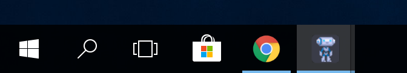
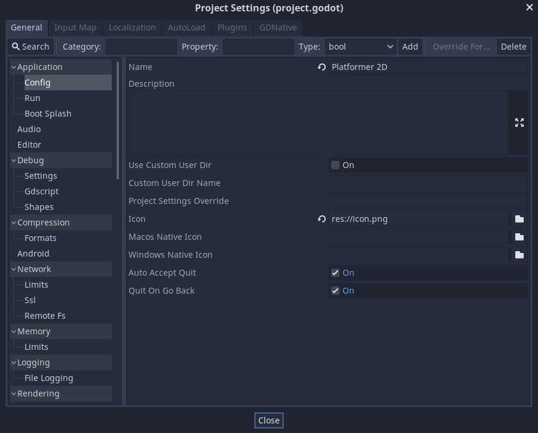
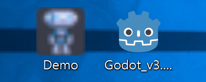
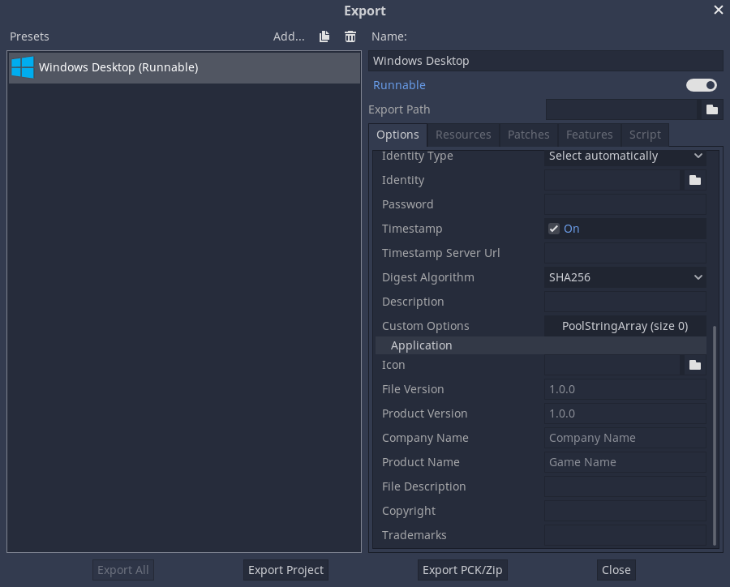
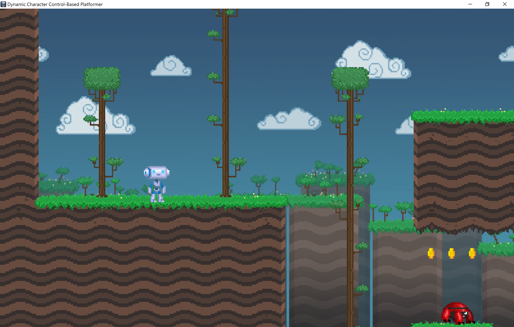

.. _doc_changing_application_icon_for_windows:

Changing application icon for Windows
=====================================

By default, the exported project's icon will be the Godot icon.
You will most likely want to change that for your project. There are two types
of icons that can be changed on Windows: the file icon and the taskbar icon.

Creating an ICO file
--------------------

Windows does not use formats such as png or jpg for application icons. Instead,
it uses a Windows-only format called ICO. You can create your application icon
in any program but you will have to convert it to an ICO file using a program such
as GIMP.

`This video tutorial <https://www.youtube.com/watch?v=uqV3UfM-n5Y>`_ goes over how to
export an ICO file with GIMP.

It is also possible to convert a PNG image to an hiDPI-friendly ICO file
using this `ImageMagick <https://www.imagemagick.org/>`_ command:

.. code-block:: none

    magick convert icon.png -define icon:auto-resize=256,128,64,48,32,16 icon.ico

Depending on which version of ImageMagick you installed, you might need to leave out the ``magick`` and run this command instead:

.. code-block:: none

    convert icon.png -define icon:auto-resize=256,128,64,48,32,16 icon.ico

.. warning::

    For the ICO file to effectively replace the default Godot icon, it must
    contain *all* the sizes included in the default Godot icon: 16×16, 32×32,
    48×48, 64×64, 128×128, 256×256. If the ICO file does not contain all the sizes,
    the default Godot icon will be kept for the sizes that weren't overridden.

    The above ImageMagick command takes this into account.

Changing the taskbar icon
-------------------------

The taskbar icon is the icon that shows up on the taskbar when your project
is running.

To change the taskbar icon, go to
**Project → Project Settings → Application → Config → Windows Native Icon**.
Click on the folder icon and select your ICO file.

This setting only changes the icon for your exported game on Windows.
To set the icon for macOS, use ``Macos Native Icon``. And for any other platform,
use the ``Icon`` setting.

Changing the file icon
----------------------

In Godot 3.5 and later, you can change the file icon without
external tools using `godoticon <https://github.com/pkowal1982/godoticon>`__.
Changing the file icon this way should work for executables containing
an embedded PCK.

.. warning::

    There are `known issues <https://github.com/godotengine/godot/issues/33466>`__
    when changing the application icon in executables that embed a PCK file.
    It's recommended to avoid using rcedit for now if you choose to enable the
    **Embed Pck** option for your Windows export preset in the Export dialog.

The file icon is the icon of the executable that you click on to start
the project.

Before selecting it in the export options, you will need to install
an extra tool called **rcedit**.
You can download it `here <https://github.com/electron/rcedit/releases>`_.

After downloading, you need to tell Godot the path to the rcedit executable
on your computer.
Go to **Editor → Editor Settings → Export → Windows**.
Click on the folder icon for the **rcedit** entry.
Navigate to and select the rcedit executable.

.. note::

    Linux and macOS users will also need to install
    `WINE <https://www.winehq.org/>`_ to use rcedit.

    On macOS 10.15 (Catalina) or later, make sure to use a 64-bit version of
    both WINE and rcedit since 32-bit applications aren't supported anymore.

.. image:: img/icon_rcedit.png

You should now have everything in place to change the file icon.
To do that, you will need to specify the icon when exporting.
Go to **Project → Export**. Assuming you have already created
a Windows Desktop preset, select your icon in ICO format in
the **Application → Icon** field.

.. warning::

    All the supplied metadata must be valid. Most importantly, the version
    identifiers **must** take the form ``major.minor.patch.revision`` where
    every component is required and is a positive integer. For instance,
    ``1.2.0.0`` is valid but ``1.2.0`` is not.

    If you provide invalid metadata in the export preset, the application icon
    won't change as rcedit will fail to change the executable's metadata.

.. note::

    If rcedit fails to change the icon, you can instead
    :ref:`compile your own Windows export templates <doc_compiling_for_windows>`
    with the icon changed. To do so, replace
    `platform/windows/godot.ico <https://github.com/godotengine/godot/blob/master/platform/windows/godot.ico>`__
    with your own ICO file *before* compiling export templates.

    Once this is done, you can specify your export templates as custom export
    templates in your project's Windows export preset.

Testing the result
------------------

You can now export the project. If it worked correctly, you should see this:

.. note::

    If your icon isn't showing up properly, on Windows 10, try clearing the icon
    cache. To do so, open the **Run** dialog and enter ``ie4uinit.exe
    -ClearIconCache`` or ``ie4uinit.exe -show``.
