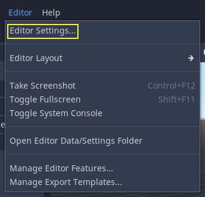
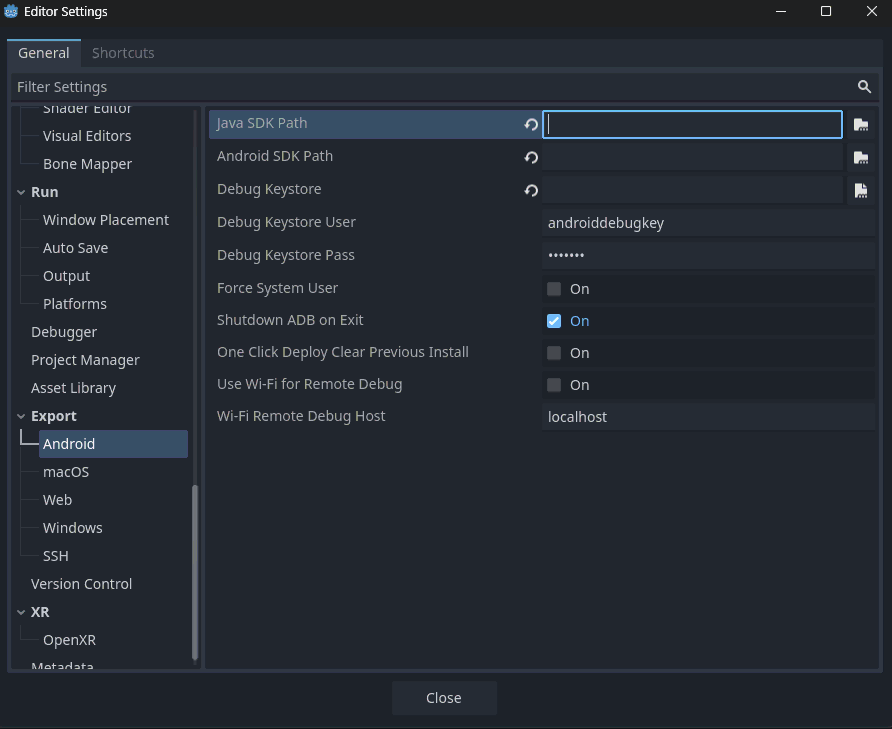
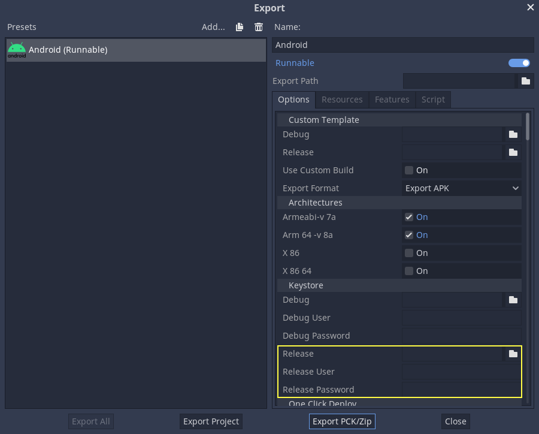
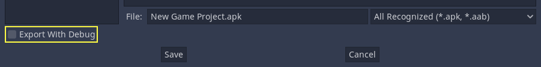

.. _doc_exporting_for_android:

Exporting for Android
=====================

.. seealso::

    This page describes how to export a Godot project to Android.
    If you're looking to compile export template binaries from source instead,
    read :ref:`doc_compiling_for_android`.

Exporting for Android has fewer requirements than compiling Godot for Android.
The following steps detail what is needed to set up the Android SDK and the engine.

.. attention::

    Projects written in C# can be exported to Android as of Godot 4.2, but support
    is experimental and :ref:`some limitations apply <doc_c_sharp_platforms>`.

Install OpenJDK 17
------------------

Download and install `OpenJDK 17 <https://adoptium.net/temurin/releases/?variant=openjdk17&version=17&os=any&arch=any>`__.

.. note::

    Higher versions of the JDK are also supported, but we recommend using JDK 17 for optimal compatibility and stability.

Download the Android SDK
------------------------

Download and install the Android SDK.

- You can install the Android SDK using `Android Studio Iguana (version 2023.2.1) or later <https://developer.android.com/studio/>`__.

  - Run it once to complete the SDK setup using these `instructions <https://developer.android.com/studio/intro/update#sdk-manager>`__.
  - Ensure that the `required packages <https://developer.android.com/studio/intro/update#required>`__ are installed as well.

    - Android SDK Platform-Tools version 35.0.0 or later
    - Android SDK Build-Tools version 35.0.0
    - Android SDK Platform 35
    - Android SDK Command-line Tools (latest)

  - Ensure that the `NDK and CMake are installed and configured <https://developer.android.com/studio/projects/install-ndk>`__.

    - CMake version 3.10.2.4988404
    - NDK version r28b (28.1.13356709)

- Alternatively, you can install the Android SDK with the `sdkmanager` command line tool.

  - Install the command line tools package using these `instructions <https://developer.android.com/tools/sdkmanager>`__.
  - Once the command line tools are installed, run the following `sdkmanager` command to complete the setup process:

::

    sdkmanager --sdk_root=<android_sdk_path> "platform-tools" "build-tools;35.0.0" "platforms;android-35" "cmdline-tools;latest" "cmake;3.10.2.4988404" "ndk;28.1.13356709"

.. note::

    If you are using Linux,
    **do not use an Android SDK provided by your distribution's repositories as it will often be outdated**.

Setting it up in Godot
----------------------

Enter the Editor Settings screen (under the Godot tab for macOS, or the Editor tab
for other platforms). This screen contains the editor settings for the user
account in the computer (it's independent of the project).

Scroll down to the section where the Android settings are located:

In that screen, 2 paths need to be set:

- ``Java SDK Path`` should be the location where OpenJDK 17 was installed.

- ``Android Sdk Path`` should be the location where the Android SDK was installed.
  - For example ``%LOCALAPPDATA%\Android\Sdk\`` on Windows or ``/Users/$USER/Library/Android/sdk/`` on macOS.

Once that is configured, everything is ready to export to Android!

.. note::

    If you get an error saying *"Could not install to device."*, make sure
    you do not have an application with the same Android package name already
    installed on the device (but signed with a different key).

    If you have an application with the same Android package name but a
    different signing key already installed on the device, you **must** remove
    the application in question from the Android device before exporting to
    Android again.

Providing launcher icons
------------------------

Launcher icons are used by Android launcher apps to represent your application to users. Godot only requires high-resolution icons (for ``xxxhdpi`` density screens) and will automatically generate lower-resolution variants.

There are three types of icons:

- **Main Icon:** The "classic" icon. This will be used on all Android versions up to Android 8 (Oreo), exclusive. Must be at least 192×192 px.
- **Adaptive Icons:** Starting from Android 8 (inclusive), `Adaptive Icons <https://developer.android.com/guide/practices/ui_guidelines/icon_design_adaptive>`_ were introduced. Applications will need to include separate background and foreground icons to have a native look. The user's launcher application will control the icon's animation and masking. Must be at least 432×432 px.
- **Themed Icons (optional):** Starting from Android 13 (inclusive), Themed Icons were introduced. Applications will need to include a monochrome icon to enable this feature. The user's launcher application will control the icon's theme. Must be at least 432×432 px.

.. seealso:: It's important to adhere to some rules when designing adaptive icons. `Google Design has provided a nice article <https://medium.com/google-design/designing-adaptive-icons-515af294c783>`_ that helps to understand those rules and some of the capabilities of adaptive icons.

.. caution:: The most important adaptive icon design rule is to have your icon critical elements inside the safe zone: a centered circle with a diameter of 66dp (264 pixels on ``xxxhdpi``) to avoid being clipped by the launcher.

If you don't provide the requested icons (except for Monochrome), Godot will replace them using a fallback chain, trying the next in line when the current one fails:

- **Main Icon:** Provided main icon -> Project icon -> Default Godot main icon.
- **Adaptive Icon Foreground:** Provided foreground icon -> Provided main icon -> Project icon -> Default Godot foreground icon.
- **Adaptive Icon Background:** Provided background icon -> Default Godot background icon.

It's highly recommended to provide all the requested icons with their specified resolutions.
This way, your application will look great on all Android devices and versions.

Exporting for Google Play Store
-------------------------------

All new apps uploaded to Google Play after August 2021 must be an AAB (Android App Bundle)
file.

Uploading an AAB or APK to Google's Play Store requires you to sign using a non-debug
keystore file; such a file can be generated like this:

.. code-block:: shell

    keytool -v -genkey -keystore mygame.keystore -alias mygame -keyalg RSA -validity 10000

This keystore and key are used to verify your developer identity, remember the password and keep it in a safe place!
It is suggested to use only upper and lowercase letters and numbers. Special characters may cause errors.
Use Google's Android Developer guides to learn more about `app signing <https://developer.android.com/studio/publish/app-signing>`__.

Now fill in the following forms in your Android Export Presets:

- **Release:** Enter the path to the keystore file you just generated.
- **Release User:** Replace with the key alias.
- **Release Password:** Key password. Note that the keystore password and the key password currently have to be the same.

Don't forget to uncheck the **Export With Debug** checkbox while exporting.

Optimizing the file size
------------------------

If you're working with APKs and not AABs, by default, the APK will contain native
libraries for both ARMv7 and ARMv8 architectures. This increases its size significantly.
To create a smaller file, uncheck either **Armeabi-v 7a** or **Arm 64 -v 8a** in
your project's Android export preset. This will create an APK that only contains
a library for a single architecture. Note that applications targeting ARMv7 can
also run on ARMv8 devices, but the opposite is not true. The reason you don't do
this to save space with AABs is that Google automatically splits up the AAB on their
backend, so the user only downloads what they need.

You can optimize the size further by compiling an Android export template with
only the features you need. See :ref:`doc_optimizing_for_size` for more
information.

Environment variables
---------------------

You can use the following environment variables to set export options outside of
the editor. During the export process, these override the values that you set in
the export menu.

.. list-table:: Android export environment variables
   :header-rows: 1

   * - Export option
     - Environment variable
   * - Encryption / Encryption Key
     - ``GODOT_SCRIPT_ENCRYPTION_KEY``
   * - Options / Keystore / Debug
     - ``GODOT_ANDROID_KEYSTORE_DEBUG_PATH``
   * - Options / Keystore / Debug User
     - ``GODOT_ANDROID_KEYSTORE_DEBUG_USER``
   * - Options / Keystore / Debug Password
     - ``GODOT_ANDROID_KEYSTORE_DEBUG_PASSWORD``
   * - Options / Keystore / Release
     - ``GODOT_ANDROID_KEYSTORE_RELEASE_PATH``
   * - Options / Keystore / Release User
     - ``GODOT_ANDROID_KEYSTORE_RELEASE_USER``
   * - Options / Keystore / Release Password
     - ``GODOT_ANDROID_KEYSTORE_RELEASE_PASSWORD``

Export options
--------------

You can find a full list of export options available in the
:ref:`class_EditorExportPlatformAndroid` class reference.
