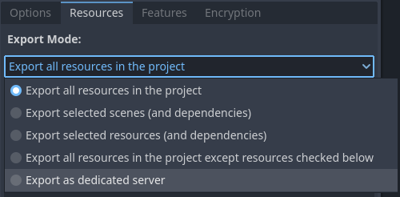
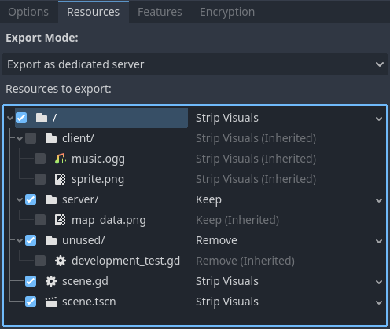

.. _doc_exporting_for_dedicated_servers:

Exporting for dedicated servers
===============================

.. highlight:: none

If you want to run a dedicated server for your project on a machine that doesn't
have a GPU or display server available, you'll need to run Godot with the ``headless``
display server and ``Dummy`` :ref:`audio driver <class_ProjectSettings_property_audio/driver/driver>`.

Since Godot 4.0, this can be done by running a Godot binary on any platform with
the ``--headless`` command line argument, or running a project exported as
dedicated server. You do not need to use a specialized server binary anymore,
unlike Godot 3.x.

Editor versus export template
-----------------------------

It is possible to use either an editor or export template (debug or release)
binary in headless mode. Which one you should use depends on your use case:

- **Export template:** Use this one for running dedicated servers. It does not
  contain editor functionality, and is therefore smaller and more optimized.
- **Editor:** This binary contains editor functionality and is intended to be
  used for exporting projects. This binary *can* be used to run dedicated
  servers, but it's not recommended as it's larger and less optimized.

Export approaches
-----------------

There are two ways to export a project for a server:

- Create a separate export preset for the platform that will host the server, then
  export your project as usual.
- Export a PCK file only, preferably for the platform that matches the platform
  that will host the server. Place this PCK file in the same folder as an export
  template binary, rename the binary to have the same name as the PCK (minus the
  file extension), then run the binary.

Both methods should result in identical output. The rest of the page will focus
on the first approach.

See :ref:`doc_exporting_projects` for more information.

.. _doc_exporting_for_dedicated_servers_exporting_project:

Exporting a project for a dedicated server
------------------------------------------

If you export a project as usual when targeting a server, you will notice that
the PCK file is just as large as for the client. This is because it includes all
resources, including those the server doesn't need (such as texture data).
Additionally, headless mode won't be automatically used; the user will have to
specify ``--headless`` to make sure no window spawns.

Many resources such as textures can be stripped from the PCK file to greatly
reduce its size. Godot offers a way to do this for textures and materials in a way
that preserves references in scene or resource files (built-in or external).

To begin doing so, make sure you have a dedicated export preset for your server,
then select it, go to its **Resources** tab and change its export mode:

   Choosing the **Export as dedicated server** export mode in the export preset

When this export mode is chosen, the ``dedicated_server`` feature tag is
automatically added to the exported project.

.. note::

    If you do not wish to use this
    export mode but still want the feature tag, you can write the name
    ``dedicated_server`` in the **Features** tab of the export preset.
    This will also force ``--headless`` when running the exported project.

After selecting this export mode, you will be presented with a list of resources
in the project:

   Choosing resources to keep, keep with stripped visuals or remove

Ticking a box allows you to override options for the specified file or folder.
Checking boxes does **not** affect which files are exported; this is done by the
options selected for each checkbox instead.

Files within a checked folder will automatically use the parent's option by
default, which is indicated by the **(Inherited)** suffix for the option name
(and the option name being grayed out). To change the option for a file whose
option is currently inherited, you must tick the box next to it first.

- **Strip Visuals:** Export this resource, with visual files (textures and materials)
  replaced by placeholder classes. Placeholder classes store the image size
  (as it's sometimes used to position elements in a 2D scene), but nothing else.
- **Keep:** Export this resource as usual, with visual files intact.
- **Remove:** The file is not included in the PCK. This is useful to ignore
  scenes and resources that only the client needs. If you do so, make sure the
  server doesn't reference these client-only scenes and resources in any way.

The general recommendation is to use **Strip Visuals** whenever possible, unless
the server needs to access image data such as pixels' colors. For example, if
your server generates collision data based on an image's contents, you need to
use **Keep** for that particular image.

.. tip::

    To check the file structure of your exported PCK, use the **Export
    PCK/ZIP...** button with a ``.zip`` file extension, then open the resulting
    ZIP file in a file manager.

.. warning::

    Be careful when using the **Remove** mode, as scenes/resources that reference
    a removed file will no longer be able to load successfully.

    If you wish to remove specific resources but make the scenes still be able
    to load without them, you'll have to remove the reference in the scene file
    and load the files to the nodes' properties using ``load()`` in a script.
    This approach can be used to strip resources that Godot doesn't support
    replacing with placeholders yet, such as audio.

    Removing textures is often what makes the greatest impact on the PCK size,
    so it is recommended to stick with **Strip Visuals** at first.

With the above options used, a PCK for the client (which exports all resources
normally) will look as follows:

::

    .
    ├── .godot
    │   ├── exported
    │   │   └── 133200997
    │   │       └── export-78c237d4bfdb4e1d02e0b5f38ddfd8bd-scene.scn
    │   ├── global_script_class_cache.cfg
    │   ├── imported
    │   │   ├── map_data.png-ce840618f399a990343bfc7298195a13.ctex
    │   │   ├── music.ogg-fa883da45ae49695a3d022f64e60aee2.oggvorbisstr
    │   │   └── sprite.png-7958af25f91bb9dbae43f35388f8e840.ctex
    │   └── uid_cache.bin
    ├── client
    │   ├── music.ogg.import
    │   └── sprite.png.import
    ├── server
    │   └── map_data.png.import
    ├── test
    │   └── scene.gd
    └── unused
    │   └── development_test.gd
    ├── project.binary
    ├── scene.gd
    ├── scene.tscn.remap

The PCK's file structure for the server will look as follows:

::

    .
    ├── .godot
    │   ├── exported
    │   │   └── 3400186661
    │   │       ├── export-78c237d4bfdb4e1d02e0b5f38ddfd8bd-scene.scn
    │   │       ├── export-7958af25f91bb9dbae43f35388f8e840-sprite.res  # Placeholder texture
    │   │       └── export-fa883da45ae49695a3d022f64e60aee2-music.res
    │   ├── global_script_class_cache.cfg
    │   ├── imported
    │   │   └── map_data.png-ce840618f399a990343bfc7298195a13.ctex
    │   └── uid_cache.bin
    ├── client
    │   ├── music.ogg.import
    │   └── sprite.png.import  # Points to placeholder texture
    └── server
    │   └── map_data.png.import
    ├── project.binary
    ├── scene.gd
    ├── scene.tscn.remap

Starting the dedicated server
-----------------------------

If both your client and server are part of the same Godot project, you will have
to add a way to start the server directly using a command-line argument.

If you :ref:`exported the project <doc_exporting_for_dedicated_servers_exporting_project>`
using the **Export as dedicated server** export mode (or have added
``dedicated_server`` as a custom feature tag), you can use the ``dedicated_server``
feature tag to detect whether a dedicated server PCK is being used:

.. tabs::
 .. code-tab:: gdscript

    # Note: Feature tags are case-sensitive.
    if OS.has_feature("dedicated_server"):
        # Run your server startup code here...
        pass

 .. code-tab:: csharp

    // Note: Feature tags are case-sensitive.
    if (OS.HasFeature("dedicated_server"))
    {
        // Run your server startup code here...
    }

If you also wish to host a server when using the built-in ``--headless`` command
line argument, this can be done by adding the following code snippet in your
main scene (or an autoload)'s ``_ready()`` method:

.. tabs::
 .. code-tab:: gdscript

    if DisplayServer.get_name() == "headless":
        # Run your server startup code here...
        #
        # Using this check, you can start a dedicated server by running
        # a Godot binary (editor or export template) with the `--headless`
        # command-line argument.
        pass

 .. code-tab:: csharp

    using System.Linq;

    if (DisplayServer.GetName() == "headless")
    {
        // Run your server startup code here...
        //
        // Using this check, you can start a dedicated server by running
        // a Godot binary (editor or export template) with the `--headless`
        // command-line argument.
    }

If you wish to use a custom command line argument, this can be done by adding
the following code snippet in your main scene (or an autoload)'s ``_ready()``
method:

.. tabs::
 .. code-tab:: gdscript

    if "--server" in OS.get_cmdline_user_args():
        # Run your server startup code here...
        #
        # Using this check, you can start a dedicated server by running
        # a Godot binary (editor or export template) with the `--server`
        # command-line argument.
        pass

 .. code-tab:: csharp

    using System.Linq;

    if (OS.GetCmdlineUserArgs().Contains("--server"))
    {
        // Run your server startup code here...
        //
        // Using this check, you can start a dedicated server by running
        // a Godot binary (editor or export template) with the `--server`
        // command-line argument.
    }

It's a good idea to add at least one of the above command-line arguments to
start a server, as it can be used to test server functionality from the command
line without having to export the project.

If your client and server are separate Godot projects, your server should most
likely be configured in a way where running the main scene starts a server
automatically.

Next steps
----------

On Linux, to make your dedicated server restart after a crash or system reboot,
you can
`create a systemd service <https://medium.com/@benmorel/creating-a-linux-service-with-systemd-611b5c8b91d6>`__.
This also lets you view server logs in a more convenient fashion, with automatic
log rotation provided by systemd. When making your project hostable as a systemd service,
you should also enable the ``application/run/flush_stdout_on_print``
project setting. This way, journald (the systemd logging service) can collect
logs while the process is running.

If you have experience with containers, you could also look into wrapping your
dedicated server in a `Docker <https://www.docker.com/>`__ container. This way,
it can be used more easily in an automatic scaling setup (which is outside the
scope of this tutorial).
