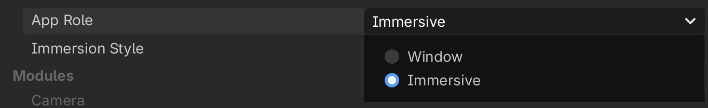
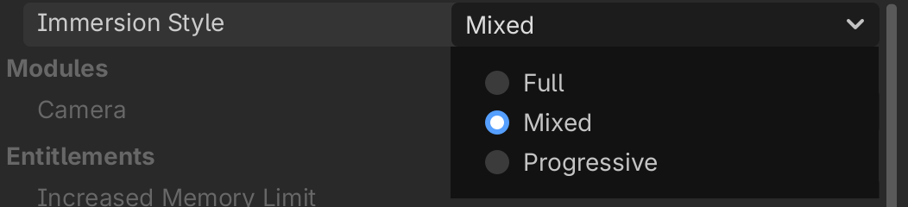

.. _doc_exporting_for_visionos:

Exporting for visionOS
======================

.. seealso::

    This page describes how to export a Godot project to visionOS.
    If you're looking to compile export template binaries from source instead,
    see :ref:`doc_compiling_for_visionos`.

Exporting instructions for visionOS are very similar to :ref:`doc_exporting_for_ios`.
You can refer to it for more details about the Xcode workflow.

Requirements
------------

-  `Xcode <https://developer.apple.com/xcode/>`_ (from the macOS App Store).
-  An Apple account, for code-signing (`free for on-device testing <https://developer.apple.com/support/compare-memberships/>`_).

.. attention::

    Projects written in C# are currently not supported on visionOS, as
    the :ref:`.NET runtime <doc_c_sharp_platforms>` does not support visionOS.

App Role
--------

-  The **Window** mode (default) presents your game in a flat window, similar to an iOS app.
-  The **Immersive** mode presents your game as an XR app.

For more information about the immersive mode, see :ref:`doc_visionos_intro`.

Immersion Mode
--------------

The **Mixed** immersion style displays your Godot game on top of the passthrough environment.
The **Full** and **Progressive** immersion styles display your game on top of an
opaque background and defines a 1.5-meter boundary around the player.

See Apple's `Human Interface Guidelines <https://developer.apple.com/design/human-interface-guidelines/immersive-experiences#Immersion-styles>`_
for more details.
