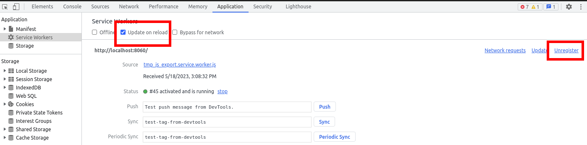
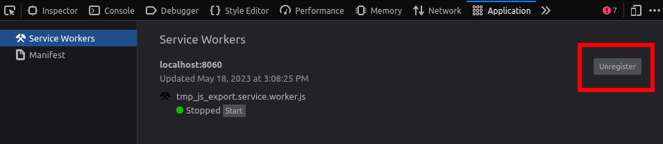

.. _doc_exporting_for_web:

Exporting for the Web
=====================

.. seealso::

    This page describes how to export a Godot project to HTML5.
    If you're looking to compile editor or export template binaries from source instead,
    read :ref:`doc_compiling_for_web`.

HTML5 export allows publishing games made in Godot Engine to the browser.
This requires support for `WebAssembly
<https://webassembly.org/>`__ and `WebGL 2.0 <https://www.khronos.org/webgl/>`__
in the user's browser.

.. attention::

    Projects written in C# using Godot 4 currently cannot be exported to the
    web. See `this blog post <https://godotengine.org/article/platform-state-in-csharp-for-godot-4-2/#web>`__
    for more information.

    To use C# on web platforms, use Godot 3 instead.

.. tip::

    Use the browser-integrated developer console, usually opened
    with :kbd:`F12` or :kbd:`Ctrl + Shift + I` (:kbd:`Cmd + Option + I` on macOS), to view
    **debug information** like JavaScript, engine, and WebGL errors.

    If the shortcut doesn't work, it's because Godot actually captures the input.
    You can still open the developer console by accessing the browser's menu.

.. note::

    Due to security concerns with ``SharedArrayBuffer`` due to various exploits,
    the use of multiple threads for the Web platform has multiple drawbacks,
    including requiring specific server-side headers and complete cross-origin isolation
    (meaning no ads, nor third-party integrations on the website hosting your game).

    Since Godot 4.3, Godot supports exporting your game on a single thread, which
    solves this issue. While it has some drawbacks on its own (it cannot use threads, and is
    not as performant as the multi-threaded export), it doesn't require as much overhead to install.
    It is also more compatible overall with stores like `itch.io <https://itch.io/>`__ or Web publishers like
    `Poki <https://poki.com/>`__ or `CrazyGames <https://crazygames.com/>`__. The single-threaded export
    works very well on macOS and iOS too, where it always had compatibility issues with multiple threads
    exports.

    For these reasons, it is the preferred and now default way to export your games on the Web.

    For more information, see `this blog post about single-threaded Web export
    <https://godotengine.org/article/progress-report-web-export-in-4-3/#single-threaded-web-export>`__.

.. seealso::

    See the
    `list of open issues on GitHub related to the web export <https://github.com/godotengine/godot/issues?q=is%3Aopen+is%3Aissue+label%3Aplatform%3Aweb>`__
    for a list of known bugs.

Export file name
----------------

We suggest users to export their Web projects with ``index.html`` as the file name.
``index.html`` is usually the default file loaded by web servers when accessing the
parent directory, usually hiding the name of that file.

.. attention::

    The Godot 4 Web export expects some files to be named the same name as the one set in the
    initial export. Some issues could occur if some exported files are renamed, including the
    main HTML file.

WebGL version
-------------

Godot 4.0 and later can only target WebGL 2.0 (using the Compatibility rendering
method). Forward+/Mobile are not supported on the web platform, as these
rendering methods are designed around modern low-level graphics APIs. Godot
currently does not support WebGPU, which is a prerequisite for allowing
Forward+/Mobile to run on the web platform.

See `Can I use WebGL 2.0 <https://caniuse.com/webgl2>`__ for a list of browser
versions supporting WebGL 2.0. Note that Safari has several issues with WebGL
2.0 support that other browsers don't have, so we recommend using a
Chromium-based browser or Firefox if possible.

Mobile considerations
---------------------

The Web export can run on mobile platforms with some caveats. While native
:ref:`Android <doc_exporting_for_android>` and :ref:`iOS <doc_exporting_for_ios>`
exports will always perform better by a significant margin, the Web export
allows people to run your project without going through app stores.

Remember that CPU and GPU performance is at a premium when running on mobile devices.
This is even more the case when running a project exported to Web (as it's
WebAssembly instead of native code). See :ref:`doc_performance` section of the
documentation for advice on optimizing your project. If your project runs on
platforms other than Web, you can use :ref:`doc_feature_tags` to apply
low-end-oriented settings when running the project exported to Web.

To speed up loading times on mobile devices, you should also
:ref:`compile an optimized export template <doc_optimizing_for_size>`
with unused features disabled. Depending on the features used by your project,
this can reduce the size of the WebAssembly payload significantly,
making it faster to download and initialize (even when cached).

.. _doc_exporting_for_web_audio_playback:

Audio playback
--------------

Since Godot 4.3, audio playback is done using the Web Audio API on the web
platform. This **Sample** playback mode allows for low latency even when the
project is exported without thread support, but it has several limitations:

- AudioEffects are not supported.
- :ref:`Reverberation and doppler <doc_audio_streams_reverb_buses>` effects are not supported.
- Procedural audio generation is not supported.
- Positional audio may not always work correctly depending on the node's properties.

To use Godot's own audio playback system on the web platform, you can change the
default playback mode using the **Audio > General > Default Playback Type.web**
project setting, or change the **Playback Type** property to **Stream** on an
:ref:`class_AudioStreamPlayer`, :ref:`class_AudioStreamPlayer2D` or
:ref:`class_AudioStreamPlayer3D` node. This leads to increased latency
(especially when thread support is disabled), but it allows the full suite
of Godot's audio features to work.

.. _doc_javascript_export_options:

Export options
--------------

If a runnable web export template is available, a button appears between the
*Stop scene* and *Play edited Scene* buttons in the editor to quickly open the
game in the default browser for testing.

If your project uses GDExtension, **Extension Support** needs to be enabled.

If you plan to use :ref:`VRAM compression <doc_importing_images>` make sure that
**VRAM Texture Compression** is enabled for the targeted platforms (enabling
both **For Desktop** and **For Mobile** will result in a bigger, but more
compatible export).

If a path to a **Custom HTML shell** file is given, it will be used instead of
the default HTML page. See :ref:`doc_customizing_html5_shell`.

**Head Include** is appended into the ``<head>`` element of the generated
HTML page. This allows to, for example, load webfonts and third-party
JavaScript APIs, include CSS, or run JavaScript code.

The window size will automatically match the browser window size by default.
If you want to use a fixed size instead regardless of the browser window size,
change **Canvas Resize Policy** to **None**. This allows controlling the window
size with custom JavaScript code in the HTML shell. You can also set it to
**Project** to make it behave closer to a native export, according to the
:ref:`project settings <doc_multiple_resolutions>`.

.. important:: Each project must generate their own HTML file. On export,
               several text placeholders are replaced in the generated HTML
               file specifically for the given export options. Any direct
               modifications to that HTML file will be lost in future exports.
               To customize the generated file, use the **Custom HTML shell**
               option.

.. _doc_exporting_for_web_thread_extension_support:

Thread and extension support
~~~~~~~~~~~~~~~~~~~~~~~~~~~~

If **Thread Support** is enabled, the exported project will be able to
:ref:`make use of multithreading <doc_using_multiple_threads>` to improve
performance. This also allows for low-latency audio playback
when the playback type is set to **Stream** (instead of the default **Sample**
that is used in web exports). Enabling this feature requires the use of
cross-origin isolation headers, which are described in the
:ref:`doc_exporting_for_web_serving_the_files` section below.

If **Extensions Support** is enabled, :ref:`GDExtensions <doc_what_is_gdextension>`
will be able to be loaded. Note that GDExtensions still need to be specifically
compiled for the web platform to work. Like thread support, enabling this feature
requires the use of cross-origin isolation headers.

Exporting as a Progressive Web App (PWA)
~~~~~~~~~~~~~~~~~~~~~~~~~~~~~~~~~~~~~~~~

If **Progressive Web App > Enable** is enabled, it will have several effects:

- Configure high-resolution icons, a display mode and screen orientation. These
  are configured at the end of the Progressive Web App section in the export
  options. These options are used if the user adds the project to their device's
  homescreen, which is common on mobile platforms. This is also supported on
  desktop platforms, albeit in a more limited capacity.

- Allow the project to be loaded without an Internet connection if it has been
  loaded at least once beforehand. This works thanks to the *service worker*
  that is installed when the project is first loaded in the user's browser. This
  service worker provides a local fallback when no Internet connection is
  available.

  - Note that web browsers can choose to evict the cached data if the user runs
    low on disk space, or if the user hasn't opened the project for a while.
    To ensure data is cached for a longer duration, the user can bookmark the page,
    or ideally add it to their device's home screen.

  - If the offline data is not available because it was evicted from the cache,
    you can configure an **Offline Page** that will be displayed in this case.
    The page must be in HTML format and will be saved on the client's machine
    the first time the project is loaded.

- Ensure cross-origin isolation headers are always present, even if the web
  server hasn't been configured to send them. This allows exports with threads
  enabled to work when hosted on any website, even if there is no way for you to
  control the headers it sends.

  - This behavior can be disabled by unchecking **Enable Cross Origin Isolation Headers**
    in the Progressive Web App section.

Limitations
-----------

For security and privacy reasons, many features that work effortlessly on
native platforms are more complicated on the web platform. Following is a list
of limitations you should be aware of when porting a Godot game to the web.

.. _doc_javascript_secure_contexts:

.. important:: Browser vendors are making more and more functionalities only
               available in `secure contexts <https://developer.mozilla.org/en-US/docs/Web/Security/Secure_Contexts>`_,
               this means that such features are only be available if the web
               page is served via a secure HTTPS connection (localhost is
               usually exempt from such requirement).

Using cookies for data persistence
~~~~~~~~~~~~~~~~~~~~~~~~~~~~~~~~~~

Users must **allow cookies** (specifically IndexedDB) if persistence of the
``user://`` file system is desired. When playing a game presented in an
``iframe``, **third-party** cookies must also be enabled. Incognito/private
browsing mode also prevents persistence.

The method ``OS.is_userfs_persistent()`` can be used to check if the
``user://`` file system is persistent, but can give false positives in some
cases.

Background processing
~~~~~~~~~~~~~~~~~~~~~

The project will be paused by the browser when the tab is no longer the active
tab in the user's browser. This means functions such as ``_process()`` and
``_physics_process()`` will no longer run until the tab is made active again by
the user (by switching back to the tab). This can cause networked games to
disconnect if the user switches tabs for a long duration.

This limitation does not apply to unfocused browser *windows*. Therefore, on the
user's side, this can be worked around by running the project in a separate
*window* instead of a separate tab.

Full screen and mouse capture
~~~~~~~~~~~~~~~~~~~~~~~~~~~~~

Browsers do not allow arbitrarily **entering full screen**. The same goes for
**capturing the cursor**. Instead, these actions have to occur as a response to
a JavaScript input event. In Godot, this means entering full screen from within
a pressed input event callback such as ``_input`` or ``_unhandled_input``.
Querying the :ref:`class_Input` singleton is not sufficient, the relevant
input event must currently be active.

For the same reason, the full screen project setting doesn't work unless the
engine is started from within a valid input event handler. This requires
:ref:`customization of the HTML page <doc_customizing_html5_shell>`.

Audio
~~~~~

Some browsers restrict autoplay for audio on websites. The easiest way around this limitation is to request the
player to click, tap or press a key/button to enable audio, for instance when displaying a splash screen at the start of your game.

.. seealso:: Google offers additional information about their `Web Audio autoplay
             policies <https://www.chromium.org/audio-video/autoplay/>`__.

             Apple's Safari team also posted additional information about their `Auto-Play Policy Changes for macOS
             <https://webkit.org/blog/7734/auto-play-policy-changes-for-macos/>`__.

.. warning:: Access to microphone requires a
             :ref:`secure context <doc_javascript_secure_contexts>`.

.. warning::

        Since Godot 4.3, by default Web exports will use samples instead of streams
        to play audio.

        This is due to the way browsers prefer to play audio and the lack of processing power
        available when exporting Web games with the **Use Threads** export option off.

        Please note that audio effects aren't yet implemented for samples.

Networking
~~~~~~~~~~

.. UPDATE: Not implemented. When low-level networking is implemented, remove
.. this paragraph.

Low-level networking is not implemented due to lacking support in browsers.

Currently, only :ref:`HTTP client <doc_http_client_class>`,
:ref:`HTTP requests <doc_http_request_class>`,
:ref:`WebSocket (client) <doc_websocket>` and :ref:`WebRTC <doc_webrtc>` are
supported.

The HTTP classes also have several restrictions on the HTML5 platform:

 -  Accessing or changing the ``StreamPeer`` is not possible
 -  Threaded/Blocking mode is not available
 -  Cannot progress more than once per frame, so polling in a loop will freeze
 -  No chunked responses
 -  Host verification cannot be disabled
 -  Subject to `same-origin policy <https://developer.mozilla.org/en-US/docs/Web/Security/Same-origin_policy>`__

Clipboard
~~~~~~~~~

Clipboard synchronization between engine and the operating system requires a
browser supporting the `Clipboard API <https://developer.mozilla.org/en-US/docs/Web/API/Clipboard_API>`__,
additionally, due to the API asynchronous nature might not be reliable when
accessed from GDScript.

.. warning:: Requires a :ref:`secure context <doc_javascript_secure_contexts>`.

Gamepads
~~~~~~~~

Gamepads will not be detected until one of their button is pressed. Gamepads
might have the wrong mapping depending on the browser/OS/gamepad combination,
sadly the `Gamepad API <https://developer.mozilla.org/en-US/docs/Web/API/Gamepad_API/Using_the_Gamepad_API>`__
does not provide a reliable way to detect the gamepad information necessary
to remap them based on model/vendor/OS due to privacy considerations.

.. warning:: Requires a :ref:`secure context <doc_javascript_secure_contexts>`.

.. _doc_exporting_for_web_serving_the_files:

Serving the files
-----------------

Exporting for the web generates several files to be served from a web server,
including a default HTML page for presentation. A custom HTML file can be
used, see :ref:`doc_customizing_html5_shell`.

.. warning::

    Only when exporting with **Use Threads**, to ensure low audio latency and the
    ability to use :ref:`class_Thread` in web exports, Godot 4 web exports use
    `SharedArrayBuffer <https://developer.mozilla.org/en-US/docs/Web/JavaScript/Reference/Global_Objects/SharedArrayBuffer>`__.
    This requires a :ref:`secure context <doc_javascript_secure_contexts>`,
    while also requiring the following CORS headers to be set when serving the files:

    ::

        Cross-Origin-Opener-Policy: same-origin
        Cross-Origin-Embedder-Policy: require-corp

    If you don't control the web server or are unable to add response headers,
    check **Progressive Web App > Enable** in the export options. This applies
    a service worker-based workaround that allows the project to run by
    simulating the presence of these response headers. A secure context
    is still required in this case.

    If the client doesn't receive the required response headers or the service
    worker-based workaround is not applied, **the project will not run**.

The generated ``.html`` file can be used as ``DirectoryIndex`` in Apache
servers and can be renamed to e.g. ``index.html`` at any time. Its name is
never depended on by default.

The HTML page draws the game at maximum size within the browser window.
This way, it can be inserted into an ``<iframe>`` with the game's size, as is
common on most web game hosting sites.

The other exported files are served as they are, next to the ``.html`` file,
names unchanged. The ``.wasm`` file is a binary WebAssembly module implementing
the engine. The ``.pck`` file is the Godot main pack containing your game. The
``.js`` file contains start-up code and is used by the ``.html`` file to access
the engine. The ``.png`` file contains the boot splash image.

The ``.pck`` file is binary, usually delivered with the MIME-type
:mimetype:`application/octet-stream`. The ``.wasm`` file is delivered as
:mimetype:`application/wasm`.

.. warning::

    Delivering the WebAssembly module (``.wasm``) with a MIME-type
    other than :mimetype:`application/wasm` can prevent some start-up
    optimizations.

Delivering the files with server-side compression is recommended especially for
the ``.pck`` and ``.wasm`` files, which are usually large in size. The
WebAssembly module compresses particularly well, down to around a quarter of its
original size with gzip compression. Consider using Brotli precompression if
supported on your web server for further file size savings.

**Hosts that provide on-the-fly compression:** GitHub Pages (gzip)

**Hosts that don't provide on-the-fly compression:** itch.io, GitLab Pages
(`supports manual gzip precompression <https://docs.gitlab.com/user/project/pages/introduction/#serving-compressed-assets>`__)

.. tip::

    The Godot repository includes a
    `Python script to host a local web server <https://raw.githubusercontent.com/godotengine/godot/master/platform/web/serve.py>`__.
    This script is intended for testing the web editor, but it can also be used to test exported projects.

    Save the linked script to a file called ``serve.py``, move this file to the
    folder containing the exported project's ``index.html``, then run the
    following command in a command prompt within the same folder:

    ::

        # You may need to replace `python` with `python3` on some platforms.
        python serve.py --root .

    On Windows, you can open a command prompt in the current folder by holding
    :kbd:`Shift` and right-clicking on empty space in Windows Explorer, then
    choosing **Open PowerShell window here**.

    This will serve the contents of the current folder and open the default web
    browser automatically.

    Note that for production use cases, this Python-based web server should not
    be used. Instead, you should use an established web server such as Apache or
    nginx.

Interacting with the browser and JavaScript
-------------------------------------------

See the :ref:`dedicated page <doc_web_javascript_bridge>` on how to interact
with JavaScript and access some unique Web browser features.

Environment variables
---------------------

You can use the following environment variables to set export options outside of
the editor. During the export process, these override the values that you set in
the export menu.

.. list-table:: HTML5 export environment variables
   :header-rows: 1

   * - Export option
     - Environment variable
   * - Encryption / Encryption Key
     - ``GODOT_SCRIPT_ENCRYPTION_KEY``

.. _doc_exporting_for_web_troubleshooting:

Troubleshooting
---------------

Running the export locally shows another project instead
~~~~~~~~~~~~~~~~~~~~~~~~~~~~~~~~~~~~~~~~~~~~~~~~~~~~~~~~

If you use one-click deploy in multiple projects, you may notice that one
of the projects you've previously deployed is shown instead of the project
you're currently working on. This is due to service worker caching which
currently lacks an automated cache busting mechanism.

As a workaround, you can manually unregister the current service worker
so that the cache is reset. This also allows a new service worker to be registered.
In Chromium-based browsers, open the Developer Tools by pressing
:kbd:`F12` or :kbd:`Ctrl + Shift + I` (:kbd:`Cmd + Option + I` on macOS),
then click on the Application tab in DevTools (it may be hidden behind a chevron
icon if the devtools pane is narrow). You can either check
:button:`Update on reload` and reload the page, or click :button:`Unregister`
next to the service worker that is currently registered, then reload the page.

   Unregistering the service worker in Chromium-based browsers' DevTools

The procedure is similar in Firefox. Open developer tools by pressing
:kbd:`F12` or :kbd:`Ctrl + Shift + I` (:kbd:`Cmd + Option + I` on macOS),
click on the Application tab in DevTools (it may be hidden behind a chevron
icon if the devtools pane is narrow). Click :button:`Unregister` next to the
service worker that is currently registered, then reload the page.

   Unregistering the service worker in Firefox's DevTools

Export options
--------------

You can find a full list of export options available in the
:ref:`class_EditorExportPlatformWeb` class reference.
