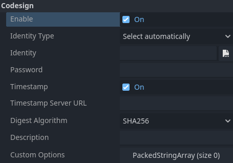

.. _doc_exporting_for_windows:

Exporting for Windows
=====================

.. seealso::

    This page describes how to export a Godot project to Windows.
    If you're looking to compile editor or export template binaries from source instead,
    read :ref:`doc_compiling_for_windows`.

The simplest way to distribute a game for PC is to copy the executable
(``godot.exe``), compress the folder and send it to someone else. However, this
is often not desired.

Godot offers a more elegant approach for PC distribution when using the export
system. When exporting for Windows, the exporter takes all the project files and
creates a ``data.pck`` file. This file is bundled with a specially optimized
binary that is smaller, faster and does not contain the editor and debugger.

Changing the executable icon
----------------------------

Godot will automatically use whatever image is set as your project's icon in the project
settings, and convert it to an ICO file for the exported project. If you want to
manually create an ICO file for greater control over how the icon looks at different
resolutions then see the :ref:`doc_changing_application_icon_for_windows` page.

Code signing
------------

Godot is capable of automatic code signing on export. To do this you must have the
``Windows SDK`` (on Windows) or `osslsigncode <https://github.com/mtrojnar/osslsigncode>`__
(on any other OS) installed. You will also need a package signing certificate,
information on creating one can be found `here <https://learn.microsoft.com/en-us/windows/msix/package/create-certificate-package-signing>`__.

.. warning::

    If you export for Windows with embedded PCK files, you will not be able to
    sign the program as it will break.

    On Windows, PCK embedding is also known to cause false positives in
    antivirus programs. Therefore, it's recommended to avoid using it unless
    you're distributing your project via Steam as it bypasses code signing and
    antivirus checks.

Setup
~~~~~

Settings need to be changed in two places. First, in the editor settings, under
**Export > Windows**. Click on the folder next to the ``Sign Tool`` setting, if
you're using Windows navigate to and select ``SignTool.exe``, if you're on a different
OS select ``osslsigncode``.

.. image:: img/windows_editor_settings.webp

The second location is the Windows export preset, which can be found in
**Project > Export...**. Add a windows desktop preset if you haven't already.
Under options there is a code signing category.

``Enabled`` must be set to true, and ``Identity`` must be set to the signing
certificate. The other settings can be adjusted as needed. Once this is Done
Godot will sign your project on export.

Environment variables
---------------------

You can use the following environment variables to set export options outside of
the editor. During the export process, these override the values that you set in
the export menu.

.. list-table:: Windows export environment variables
   :header-rows: 1

   * - Export option
     - Environment variable
   * - Encryption / Encryption Key
     - ``GODOT_SCRIPT_ENCRYPTION_KEY``
   * - Options / Codesign / Identity Type
     - ``GODOT_WINDOWS_CODESIGN_IDENTITY_TYPE``
   * - Options / Codesign / Identity
     - ``GODOT_WINDOWS_CODESIGN_IDENTITY``
   * - Options / Codesign / Password
     - ``GODOT_WINDOWS_CODESIGN_PASSWORD``

Export options
--------------

You can find a full list of export options available in the
:ref:`class_EditorExportPlatformWindows` class reference.
