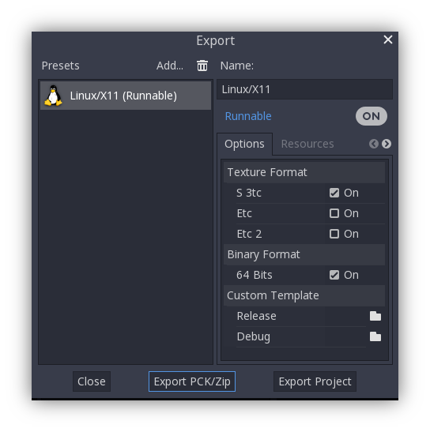

.. _doc_exporting_pcks:

Exporting packs, patches, and mods
==================================

Use cases
---------

Oftentimes one would like to add functionality to one's game after it has been
deployed.

Examples of this include...

- Downloadable Content: the ability to add features and content to one's game.
- Patches: the ability to fix a bug that is present in a shipped product.
- Mods: grant other people the ability to create content for one's game.

These tools help developers to extend their development beyond the initial
release.

Overview of PCK files
---------------------

Godot enables this via a feature called **resource packs** (PCK files,
with extension ``.pck``).

**Advantages:**

- incremental updates/patches
- offer DLCs
- offer mod support
- no source code disclosure needed for mods
- more modular project structure
- users don't have to replace the entire game

The first part of using them involves exporting and delivering the project to
players. Then, when one wants to add functionality or content later on, they
just deliver the updates via PCK files to the users.

PCK files usually contain, but are not limited to:

- scripts
- scenes
- shaders
- models
- textures
- sound effects
- music
- any other asset suitable for import into the game

The PCK files can even be an entirely different Godot project, which the
original game loads in at runtime.

Generating PCK files
--------------------

In order to pack all resources of a project into a PCK file open the project
and go to Project/Export and click on "Export PCK/Zip". Also make sure to have
an export template selected while doing so.

Another method would be to :ref:`export from the command line <doc_command_line_tutorial_exporting>`.
If the output file ends with a PCK or ZIP file extension, then the export
process will build that type of file for the chosen platform.

.. note::

    If one wishes to support mods for their game, they will need their users to
    create similarly exported files. Assuming the original game expects a
    certain structure for the PCK's resources and/or a certain interface for
    its scripts, then either...

    1. The developer must publicize documentation of these expected structures/
       interfaces, expect modders to install Godot Engine, and then also expect
       those modders to conform to the documentation's defined API when building
       mod content for the game (so that it will work). Users would then use
       Godot's built in exporting tools to create a PCK file, as detailed
       above.
    2. The developer uses Godot to build a GUI tool for adding their exact API
       content to a project. This Godot tool must either run on a tools-enabled
       build of the engine or have access to one (distributed alongside or
       perhaps in the original game's files). The tool can then use the Godot
       executable to export a PCK file from the command line with
       :ref:`OS.execute() <class_OS_method_execute>`. The game itself shouldn't
       use a tool-build of the engine (for security), so it's best to keep
       the modding tool and game separate.

Opening PCK files at runtime
----------------------------

To import a PCK file, one uses the ProjectSettings singleton. The following
example expects a “mod.pck” file in the directory of the games executable.
The PCK file contains a “mod_scene.tscn” test scene in its root.

.. tabs::
 .. code-tab:: gdscript GDScript

    func _your_function():
        # This could fail if, for example, mod.pck cannot be found.
        var success = ProjectSettings.load_resource_pack("res://mod.pck")

        if success:
            # Now one can use the assets as if they had them in the project from the start.
            var imported_scene = load("res://mod_scene.tscn")

 .. code-tab:: csharp

    private void YourFunction()
    {
        // This could fail if, for example, mod.pck cannot be found.
        var success = ProjectSettings.LoadResourcePack("res://mod.pck");

        if (success)
        {
            // Now one can use the assets as if they had them in the project from the start.
            var importedScene = (PackedScene)ResourceLoader.Load("res://mod_scene.tscn");
        }
    }

.. warning::

    By default, if you import a file with the same file path/name as one you already have in your
    project, the imported one will replace it. This is something to watch out for when
    creating DLC or mods. You can solve this problem by using a tool that isolates mods to a specific mods subfolder.
    However, it is also a way of creating patches for one's own game. A
    PCK file of this kind can fix the content of a previously loaded PCK.

    To opt out of this behavior, pass ``false`` as the second argument to
    :ref:`ProjectSettings.load_resource_pack() <class_ProjectSettings_method_load_resource_pack>`.

.. note::
    For a C# project, you need to build the DLL and place it in the project directory first.
    Then, before loading the resource pack, you need to load its DLL as follows:
    ``Assembly.LoadFile("mod.dll")``

Summary
-------

This tutorial explains how to add mods, patches, or DLC to a game.
The most important thing is to identify how one plans to distribute future
content for their game and develop a workflow that is customized for that
purpose. Godot should make that process smooth regardless of which route a
developer pursues.
