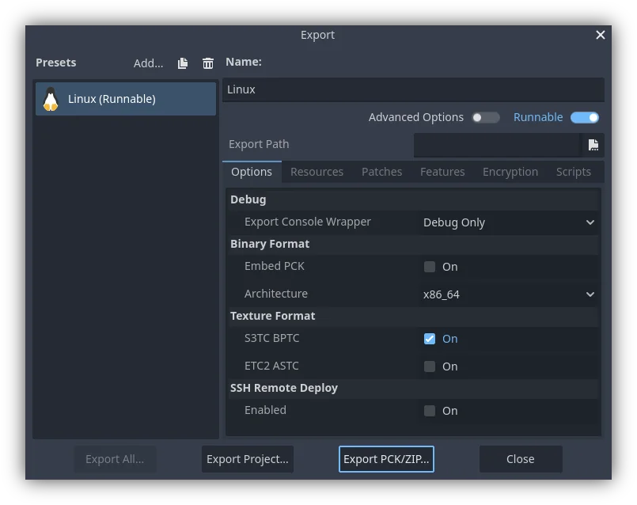

.. _doc_exporting_pcks:

Exporting packs, patches, and mods
==================================

Use cases
---------

Oftentimes, one would like to add functionality to one's game after it has been
deployed.

Examples of this include...

- Downloadable Content: the ability to add features and content to one's game.
- Patches: the ability to fix a bug that is present in a shipped product.
- Mods: grant other people the ability to create content for one's game.

These tools help developers to extend their development beyond the initial
release.

Overview of PCK/ZIP files
-------------------------

Godot enables this via a feature called **resource packs** (PCK files,
with the ``.pck`` extension, or ZIP files).

**Advantages:**

- incremental updates/patches
- offer DLCs
- offer mod support
- no source code disclosure needed for mods
- more modular project structure
- users don't have to replace the entire game

The first part of using them involves exporting and delivering the project to
players. Then, when one wants to add functionality or content later on, they
just deliver the updates via PCK/ZIP files to the users.

PCK/ZIP files usually contain, but are not limited to:

- scripts
- scenes
- shaders
- models
- textures
- sound effects
- music
- any other asset suitable for import into the game

The PCK/ZIP files can even be an entirely different Godot project, which the
original game loads in at runtime.

It is possible to load both PCK and ZIP files as additional packs at the same time.
See :ref:`doc_exporting_projects_pck_versus_zip` for a comparison of the two formats.

.. seealso::

    If you want to load loose files at runtime (not packed in a PCK or ZIP by Godot),
    consider using :ref:`doc_runtime_loading_and_saving` instead.
    This is useful for loading user-generated content that is not made with Godot,
    without requiring users to pack their mods into a specific file format.

    The downside of this approach is that it's less transparent to the game logic,
    as it will not benefit from the same resource management as PCK/ZIP files.

Security Concerns
-----------------

It is important to note that loading PCK files for patches, mods, or extra content
like expansions, will require you to code a system to automatically load files based
on their location, and possibly name. This is a security vulnerability in three
scenarios. One, a user downloads a mod with malicious code. Two, a malicious program
already exists on an end users PC and has replaced the PCK file with a malicious
copy. Three, you are distributing patch PCK files through a game launcher and the
system has become compromised.

Take this into consideration when determining how to use PCK files in a project.
For situations where you have a patching system via a launcher, consider using
asymmetric cryptography. In the main PCK you could store the public key, and sign
patch or expansion PCK files with the private key. See the :ref:`class_Crypto` class
for more information.

Piracy Concerns
---------------

If you want to use PCK files to distribute extra paid content, such as expansions,
keep in mind that Godot provides no way out of the box to prevent someone from
copying the PCK file, and putting it on another persons computer. Any kind of DRM
system is your responsibility to implement if that's what you want.

Generating PCK files
--------------------

In order to pack all resources of a project into a PCK file, open the project
and go to :menu:`Project > Export`, select and export preset, and click on
:button:`Export PCK/ZIP`.

Another method would be to :ref:`export from the command line <doc_command_line_tutorial_exporting>`
with ``--export-pack``. The output file must with a ``.pck`` or ``.zip``
file extension. The export process will build that type of file for the
chosen platform.

Patch PCK files
---------------

Generating Patch PCK files
~~~~~~~~~~~~~~~~~~~~~~~~~~

To create a PCK file that only contains resources not present in the original
release of a project, you would create a patch PCK file. This could be used for
patches, mods or expansions. For this to work you'll first need to have a PCK file
created of your project at the point of its initial release.

To generate a patch PCK file, within the export menu, and with your desired preset
selected, click on the :Button:`Patching` tab. At the bottom is the :ui:`Base Packs`
section. Click on the :Button:`Add Pack` button, then navigate to the PCK file you
exported that contains everything in your project for its initial release.

Now, when you go to export a PCK file of your project again, if you have the
:Button:`Export as Patch` button selected. Only files resources that have changed
will be exported in the PCK file.

You can also add any patches you export to your base packs for future use. For
example, adding ``patch.pck`` will ensure that ``patch2.pck`` will not include any
resources from that first patch.

Delta Encoding
~~~~~~~~~~~~~~

Patch PCK files can be made smaller through the use of delta encoding. This makes it
so that only parts of a file that have been changed are updated. This does have a
drawback of longer load times for the patch PCK files. There are two settings for
Delta encoding in addition to the filters:

- **Delta Encoding Compression Level:** Controls how much compression is applied to
  the files. We do not recommend any more than the default of 19. Beyond that more
  memory is needed for export and import for significantly fewer gains. any positive
  number values will have the same decompression speed, however export will take
  longer the higher the number is. Negative number values enable fast mode, which
  means larger files, but the decompression speed is faster.

- **Delta Encoding Minimum Size Reduction:** Controls how much size has to be saved
  at minimum for compression to be used on an individual file. For example, at a
  level of 10%, if the file size can only be reduced by 5%, then the file won't use
  delta encoding.

The default compression level, 19, is the highest recommended level

Opening PCK or ZIP files at runtime
-----------------------------------

To load a PCK or ZIP file, one uses the ProjectSettings singleton. The following
example expects a ``mod.pck`` file in the directory of the game's executable.
The PCK or ZIP file contains a ``mod_scene.tscn`` test scene in its root.

.. tabs::
 .. code-tab:: gdscript GDScript

    func _your_function():
        # This could fail if, for example, mod.pck cannot be found.
        var success = ProjectSettings.load_resource_pack(OS.get_executable_path().get_base_dir().path_join("mod.pck"))

        if success:
            # Now one can use the assets as if they had them in the project from the start.
            var imported_scene = load("res://mod_scene.tscn")

 .. code-tab:: csharp

    private void YourFunction()
    {
        // This could fail if, for example, mod.pck cannot be found.
        var success = ProjectSettings.LoadResourcePack(OS.GetExecutablePath().GetBaseDir().PathJoin("mod.pck"));

        if (success)
        {
            // Now one can use the assets as if they had them in the project from the start.
            var importedScene = (PackedScene)ResourceLoader.Load("res://mod_scene.tscn");
        }
    }

.. warning::

    By default, if you import a file with the same file path/name as one you
    already have in your project, the imported one will replace it. This is
    something to watch out for when creating DLC or mods. You can solve this
    problem by using a tool that isolates mods to a specific mods subfolder.

    However, it is also a way of creating patches for one's own game. A PCK/ZIP
    file of this kind can fix the content of a previously loaded PCK/ZIP
    (therefore, the order in which packs are loaded matters).

    To opt out of this behavior, pass ``false`` as the second argument to
    :ref:`ProjectSettings.load_resource_pack() <class_ProjectSettings_method_load_resource_pack>`.

.. note::

    For a C# project, you need to build the DLL and place it in the project directory first.
    Then, before loading the resource pack, you need to load its DLL as follows:
    ``Assembly.LoadFile("mod.dll")``

Troubleshooting
~~~~~~~~~~~~~~~

If you are loading a resource pack and are not noticing any changes, it may be
due to the pack being loaded too late. This is particularly the case with menu
scenes that may preload other scenes using
:ref:`preload() <class_@GDScript_method_preload>`. This means that loading
a pack in the menu will not affect the other scene that was already preloaded.

To avoid this, you need to load the pack as early as possible.
To do so, create a new :ref:`autoload <doc_singletons_autoload>` script and
call :ref:`ProjectSettings.load_resource_pack() <class_ProjectSettings_method_load_resource_pack>`
in the autoload script's ``_init()`` function, rather than ``_enter_tree()``
or ``_ready()``.

Modding considerations
----------------------

If one wishes to support mods for their game, they will need their users to
create similarly exported files. Assuming the original game expects a
certain structure for the PCK's resources, and/or a certain interface for
its scripts, then one of two things has to be done.

1. The developer must publicize documentation of these expected structures/
    interfaces, expect modders to install Godot Engine, and then also expect
    those modders to conform to the documentation's defined API when building
    mod content for the game (so that it will work). Users would then use
    Godot's built in exporting tools to create a PCK file, as detailed
    above.
2. The developer uses Godot to build a GUI tool for adding their exact API
    content to a project. This Godot tool must either run on a tools-enabled
    build of the engine or have access to one (distributed alongside or
    perhaps in the original game's files). The tool can then use the Godot
    executable to export a PCK file from the command line with
    :ref:`OS.execute() <class_OS_method_execute>`. The game itself shouldn't
    use a tool-build of the engine (for security), so it's best to keep
    the modding tool and game separate.
