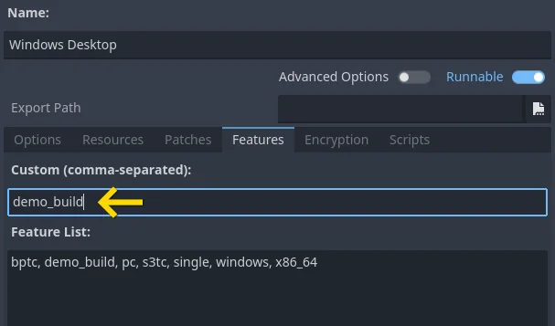
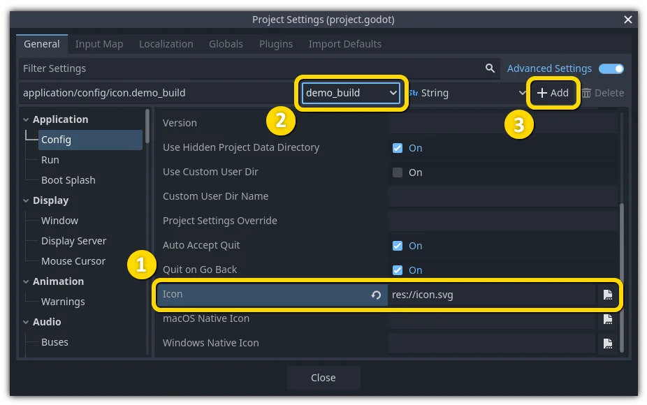
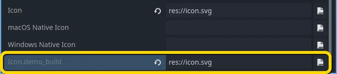
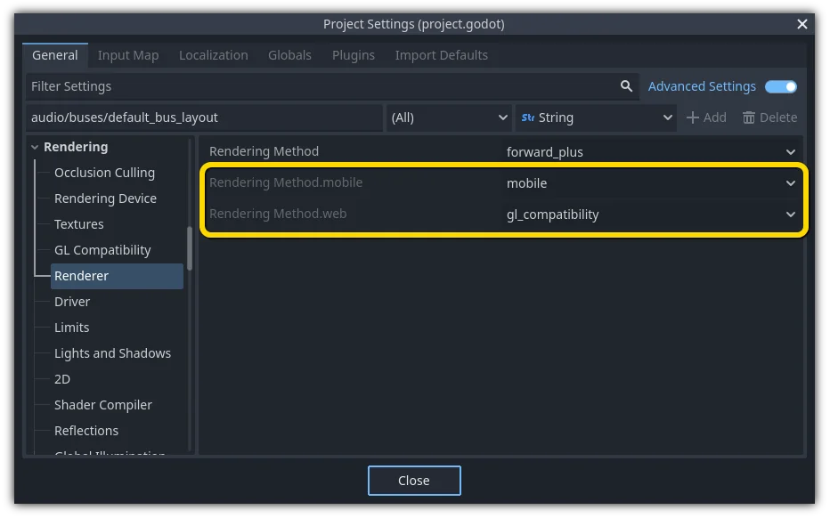

.. _doc_feature_tags:

Feature tags
============

Introduction
------------

Godot has a special system to tag availability of features.
Each *feature* is represented as a string, which can refer to many of the following:

* Platform name.
* Platform architecture (64-bit or 32-bit, x86 or ARM).
* Platform type (desktop, mobile, Web).
* Supported texture compression algorithms on the platform.
* Whether a build is ``debug`` or ``release`` (``debug`` includes the editor).
* Whether the project is running from the editor or a "standalone" binary.
* Many more things.

Features can be queried at runtime from the singleton API by calling:

.. tabs::
 .. code-tab:: gdscript

    OS.has_feature(name)

 .. code-tab:: csharp

    OS.HasFeature(name);

OS feature tags are used by GDExtension to determine which libraries to load.
For example, a library for ``linux.debug.editor.x86_64`` will be
loaded only on a debug editor build for Linux x86_64.

Default features
----------------

Here is a list of most feature tags in Godot. Keep in mind they are **case-sensitive**:

+----------------------+-----------------------------------------------------------------------------------------+
| **Feature tag**      | **Description**                                                                         |
+======================+=========================================================================================+
| **android**          | Running on Android (but not within a Web browser)                                       |
+----------------------+-----------------------------------------------------------------------------------------+
| **bsd**              | Running on \*BSD (but not within a Web browser)                                         |
+----------------------+-----------------------------------------------------------------------------------------+
| **linux**            | Running on Linux (but not within a Web browser)                                         |
+----------------------+-----------------------------------------------------------------------------------------+
| **macos**            | Running on macOS (but not within a Web browser)                                         |
+----------------------+-----------------------------------------------------------------------------------------+
| **ios**              | Running on iOS (but not within a Web browser)                                           |
+----------------------+-----------------------------------------------------------------------------------------+
| **visionos**         | Running on visionOS (but not within a Web browser)                                      |
+----------------------+-----------------------------------------------------------------------------------------+
| **windows**          | Running on Windows                                                                      |
+----------------------+-----------------------------------------------------------------------------------------+
| **linuxbsd**         | Running on Linux or \*BSD                                                               |
+----------------------+-----------------------------------------------------------------------------------------+
| **debug**            | Running on a debug build (including the editor)                                         |
+----------------------+-----------------------------------------------------------------------------------------+
| **release**          | Running on a release build                                                              |
+----------------------+-----------------------------------------------------------------------------------------+
| **editor**           | Running on an editor build                                                              |
+----------------------+-----------------------------------------------------------------------------------------+
| **editor_hint**      | Running on an editor build, and inside the editor                                       |
+----------------------+-----------------------------------------------------------------------------------------+
| **editor_runtime**   | Running on an editor build, and running the project                                     |
+----------------------+-----------------------------------------------------------------------------------------+
| **template**         | Running on a non-editor (export template) build                                         |
+----------------------+-----------------------------------------------------------------------------------------+
| **double**           | Running on a double-precision build                                                     |
+----------------------+-----------------------------------------------------------------------------------------+
| **single**           | Running on a single-precision build                                                     |
+----------------------+-----------------------------------------------------------------------------------------+
| **64**               | Running on a 64-bit build (any architecture)                                            |
+----------------------+-----------------------------------------------------------------------------------------+
| **32**               | Running on a 32-bit build (any architecture)                                            |
+----------------------+-----------------------------------------------------------------------------------------+
| **x86_64**           | Running on a 64-bit x86 build                                                           |
+----------------------+-----------------------------------------------------------------------------------------+
| **x86_32**           | Running on a 32-bit x86 build                                                           |
+----------------------+-----------------------------------------------------------------------------------------+
| **x86**              | Running on an x86 build (any bitness)                                                   |
+----------------------+-----------------------------------------------------------------------------------------+
| **arm64**            | Running on a 64-bit ARM build                                                           |
+----------------------+-----------------------------------------------------------------------------------------+
| **arm32**            | Running on a 32-bit ARM build                                                           |
+----------------------+-----------------------------------------------------------------------------------------+
| **arm**              | Running on an ARM build (any bitness)                                                   |
+----------------------+-----------------------------------------------------------------------------------------+
| **rv64**             | Running on a 64-bit RISC-V build                                                        |
+----------------------+-----------------------------------------------------------------------------------------+
| **riscv**            | Running on a RISC-V build (any bitness)                                                 |
+----------------------+-----------------------------------------------------------------------------------------+
| **ppc64**            | Running on a 64-bit PowerPC build                                                       |
+----------------------+-----------------------------------------------------------------------------------------+
| **ppc32**            | Running on a 32-bit PowerPC build                                                       |
+----------------------+-----------------------------------------------------------------------------------------+
| **ppc**              | Running on a PowerPC build (any bitness)                                                |
+----------------------+-----------------------------------------------------------------------------------------+
| **wasm64**           | Running on a 64-bit WebAssembly build (not yet possible)                                |
+----------------------+-----------------------------------------------------------------------------------------+
| **wasm32**           | Running on a 32-bit WebAssembly build                                                   |
+----------------------+-----------------------------------------------------------------------------------------+
| **wasm**             | Running on a WebAssembly build (any bitness)                                            |
+----------------------+-----------------------------------------------------------------------------------------+
| **mobile**           | Host OS is a mobile platform                                                            |
+----------------------+-----------------------------------------------------------------------------------------+
| **pc**               | Host OS is a PC platform (desktop/laptop)                                               |
+----------------------+-----------------------------------------------------------------------------------------+
| **web**              | Host OS is a Web browser                                                                |
+----------------------+-----------------------------------------------------------------------------------------+
| **nothreads**        | Running without threading support                                                       |
+----------------------+-----------------------------------------------------------------------------------------+
| **threads**          | Running with threading support                                                          |
+----------------------+-----------------------------------------------------------------------------------------+
| **web_android**      | Host OS is a Web browser running on Android                                             |
+----------------------+-----------------------------------------------------------------------------------------+
| **web_ios**          | Host OS is a Web browser running on iOS                                                 |
+----------------------+-----------------------------------------------------------------------------------------+
| **web_linuxbsd**     | Host OS is a Web browser running on Linux or \*BSD                                      |
+----------------------+-----------------------------------------------------------------------------------------+
| **web_macos**        | Host OS is a Web browser running on macOS                                               |
+----------------------+-----------------------------------------------------------------------------------------+
| **web_windows**      | Host OS is a Web browser running on Windows                                             |
+----------------------+-----------------------------------------------------------------------------------------+
| **etc**              | Textures using ETC1 compression are supported                                           |
+----------------------+-----------------------------------------------------------------------------------------+
| **etc2**             | Textures using ETC2 compression are supported                                           |
+----------------------+-----------------------------------------------------------------------------------------+
| **s3tc**             | Textures using S3TC (DXT/BC) compression are supported                                  |
+----------------------+-----------------------------------------------------------------------------------------+
| **movie**            | :ref:`Movie Maker mode <doc_creating_movies>` is active                                 |
+----------------------+-----------------------------------------------------------------------------------------+
| **shader_baker**     | Project was exported with :ref:`shader baking <doc_pipeline_compilations_shader_baker>` |
|                      | enabled (only applies to the exported project, not when running in the editor)          |
+----------------------+-----------------------------------------------------------------------------------------+
| **dedicated_server** | Project was exported as a :ref:`dedicated server <doc_exporting_for_dedicated_servers>` |
|                      | (only applies to the exported project, not when running in the editor)                  |
+----------------------+-----------------------------------------------------------------------------------------+

.. warning::

    With the exception of texture compression, ``web_<platform>`` and
    ``movie`` feature tags, default feature tags are **immutable**.
    This means that they will *not* change depending on runtime conditions.
    For example, ``OS.has_feature("mobile")`` will return ``false``
    when running a project exported to Web on a mobile device.

    To check whether a project exported to Web is running on a mobile device,
    use ``OS.has_feature("web_android") or OS.has_feature("web_ios")``.

Custom features
---------------

It is possible to add custom features to a build; use the relevant
field in the *export preset* used to generate it:

.. note::

    Custom feature tags are only used when running the exported project
    (including with :ref:`doc_one-click_deploy`). They are **not used** when
    running the project from the editor, even if the export preset marked as
    **Runnable** for your current platform has custom feature tags defined.

    Custom feature tags are also not used in :ref:`class_EditorExportPlugin`
    scripts. Instead, feature tags in :ref:`class_EditorExportPlugin`
    will reflect the device the editor is currently running on.

Overriding project settings
---------------------------

Features can be used to override specific configuration values in the *Project Settings*.
This allows you to better customize any configuration when doing a build.

In the following example, a different icon is added for the demo build of the game (which was
customized in a special export preset, which, in turn, includes only demo levels).

    The desired configuration is selected, which effectively copies its properties to the panel above (1). The "demo_build" feature tag is selected (2). The configuration is added to the project settings (3).

After overriding, a new field is added for this specific configuration.

.. note::

    When using the
    :ref:`project settings "override.cfg" functionality <class_ProjectSettings>`
    (which is unrelated to feature tags), remember that feature tags still apply.
    Therefore, make sure to *also* override the setting with the desired feature
    tag(s) if you want them to override base project settings on all platforms
    and configurations.

Default overrides
-----------------

There are already a lot of settings that come with overrides by default; they can be found
in many sections of the project settings.

Taking feature tags into account when reading project settings
--------------------------------------------------------------

By default, feature tags are **not** taken into account when reading project settings
using the typical approaches (:ref:`ProjectSettings.get_setting<class_ProjectSettings_method_get_setting>`
or :ref:`ProjectSettings.get <class_Object_private_method__get>`).
Instead, you must use :ref:`ProjectSettings.get_setting_with_override <class_ProjectSettings_method_get_setting>`.

For example, with the following project settings:

::

    [section]

    subsection/example = "Release"
    subsection/example.debug = "Debug"

Using ``ProjectSettings.get_setting("section/subsection/example")`` will return
``"Release"`` regardless of whether a debug build is currently running. On the
other hand, ``ProjectSettings.get_setting_with_override("section/subsection/example")``
will obey feature tags and will return ``"Debug"`` if using a debug build.

Customizing the build
---------------------

Feature tags can be used to customize a build process too, by writing a custom **ExportPlugin**.
They are also used to specify which shared library is loaded and exported in **GDExtension**.
