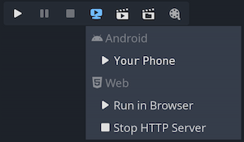

.. _doc_one-click_deploy:

One-click deploy
================

What is one-click deploy?
-------------------------

One-click deploy is a feature that is available once a platform is properly
configured and a supported device is connected to the computer. Since things can
go wrong at many levels (platform may not be configured correctly, SDK may be
incorrectly installed, device may be improperly configured, etc.), it's good to
let the user know that it exists.

After adding an Android export preset marked as Runnable, Godot can detect when
a USB device is connected to the computer and offer the user to automatically
export, install and run the project (in debug mode) on the device. This feature
is called *one-click deploy*.

.. note::

   One-click deploy is only available once you've added an export template
   marked as **Runnable** in the Export dialog. You can mark several export
   presets as runnable, but only one preset per platform may be marked as
   runnable. If you mark a second preset in a given platform as runnable, the
   other preset will no longer be marked as runnable.

Supported platforms
-------------------

- **Android:** Exports the project with debugging enabled and runs it on the
  connected device.

   - Make sure to follow the steps described in :ref:`doc_exporting_for_android`.
     Otherwise, the one-click deploy button won't appear.

   - If you have more than one device connected, Godot will ask you which device
     the project should be exported to.

- **iOS:** Exports the project with debugging enabled and runs it on the
  connected device.

   - Make sure to follow the steps described in :ref:`doc_exporting_for_ios`.
     Otherwise, the one-click deploy button won't appear.

   - For each new bundle identifier, export the project, open it in the
     Xcode, and build at least once to create new provisioning profile or
     create a provisioning profile in the Apple Developer account dashboard.

   - If you have more than one device connected, Godot will ask you which device
     the project should be exported to.

- **Desktop platforms:** Exports the project with debugging enabled and runs it
  on the remote computer via SSH.

- **Web:** Starts a local web server and runs the exported project by opening
  the default web browser. This is only accessible on ``localhost`` by default.
  See :ref:`Troubleshooting <doc_one-click_deploy_troubleshooting_web>`
  for making the exported project accessible on remote devices.

Using one-click deploy
----------------------

- **Android:**
   - Enable developer mode on your mobile device
     then enable USB debugging in the device's settings.
   - After enabling USB debugging, connect the device to your PC using a USB
     cable.
   - For advanced users, it should also be possible to use wireless ADB.

- **iOS:**
   - Install Xcode, accept Xcode license and login with your Apple Developer
     account.
   - If you are using Xcode 14 or earlier, install `ios-deploy <https://github.com/ios-control/ios-deploy>`__
     and set path to `ios-deploy` in the Editor Settings (see `Export ⇾ iOS ⇾ iOS Deploy`).
   - For running on device:
      - Pair your mobile device with a Mac.
      - Enable developer mode on your device.
      - Device can be connected via USB or local network.
      - Make sure the device is on the same local network and a correct network
        interface is selected in the editor settings (see `Network ⇾ Debug ⇾ Remote Host`).
        By default, the editor is listening for `localhost` connections only.
   - Device screen should be unlocked.

- **Desktop platforms:**
   - Enable `SSH Remote Deploy` and configure connection settings in the project
     export setting.

- Make sure there is an export preset marked as **Runnable** for the target
  platform (Android, iOS or Web).
- If everything is configured correctly and with no errors, platform-specific
  icons will appear in the top-right corner of the editor.
- Click the button to export to the desired platform in one click.

.. _doc_one-click_deploy_troubleshooting:

Troubleshooting
---------------

Android
~~~~~~~

If you can't see the device in the list of devices when running the
``adb devices`` command in a terminal, it will not be visible by Godot either.
To resolve this:

- Check if USB debugging is enabled *and authorized on the device*.
  Try unlocking your device and accepting the authorization prompt if you see any.
  If you can't see this prompt, running ``adb devices`` on your PC should make
  the authorization prompt appear on the device.
- Try `revoking the debugging authorization <https://stackoverflow.com/questions/23081263/adb-android-device-unauthorized>`__
  in the device's developer settings, then follow the steps again.
- Try using USB debugging instead of wireless debugging or vice versa.
  Sometimes, one of those can work better than the other.
- On Linux, you may be missing the required
  `udev rules <https://github.com/M0Rf30/android-udev-rules>`__
  for your device to be recognized.

.. _doc_one-click_deploy_troubleshooting_web:

Web
~~~

By default, the web server started by the editor is only accessible from
``localhost``. This means the web server can't be reached by other devices on
the local network or the Internet (if port forwarding is set up on the router).
This is done for security reasons, as you may not want other devices to be able
to access the exported project while you're testing it. Binding to ``localhost``
also prevents a firewall popup from appearing when you use one-click deploy for
the web platform.

To make the local web server accessible over the local network, you'll need to
change the **Export > Web > HTTP Host** editor setting to ``0.0.0.0``. You will
also need to enable **Export > Web > Use TLS** as SharedArrayBuffer requires the
use of a secure connection to work, *unless* connecting to ``localhost``.
However, since other clients will be connecting to a remote device, the use of
TLS is absolutely required here.

To make the local web server accessible over the Internet, you'll also need to
forward the **Export > Web > HTTP Port** port specified in the Editor Settings
(``8060`` by default) in TCP on your router. This is usually done by accessing
your router's web interface then adding a NAT rule for the port in question. For
IPv6 connections, you should allow the port in the router's IPv6 firewall
instead. Like for local network devices, you will also need to enable **Export >
Web > Use TLS**.

.. note::

    When **Use TLS** is enabled, you will get a warning from your web browser as
    Godot will use a temporary self-signed certificate. You can safely ignore it
    and bypass the warning by clicking **Advanced** and then **Proceed to
    (address)**.

    If you have an SSL/TLS certificate that is trusted by browsers, you can specify
    the paths to the key and certificate files in the **Export > Web > TLS Key**
    and **Export > Web > TLS Certificate**. This will only work if the project
    is accessed through a domain name that is part of the TLS certificate.

.. warning::

    When using one-click deploy on different projects, it's possible that
    a previously edited project is being shown instead. This is due to service
    worker caching not being cleared automatically. See
    :ref:`doc_exporting_for_web_troubleshooting` for instructions on unregistering
    the service worker, which will effectively clear the cache and resolve the issue.
