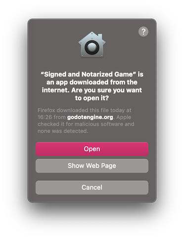
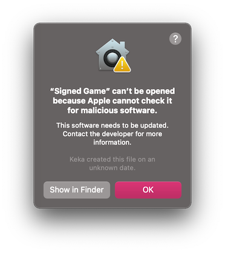
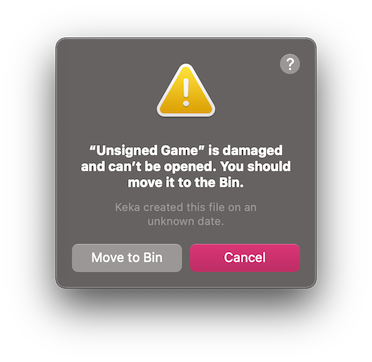
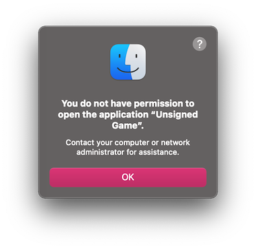

.. _doc_running_on_macos:

Running Godot apps on macOS
===========================

.. seealso::

    This page covers running Godot projects on macOS.
    If you haven't exported your project yet, read :ref:`doc_exporting_for_macos` first.

By default, macOS will run only applications that are signed and notarized.

.. note::

    When running an app from the Downloads folder or when still in quarantine,
    Gatekeeper will perform *path randomization* as a security measure.
    This breaks access to relative paths from the app, which the app relies upon to work.
    To resolve this issue, move the app to the ``/Applications`` folder.

    In general, macOS apps should avoid relying on relative paths from the
    application folder.

Depending on the way a macOS app is signed and distributed, the following scenarios are possible:

App is signed, notarized and distributed via App Store
------------------------------------------------------

.. note::

    App developers need to join the Apple Developer Program, and configure signing and notarization options during export, then upload the app to the App Store.

The app should run out of the box, without extra user interaction required.

App is signed, notarized and distributed outside App Store
----------------------------------------------------------

.. note::

    App developers need to join the Apple Developer Program, and configure signing and notarization options during export, then distribute the app as ".DMG" or ".ZIP" archive.

When you run the app for the first time, the following dialog is displayed:

Click ``Open`` to start the app.

If you see the following warning dialog, your Mac is set up to allow apps only from the App Store.

.. image:: img/signed_and_notarized_1.png

To allow third-party apps, open ``System Preferences``, click ``Security & Privacy``, then click ``General``, unlock settings, and select ``App Store and identified developers``.

.. image:: img/sys_pref_0.png

App is signed (including ad-hoc signatures) but not notarized
-------------------------------------------------------------

.. note::

    App developer used self-signed certificate or ad-hoc signing (default Godot behavior for exported project).

When you run the app for the first time, the following dialog is displayed:

To run this app, you can temporarily override Gatekeeper:

* Either open ``System Preferences``, click ``Security & Privacy``, then click ``General``, and click ``Open Anyway``.

  .. image:: img/sys_pref_1.png

* Or, right-click (Control-click) on the app icon in the Finder window and select ``Open`` from the menu.

  .. image:: img/signed_1.png

* Then click ``Open`` in the confirmation dialog.

  .. image:: img/signed_2.png

* Enter your password if you're prompted.

Another option is to disable Gatekeeper entirely. Note that this does decrease
the security of your computer by allowing you to run any software you want.
To do this, run ``sudo spctl --master-disable`` in the Terminal, enter your
password, and then the **Anywhere** option will be available:

  .. image:: img/macos_allow_from_anywhere.png

Note that Gatekeeper will re-enable itself when macOS updates.

App is not signed, executable is linker-signed
----------------------------------------------

.. note::

    App is built using official export templates, but it is not signed.

When you run the app for the first time, the following dialog is displayed:

To run this app, you should remove the quarantine extended file attribute manually:

* Open ``Terminal.app`` (press :kbd:`Cmd + Space` and enter ``Terminal``).

* Navigate to the folder containing the target application.

  Use the ``cd path_to_the_app_folder`` command, e.g. ``cd ~/Downloads/`` if it's in the ``Downloads`` folder.

* Run the command ``xattr -dr com.apple.quarantine "Unsigned Game.app"`` (including quotation marks and ``.app`` extension).

Neither app nor executable is signed (relevant for Apple Silicon Macs only)
---------------------------------------------------------------------------

.. note::

    App is built using custom export templates, compiled using OSXCross, and it is not signed at all.

When you run the app for the first time, the following dialog is displayed:

To run this app, you can ad-hoc sign it yourself:

* Install ``Xcode`` for the App Store, start it and confirm command line tools installation.

* Open ``Terminal.app`` (press :kbd:`Cmd + Space` and enter ``Terminal``).

* Navigate to the folder containing the target application.

  Use the ``cd path_to_the_app_folder`` command, e.g. ``cd ~/Downloads/`` if it's in the ``Downloads`` folder.

* Run the following commands:

  ``xattr -dr com.apple.quarantine "Unsigned Game.app"`` (including quotation marks and ".app" extension).

  ``codesign -s - --force --deep "Unsigned Game.app"`` (including quotation marks and ".app" extension).
