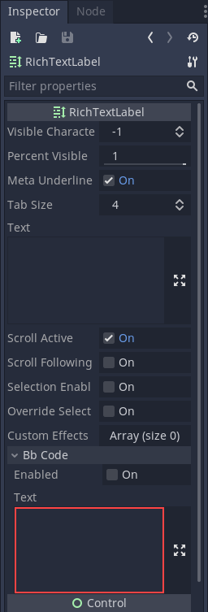
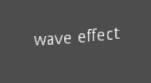
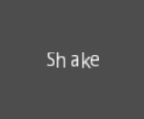
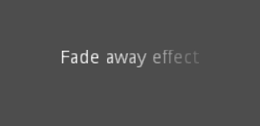
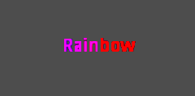

.. _doc_bbcode_in_richtextlabel:

BBCode in RichTextLabel
=======================

Introduction
------------

Label nodes are great for displaying basic text but they have limits. If you want
to change the color of the text, or its allignment, that change affects all of the
text in the label node. You can't have only one part of the text be one color, or
only one part of the text be centered. to get around this limitation you would use
a :ref:`class_RichTextLabel`.

:ref:`class_RichTextLabel` allows the display of complex text markup in a control.
It has a built-in API for generating the markup, but can also parse a BBCode.

Note that the BBCode tags can also be used, to some extent, in the
:ref:`XML source of the class reference <doc_updating_the_class_reference>`.

Using BBCode
------------

Normally for text you would write in the text property. But with BBCode everything
needs to be written in the BBCode property

For example, ``BBCode [b] bold [b]`` makes text blue. After putting that
in the text property the BBCode is shown like regular text. That's because you
need to check ``Enabled`` for it to work. you should get a result like this.

.. iamge:: img/bbcodeDemo.png

You'll notice that after writing in the BBCode text property the regular text
property now has the text without the BBCode. While the text property will be updated
by the BBCode property, you can't edit the text property or you'll break the BBCode.
All changes to the text must be done in the BBCode parameter.

.. node:: for BBCode such as ``Bold`` or ``Italics`` to work you must
		  set up custom fonts for the RichTextLabel node first.

Reference
---------

+-------------------+--------------------------------------------+--------------------------------------------------------------+
| Command           | Tag                                        | Description                                                  |
+-------------------+--------------------------------------------+--------------------------------------------------------------+
| **bold**          | ``[b]{text}[/b]``                          | Makes {text} bold.                                           |
+-------------------+--------------------------------------------+--------------------------------------------------------------+
| **italics**       | ``[i]{text}[/i]``                          | Makes {text} italics.                                        |
+-------------------+--------------------------------------------+--------------------------------------------------------------+
| **underline**     | ``[u]{text}[/u]``                          | Makes {text} underline.                                      |
+-------------------+--------------------------------------------+--------------------------------------------------------------+
| **strikethrough** | ``[s]{text}[/s]``                          | Makes {text} strikethrough.                                  |
+-------------------+--------------------------------------------+--------------------------------------------------------------+
| **code**          | ``[code]{text}[/code]``                    | Makes {text} monospace.                                      |
+-------------------+--------------------------------------------+--------------------------------------------------------------+
| **center**        | ``[center]{text}[/center]``                | Makes {text} centered.                                       |
+-------------------+--------------------------------------------+--------------------------------------------------------------+
| **right**         | ``[right]{text}[/right]``                  | Makes {text} right-aligned.                                  |
+-------------------+--------------------------------------------+--------------------------------------------------------------+
| **fill**          | ``[fill]{text}[/fill]``                    | Makes {text} fill width.                                     |
+-------------------+--------------------------------------------+--------------------------------------------------------------+
| **indent**        | ``[indent]{text}[/indent]``                | Increase indent level of {text}.                             |
+-------------------+--------------------------------------------+--------------------------------------------------------------+
| **url**           | ``[url]{url}[/url]``                       | Show {url} as such.                                          |
+-------------------+--------------------------------------------+--------------------------------------------------------------+
| **url (ref)**     | ``[url=<url>]{text}[/url]``                | Makes {text} reference <url>.                                |
+-------------------+--------------------------------------------+--------------------------------------------------------------+
| **image**         | ``[img]{path}[/img]``                      | Insert image at resource {path}.                             |
+-------------------+--------------------------------------------+--------------------------------------------------------------+
| **font**          | ``[font=<path>]{text}[/font]``             | Use custom font at <path> for {text}.                        |
+-------------------+--------------------------------------------+--------------------------------------------------------------+
| **color**         | ``[color=<code/name>]{text}[/color]``      | Change {text} color; use name or # format, such as #ff00ff.  |
+-------------------+--------------------------------------------+--------------------------------------------------------------+

Built-in color names
~~~~~~~~~~~~~~~~~~~~

List of valid color names for the [color=<name>] tag:

-  aqua
-  black
-  blue
-  fuchsia
-  gray
-  green
-  lime
-  maroon
-  navy
-  purple
-  red
-  silver
-  teal
-  white
-  yellow

Hexadecimal color codes
~~~~~~~~~~~~~~~~~~~~~~~

For opaque RGB colors, any valid 6-digit hexadecimal code is supported, e.g. ``[color=#ffffff]white[/color]``.

For transparent RGB colors, any 8-digit hexadecimal code can be used, e.g. ``[color=#88ffffff]translucent white[/color]``.
In this case, note that the alpha channel is the **first** component of the color code, not the last one.

Animation Effects
-----------------

BBCode can also be used to create different text animation effects. Right now there
are five. Each of them can be customized.

Wave
++++

Wave makes the text go up and down. The code for it is ``[wave amp=50 freq=2][/wave]``,
``amp`` controls how high and low the effect goes, and ``freq`` controls how fast the
text goes up and down.

Tornado
+++++++

Tornao makes the text move around in a circle. The code for it is
``[tornado radius=5 freq=2][/tornado]``, ``radius`` is the radius of the circle that
controls its offset, ``freq`` is how fast the text moves in a circle.

Shake
+++++

Shake makes the text shake. The code for it is ``[shake rate=5 level=10][/shake]``,
``rate`` controls how fast the text shakes, ``level`` controls how far the text is
offset from the origin.

Fade
++++

Fade creates a fade effect over the text that is not animated. The code for it is
``[fade start=4 length=14][/fade]``, ``start`` controls the starting position of
the falloff relative to where the fade command is inserted, ``length`` controls
over how many characters should the fade out take place.

Rainbow
+++++++

Rainbow gives the text a rainbow color that changes over time. The code for it is
``[rainbow freq=0.2 sat=10 val=20][/rainbow], ``freq`` is the number of full
rianbow cycles per second, ``sat`` is the saturation of the rainbow, ``val`` is
the value of the rainbow.

Custom BBCodes and Text Effects
-------------------------------

You can extend the ``RichTextEffect`` resource type to create your own custom
BBCodes. You begin by extending the RichTextEffect resource type. Add the tool prefix
to your gdscript file if you wish to have these custom effects run within the editor
itself. The RichTextLabel does not need to have a script attached, nor does it need
to be running in tool mode.

Here are some examples of custom effects:

Ghost
+++++

::

	tool extends RichTextEffect

	var bbcode = "ghost"

	func _process_custom_fx(char_fx):
		
		var speed = char_fx.get_or("freq", 5.0)
		var span = char_fx.get_or("span", 10.0)
		
		var alpha = sin(char_fx.elapsed_time * speed + (char_fx.absolute_index / span)) * 0.5 + 0.5
		char_fx.color.a = alpha
		return true;

Pulse
+++++

::

	tool extends RichTextEffect

	var bbcode = "pulse"

	func _process_custom_fx(char_fx):
		var color = char_fx.get_or("color", char_fx.color)
		var height = char_fx.get_or("height", 0.0)
		var freq = char_fx.get_or("freq", 2.0)
		
		var sinedTime = (sin(char_fx.elapsed_time * freq) + 1.0) / 2.0
		var y_off = sinedTime * height
		color.a = 1.0
		char_fx.color = char_fx.color.linear_interpolate(color, sinedTime)
		char_fx.offset = Vector2(0, -1) * y_off
		return true

Matrix
++++++

::

	tool extends RichTextEffect

	var bbcode = "matrix"

	func _process_custom_fx(char_fx):
		var clear_time = char_fx.get_or("clean", 2.0)
		var dirty_time = char_fx.get_or("dirty", 1.0)
		var text_span = char_fx.get_or("span", 50)
		
		var value = char_fx.character
		
		var matrix_time = fmod(char_fx.elapsed_time + (char_fx.absolute_index / float(text_span)), \
								clear_time + dirty_time)
		
		matrix_time = 0.0 if matrix_time < clear_time else \
					(matrix_time - clear_time)/dirty_time
		
		if( value >= 65 && value < 126 && matrix_time > 0.0 ):
			value -= 65
			value = value + int((1 * matrix_time * (126-65)))
			value %= (126 - 65)
			value += 65
		char_fx.character = value
		return true

There is only one function you need to extend named _process_custom_fx(char_fx).
Optionally, you can also provide a custom bbcode identifier simply by adding a member
name bbcode. The code will check the bbcode automagically or will simply use the name
of the file to determine what the bbcode should be.

_process_custom_fx.
+++++++++++++++++++

This is where the logic of each effect takes place and is called once per character
during the draw phase of text rendering. This passes in a CharFXTransform object, which
holds a few variables that control how the associated character is rendered. The first
is identity, which will specify which custom effect is being processed. You should use
that for code flow control. relative_index will tell you how far into a given custom
effect block you are in as an index. absolute_index will tell you how far into the entire
text you are as an index. elapsed_time is the total amount of time the text effect has
been running. visible will tell you whether the character is visible or not and will also
allow you to hide a given portion of text. offset is an offset position relative to where
given character should render under normal circumstances. color is the color of a given
character. There's also env which is a dictionary of variables assigned to a given custom
effect (for an example look at the code above). The last thing to note about this function
is that it is necessary to return a boolean true value to verify that the effect processed
correctly. This way, if there's a problem with rendering a given character, it will back
out of rendering custom effects entirely until the user fixes whatever error cropped up in
their custom effect logic.

This will add a few new bbcode commands, which can be used like so:

[center][ghost]This is a custom [matrix]effect[/matrix][/ghost] made in [pulse freq=5.0 height=2.0][pulse color=#00FFAA freq=2.0]GDScript[/pulse][/pulse].[/center]