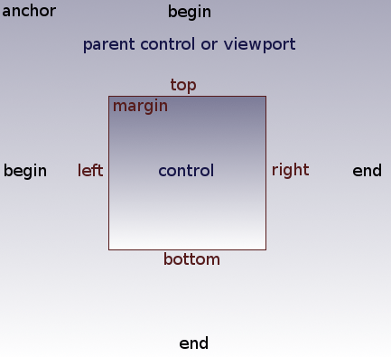
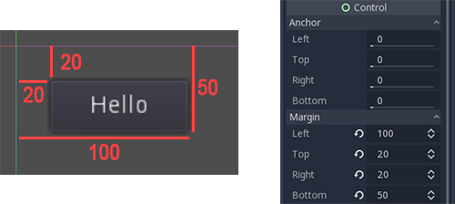
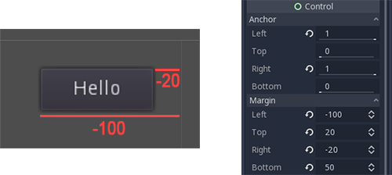
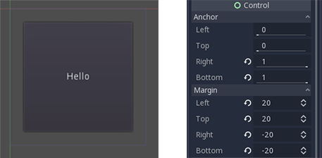

.. _doc_size_and_anchors:

Size and anchors
----------------

If a game was always going to be run on the same device and at the same
resolution, positioning controls would be a simple matter of setting the
position and size of each one of them. Unfortunately, that is rarely the
case.

Only TVs nowadays have a standard resolution and aspect ratio.
Everything else, from computer monitors to tablets, portable consoles
and mobile phones have different resolutions and aspect ratios.

There are several ways to handle this, but for now let's just imagine
that the screen resolution has changed and the controls need to be
re-positioned. Some will need to follow the bottom of the screen, others
the top of the screen, or maybe the right or left margins.

This is done by editing the *margin* properties of controls. Each
control has four margins: left, right, bottom and top. By default all of
them represent a distance in pixels relative to the top-left corner of
the parent control or (in case there is no parent control) the viewport.

When horizontal (left,right) and/or vertical (top,bottom) anchors are
changed to END, the margin values become relative to the bottom-right
corner of the parent control or viewport.

Here the control is set to expand its bottom-right corner with that of
the parent, so when re-sizing the parent, the control will always cover
it, leaving a 20 pixel margin:

