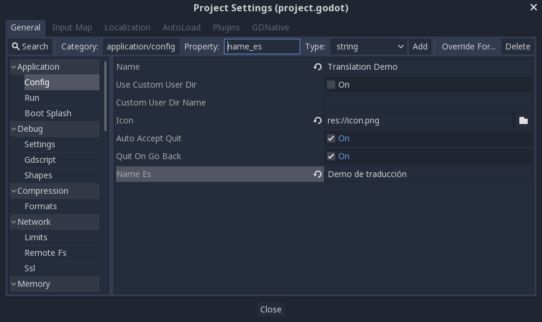

.. _doc_internationalizing_games:

Internationalizing games
========================

Introduction
------------

Sería excelente que el mundo hablara solo un idioma (It would be great if the
world spoke only one language). Unfortunately for
us developers, that is not the case. While indie or niche games usually
do not need localization, games targeting a more massive market
often require localization. Godot offers many tools to make this process
more straightforward, so this tutorial is more like a collection of
tips and tricks.

.. note:: We will be using the official demo as an example; you can
          `download it from the Asset Library <https://godotengine.org/asset-library/asset/134>`_.

Localizing texts
----------------

The most common topic in localization is text translation. 

Godot offers two ways to localize text, by using CSV files or gettext 
PO files. These files contain the translation data needed to translate 
the texts in a game. Both formats have their own advantage and disadvantage, 
which you can learn in detail in the tutorials :ref:`doc_localization_using_csv` 
and :ref:`doc_localization_using_gettext`. In this section, we'll provide a quick 
overview of text translation.

Some controls, such as :ref:`Button <class_Button>` and :ref:`Label <class_Label>`,
will automatically fetch a translation if their text matches a key. 
The keys are imported from a CSV file or gettext PO files.
For example, if a label's text is "MAIN_SCREEN_GREETING1" and that key exists, 
then the text will automatically be translated.

In ``GDScript``, the :ref:`Object.tr() <class_Object_method_tr>` and 
:ref:`Object.tr_n() <class_Object_method_tr_n>` functions are used with keys to provide
translation. These two functions will look up the key in the imported translations 
and convert it into the translated text if found:

::

    # Text localization using keys (CSV method).
    level.set_text(tr("LEVEL_5_NAME"))
    status.set_text(tr("GAME_STATUS_" + str(status_index)))
    
    # Text localization using source strings as keys (gettext PO method).
    level.set_text(tr("Level 5: The Infinite Void"))
    status.set_text(tr("Game status: " + str(status_index)))

Localizing resources
--------------------

It is also possible to instruct Godot to use alternate versions of
assets (resources) depending on the current language. The **Remaps** tab
can be used for this:

.. image:: img/localization_remaps.png

Select the resource to be remapped, then add some alternatives for each
locale.

Making controls resizable
--------------------------

The same text in different languages can vary greatly in length. For
this, make sure to read the tutorial on :ref:`doc_size_and_anchors`, as
dynamically adjusting control sizes may help.
:ref:`Container <class_Container>` can be useful, as well as the text wrapping
options available in :ref:`Label <class_Label>`.

TranslationServer
-----------------

Godot has a server handling low-level translation management
called the :ref:`TranslationServer <class_TranslationServer>`.
Translations can be added or removed during run-time;
the current language can also be changed at run-time.

Command line
------------

Language can be tested when running Godot from the command line.
For example, to test a game in French, the following argument can be
supplied:

.. code-block:: shell

   godot --language fr

Translating the project name
----------------------------

The project name becomes the app name when exporting to different
operating systems and platforms. To specify the project name in more
than one language, create a new setting ``application/name`` in the **Project
Settings** and append the locale identifier to it.
For instance, for Spanish, this would be ``application/name_es``:

If you are unsure about the language code to use, refer to the
:ref:`list of locale codes <doc_locales>`.
