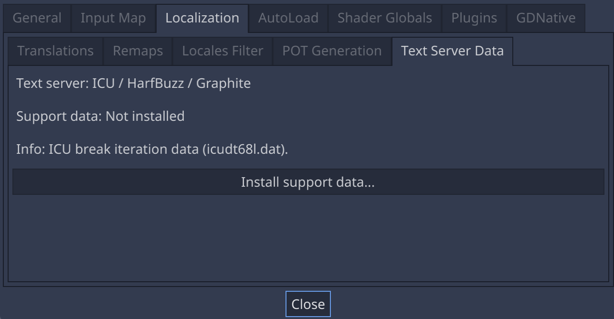
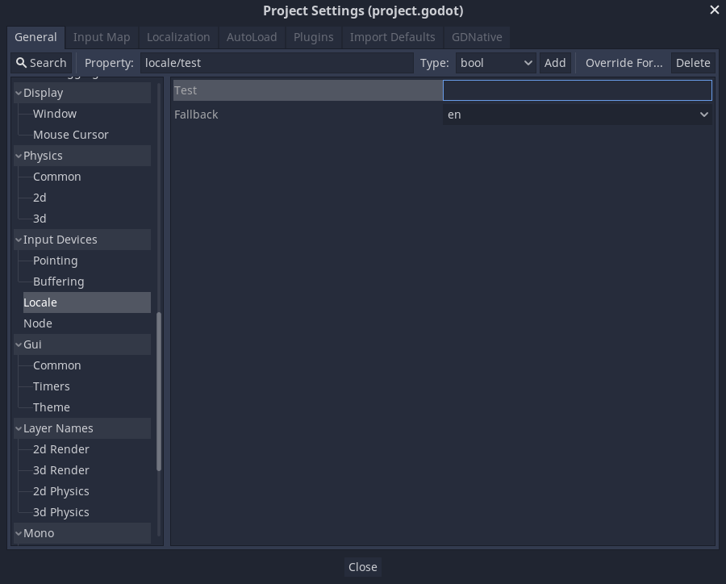

.. _doc_internationalizing_games:

Internationalizing games
========================

Introduction
------------

Sería excelente que el mundo hablara solo un idioma (It would be great if the
world spoke only one language). Unfortunately for
us developers, that is not the case. While indie or niche games usually
do not need localization, games targeting a more massive market
often require localization. Godot offers many tools to make this process
more straightforward, so this tutorial is more like a collection of
tips and tricks.

Localization is usually done by specific studios hired for the job and,
despite the huge amount of software and file formats available for this,
the most common way to do localization to this day is still with
spreadsheets. The process of creating the spreadsheets and importing
them is already covered in the :ref:`doc_importing_translations` tutorial,
so this one could be seen more like a follow-up to that one.

.. note:: We will be using the official demo as an example; you can
          `download it from the Asset Library <https://godotengine.org/asset-library/asset/134>`_.

Configuring the imported translation
------------------------------------

Translations can get updated and re-imported when they change, but
they still have to be added to the project. This is done in
**Project → Project Settings → Localization**:

.. image:: img/localization_dialog.png

The above dialog is used to add or remove translations project-wide.

Localizing resources
--------------------

It is also possible to instruct Godot to use alternate versions of
assets (resources) depending on the current language. This can be used for
localized images such as in-game billboards or localized voices.

The **Remaps** tab can be used for this:

.. image:: img/localization_remaps.png

Select the resource to be remapped then add some alternatives for each locale.

.. note::

    The resource remapping system isn't supported for DynamicFonts. To use
    different fonts depending on the language's script, use the DynamicFont
    fallback system instead, which lets you define as many fallback fonts as you
    want.

    The upside of the DynamicFont fallback system is that it works regardless of
    the current language, making it ideal for things like multiplayer chat where
    the text language may not match the client's language.

Converting keys to text
-----------------------

Some controls, such as :ref:`Button <class_Button>` and :ref:`Label <class_Label>`,
will automatically fetch a translation if their text matches a translation key.
For example, if a label's text is "MAIN_SCREEN_GREETING1" and that key exists
in the current translation, then the text will automatically be translated.

This automatic translation behavior may be undesirable in certain cases. For
instance, when using a Label to display a player's name, you most likely don't
want the player's name to be translated if it matches a translation key. To
disable automatic translation on a specific node, use
:ref:`Object.set_message_translation<class_Object_method_set_message_translation>`
and send a :ref:`Object.notification<class_Object_method_notification>` to update the
translation::

    func _ready():
        # This assumes you have a node called "Label" as a child of the node
        # that has the script attached.
        var label = get_node("Label")
        label.set_message_translation(false)
        label.notification(NOTIFICATION_TRANSLATION_CHANGED)

For more complex UI nodes such as OptionButtons, you may have to use this instead::

    func _ready():
        var option_button = get_node("OptionButton")
        option_button.set_message_translation(false)
        option_button.notification(NOTIFICATION_TRANSLATION_CHANGED)
        option_button.get_popup().set_message_translation(false)
        option_button.get_popup().notification(NOTIFICATION_TRANSLATION_CHANGED)

In code, the :ref:`Object.tr() <class_Object_method_tr>`
function can be used. This will just look up the text in the
translations and convert it if found:

::

    level.set_text(tr("LEVEL_5_NAME"))
    status.set_text(tr("GAME_STATUS_" + str(status_index)))

.. note::

    If no text is displayed after changing the language, try to use a different
    font. The default project font only supports a subset of the Latin-1 character set,
    which cannot be used to display languages like Russian or Chinese.

    A good resource for multilingual fonts is `Noto Fonts <https://www.google.com/get/noto/>`__.
    Make sure to download the correct variation if you're using a less common
    language.

    Once you've downloaded the font, load the TTF file into a DynamicFont
    resource and use it as a custom font of your Control node. For better
    reusability, associate a new a Theme resource to your root Control node and
    define the DynamicFont as the Default Font in the theme.

Making controls resizable
--------------------------

The same text in different languages can vary greatly in length. For
this, make sure to read the tutorial on :ref:`doc_size_and_anchors`, as
dynamically adjusting control sizes may help.
:ref:`Container <class_Container>` can be useful, as well as the text wrapping
options available in :ref:`Label <class_Label>`.

TranslationServer
-----------------

Godot has a server handling low-level translation management
called the :ref:`TranslationServer <class_TranslationServer>`.
Translations can be added or removed during run-time;
the current language can also be changed at run-time.

Bidirectional text and UI Mirroring
-----------------------------------

Arabic and Hebrew are written from right to left (except for the numbers and Latin
words mixed in), and the user interface for these languages should be mirrored as well.
In some languages the shape of a glyph changes depending on the surrounding characters.

Support for bidirectional writing systems and UI mirroring is transparent, you don't
usually need to change anything or have any knowledge of the specific writing system.

For RTL languages, Godot will automatically do the following changes to the UI:

-  Mirrors left/right anchors and margins.
-  Swaps left and right text alignment.
-  Mirrors horizontal order of the child controls in the containers, and items in Tree/ItemList controls.
-  Uses mirrored order of the internal control elements (e.g. OptionButton dropdown button, checkbox alignment, List column order, Tree item icons and connecting line alignment, e.t.c.), in some cases mirrored controls use separate theme styles.
-  Coordinate system is not mirrored, and non-UI nodes (sprites, e.t.c) are not affected.x

It is possible to override text and control layout direction by using the following control properties:

-  ``text_direction``, sets the base text direction. When set to "auto", direction depends on the first strong directional character in the text according to the Unicode Bidirectional Algorithm,
-  ``language``, overrides current project locale.
-  ``structured_text_bidi_override property`` and ``_structured_text_parser callback``, enables special handling for structured text.
-  ``layout_direction``, overrides control mirroring.

.. image:: img/ui_mirror.png

Adding break iterator data to exported project
----------------------------------------------

Some languages are written without spaces, and word and line breaking requires more than rules over character sequences.
Godot includes ICU rule and dictionary based, break iterator data, but this data is not included into exported projects by default.
To include it go to **Project → Project Settings → Localization → Text Server Data** and click **Install support data...**. Break iterator data is about 4 MB large.

Structured text BiDi override
-----------------------------

Unicode BiDi algorithm is designed to work with natural text and it's incapable of
handling text with the higher level order, like file names, URIs, email addresses,
regular expressions or source code.

.. image:: img/bidi_override.png

For example, the path for this shown directory structure will be displayed incorrectly
(top "LineEdit" control). "File" type structured text override splits text into segments,
then BiDi algorithm is applied to each of them individually to correctly display directory
names in any language and preserve correct order of the folders (bottom "LineEdit" control).

Custom callbacks provide a way to override BiDi for the other types of structured text.

Localizing numbers
------------------

Controls specifically designed for number input or output (e.g. ProgressBar, SpinBox)
will use localized numbering system automatically, for the other control
:ref:`TextServer.format_number(string, language) <class_TextServer_method_format_number>`
can be used to convert Western Arabic numbers (0..9) to the localized numbering system
and :ref:`TextServer.parse_number(string, language) <class_TextServer_method_parse_number>`
to convert it back.

Localizing icons and images
---------------------------

Icons with left and right pointing arrows which may need to be reversed for Arabic
and Hebrew locales, in case they indicate movement or direction (e.g. back/forward
buttons), otherwise they can remain the same.

Testing translations
--------------------

You may want to test a project's translation before releasing it. Godot provides two ways
to do this.

First, in the Project Settings, under **Input Devices > Locale**, there is a **Test**
property. Set this property to the locale code of the language you want to test. Godot will
run the project with that locale when the project is run (either from the editor or when
exported).

Keep in mind that since this is a project setting, it will show up in version control when
it is set to a non-empty value. Therefore, it should be set back to an empty value before
committing changes to version control.

Translations can also be tested when running Godot from the command line.
For example, to test a game in French, the following argument can be
supplied:

.. code-block:: shell

   godot --language fr

Translating the project name
----------------------------

The project name becomes the app name when exporting to different
operating systems and platforms. To specify the project name in more
than one language, create a new setting ``application/name`` in the **Project
Settings** and append the locale identifier to it.
For instance, for Spanish, this would be ``application/name_es``:

.. image:: img/localized_name.png

If you are unsure about the language code to use, refer to the
:ref:`list of locale codes <doc_locales>`.
