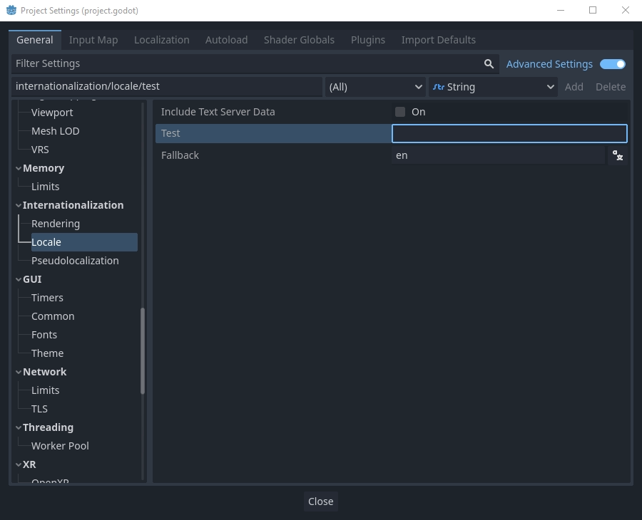
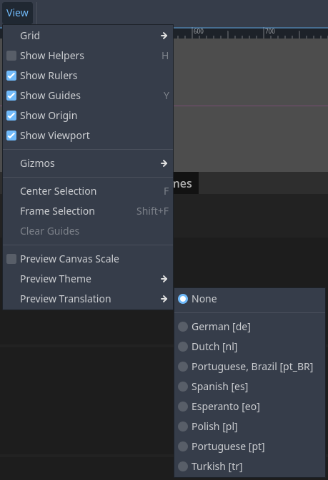
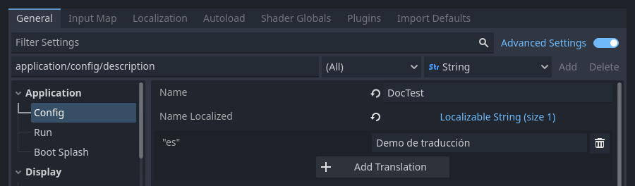

.. _doc_internationalizing_games:

Internationalizing games
========================

Introduction
------------

While indie or niche games usually
do not need localization, games targeting a more massive market
often require localization. Godot offers many tools to make this process
more straightforward, so this tutorial is more like a collection of
tips and tricks.

Localization is usually done by specific studios hired for the job. Despite the
huge amount of software and file formats available for this, the most common way
to do localization to this day is still with spreadsheets. The process of
creating the spreadsheets and importing them is already covered in the
:ref:`doc_importing_translations` tutorial. If you haven't read the Importing
translations page before, we recommend you give it a read before reading this
page.

.. note:: We will be using the official demo as an example; you can
          `download it from the Asset Library <https://godotengine.org/asset-library/asset/2776>`_.

Configuring the imported translation
------------------------------------

Translations can get updated and re-imported when they change, but
they still have to be added to the project. This is done in
**Project → Project Settings → Localization**:

.. image:: img/localization_dialog.png

The above dialog is used to add or remove translations project-wide.

Localizing resources
--------------------

It is also possible to instruct Godot to use alternate versions of
assets (resources) depending on the current language. This can be used for
localized images such as in-game billboards or localized voices.

The **Remaps** tab can be used for this:

.. image:: img/localization_remaps.png

Select the resource to be remapped then add some alternatives for each locale.

.. note::

    The resource remapping system isn't supported for DynamicFonts. To use
    different fonts depending on the language's script, use the DynamicFont
    fallback system instead, which lets you define as many fallback fonts as you
    want.

    The upside of the DynamicFont fallback system is that it works regardless of
    the current language, making it ideal for things like multiplayer chat where
    the text language may not match the client's language.

Automatically setting a language
--------------------------------
It is recommended to default to the user's preferred language which can be obtained via :ref:`OS.get_locale_language() <class_OS_method_get_locale_language>`.
If your game is not available in that language, it will fall back to the :ref:`Fallback <class_ProjectSettings_property_internationalization/locale/fallback>`
in **Project Settings > Internationalization > Locale**, or to ``en`` if empty.
Nevertheless letting players change the language in game is recommended for various reasons (e.g. translation quality or player preference).

.. tabs::
 .. code-tab:: gdscript

    var language = "automatic"
    # Load here language from the user settings file
    if language == "automatic":
       var preferred_language = OS.get_locale_language()
       TranslationServer.set_locale(preferred_language)
    else:
       TranslationServer.set_locale(language)

Locale vs. language
-------------------
A :ref:`locale <doc_locales>` is commonly a combination of a language with a region or country, but can also contain information like a script or a variant.

Examples:

- ``en``: English language
- ``en_GB``: English in Great Britain / British English
- ``en_US``: English in the USA / American English
- ``en_DE``: English in Germany

Indie games generally only need to care about language, but read on for more information.

Why locales exist can be illustrated through the USA and Great Britain. Both speak the same language (English), yet differ in many aspects:
- Spelling: E.g. gray (USA), grey (GB)
- Use of words: E.g. eggplant (USA), aubergine (GB)
- Units or currencies: E.g. feet/inches (USA), metres/cm (GB)

It can get more complex however. Imagine you offer different content in Europe and in China (e.g. in an MMO). You will need to translate each of those content variations into many languages and store and load them accordingly.

Converting keys to text
-----------------------

Some controls, such as :ref:`Button <class_Button>` and :ref:`Label <class_Label>`,
will automatically fetch a translation if their text matches a translation key.
For example, if a label's text is "MAIN_SCREEN_GREETING1" and that key exists
in the current translation, then the text will automatically be translated.

This automatic translation behavior may be undesirable in certain cases. For
instance, when using a Label to display a player's name, you most likely don't
want the player's name to be translated if it matches a translation key. To
disable automatic translation on a specific node, disable **Localization > Auto
Translate** in the inspector.

In code, the :ref:`Object.tr() <class_Object_method_tr>` function can be used.
This will just look up the text in the translations and convert it if found:

.. tabs::
 .. code-tab:: gdscript

    level.text = tr("LEVEL_5_NAME")
    status.text = tr("GAME_STATUS_%d" % status_index)

 .. code-tab:: csharp

    level.Text = Tr("LEVEL_5_NAME");
    status.Text = Tr($"GAME_STATUS_{statusIndex}");

.. note::

    If no text is displayed after changing the language, try to use a different
    font. The default project font only supports a subset of the Latin-1 character set,
    which cannot be used to display languages like Russian or Chinese.

    A good resource for multilingual fonts is `Noto Fonts <https://www.google.com/get/noto/>`__.
    Make sure to download the correct variation if you're using a less common
    language.

    Once you've downloaded the font, load the TTF file into a DynamicFont
    resource and use it as a custom font of your Control node. For better
    reusability, associate a new a Theme resource to your root Control node and
    define the DynamicFont as the Default Font in the theme.

Placeholders
~~~~~~~~~~~~

To feature placeholders in your translated strings, use
:ref:`doc_gdscript_printf` or the equivalent feature in C#. This lets
translators move the location of the placeholder in the string freely, which
allows translations to sound more natural. Named placeholders with the
``String.format()`` function should be used whenever possible, as they also
allow translators to choose the *order* in which placeholders appear:

.. tabs::
 .. code-tab:: gdscript

    # The placeholder's locations can be changed, but not their order.
    # This will probably not suffice for some target languages.
    message.text = tr("%s picked up the %s") % ["Ogre", "Sword"]

    # The placeholder's locations and order can be changed.
    # Additionally, this form gives more context for translators to work with.
    message.text = tr("{character} picked up the {weapon}").format({character = "Ogre", weapon = "Sword"})

Translation contexts
~~~~~~~~~~~~~~~~~~~~

If you're using plain English as source strings (rather than message codes
``LIKE_THIS``), you may run into ambiguities when you have to translate the same
English string to different strings in certain target languages. You can
optionally specify a *translation context* to resolve this ambiguity and allow
target languages to use different strings, even though the source string is
identical:

.. tabs::
 .. code-tab:: gdscript

    # "Close", as in an action (to close something).
    button.set_text(tr("Close", "Actions"))

    # "Close", as in a distance (opposite of "far").
    distance_label.set_text(tr("Close", "Distance"))

 .. code-tab:: csharp

    // "Close", as in an action (to close something).
    GetNode<Button>("Button").Text = Tr("Close", "Actions");

    // "Close", as in a distance (opposite of "far").
    GetNode<Label>("Distance").Text = Tr("Close", "Distance");

Pluralization
~~~~~~~~~~~~~

Most languages require different strings depending on whether an object is in
singular or plural form. However, hardcoding the "is plural" condition depending
on whether there is more than 1 object is not valid in all languages.

Some languages have more than two plural forms, and the rules on the number of
objects required for each plural form vary. Godot offers support for
*pluralization* so that the target locales can handle this automatically.

Pluralization is meant to be used with positive (or zero) integer numbers only.
Negative and floating-point values usually represent physical entities for which
singular and plural don't clearly apply.

.. tabs::
 .. code-tab:: gdscript

    var num_apples = 5
    label.text = tr_n("There is %d apple", "There are %d apples", num_apples) % num_apples

 .. code-tab:: csharp

    int numApples = 5;
    GetNode<Label>("Label").Text = string.Format(TrN("There is {0} apple", "There are {0} apples", numApples), numApples);

This can be combined with a context if needed:

.. tabs::
 .. code-tab:: gdscript

    var num_jobs = 1
    label.text = tr_n("%d job", "%d jobs", num_jobs, "Task Manager") % num_jobs

 .. code-tab:: csharp

    int numJobs = 1;
    GetNode<Label>("Label").Text = string.Format(TrN("{0} job", "{0} jobs", numJobs, "Task Manager"), numJobs);

.. note::

    Providing pluralized translations is only supported with
    :ref:`doc_localization_using_gettext`, not CSV.

Making controls resizable
-------------------------

The same text in different languages can vary greatly in length. For
this, make sure to read the tutorial on :ref:`doc_size_and_anchors`, as
dynamically adjusting control sizes may help.
:ref:`Container <class_Container>` can be useful, as well as the text wrapping
options available in :ref:`Label <class_Label>`.

To check whether your UI can accommodate translations with longer strings than
the original, you can enable :ref:`pseudolocalization <doc_pseudolocalization>`
in the advanced Project Settings. This will replace all your localizable strings
with longer versions of themselves, while also replacing some characters in the
original strings with accented versions (while still being readable).
Placeholders are kept as-is, so that they keep working when pseudolocalization
is enabled.

For example, the string ``Hello world, this is %s!`` becomes
``[Ĥéłłô ŵôŕłd́, ŧh̀íš íš %s!]`` when pseudolocalization is enabled.

While looking strange at first, pseudolocalization has several benefits:

- It lets you spot non-localizable strings quickly, so you can go over them and
  make them localizable (if it makes sense to do so).
- It lets you check UI elements that can't fit long strings. Many languages will
  feature much longer translations than the source text, so it's important to
  ensure your UI can accommodate longer-than-usual strings.
- It lets you check whether your font contains all the characters required to
  support various languages. However, since the goal of pseudolocalization is to
  keep the original strings readable, it's not an effective test for checking
  whether a font can support :abbr:`CJK (Chinese, Japanese, Korean)` or
  right-to-left languages.

The project settings allow you to tune pseudolocalization behavior, so that you
can disable parts of it if desired.

TranslationServer
-----------------

Godot has a server handling low-level translation management
called the :ref:`TranslationServer <class_TranslationServer>`.
Translations can be added or removed during runtime;
the current language can also be changed at runtime.

.. _doc_internationalizing_games_bidi:

Bidirectional text and UI Mirroring
-----------------------------------

Arabic and Hebrew are written from right to left (except for the numbers and Latin
words mixed in), and the user interface for these languages should be mirrored as well.
In some languages the shape of a glyph changes depending on the surrounding characters.

Support for bidirectional writing systems and UI mirroring is transparent, you don't
usually need to change anything or have any knowledge of the specific writing system.

For RTL languages, Godot will automatically do the following changes to the UI:

-  Mirrors left/right anchors and margins.
-  Swaps left and right text alignment.
-  Mirrors horizontal order of the child controls in the containers, and items in Tree/ItemList controls.
-  Uses mirrored order of the internal control elements (e.g. OptionButton dropdown button, checkbox alignment, List column order, Tree item icons and connecting line alignment, e.t.c.), in some cases mirrored controls use separate theme styles.
-  Coordinate system is not mirrored, and non-UI nodes (sprites, e.t.c) are not affected.

It is possible to override text and control layout direction by using the following control properties:

-  ``text_direction``, sets the base text direction. When set to "auto", direction depends on the first strong directional character in the text according to the Unicode Bidirectional Algorithm,
-  ``language``, overrides current project locale.
-  ``structured_text_bidi_override`` property and ``_structured_text_parser`` callback, enables special handling for structured text.
-  ``layout_direction``, overrides control mirroring.

.. image:: img/ui_mirror.png

.. seealso::

    You can see how right-to-left typesetting works in action using the
    `BiDI and Font Features demo project <https://github.com/godotengine/godot-demo-projects/tree/master/gui/bidi_and_font_features>`__.

Adding break iterator data to exported project
----------------------------------------------

Some languages are written without spaces. In those languages,
word and line breaking require more than rules over character sequences.
Godot includes ICU rule and dictionary-based break iterator data, but this data
is not included in exported projects by default.

To include it, go to **Project → Project Settings**, enable **Internationalization → Locale → Include Text Server Data**,
then export the project. Break iterator data is about 4 MB in size.

Structured text BiDi override
-----------------------------

Unicode BiDi algorithm is designed to work with natural text and it's incapable of
handling text with the higher level order, like file names, URIs, email addresses,
regular expressions or source code.

.. image:: img/bidi_override.png

For example, the path for this shown directory structure will be displayed incorrectly
(top "LineEdit" control). "File" type structured text override splits text into segments,
then BiDi algorithm is applied to each of them individually to correctly display directory
names in any language and preserve correct order of the folders (bottom "LineEdit" control).

Custom callbacks provide a way to override BiDi for the other types of structured text.

Localizing numbers
------------------

Controls specifically designed for number input or output (e.g. ProgressBar, SpinBox)
will use localized numbering system automatically, for the other control
:ref:`TextServer.format_number(string, language) <class_TextServer_method_format_number>`
can be used to convert Western Arabic numbers (0..9) to the localized numbering system
and :ref:`TextServer.parse_number(string, language) <class_TextServer_method_parse_number>`
to convert it back.

Localizing icons and images
---------------------------

Icons with left and right pointing arrows which may need to be reversed for Arabic
and Hebrew locales, in case they indicate movement or direction (e.g. back/forward
buttons). Otherwise, they can remain the same.

Testing translations
--------------------

You may want to test a project's translation before releasing it. Godot provides three ways
to do this.

First, in the Project Settings, under :menu:`Internationalization > Locale` (with advanced settings enabled), there is a **Test**
property. Set this property to the locale code of the language you want to test. Godot will
run the project with that locale when the project is run (either from the editor or when
exported).

Keep in mind that since this is a project setting, it will show up in version control when
it is set to a non-empty value. Therefore, it should be set back to an empty value before
committing changes to version control.

Second, from within the editor go to the top bar and click on :button:`View` on the top bar, then go down to
:ui:`Preview Translation` and select the language you want to preview.

All text in scenes in the editor should now be displayed using the selected language.

Translations can also be tested when :ref:`running Godot from the command line <doc_command_line_tutorial>`.
For example, to test a game in French, the following argument can be
supplied:

.. code-block:: shell

   godot --language fr

Translating the project name
----------------------------

The project name becomes the app name when exporting to different
operating systems and platforms. To specify the project name in more
than one language go to **Project > Project Settings> Application >
Config**. From here click on the button that says ``Localizable String
(Size 0)``. Now there should be a button below that which says ``Add
Translation``. Click on that and it will take you to a page where you
can choose the language (and country if needed) for your project name
translation. After doing that you can now type in the localized name.

If you are unsure about the language code to use, refer to the
:ref:`list of locale codes <doc_locales>`.
