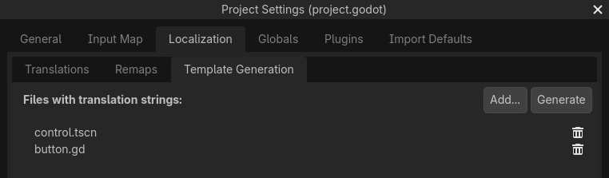

.. _doc_localization_using_gettext:

Localization using gettext
==========================

In addition to :ref:`doc_importing_translations` in CSV format, Godot
also supports loading translation files written in the GNU gettext
format (text-based ``.po`` and compiled ``.mo`` since Godot 4.0).

.. note:: For an introduction to gettext, check out
          `A Quick Gettext Tutorial <https://www.labri.fr/perso/fleury/posts/programming/a-quick-gettext-tutorial.html>`_.
          It's written with C projects in mind, but much of the advice
          also applies to Godot (with the exception of ``xgettext``).

Advantages
----------

- gettext is a standard format, which can be edited using any text editor
  or GUI editors such as `Poedit <https://poedit.net/>`_.
- gettext is supported by translation platforms such as
  `Transifex <https://www.transifex.com/>`_ and `Weblate <https://weblate.org/>`_,
  which makes it easier for people to collaborate to localization.
- Compared to CSV, gettext works better with version control systems like Git,
  as each locale has its own messages file.
- Multiline strings are more convenient to edit in gettext files compared
  to CSV files.

Disadvantages
-------------

- gettext is a more complex format than CSV and can be harder to grasp for
  people new to software localization.
- People who maintain localization files will have to install gettext tools
  on their system. However, as Godot supports using text-based message files
  (``.po``), translators can test their work without having to install gettext tools.

Installing gettext tools
------------------------

The command line gettext tools are required to perform maintenance operations,
such as updating message files. Therefore, it's strongly recommended to
install them.

- **Windows:** Download an installer from
  `this page <https://mlocati.github.io/articles/gettext-iconv-windows.html>`_.
  Any architecture and binary type (shared or static) works;
  if in doubt, choose the 64-bit static installer.
- **macOS:** Install gettext either using `Homebrew <https://brew.sh/>`_
  with the ``brew install gettext`` command, or using
  `MacPorts <https://www.macports.org/>`_ with the
  ``sudo port install gettext`` command.
- **Linux:** On most distributions, install the ``gettext`` package from
  your distribution's package manager.

Creating the PO template
------------------------

Automatic generation using the editor
^^^^^^^^^^^^^^^^^^^^^^^^^^^^^^^^^^^^^

Since Godot 4.0, the editor can generate a PO template automatically from
specified scene and GDScript files. This POT generation also supports translation
contexts and pluralization if used in a script, with the optional second
argument of ``tr()`` and the ``tr_n()`` method.

Open the Project Settings' **Localization > POT Generation** tab, then use the
**Add…** button to specify the path to your project's scenes and scripts that
contain localizable strings:

   Creating a PO template in the **Localization > POT Generation** tab of the Project Settings

After adding at least one scene or script, click **Generate POT** in the
top-right corner, then specify the path to the output file. This file can be
placed anywhere in the project directory, but it's recommended to keep it in a
subdirectory such as ``locale``, as each locale will be defined in its own file.

You can then move over to
:ref:`creating a messages file from a PO template <doc_localization_using_gettext_messages_file>`.

.. note::

    Remember to regenerate the PO template after making any changes to
    localizable strings, or after adding new scenes or scripts. Otherwise, newly
    added strings will not be localizable and translators won't be able to
    update translations for outdated strings.

Manual creation
^^^^^^^^^^^^^^^

If the automatic generation approach doesn't work out for your needs, you can
create a PO template by hand in a text editor. This file can be placed anywhere
in the project directory, but it's recommended to keep it in a subdirectory, as
each locale will be defined in its own file.

Create a directory named ``locale`` in the project directory. In this directory,
save a file named ``messages.pot`` with the following contents:

::

    # Don't remove the two lines below, they're required for gettext to work correctly.
    msgid ""
    msgstr ""

    # Example of a regular string.
    msgid "Hello world!"
    msgstr ""

    # Example of a string with pluralization.
    msgid "There is %d apple."
    msgid_plural "There are %d apples."
    msgstr[0] ""
    msgstr[1] ""

    # Example of a string with a translation context.
    msgctxt "Actions"
    msgid "Close"
    msgstr ""

Messages in gettext are made of ``msgid`` and ``msgstr`` pairs.
``msgid`` is the source string (usually in English), ``msgstr`` will be
the translated string.

.. warning::

    The ``msgstr`` value in PO template files (``.pot``) should **always** be
    empty. Localization will be done in the generated ``.po`` files instead.

.. _doc_localization_using_gettext_messages_file:

Creating a messages file from a PO template
-------------------------------------------

The ``msginit`` command is used to turn a PO template into a messages file.
For instance, to create a French localization file, use the following command
while in the ``locale`` directory:

.. code-block:: shell

    msginit --no-translator --input=messages.pot --locale=fr

The command above will create a file named ``fr.po`` in the same directory
as the PO template.

Alternatively, you can do that graphically using Poedit, or by uploading the
POT file to your web platform of choice.

Loading a messages file in Godot
--------------------------------

To register a messages file as a translation in a project, open the
**Project Settings**, then go to the **Localization** tab.
In **Translations**, click **Add…** then choose the ``.po`` or ``.mo`` file
in the file dialog. The locale will be inferred from the
``"Language: <code>\n"`` property in the messages file.

.. note:: See :ref:`doc_internationalizing_games` for more information on
          importing and testing translations in Godot.

Updating message files to follow the PO template
------------------------------------------------

After updating the PO template, you will have to update message files so
that they contain new strings, while removing strings that are no longer
present in the PO template. This can be done automatically using the
``msgmerge`` tool:

.. code-block:: shell

    # The order matters: specify the message file *then* the PO template!
    msgmerge --update --backup=none fr.po messages.pot

If you want to keep a backup of the original message file (which would be
saved as ``fr.po~`` in this example), remove the ``--backup=none`` argument.

.. note::

    After running ``msgmerge``, strings which were modified in the source language
    will have a "fuzzy" comment added before them in the ``.po`` file. This comment
    denotes that the translation should be updated to match the new source string,
    as the translation will most likely be inaccurate until it's updated.

    Strings with "fuzzy" comments will **not** be read by Godot until the
    translation is updated and the "fuzzy" comment is removed.

Checking the validity of a PO file or template
----------------------------------------------

It is possible to check whether a gettext file's syntax is valid by running
the command below:

.. code-block:: shell

    msgfmt fr.po --check

If there are syntax errors or warnings, they will be displayed in the console.
Otherwise, ``msgfmt`` won't output anything.

Using binary MO files (useful for large projects only)
------------------------------------------------------

For large projects with several thousands of strings to translate or more,
it can be worth it to use binary (compiled) MO message files instead of text-based
PO files. Binary MO files are smaller and faster to read than the equivalent
PO files.

You can generate a MO file with the command below:

.. code-block:: shell

    msgfmt fr.po --no-hash -o fr.mo

If the PO file is valid, this command will create a ``fr.mo`` file besides
the PO file. This MO file can then be loaded in Godot as described above.

The original PO file should be kept in version control so you can update
your translation in the future. In case you lose the original PO file and
wish to decompile a MO file into a text-based PO file, you can do so with:

.. code-block:: shell

    msgunfmt fr.mo > fr.po

The decompiled file will not include comments or fuzzy strings, as these are
never compiled in the MO file in the first place.
