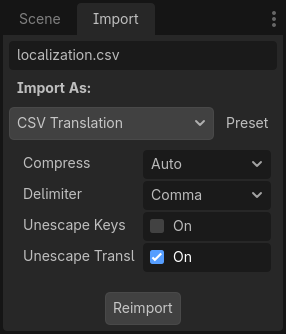

.. _doc_localization_using_spreadsheets:

Localization using spreadsheets
===============================

Spreadsheets are one of the most common formats for localizing games.
In Godot, spreadsheets are supported through the CSV format. This
guide explains how to work with CSVs.

The CSV files **must** be saved with UTF-8 encoding
without a `byte order mark <https://en.wikipedia.org/wiki/Byte_order_mark>`__.

.. warning::

    By default, Microsoft Excel will always save CSV files with ANSI encoding
    rather than UTF-8. There is no built-in way to do this, but there are
    workarounds as described
    `here <https://stackoverflow.com/questions/4221176/excel-to-csv-with-utf8-encoding>`__.

    We recommend using `LibreOffice <https://www.libreoffice.org/>`__ or Google Sheets instead.

Formatting
----------

CSV files must be formatted as follows:

+--------+----------+----------+----------+
| keys   | <lang1>  | <lang2>  | <langN>  |
+========+==========+==========+==========+
| KEY1   | string   | string   | string   |
+--------+----------+----------+----------+
| KEY2   | string   | string   | string   |
+--------+----------+----------+----------+
| KEYN   | string   | string   | string   |
+--------+----------+----------+----------+

The "lang" tags must represent a language, which must be one of the :ref:`valid
locales <doc_locales>` supported by the engine, or they must start with an underscore (``_``),
which means the related column is served as comment and won't be imported.
The ``KEY`` tags must be unique and represent a string universally. By convention, these are
usually in uppercase to differentiate them from other strings. These keys will be replaced at
runtime by the matching translated string. Note that the case is important:
``KEY1`` and ``Key1`` will be different keys.
The top-left cell is ignored and can be left empty or having any content.
Here's an example:

+-------+-----------------------+------------------------+------------------------------+
| keys  | en                    | es                     | ja                           |
+=======+=======================+========================+==============================+
| GREET | Hello, friend!        | Hola, amigo!           | こんにちは                   |
+-------+-----------------------+------------------------+------------------------------+
| ASK   | How are you?          | Cómo está?             | 元気ですか                   |
+-------+-----------------------+------------------------+------------------------------+
| BYE   | Goodbye               | Adiós                  | さようなら                   |
+-------+-----------------------+------------------------+------------------------------+
| QUOTE | "Hello" said the man. | "Hola" dijo el hombre. | 「こんにちは」男は言いました |
+-------+-----------------------+------------------------+------------------------------+

The same example is shown below as a comma-separated plain text file,
which should be the result of editing the above in a spreadsheet.
When editing the plain text version, be sure to enclose with double
quotes any message that contains commas, line breaks or double quotes,
so that commas are not parsed as delimiters, line breaks don't create new
entries and double quotes are not parsed as enclosing characters. Be sure
to escape any double quotes a message may contain by preceding them with
another double quote. Alternatively, you can select another delimiter than
comma in the import options.

.. code-block:: none

    keys,en,es,ja
    GREET,"Hello, friend!","Hola, amigo!",こんにちは
    ASK,How are you?,Cómo está?,元気ですか
    BYE,Goodbye,Adiós,さようなら
    QUOTE,"""Hello"" said the man.","""Hola"" dijo el hombre.",「こんにちは」男は言いました

Specifying plural forms
~~~~~~~~~~~~~~~~~~~~~~~

Since Godot 4.6, it is possible to specify
:ref:`plural forms <doc_internationalizing_games_pluralization>` in CSV files.

This is done by adding a column named ``?plural`` anywhere in the table
(except on the first column, which is reserved for translation keys).
By convention, it's recommended to place it on the second column.
Note that in the example below, the key column is the one that contains English
localization.

.. code-block:: none

    en,?plural,fr,ru,ja,zh
    ?pluralrule,,nplurals=2; plural=(n >= 2);,,
    There is %d apple,There are %d apples,Il y a %d pomme,Есть %d яблоко,リンゴが%d個あります,那里有%d个苹果
    ,,Il y a %d pommes,Есть %d яблока,,
    ,,,Есть %d яблок,,

.. note::

    Automatic Control translation is not supported when using plural forms. You must
    translate the string manually using :ref:`tr_n()<class_Object_method_tr_n>`.

Specifying translation contexts
~~~~~~~~~~~~~~~~~~~~~~~~~~~~~~~

Since Godot 4.6, it is possible to specify
:ref:`translation contexts <doc_internationalizing_games_translation_contexts>`
in CSV files. This can be used to disambiguate identical source strings that
have different meanings. While this is generally not needed when using translation
keys ``LIKE_THIS``, it's useful when using plain English text as translation keys.

This is done by adding a column named ``?context`` column anywhere in the table
(except on the first column, which is reserved for translation keys).
By convention, it's recommended to place it on the second column, or after
``?plural`` if it's also used. Note that in the example below, the key column
is the one that contains English localization.

.. code-block:: none

    en,?context,fr,ru,ja,zh
    Letter,Alphabet,Lettre,Буква,字母,字母
    Letter,Message,Courrier,Письмо,手紙,信件

.. note::

    Automatic Control translation is not supported when using context. You must
    translate the string manually using :ref:`tr() <class_Object_method_tr>`
    or :ref:`tr_n() <class_Object_method_tr_n>`.

CSV importer
------------

Godot will treat CSV files as translations by default. It will import them
and generate one or more compressed translation resource files next to it.

Importing will also add the translation to the list of
translations to load when the game runs, specified in project.godot (or the
project settings). Godot allows loading and removing translations at
runtime as well.

Select the ``.csv`` file and access the **Import** dock to define import
options. You can toggle the compression of the imported translations, and
select the delimiter to use when parsing the CSV file.

Be sure to click **Reimport** after any change to these options.
