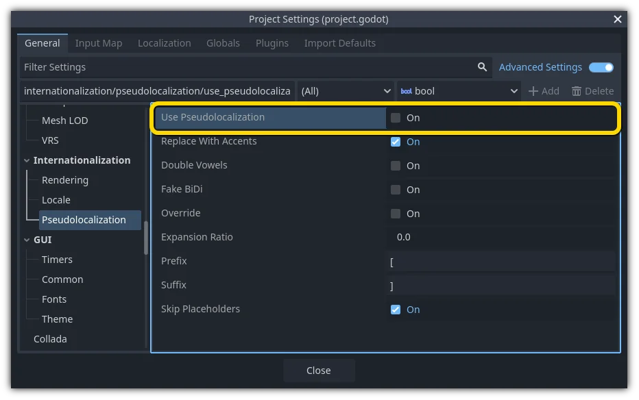

.. _doc_pseudolocalization:

Pseudolocalization
==================

Introduction
------------

When creating a game, the process of localization usually starts when development
has finished. This means that translations aren't available during development
for testing whether the project is internationalized properly.

Godot offers pseudolocalization as a way to test how robust the project is
when it comes to locale changes. Pseudolocalization simulates changes that
might take place during localization. This way, any issues regarding
internationalization can be recognized early on during development.

.. seealso::

    You can see how pseudolocalization works in action using the
    `Pseudolocalizaton demo project <https://github.com/godotengine/godot-demo-projects/tree/master/gui/pseudolocalization>`__.

Enabling and configuring pseudolocalization
-------------------------------------------

Enabling pseudolocalization and the configurations related to it is as simple as
toggling a checkbox in the project settings. These settings can be found in
**Project → Project Settings → General → Internationalization → Pseudolocalization**
after enabling the **Advanced** toggle in the project settings dialog:

Pseudolocalization can also be :ref:`toggled at runtime from a script <doc_pseudolocalization_runtime>`.

Pseudolocalization configurations
---------------------------------

Pseudolocalization in Godot can be set up according to the specific use case of the
project. Here are the pseudolocalization properties that can be configured through
project settings:

- ``replace_with_accents``: Replaces all characters in the string with their accented
  variants. *"The quick brown fox jumped over the lazy dog"* will be converted to
  *"Ŧh̀é q́üíćḱ ḅŕôŵή f́ôx́ ǰüm̀ṕéd́ ôṽéŕ ŧh̀é łáźý d́ôǵ"* when this setting is enabled.
  This can be used to spot untranslated strings that won't have accents,
  but is also useful to check for missing glyphs in the font(s) used by the project.
- ``double_vowels``: Doubles all the vowels in the string. It is a good approximation
  to simulate expansion of text during localization.
  This can be used to check for text that would overflow its container
  (such as buttons).
- ``fake_bidi``: Fake bidirectional text (simulates right-to-left text). This is useful to
  simulate right-to-left writing systems to check for potential layout issues that would occur in languages using right-to-left scripts.
- ``override``: Replaces all the characters in the string with an asterisk (``*``). This is useful for
  quickly finding text that isn't being localized.
- ``expansion_ratio``: Can be used in cases where doubling the vowels isn't a sufficient
  approximation. This setting pads the string with underscores (``_``) and expands it by the given ratio.
  An expansion ratio of ``0.3`` is sufficient for most practical cases; it will increase
  the length of the string by 30%.
- ``prefix`` and ``suffix``: These properties can be used to specify a prefix and suffix to wrap
  the text in.
- ``skip_placeholders``: Skips placeholders for string formatting like ``%s`` and ``%f``.
  This is useful to identify places where more arguments are required for the formatted
  string to display correctly.

All of these properties can be toggled as needed according to the project's use case.

.. _doc_pseudolocalization_runtime:

Configuring pseudolocalization at runtime
-----------------------------------------

Pseudolocalization can be toggled at runtime using the
:ref:`pseudolocalization_enabled<class_TranslationServer_property_pseudolocalization_enabled>` property
in TranslationServer.
However, if runtime configuration of pseudolocalization properties is required,
they can be directly configured using
:ref:`ProjectSettings.set_setting(property, value) <class_ProjectSettings_method_set_setting>`
and then calling
:ref:`TranslationServer.reload_pseudolocalization() <class_TranslationServer_method_reload_pseudolocalization>`
which reparses the pseudolocalization properties and reloads the pseudolocalization.
The following code snippet shall turn on ``replace_with_accents`` and ``double_vowels`` properties
and then call ``reload_pseudolocalization()`` for the changes to get reflected::

    ProjectSettings.set_setting("internationalization/pseudolocalization/replace_with_accents", true)
    ProjectSettings.set_setting("internationalization/pseudolocalization/double_vowels", true)
    TranslationServer.reload_pseudolocalization()
