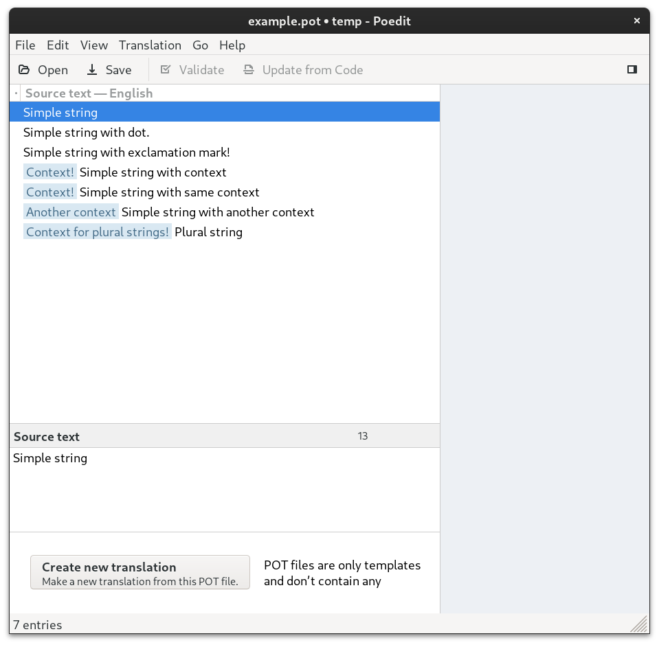
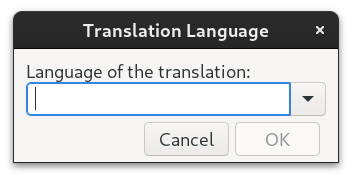
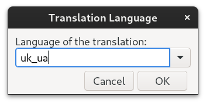
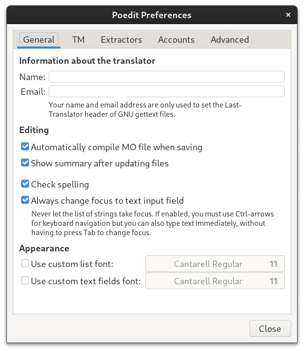
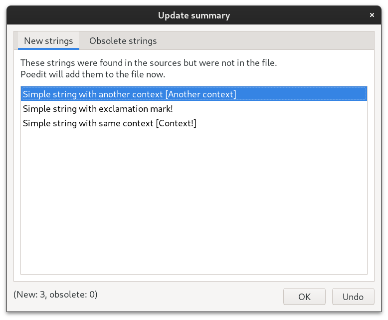
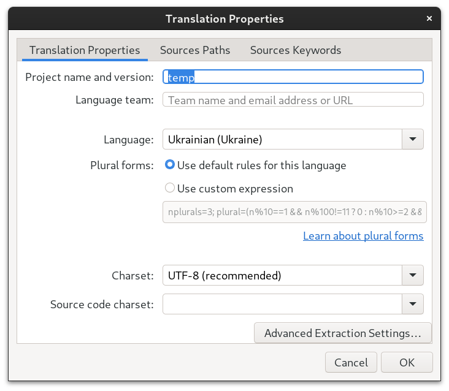
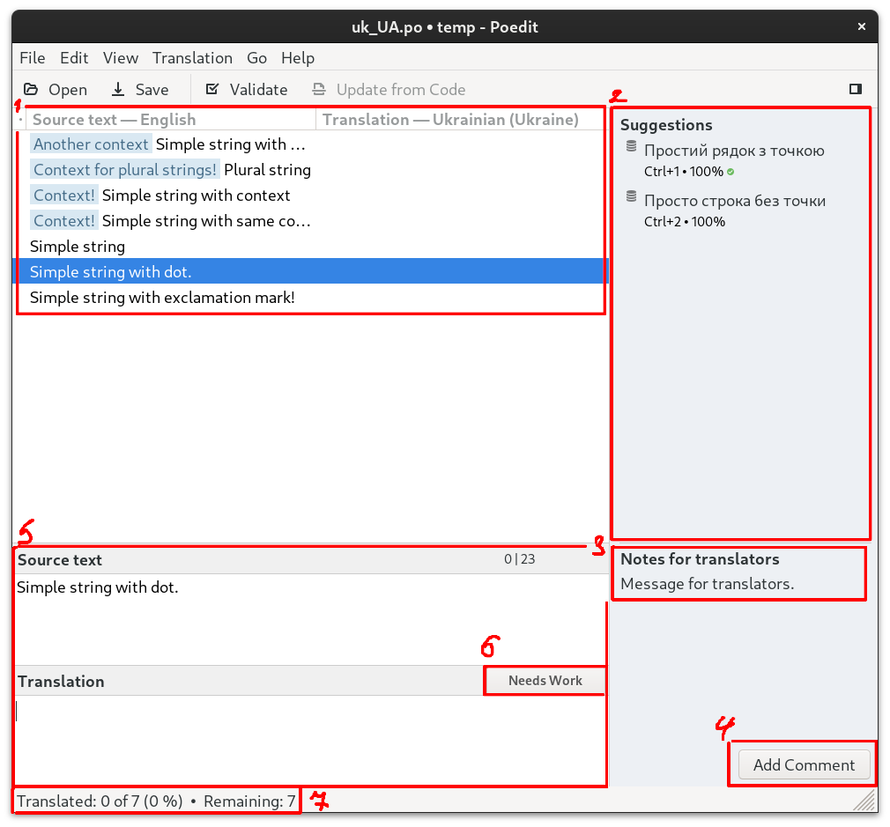
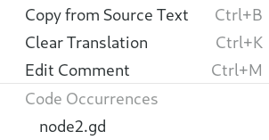
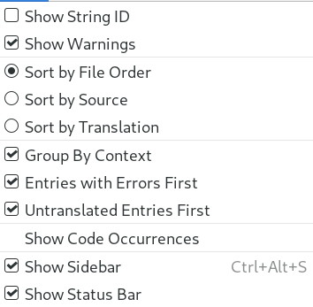
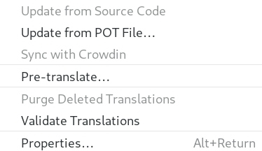

.. _doc_translating_using_poedit:

Translating using Poedit
========================

For who this manual written for
-------------------------------

This manual aimed at translators who want to translate projects that uses ``gettext`` translation system using program Poedit.

.. important:: Before procedding, make sure that `Poedit <https://poedit.net/>`_ is installed. It is avaliable for Windows, Linux and MacOS systems.

Creating new translation
-------------------------
You need to locate ``.pot`` (Portable Object Template) of project (refer to developer it you unsure where to found one). Open it using Poedit.
You will be meet with Poedit window, where will be showed contents of ``.pot`` file.

Click on **Create new translation**.

In text field, you need to input language name (and optionally, country), pick from drop-down list or input language code.
In this example, **Ukrainian (Ukraine)** language will be used with language code ``uk_ua``.

Now you can save file using ``CTRL + S`` or ``File -> Save As...`` and continue to next section.

Poedit settings
---------------
Poedit has some setting that you might want to change before starting to translate. Go to ``Edit -> Preferences -> General``.

Some options worthy mention.

* **Name** and **Email** will be saved as ``"Last-Translator: SOME ALIAS <SOME@EMAIL.COM>"`` in translation file. It is intended for other translators to be used as way to have feedback with you. This data is **not** necessary for translation file to function, so you can leave out this fields.

* **Automatically compile MO file when saving** - every time, when you translation file will be saved, Poedit will compile MO file for you, in same folder as ``.po`` file with same name, but ``.mo`` file extension. If project that you are translation requires to use ``.mo`` files, turn this option on.

* **Show summary after updating files** - used when you are going to update your translation from ``.pot`` file. Window will be show, showing which strings and how they were changed.

Translation options
-------------------
There options that exclusive to each translation file. Go to ``Translation -> Properties...``.

* **Project name and version** - information about project. Usually this information should be filled from ``.pot`` file for you, but if not, you can fill it manually.

* **Language team** - here you can write your ``alias <email>`` or site link where users can contact translator organization if you working in team.

* **Plural forms** - if ``.pot`` translation file has at least one string with plural forms, this field will be editable. Plural form - is formula, used by gettext to determine how much plurals forms there will be in language and how to calculate them. Usually, when you pick language for your translation, Poedit will choose correct form for you. If that didn't happened, you can choose rules from other languages in the list or input custom one.

UI
--
Here you can learn important UI parts of Poedit.

1. This is list of strings that translation have. On left side is source string, right side for translated strings.
2. Suggestions panel, that works on **Translation Memory**. This is mechanism of Poedit, which can save translation that you did in past and suggesting them to you, if string that you currently want to translate is similar string that you translated in past. You can **export** or **import** translation memory in ``Edit -> Preferences -> TM -> Manage...``
3. Some strings might have **Notes for translators** they are written by developers for translators. They might contain information about some string that you might need to account for.
4. **Add Comment** or **Edit Comment** button used to add or edit comments. This comments meant for other translations. As example, add reference link to material where you got your translation.

 .. figure:: img/poedit/editing_comment.webp
   :align: center
   :alt: User writes comment for translated string.

 .. figure:: img/poedit/comment_visible_on_right_side.webp
   :align: center
   :alt: Comment now visible from main UI window.

 String with comment will have this icon in list.

 .. figure:: img/poedit/icon_for_commented_string.webp
   :align: center
   :alt: String with comment will be marked with special icon.

5. Source text and your translation. If there will be detected any errors with your translation, they will show up near **Translation** label.
6. **Needs Work** button. With it, you can disable/enable string. When string is disabled, it will be highlighted with orange color in list and **won't** be used in translation. Use it, when you unsure about translation or need to temporarily disable string.
7. Translation completeness percentage.

Context menu of strings
-----------------------

You can Right-Click on any entry to show context menu with additional functions.

Here you can clear your translation, copy text from source string, edit comment and by **Code Occurrences** you can track from which scripts strings were extracted. If string exist in several places, then there will be several occurrences. You can click on any of them. This will open Poedit code text viewer where you could inspect where string come from in which context.

.. note:: If you translating project that is closed sourced and developer doesn't provide source code for you to translate, this option won't bring any benefits to you.

.. note:: As of now, Godot built-in POT generation doesn't provide information from which line code was extracted, therefore you won't be able to use this feature for now. Follow this `proposal <https://github.com/godotengine/godot/issues/86457>`_ to track when such option will be added to Godot.

Errors in translation
---------------------

There 2 types of errors that Poedit will report to you.

* Non-critical errors.

 Non-critical errors won't affect how translation will perform when running. This errors can be ignored.

 .. figure:: img/poedit/string_marked_with_error.webp
   :align: center
   :alt: Example of how non-critical error will be marked in list.

* Critical error.

 Critical errors require some attention from translator. Running translation with critical errors might lead to any unexpected behavior or refuse to load.

  .. figure:: img/poedit/string_marked_with_critical_error.webp
   :align: center
   :alt: Translation Properties

To learn what went from with each string, select string with error and read explanation near **Translation** label.

 .. figure:: img/poedit/error_in_translation.webp
   :align: center
   :alt: Example of text of non-critical error.

Sorting parameters
------------------

Poedit has options for sorting strings. Go to ``View`` menu.

* **Show Warning** will remove all warning about errors in your translations, such as missing period at end of translation when original has one. Better to leave turned **on**.

* **Sort by** will sort string by some filter. Depending on how translation template were generated, strings might be placed at translation file differently.

* **Group By Context** strings will be grouped by same contexts. For example, if 2 different strings will have context, they will be grouped together. Only useful, if developer of project filled strings with context, otherwise don't provide much benefits.

* **Entries with Errors First** will place all strings that have errors on top of list. Better to leave to **on**, to not accidentally miss strings with error.

* **Untranslated Entries First** will place untranslated strings on top. By "untranslated" Poedit means strings that don't have text in them. Strings marked as **Needs Work** doesn't counts as untranslated.

Translation menu
----------------

* **Update from POT File...** used to update your translation from ``.pot`` file. You will need to use this option every time, when you going to update your translation and for doing maintenance. If you have **Show summary after updating files** turned on, window with summary will show up, showing what exactly changed.
* **Pre-translate...** option to try and fill strings with similar (or exact) translations from **Translation Memory**. This option is useful only if you already have **Translation Memory** filled with many translations.
* **Validate Translations** used to validate translation, for errors, critical errors, how much strings left to translate.

Translating process
--------------------

In most cases, you will deal with 2 main types of strings:

1. Simple string.

 The simplest string.

 .. figure:: img/poedit/simple_string.webp
  :align: center
  :alt: Translation Properties

2. Plural string.

 Poedit provides visual help for plural cases. Source text here shows, how string will look in original language. In this case, in English, there will be 2 forms: **Singular** and **Plural**.

 For translation, there will be provided several tabs (the amount of which controlled by plural formula), each tab representing one plural form. In this case, Ukrainian have 3 plural forms.

 .. figure:: img/poedit/plural_string_with_context.webp
  :align: center
  :alt: Translation Properties

 Try to count apple using numbers given in tab title: одне/двадцять одне яблуко. Let's move to another tab: два/три/чотири яблука. And to last one: нуль/п'ять/шість яблук.

 This rules depends on language (some of which might lack any plural forms at all), but general process goes like this.

Ensuring that translation is done
---------------------------------

Once you think you done with translation process, make sure that everything is actually done:

1. Make sure that all strings that need translation are translated.
2. Test translation in-game/in-program. Refer to developer of project, since instructions on how to test translation might differ from project to project.

Maintaining existing translation
--------------------------------

In cases, when you need to update/maintain existing translation, there this steps:

1. Open ``.po`` file of your translation with Poedit.
2. Update translation from ``.pot`` file.
3. Translate new strings (if there any) and update existing one, if they become obsolete (they will be marked as **Needs Work** after updating from ``.pot`` file).
