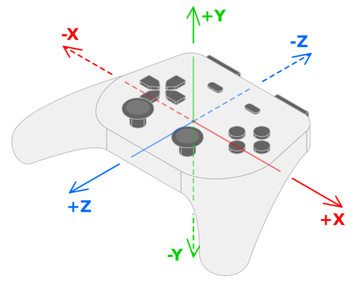

.. _doc_controller_features:

Controller features
===================

Godot supports controller-specific features that can further enhance the gameplay
experience. This page describes these features, how existing games have used them,
and how you can get started with them in Godot.

.. warning::

    These controller features are currently only supported on Windows, macOS, and Linux.

.. warning::

    Unless you specifically advertise your game as requiring specific controllers,
    remember that there is no guarantee that players will have a controller with
    any given features.

    As a result, we suggest using these features to enhance the gameplay experience
    for players whose controllers support them, without detracting from those who
    don't have controllers.

LED color
---------

Games can use the LED lights on certain controllers to subtly complement the on-screen gameplay by
providing some matching visuals in the player's hands. Here are some notable examples:

- In *Hades*, the color of the light matches the god you're receiving a boon from.
- In *Resident Evil 2*, the color of the light indicates your health (green for full, yellow for medium, red for low).
- In *Star Wars Jedi: Fallen Order*, the color of the light matches your lightsaber's color.

Use the method :ref:`Input.set_joy_light()<class_Input_method_set_joy_light>` to set the color
of a given controller's LEDs.

To determine if a given controller supports setting LED lights, use the :ref:`Input.has_joy_light()<class_Input_method_has_joy_light>`
method. The PlayStation DualShock and DualSense controllers are known to support LED lights.

The following ``_process()`` method sets the LED color according to the currently pressed button,
and turns it off if no button is being pressed:

.. code-block::

    func _process(_delta):
        var color := Color.BLACK
        
        if Input.is_joy_button_pressed(0, JOY_BUTTON_A):
            color = Color.BLUE
        elif Input.is_joy_button_pressed(0, JOY_BUTTON_X):
            color = Color.MAGENTA
        elif Input.is_joy_button_pressed(0, JOY_BUTTON_B):
            color = Color.RED
        elif Input.is_joy_button_pressed(0, JOY_BUTTON_Y):
            color = Color.GREEN
            
        Input.set_joy_light(0, color)

The following example smoothly fades the LED through hues in a loop:

.. code-block::

    var hue = 0.0

    func _process(delta):
        var col = Color.from_hsv(hue, 1.0, 1.0)
        Input.set_joy_light(0, col)
        hue += delta * 0.1

The following example makes the LED blink red three times when the south button (Cross/X on PlayStation controllers) is pressed:

.. code-block::

    var blink_tween: Tween = null

    func _process(_delta):
        var ready_to_blink = not blink_tween or not blink_tween.is_running()
        if Input.is_joy_button_pressed(0, JOY_BUTTON_A) and ready_to_blink:
            do_blink()

    func do_blink():
        if blink_tween:
            blink_tween.kill()

        blink_tween = create_tween()
        blink_tween.tween_callback(func(): Input.set_joy_light(0, Color.RED))
        blink_tween.tween_interval(0.2)
        blink_tween.tween_callback(func(): Input.set_joy_light(0, Color.BLACK))
        blink_tween.tween_interval(0.2)
        blink_tween.set_loops(3)

Motion sensors (gyroscope and accelerometer)
--------------------------------------------

There are several controller brands that have implemented gyroscope and accelerometer sensors
into their modern controllers, the biggest two being PlayStation and Nintendo.

To check if a connected controller has motion sensors, use :ref:`Input.has_joy_motion_sensors()<class_Input_method_has_joy_motion_sensors>`.

Motion sensors are disabled by default to avoid draining the controller battery when games don't use those features.
To enable them, call :ref:`Input.set_joy_motion_sensors_enabled()<class_Input_method_set_joy_motion_sensors_enabled>`.

Note that the axes of the values that controller's motion sensors report are always relative to the controller's natural orientation.
Here's an image of the axes mapping for more clarity:

Gyroscope
~~~~~~~~~

A **gyroscope** is a type of sensor that detects the controller's rotation.
They can be useful to make a camera that rotates as the player tilts their controller.
Here are some notable examples:

- In *Helldivers 2*, *Horizon Forbidden West*, and *Star Wars: Dark Forces Remaster*, the controller's gyroscope is used for camera rotation ("gyro aiming").
- In *Death Stranding*, BB can be soothed with controller's rotation, which is picked up by the gyroscope.
- In *For Honor*, the controller's gyroscope is used to parry attacks.

An example of using gyroscope aiming in *Horizon Forbidden West* can be seen in this video by *Daven On The Moon*: https://www.youtube.com/watch?v=Vlfg9yku2hY

The following example rotates an object using a controller's gyroscope sensor.
You can also access this example by taking a look at the
:ref:`Input.start_joy_motion_sensors_calibration()<class_Input_method_start_joy_motion_sensors_calibration>` documentation.

.. code-block::
    
	const GYRO_SENSITIVITY = 10.0

	func _ready():
		# In this example we only use the first connected joypad (id 0).
		if 0 not in Input.get_connected_joypads():
			return

		if not Input.has_joy_motion_sensors(0):
			return

		# We must enable the motion sensors before using them.
		Input.set_joy_motion_sensors_enabled(0, true)

		# (Tell the users here that they need to put their joypads on a flat surface and wait for confirmation.)

		# Start the calibration process.
		calibrate_motion()

	func _process(delta):
		# Only move the object if the joypad motion sensors are calibrated.
		if Input.is_joy_motion_sensors_calibrated(0):
			move_object(delta)

	func calibrate_motion():
		Input.start_joy_motion_sensors_calibration(0)

		# Wait for some time.
		await get_tree().create_timer(1.0).timeout

		Input.stop_joy_motion_sensors_calibration(0)
		# The joypad is now calibrated.

	func move_object(delta):
		var node: Node3D = ... # Put your object here.

		var gyro := Input.get_joy_gyroscope(0)
		node.rotation.x -= -gyro.y * GYRO_SENSITIVITY * delta  # Use rotation around the Y axis (yaw) here.
		node.rotation.y += -gyro.x * GYRO_SENSITIVITY * delta  # Use rotation around the X axis (pitch) here.

Note that before using the gyroscope's data, we must first calibrate it by calling :ref:`Input.start_joy_motion_sensors_calibration()<class_Input_method_start_joy_motion_sensors_calibration>`
and :ref:`Input.stop_joy_motion_sensors_calibration()<class_Input_method_stop_joy_motion_sensors_calibration>`.
That's because modern gyroscopes often need calibration. This is like how a weighing scale can need calibration to tell it what "zero" is.
Like a weighing scale, only a correctly calibrated gyroscope will give an accurate reading.
During calibration, the user sets the controller down on a flat surface.
The controller then determines what values its gyroscope reports when it is actually not moving at all (its "bias"),
and uses this information to make its rotation data more accurate.

See `the article on GyroWiki here <http://gyrowiki.jibbsmart.com/blog:good-gyro-controls-part-1:the-gyro-is-a-mouse>`
for information on how to use gyroscope input as a mouse.

After the controller's gyroscope has been enabled and correctly calibrated,
you can read its reported values by using :ref:`Input.get_joy_gyroscope()<class_Input_method_get_joy_gyroscope>`.
Note that the values show rotation around their respective axes:
- the X value of the gyroscope data shows the rotation around the X axis (roll).
- the Y value of the gyroscope data shows the rotation around the Y axis (yaw).
- the Z value of the gyroscope data shows the rotation around the Z axis (pitch).

Accelerometer
~~~~~~~~~~~~~

An **accelerometer** is a type of sensor that detects a controller's acceleration in m/s².
For example, it can detect if the player quickly raises their controller, moves it to the side, or shakes it.

.. warning::

    Note that, unfortunately, it does not **not** mean that the device will be able to detect
    precise movements that can be used to replicate a VR controller's movement (for example).

The acceleration that an accelerometer detects includes gravity by default.
To get *only* the acceleration imparted by the user, subtract gravity from the detected acceleration:

.. code-block::

    Input.get_joy_accelerometer(device) - Input.get_joy_gravity(device)

The accelerometer will provide values in the following ways, respectively:
- Movement left and right are reported as **+X** and **-X**.
- Movement down and up are reported as **+Y** and **-Y**.
- Movement away from and towards the user are reported as **+Z** and **-Z**.

Due to how accelerometers work physically, after movement in one direction stops
they almost immediately report movement in the opposite direction.
After detecting movement in one direction, you may want to ignore further readings
for a small period of time to avoid detecting this opposite movement.

The following example prints the controller movement when it's being quickly moved by using its accelerometer.
If you feel like this code is too sensitive or not sensitive enough for your controller's physical movement,
you can tweak the `THRESHOLD` constant or you can replace it by using a different value in the code below.

.. code-block::

    var detect_accelerometer = true
    
    # Change to make the game detect movement at different thresholds.
    # With a lower value, smaller movements will be detected, and with a
    # larger value, only big movements will be detected.
    const THRESHOLD = 10.0
    
    func _ready():
        # In this example we only use the first connected joypad (id 0).
        if 0 not in Input.get_connected_joypads():
            return

        if not Input.has_joy_motion_sensors(0):
            return

        # We must enable the motion sensors before using them.
        Input.set_joy_motion_sensors_enabled(0, true)

    func _process(delta):
        if Input.has_joy_motion_sensors(0):
            accelerometer_example()

    func accelerometer_example():
        if not detect_accelerometer:
            return
            
        var acceleration = Input.get_joy_accelerometer(0) - Input.get_joy_gravity(0)
        if acceleration.length() > THRESHOLD:
            if acceleration.x > THRESHOLD:
                print("Moved left")
            elif acceleration.x < -THRESHOLD:
                print("Moved right") 
            if acceleration.y < -THRESHOLD:
                print("Moved up")
            elif acceleration.y > THRESHOLD:
                print("Moved down")
            if acceleration.z < -THRESHOLD:
                print("Moved closer to the player")
            elif acceleration.z > THRESHOLD:
                print("Moved away from the player")
                
            # After detecting movement in one direction, the accelerometer sensor
            # will briefly report movement in the opposite direction, even though the controller only moved once.
            # So we need to ignore these reported values for a short amount of time.
            detect_accelerometer = false
            await get_tree().create_timer(0.5, false).timeout
            detect_accelerometer = true
