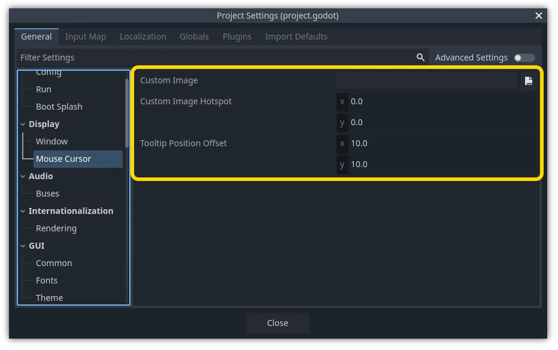

.. _doc_custom_mouse_cursor:

Customizing the mouse cursor
============================

You might want to change the appearance of the mouse cursor in your game in
order to suit the overall design. There are two ways to customize the mouse
cursor:

1. Using project settings
2. Using a script

Using project settings is a simpler (but more limited) way to customize the mouse cursor.
The second way is more customizable, but involves scripting:

.. note::

    You could display a "software" mouse cursor by hiding the mouse cursor and
    moving a Sprite2D to the cursor position in a ``_process()`` method, but
    this will add at least one frame of latency compared to an "hardware" mouse
    cursor. Therefore, it's recommended to use the approach described here
    whenever possible.

    If you have to use the "software" approach, consider adding an extrapolation step
    to better display the actual mouse input.

Using project settings
----------------------

Open project settings, go to Display>Mouse Cursor. You will see Custom Image, Custom Image Hotspot
and Tooltip Position Offset.

Custom Image is the desired image that you would like to set as the mouse cursor.
Custom Hotspot is the point in the image that you would like to use as the cursor's detection point.

.. warning::

    The custom image **must** be 256×256 pixels at most. To avoid rendering
    issues, sizes lower than or equal to 128×128 are recommended.

    On the web platform, the maximum allowed cursor image size is 128×128.

Using a script
--------------

Create a Node and attach the following script.

.. tabs::
 .. code-tab:: gdscript GDScript

    extends Node

    # Load the custom images for the mouse cursor.
    var arrow = load("res://arrow.png")
    var beam = load("res://beam.png")

    func _ready():
        # Changes only the arrow shape of the cursor.
        # This is similar to changing it in the project settings.
        Input.set_custom_mouse_cursor(arrow)

        # Changes a specific shape of the cursor (here, the I-beam shape).
        Input.set_custom_mouse_cursor(beam, Input.CURSOR_IBEAM)

 .. code-tab:: csharp

    public override void _Ready()
    {
        // Load the custom images for the mouse cursor.
        var arrow = ResourceLoader.Load("res://arrow.png");
        var beam = ResourceLoader.Load("res://beam.png");

        // Changes only the arrow shape of the cursor.
        // This is similar to changing it in the project settings.
        Input.SetCustomMouseCursor(arrow);

        // Changes a specific shape of the cursor (here, the I-beam shape).
        Input.SetCustomMouseCursor(beam, Input.CursorShape.Ibeam);
    }

.. seealso::

    Check :ref:`Input.set_custom_mouse_cursor() <class_Input_method_set_custom_mouse_cursor>`'s
    documentation for more information on usage and platform-specific caveats.

Cursor list
-----------

As documented in the :ref:`Input <class_Input>` class (see the **CursorShape**
enum), there are multiple mouse cursors you can define. Which ones you want to
use depends on your use case.
