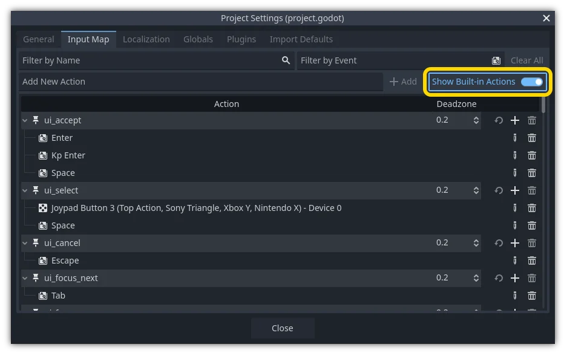

.. _doc_input_examples:

Input examples
==============

Introduction
------------

In this tutorial, you'll learn how to use Godot's :ref:`InputEvent <class_InputEvent>`
system to capture player input. There are many different types of input your
game may use - keyboard, gamepad, mouse, etc. - and many different ways to
turn those inputs into actions in your game. This document will show you some
of the most common scenarios, which you can use as starting points for your
own projects.

.. note:: For a detailed overview of how Godot's input event system works,
          see :ref:`doc_inputevent`.

Events versus polling
---------------------

Sometimes you want your game to respond to a certain input event - pressing
the "jump" button, for example. For other situations, you might want something
to happen as long as a key is pressed, such as movement. In the first case,
you can use the ``_input()`` function, which will be called whenever an input
event occurs. In the second case, Godot provides the :ref:`Input <class_Input>`
singleton, which you can use to query the state of an input.

Examples:

.. tabs::
 .. code-tab:: gdscript GDScript

    func _input(event):
        if event.is_action_pressed("jump"):
            jump()

    func _physics_process(delta):
        if Input.is_action_pressed("move_right"):
            # Move as long as the key/button is pressed.
            position.x += speed * delta

 .. code-tab:: csharp

    public override void _Input(InputEvent @event)
    {
        if (@event.IsActionPressed("jump"))
        {
            Jump();
        }
    }

    public override void _PhysicsProcess(double delta)
    {
        if (Input.IsActionPressed("move_right"))
        {
            // Move as long as the key/button is pressed.
            position.X += speed * (float)delta;
        }
    }

This gives you the flexibility to mix-and-match the type of input processing
you do.

For the remainder of this tutorial, we'll focus on capturing individual
events in ``_input()``.

Input events
------------

Input events are objects that inherit from :ref:`InputEvent <class_InputEvent>`.
Depending on the event type, the object will contain specific properties
related to that event. To see what events actually look like, add a Node and
attach the following script:

.. tabs::
 .. code-tab:: gdscript GDScript

    extends Node

    func _input(event):
        print(event.as_text())

 .. code-tab:: csharp

    using Godot;

    public partial class Node : Godot.Node
    {
        public override void _Input(InputEvent @event)
        {
            GD.Print(@event.AsText());
        }
    }

As you press keys, move the mouse, and perform other inputs, you'll see each
event scroll by in the output window. Here's an example of the output:

::

    A
    Mouse motion at position ((971, 5)) with velocity ((0, 0))
    Right Mouse Button
    Mouse motion at position ((870, 243)) with velocity ((0.454937, -0.454937))
    Left Mouse Button
    Mouse Wheel Up
    A
    B
    Shift
    Alt+Shift
    Alt
    Shift+T
    Mouse motion at position ((868, 242)) with velocity ((-2.134768, 2.134768))

As you can see, the results are very different for the different types of
input. Key events are even printed as their key symbols. For example, let's
consider :ref:`InputEventMouseButton <class_InputEventMouseButton>`.
It inherits from the following classes:

- :ref:`InputEvent <class_InputEvent>` - the base class for all input events
- :ref:`InputEventWithModifiers <class_InputEventWithModifiers>` - adds the ability to check if modifiers are pressed, such as :kbd:`Shift` or :kbd:`Alt`.
- :ref:`InputEventMouse <class_InputEventMouse>` - adds mouse event properties, such as ``position``
- :ref:`InputEventMouseButton <class_InputEventMouseButton>` - contains the index of the button that was pressed, whether it was a double-click, etc.

.. tip:: It's a good idea to keep the class reference open while you're working
        with events so you can check the event type's available properties and
        methods.

You can encounter errors if you try to access a property on an input type that
doesn't contain it - calling ``position`` on ``InputEventKey`` for example. To
avoid this, make sure to test the event type first:

.. tabs::
 .. code-tab:: gdscript GDScript

    func _input(event):
        if event is InputEventMouseButton:
            print("mouse button event at ", event.position)

 .. code-tab:: csharp

    public override void _Input(InputEvent @event)
    {
        if (@event is InputEventMouseButton mouseEvent)
        {
            GD.Print("mouse button event at ", mouseEvent.Position);
        }
    }

InputMap
--------

The :ref:`InputMap <class_InputMap>` is the most flexible way to handle a
variety of inputs. You use this by creating named input *actions*, to which
you can assign any number of input events, such as keypresses or mouse clicks.
To see them, and to add your own, open Project -> Project Settings and select
the InputMap tab:

.. tip::
    A new Godot project includes a number of default actions already defined.
    To see them, turn on ``Show Built-in Actions`` in the InputMap dialog.

Capturing actions
~~~~~~~~~~~~~~~~~

Once you've defined your actions, you can process them in your scripts using
``is_action_pressed()`` and ``is_action_released()`` by passing the name of
the action you're looking for:

.. tabs::
 .. code-tab:: gdscript GDScript

    func _input(event):
        if event.is_action_pressed("my_action"):
            print("my_action occurred!")

 .. code-tab:: csharp

    public override void _Input(InputEvent @event)
    {
        if (@event.IsActionPressed("my_action"))
        {
            GD.Print("my_action occurred!");
        }
    }

Keyboard events
---------------

Keyboard events are captured in :ref:`InputEventKey <class_InputEventKey>`.
While it's recommended to use input actions instead, there may be cases where
you want to specifically look at key events. For this example, let's check for
the :kbd:`T`:

.. tabs::
 .. code-tab:: gdscript GDScript

    func _input(event):
        if event is InputEventKey and event.pressed:
            if event.keycode == KEY_T:
                print("T was pressed")

 .. code-tab:: csharp

    public override void _Input(InputEvent @event)
    {
        if (@event is InputEventKey keyEvent && keyEvent.Pressed)
        {
            if (keyEvent.Keycode == Key.T)
            {
                GD.Print("T was pressed");
            }
        }
    }

.. tip:: See :ref:`@GlobalScope_Key <enum_@GlobalScope_Key>` for a list of keycode
        constants.

.. warning::

    Due to *keyboard ghosting*, not all key inputs may be registered at a given time
    if you press too many keys at once. Due to their location on the keyboard,
    certain keys are more prone to ghosting than others. Some keyboards feature
    antighosting at a hardware level, but this feature is generally
    not present on low-end keyboards and laptop keyboards.

    As a result, it's recommended to use a default keyboard layout that is designed to work well
    on a keyboard without antighosting. See
    `this Gamedev Stack Exchange question <https://gamedev.stackexchange.com/a/109002>`__
    for more information.

Keyboard modifiers
~~~~~~~~~~~~~~~~~~

Modifier properties are inherited from
:ref:`InputEventWithModifiers <class_InputEventWithModifiers>`. This allows
you to check for modifier combinations using boolean properties. Let's imagine
you want one thing to happen when the :kbd:`T` is pressed, but something
different when it's :kbd:`Shift + T`:

.. tabs::
 .. code-tab:: gdscript GDScript

    func _input(event):
        if event is InputEventKey and event.pressed:
            if event.keycode == KEY_T:
                if event.shift_pressed:
                    print("Shift+T was pressed")
                else:
                    print("T was pressed")

 .. code-tab:: csharp

    public override void _Input(InputEvent @event)
    {
        if (@event is InputEventKey keyEvent && keyEvent.Pressed)
        {
            switch (keyEvent.Keycode)
            {
                case Key.T:
                    GD.Print(keyEvent.ShiftPressed ? "Shift+T was pressed" : "T was pressed");
                    break;
            }
        }
    }

.. tip:: See :ref:`@GlobalScope_Key <enum_@GlobalScope_Key>` for a list of keycode
        constants.

Mouse events
------------

Mouse events stem from the :ref:`InputEventMouse <class_InputEventMouse>` class, and
are separated into two types: :ref:`InputEventMouseButton <class_InputEventMouseButton>`
and :ref:`InputEventMouseMotion <class_InputEventMouseMotion>`. Note that this
means that all mouse events will contain a ``position`` property.

Mouse buttons
~~~~~~~~~~~~~

Capturing mouse buttons is very similar to handling key events. :ref:`@GlobalScope_MouseButton <enum_@GlobalScope_MouseButton>`
contains a list of ``MOUSE_BUTTON_*`` constants for each possible button, which will
be reported in the event's ``button_index`` property. Note that the scrollwheel
also counts as a button - two buttons, to be precise, with both
``MOUSE_BUTTON_WHEEL_UP`` and ``MOUSE_BUTTON_WHEEL_DOWN`` being separate events.

.. tabs::
 .. code-tab:: gdscript GDScript

    func _input(event):
        if event is InputEventMouseButton:
            if event.button_index == MOUSE_BUTTON_LEFT and event.pressed:
                print("Left button was clicked at ", event.position)
            if event.button_index == MOUSE_BUTTON_WHEEL_UP and event.pressed:
                print("Wheel up")

 .. code-tab:: csharp

    public override void _Input(InputEvent @event)
    {
        if (@event is InputEventMouseButton mouseEvent && mouseEvent.Pressed)
        {
            switch (mouseEvent.ButtonIndex)
            {
                case MouseButton.Left:
                    GD.Print($"Left button was clicked at {mouseEvent.Position}");
                    break;
                case MouseButton.WheelUp:
                    GD.Print("Wheel up");
                    break;
            }
        }
    }

Mouse motion
~~~~~~~~~~~~

:ref:`InputEventMouseMotion <class_InputEventMouseMotion>` events occur whenever
the mouse moves. You can find the move's distance with the ``relative``
property.

Here's an example using mouse events to drag-and-drop a :ref:`Sprite2D <class_Sprite2D>`
node:

.. tabs::
 .. code-tab:: gdscript GDScript

    extends Node

    var dragging = false
    var click_radius = 32 # Size of the sprite.

    func _input(event):
        if event is InputEventMouseButton and event.button_index == MOUSE_BUTTON_LEFT:
            if (event.position - $Sprite2D.position).length() < click_radius:
                # Start dragging if the click is on the sprite.
                if not dragging and event.pressed:
                    dragging = true
            # Stop dragging if the button is released.
            if dragging and not event.pressed:
                dragging = false

        if event is InputEventMouseMotion and dragging:
            # While dragging, move the sprite with the mouse.
            $Sprite2D.position = event.position

 .. code-tab:: csharp

    using Godot;

    public partial class MyNode2D : Node2D
    {
        private bool _dragging = false;
        private int _clickRadius = 32; // Size of the sprite.

        public override void _Input(InputEvent @event)
        {
            Sprite2D sprite = GetNodeOrNull<Sprite2D>("Sprite2D");
            if (sprite == null)
            {
                return; // No suitable node was found.
            }

            if (@event is InputEventMouseButton mouseEvent && mouseEvent.ButtonIndex == MouseButton.Left)
            {
                if ((mouseEvent.Position - sprite.Position).Length() < _clickRadius)
                {
                    // Start dragging if the click is on the sprite.
                    if (!_dragging && mouseEvent.Pressed)
                    {
                        _dragging = true;
                    }
                }
                // Stop dragging if the button is released.
                if (_dragging && !mouseEvent.Pressed)
                {
                    _dragging = false;
                }
            }
            else
            {
                if (@event is InputEventMouseMotion motionEvent && _dragging)
                {
                    // While dragging, move the sprite with the mouse.
                    sprite.Position = motionEvent.Position;
                }
            }
        }
    }

Touch events
------------

If you are using a touchscreen device, you can generate touch events.
:ref:`InputEventScreenTouch <class_InputEventScreenTouch>` is equivalent to
a mouse click event, and :ref:`InputEventScreenDrag <class_InputEventScreenDrag>`
works much the same as mouse motion.

.. tip:: To test your touch events on a non-touchscreen device, open Project
        Settings and go to the "Input Devices/Pointing" section. Enable "Emulate
        Touch From Mouse" and your project will interpret mouse clicks and
        motion as touch events.
