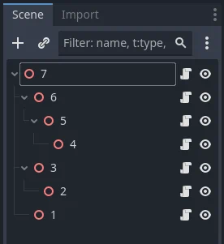

.. _doc_inputevent:

Using InputEvent
================

What is it?
-----------

Managing input is usually complex, no matter the OS or platform. To ease
this a little, a special built-in type is provided, :ref:`InputEvent <class_InputEvent>`.
This datatype can be configured to contain several types of input
events. Input events travel through the engine and can be received in
multiple locations, depending on the purpose.

Here is a quick example, closing your game if the escape key is hit:

.. tabs::
 .. code-tab:: gdscript GDScript

    func _unhandled_input(event):
        if event is InputEventKey:
            if event.pressed and event.keycode == KEY_ESCAPE:
                get_tree().quit()

 .. code-tab:: csharp

    public override void _UnhandledInput(InputEvent @event)
    {
        if (@event is InputEventKey eventKey)
        {
            if (eventKey.Pressed && eventKey.Keycode == Key.Escape)
            {
                GetTree().Quit();
            }
        }
    }

However, it is cleaner and more flexible to use the provided :ref:`InputMap <class_InputMap>` feature,
which allows you to define input actions and assign them different keys. This way,
you can define multiple keys for the same action (e.g. the keyboard escape key and the start button on a gamepad).
You can then more easily change this mapping in the project settings without updating your code,
and even build a key mapping feature on top of it to allow your game to change the key mapping at runtime!

You can set up your InputMap under **Project > Project Settings > Input Map** and then use those actions like this:

.. tabs::
 .. code-tab:: gdscript GDScript

    func _process(delta):
        if Input.is_action_pressed("ui_right"):
            # Move right.

 .. code-tab:: csharp

    public override void _Process(double delta)
    {
        if (Input.IsActionPressed("ui_right"))
        {
            // Move right.
        }
    }

How does it work?
-----------------

Every input event is originated from the user/player (though it's
possible to generate an InputEvent and feed them back to the engine,
which is useful for gestures). The DisplayServer for each platform will read
events from the operating system, then feed them to the root :ref:`Window <class_Window>`.

The window's :ref:`Viewport <class_Viewport>` does quite a lot of stuff with the
received input, in order:

.. image:: img/input_event_flow.webp

1. If the Viewport is embedding Windows, the Viewport tries to interpret the event in its
   capability as a Window-Manager (e.g. for resizing or moving Windows).
2. Next if an embedded Window is focused, the event is sent to that Window and processed in
   the Window's Viewport and afterwards treated as handled. If no embedded Window is focused,
   the event is sent to the nodes of the current viewport in the following order.
3. First of all, the standard :ref:`Node._input() <class_Node_private_method__input>` function
   will be called in any node that overrides it (and hasn't disabled input processing with :ref:`Node.set_process_input() <class_Node_method_set_process_input>`).
   If any function consumes the event, it can call :ref:`Viewport.set_input_as_handled() <class_Viewport_method_set_input_as_handled>`, and the event will
   not spread any more. This ensures that you can filter all events of interest, even before the GUI.
   For gameplay input, :ref:`Node._unhandled_input() <class_Node_private_method__unhandled_input>` is generally a better fit, because it allows the GUI to intercept the events.
4. Second, it will try to feed the input to the GUI, and see if any
   control can receive it. If so, the :ref:`Control <class_Control>` will be called via the
   virtual function :ref:`Control._gui_input() <class_Control_private_method__gui_input>` and the signal
   "gui_input" will be emitted (this function is re-implementable by
   script by inheriting from it). If the control wants to "consume" the
   event, it will call :ref:`Control.accept_event() <class_Control_method_accept_event>` and the event will
   not spread any more. Use the :ref:`Control.mouse_filter <class_Control_property_mouse_filter>`
   property to control whether a :ref:`Control <class_Control>` is notified
   of mouse events via :ref:`Control._gui_input() <class_Control_private_method__gui_input>`
   callback, and whether these events are propagated further.
5. If so far no one consumed the event, the :ref:`Node._shortcut_input() <class_Node_private_method__shortcut_input>` callback
   will be called if overridden (and not disabled with
   :ref:`Node.set_process_shortcut_input() <class_Node_method_set_process_shortcut_input>`).
   This happens only for :ref:`InputEventKey <class_InputEventKey>`,
   :ref:`InputEventShortcut <class_InputEventShortcut>` and :ref:`InputEventJoypadButton <class_InputEventJoypadButton>`.
   If any function consumes the event, it can call :ref:`Viewport.set_input_as_handled() <class_Viewport_method_set_input_as_handled>`, and the
   event will not spread any more. The shortcut input callback is ideal for treating events that are intended as shortcuts.
6. If so far no one consumed the event, the :ref:`Node._unhandled_key_input() <class_Node_private_method__unhandled_key_input>` callback
   will be called if overridden (and not disabled with
   :ref:`Node.set_process_unhandled_key_input() <class_Node_method_set_process_unhandled_key_input>`).
   This happens only if the event is an :ref:`InputEventKey <class_InputEventKey>`.
   If any function consumes the event, it can call :ref:`Viewport.set_input_as_handled() <class_Viewport_method_set_input_as_handled>`, and the
   event will not spread any more. The unhandled key input callback is ideal for key events.
7. If so far no one consumed the event, the :ref:`Node._unhandled_input() <class_Node_private_method__unhandled_input>` callback
   will be called if overridden (and not disabled with
   :ref:`Node.set_process_unhandled_input() <class_Node_method_set_process_unhandled_input>`).
   If any function consumes the event, it can call :ref:`Viewport.set_input_as_handled() <class_Viewport_method_set_input_as_handled>`, and the
   event will not spread any more. The unhandled input callback is ideal for full-screen gameplay events, so they are not received when a GUI is active.
8. If no one wanted the event so far, and :ref:`Object Picking <class_viewport_property_physics_object_picking>`
   is turned on, the event is used for object picking. For the root viewport, this can also be
   enabled in :ref:`Project Settings <class_ProjectSettings_property_physics/common/enable_object_picking>`.
   In the case of a 3D scene if a :ref:`Camera3D <class_Camera3D>` is assigned to the Viewport, a ray
   to the physics world (in the ray direction from the click) will be cast. If this ray hits an object,
   it will call the :ref:`CollisionObject3D._input_event() <class_CollisionObject3D_private_method__input_event>`
   function in the relevant physics object.
   In the case of a 2D scene, conceptually the same happens with :ref:`CollisionObject2D._input_event() <class_CollisionObject2D_private_method__input_event>`.

When sending events to its child and descendant nodes, the viewport will do so, as depicted in
the following graphic, in a reverse depth-first order, starting with the node at the bottom of
the scene tree, and ending at the root node. Excluded from this process are Windows
and SubViewports.

.. note::

   This order doesn't apply to :ref:`Control._gui_input() <class_Control_private_method__gui_input>`, which uses
   a different method based on event location or focused Control. GUI **mouse** events also travel 
   up the scene tree, subject to the :ref:`Control.mouse_filter <class_Control_property_mouse_filter>`
   restrictions described above. However, since these events target specific Controls, only direct ancestors of 
   the targeted Control node receive the event. GUI **keyboard and joypad** events *do not* travel
   up the scene tree, and can only be handled by the Control that received them. Otherwise, they will be
   propagated as non-GUI events through :ref:`Node._unhandled_input() <class_Node_private_method__unhandled_input>`.

Since Viewports don't send events to other :ref:`SubViewports <class_SubViewport>`, one of the following
methods has to be used:

1. Use a :ref:`SubViewportContainer <class_SubViewportContainer>`, which automatically
   sends events to its child :ref:`SubViewports <class_SubViewport>` after
   :ref:`Node._input() <class_Node_private_method__input>` or :ref:`Control._gui_input() <class_Control_private_method__gui_input>`.
2. Implement event propagation based on the individual requirements.

In accordance with Godot's node-based design, this enables
specialized child nodes to handle and consume particular events, while
their ancestors, and ultimately the scene root, can provide more
generalized behavior if needed.

Anatomy of an InputEvent
------------------------

:ref:`InputEvent <class_InputEvent>` is just a base built-in type, it does not represent
anything and only contains some basic information, such as event ID
(which is increased for each event), device index, etc.

There are several specialized types of InputEvent, described in the table below:

+-------------------------------------------------------------------+-----------------------------------------+
| Event                                                             | Description                             |
+-------------------------------------------------------------------+-----------------------------------------+
| :ref:`InputEvent <class_InputEvent>`                              | Empty Input Event.                      |
+-------------------------------------------------------------------+-----------------------------------------+
| :ref:`InputEventKey <class_InputEventKey>`                        | Contains a keycode and Unicode value,   |
|                                                                   | as well as modifiers.                   |
+-------------------------------------------------------------------+-----------------------------------------+
| :ref:`InputEventMouseButton <class_InputEventMouseButton>`        | Contains click information, such as     |
|                                                                   | button, modifiers, etc.                 |
+-------------------------------------------------------------------+-----------------------------------------+
| :ref:`InputEventMouseMotion <class_InputEventMouseMotion>`        | Contains motion information, such as    |
|                                                                   | relative and absolute positions and     |
|                                                                   | speed.                                  |
+-------------------------------------------------------------------+-----------------------------------------+
| :ref:`InputEventJoypadMotion <class_InputEventJoypadMotion>`      | Contains Joystick/Joypad analog axis    |
|                                                                   | information.                            |
+-------------------------------------------------------------------+-----------------------------------------+
| :ref:`InputEventJoypadButton <class_InputEventJoypadButton>`      | Contains Joystick/Joypad button         |
|                                                                   | information.                            |
+-------------------------------------------------------------------+-----------------------------------------+
| :ref:`InputEventScreenTouch <class_InputEventScreenTouch>`        | Contains multi-touch press/release      |
|                                                                   | information. (only available on mobile  |
|                                                                   | devices)                                |
+-------------------------------------------------------------------+-----------------------------------------+
| :ref:`InputEventScreenDrag <class_InputEventScreenDrag>`          | Contains multi-touch drag information.  |
|                                                                   | (only available on mobile devices)      |
+-------------------------------------------------------------------+-----------------------------------------+
| :ref:`InputEventMagnifyGesture <class_InputEventMagnifyGesture>`  | Contains a position, a factor as well   |
|                                                                   | as modifiers.                           |
+-------------------------------------------------------------------+-----------------------------------------+
| :ref:`InputEventPanGesture <class_InputEventPanGesture>`          | Contains a position, a delta as well as |
|                                                                   | modifiers.                              |
+-------------------------------------------------------------------+-----------------------------------------+
| :ref:`InputEventMIDI <class_InputEventMIDI>`                      | Contains MIDI-related information.      |
+-------------------------------------------------------------------+-----------------------------------------+
| :ref:`InputEventShortcut <class_InputEventShortcut>`              | Contains a shortcut.                    |
+-------------------------------------------------------------------+-----------------------------------------+
| :ref:`InputEventAction <class_InputEventAction>`                  | Contains a generic action. These events |
|                                                                   | are often generated by the programmer   |
|                                                                   | as feedback. (more on this below)       |
+-------------------------------------------------------------------+-----------------------------------------+

Input actions
-------------

Input actions are a grouping of zero or more InputEvents into a commonly
understood title (for example, the default "ui_left" action grouping both joypad-left input and a keyboard's left arrow key). They are not required to represent an
InputEvent but are useful because they abstract various inputs when
programming the game logic.

This allows for:

-  The same code to work on different devices with different inputs (e.g.,
   keyboard on PC, Joypad on console).
-  Input to be reconfigured at runtime.
-  Actions to be triggered programmatically at runtime.

Actions can be created from the Project Settings menu in the **Input Map**
tab and assigned input events.

Any event has the methods :ref:`InputEvent.is_action() <class_InputEvent_method_is_action>`,
:ref:`InputEvent.is_pressed() <class_InputEvent_method_is_pressed>` and :ref:`InputEvent.is_echo() <class_InputEvent_method_is_echo>`.

Alternatively, it may be desired to supply the game back with an action
from the game code (a good example of this is detecting gestures).
The Input singleton has a method for this:
:ref:`Input.parse_input_event() <class_input_method_parse_input_event>`. You would normally use it like this:

.. tabs::
 .. code-tab:: gdscript GDScript

    var ev = InputEventAction.new()
    # Set as ui_left, pressed.
    ev.action = "ui_left"
    ev.pressed = true
    # Feedback.
    Input.parse_input_event(ev)

 .. code-tab:: csharp

    var ev = new InputEventAction();
    // Set as ui_left, pressed.
    ev.Action = "ui_left";
    ev.Pressed = true;
    // Feedback.
    Input.ParseInputEvent(ev);

.. seealso::

   See :ref:`doc_first_3d_game_input_actions` for a tutorial on adding input
   actions in the project settings.

InputMap
--------

Customizing and re-mapping input from code is often desired. If your
whole workflow depends on actions, the :ref:`InputMap <class_InputMap>` singleton is
ideal for reassigning or creating different actions at runtime. This
singleton is not saved (must be modified manually) and its state is run
from the project settings (project.godot). So any dynamic system of this
type needs to store settings in the way the programmer best sees fit.
