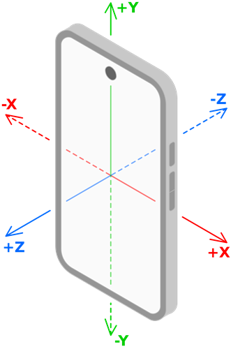
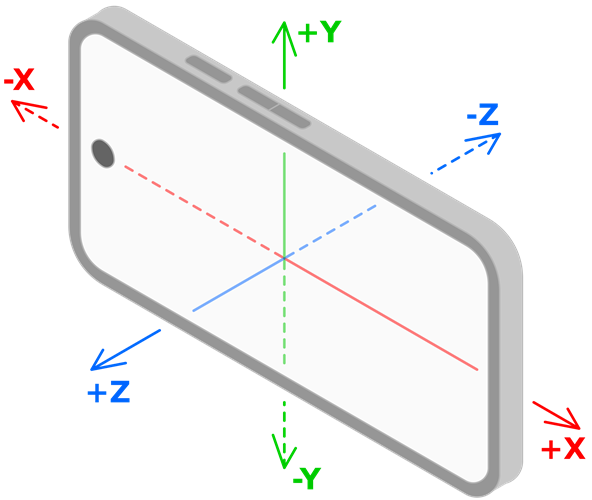

.. _doc_mobile_sensors:

Mobile sensors
==============

With motion controls, games can track the device's physical rotation and movement.
This can be used to let the player turn the in-game camera by moving their device, or shaking their device to perform a special action.

The device in this case can be either a mobile phone or a controller.

.. note::

    Controller motion sensors usage is explained in detail
    on the :ref:`doc_controller_features_motion_sensors` page.
    This page describes how to use the sensors found in mobile phones on Android and iOS.

Axis explanation
~~~~~~~~~~~~~~~~

Mobile sensor input methods, such as :ref:`Input.get_gyroscope()<class_Input_method_get_gyroscope>`,
return :ref:`Vector3<class_Vector3>`, which corresponds to X, Y, and Z axes of the reported data,
and it makes sense to explain how the data axes are mapped in Godot.

The device's gyroscope values in Godot, which can be obtained by using
:ref:`Input.get_gyroscope()<class_Input_method_get_gyroscope>`, show rotation around their respective axes:

- the X value of the gyroscope data shows the rotation around the X axis (roll).
- the Y value of the gyroscope data shows the rotation around the Y axis (yaw).
- the Z value of the gyroscope data shows the rotation around the Z axis (pitch).

The devices's accelerometer values in Godot, which can be obtained by using
:ref:`Input.get_accelerometer()<class_Input_method_get_accelerometer>`,
are provided in the following ways, respectively:

- Movement left and right are reported as **+X** and **-X**.
- Movement down and up are reported as **+Y** and **-Y**.
- Movement away from and towards the user are reported as **+Z** and **-Z**.

Note that the axes of the values that motion sensors report are always relative to the mobile device's current orientation,
and they are modified depending on whether the device is in portrait or landscape mode.
Here's an image of the axes mapping in portrait mode for more clarity:

Here's an image of the axes mapping in landscape mode:

Gyroscope
~~~~~~~~~

A **gyroscope** is a type of sensor that detects the device's rotation.
Here are some notable examples of gyroscope use in games:

- In *Helldivers 2*, *Horizon Forbidden West*, *Star Wars: Dark Forces Remaster*, and *Fortnite*,
  tilting the controller causes the camera to rotate accordingly ("gyro aiming").
  `This video by *Daven On The Moon* <https://www.youtube.com/watch?v=Vlfg9yku2hY>`_ demonstrates and discusses gyro aiming in more detail.
- In *Death Stranding*, BB can be soothed by rotating the controller softly.

.. note::
    For Android,
    :ref:`ProjectSettings.input_devices/sensors/enable_gyroscope<class_ProjectSettings_property_input_devices/sensors/enable_gyroscope>`
    must be enabled for the gyroscope to start reporting values.

You can read the mobile device's gyroscope reported values by using :ref:`Input.get_gyroscope()<class_Input_method_get_gyroscope>`.

The following example rotates an object using the mobile device's gyroscope sensor.

.. code-block::

    const GYRO_SENSITIVITY = 10.0

    func _process(delta):
        var node: Node3D = ... # Put your object here.

        var gyro := Input.get_gyroscope()
        node.rotation.x -= -gyro.y * GYRO_SENSITIVITY * delta  # Use rotation around the Y axis (yaw) here.
        node.rotation.y += -gyro.x * GYRO_SENSITIVITY * delta  # Use rotation around the X axis (pitch) here.

Accelerometer
~~~~~~~~~~~~~

.. warning::

    Do not use accelerometer data to find the controller's position in 3D space;
    the accelerometers in general are not precise enough for this.

An **accelerometer** is a type of sensor that detects a mobile device's acceleration in m/s².
For example, it can detect if the player quickly raises their device, moves it to the side, or shakes it.

.. note::
    For Android,
    :ref:`input_devices/sensors/enable_accelerometer<class_ProjectSettings_property_input_devices/sensors/enable_accelerometer>`
    and :ref:`input_devices/sensors/enable_gravity<class_ProjectSettings_property_input_devices/sensors/enable_gravity>`
    must be enabled for the accelerometer and the gravity sensors respectively to start reporting values.

The acceleration that an accelerometer detects includes gravity by default.
To get *only* the acceleration imparted by the user, subtract gravity from the detected acceleration:

.. code-block::

    Input.get_accelerometer() - Input.get_gravity()

Due to how accelerometers work physically, after movement in one direction stops
they almost immediately report movement in the opposite direction.
After detecting movement in one direction, you may want to ignore further readings
for a small period of time to avoid detecting this opposite movement.

The following example prints the device movement when it's being quickly moved by using its accelerometer.
If the sensitivity doesn't feel right for you,
you can tweak the ``THRESHOLD`` constant or you can replace it by using a different value in the code below.

.. code-block::

    var detect_accelerometer = true

    # Change to make the game detect movement at different thresholds.
    # With a lower value, smaller movements will be detected, and with a
    # larger value, only big movements will be detected.
    const THRESHOLD = 10.0

    func _process(delta):
        if not detect_accelerometer:
            return

        var acceleration = Input.get_accelerometer() - Input.get_gravity()
        if acceleration.length() > THRESHOLD:
            if acceleration.x > THRESHOLD:
                print("Moved left")
            elif acceleration.x < -THRESHOLD:
                print("Moved right")
            if acceleration.y < -THRESHOLD:
                print("Moved up")
            elif acceleration.y > THRESHOLD:
                print("Moved down")
            if acceleration.z < -THRESHOLD:
                print("Moved closer to the player")
            elif acceleration.z > THRESHOLD:
                print("Moved away from the player")

            # After detecting movement in one direction, the accelerometer sensor
            # will briefly report movement in the opposite direction, even though the controller only moved once.
            # So we need to ignore these reported values for a short amount of time.
            detect_accelerometer = false
            await get_tree().create_timer(0.5, false).timeout
            detect_accelerometer = true

Magnetometer
~~~~~~~~~~~~~

(TODO)