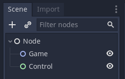
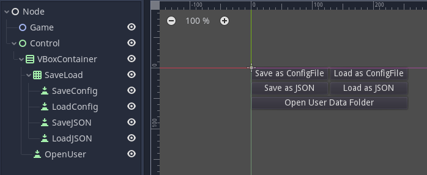
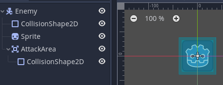
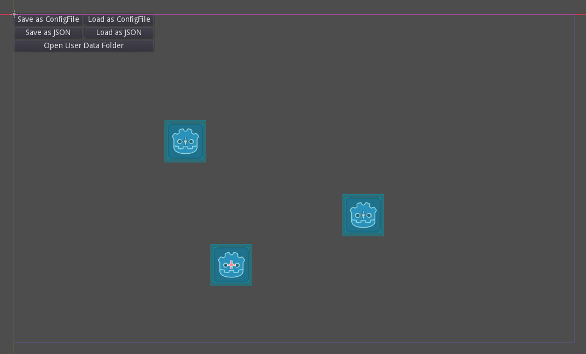
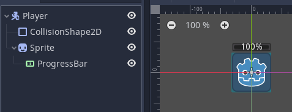
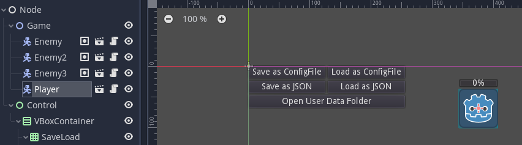

.. _doc_saving_games:

Saving games
============

Introduction
------------

This tutorial will walk you through serializing data and saving it
with :ref:`ConfigFile <class_ConfigFile>` and JSON.

Setting up the project
----------------------

First, create a main scene with this node layout:

Next, let's set up the GUI. These buttons will later be connected to
functions that allow you to save and load data.

Next, we will need entities with data to save and load. Create a new
scene and give it this layout.

Give the enemies some simple movement code. Make sure to connect the
`body_entered()` and `body_exited()` signals of the "AttackArea" node through
the "Signals" tab.

.. tabs::
 .. code-tab:: gdscript GDScript

    extends KinematicBody2D

    const MOVE_SPEED = 75
    const DAMAGE_PER_SECOND = 15

    # The node we should be "attacking" every frame.
    # If `null`, nobody is in range to attack.
    var attacking = null

    func _process(delta):
        if attacking:
            attacking.health -= delta * DAMAGE_PER_SECOND

        # warning-ignore:return_value_discarded
        move_and_slide(Vector2(MOVE_SPEED, 0))

        # The enemy went outside of the window. Move it back to the left.
        if position.x >= 1056:
            position.x = -32

    func _on_AttackArea_body_entered(body):
        if body.name == "Player":
            attacking = body

    func _on_AttackArea_body_exited(_body):
        attacking = null

 .. code-tab:: csharp

    // Someone else can do this

Finally, add the "Enemy" node to the group "enemy" in the "Groups" tab.

.. image:: img/groups.png

Return to the main scene and instance the enemy node multiple times
as children of the "Game" node. Make sure to place them in different
locations in the main scene.

Next, create a new player scene that looks like this. Make sure to
resize and move the `ProgressBar` so that it looks like the image. Also,
set the `value` of the `ProgressBar` to 100.

Add a simple movement script to the player. Also add a health
property that can be saved and loaded.

.. tabs::
 .. code-tab:: gdscript GDScript

    extends KinematicBody2D

    # The player's movement speed.
    const MOVE_SPEED = 240

    var health = 100 setget set_health
    var motion = Vector2()

    onready var progress_bar = $Sprite/ProgressBar

    func _process(delta):
        var velocity = Vector2.ZERO
        velocity.x = Input.get_action_strength("ui_right") - Input.get_action_strength("ui_left")
        velocity.y = Input.get_action_strength("ui_down") - Input.get_action_strength("ui_up")
        position += velocity * MOVE_SPEED * delta

        # Prevent the player from going outside the window.
        position.x = clamp(position.x, 32, 1024)
        position.y = clamp(position.y, 32, 600)

    func set_health(p_health):
        health = p_health
        progress_bar.value = health

        if health <= 0:
            # The player died.
            # warning-ignore:return_value_discarded
            get_tree().reload_current_scene()

 .. code-tab:: csharp

    // Someone else can do this

Return to the main scene and instance the "Player" scene as a
child of the "Game" node. Move the player so that it isn't
underneath the buttons.

If you run the main scene now, you will be able to move the
player around and take damage from the enemies. However, we still
need to serialize the data to save and load it.

There is a specific directory in that Godot uses for saving app data.
Like "res://" it is referred to by a special name, "user://". The
location of this directory varies depending on the operating system,
but there's a method for converting the "user://" path to the system
path as shown in the code below.

Add the following script to the VBoxContainer node. Make sure to connect
the `pressed()` signal from the "OpenUser" button to this script.

.. tabs::
 .. code-tab:: gdscript GDScript

    extends VBoxContainer

    func _ready():
        var file = File.new()
        # Don't allow loading files that don't exist yet.
        $SaveLoad/LoadConfig.disabled = not file.file_exists(ProjectSettings.globalize_path("user://save_config_file.ini"))
        $SaveLoad/LoadJSON.disabled = not file.file_exists(ProjectSettings.globalize_path("user://save_json.json"))

    func _on_OpenUser_pressed() -> void:
        # warning-ignore:return_value_discarded
        OS.shell_open(ProjectSettings.globalize_path("user://"))

 .. code-tab:: csharp

    // Someone else can do this

Saving with ConfigFile
----------------------

:ref:`ConfigFile <class_ConfigFile>` is an INI-style file that can be
used to store any value. ConfigFiles are composed of sections that
contain key-value pairs, similar to a `Dictionary`.

The "SaveConfig" and "LoadConfig" buttons will be sharing the same script.
Create a new script and assign it to both buttons.

.. tabs::
 .. code-tab:: gdscript GDScript

    extends Button
    # This script shows how to save data using Godot's custom ConfigFile format.
    # ConfigFile can store any Godot type natively.

    # The root game node (so we can get and instance enemies).
    export(NodePath) var game_node
    # The player node (so we can set/get its health and position).
    export(NodePath) var player_node

    const SAVE_PATH = "user://save_config_file.ini"

 .. code-tab:: csharp

    // Someone else can do this

Now move to the Inspector and set the export variables to the
correct paths for both Buttons.

In order to use ConfigFile to save, you will need to create a new ConfigFile
and set its values. We will only be saving the properties that need to be
saved. There is no need to save every property of every node.

.. tabs::
 .. code-tab:: gdscript GDScript

    func save_game():
        var config = ConfigFile.new()

        var player = get_node(player_node)
        config.set_value("player", "position", player.position)
        config.set_value("player", "health", player.health)

        var enemies = []
        for enemy in get_tree().get_nodes_in_group("enemy"):
            enemies.push_back({
                position = enemy.position,
            })
        config.set_value("enemies", "enemies", enemies)

        config.save(SAVE_PATH)

        get_node("../LoadConfig").disabled = false

 .. code-tab:: csharp

    // Someone else can do this

Loading is like saving, but in reverse. We will delete the current
enemies and create new ones at the saved values.

.. tabs::
 .. code-tab:: gdscript GDScript

    # `load()` is reserved.
    func load_game():
        var config = ConfigFile.new()
        config.load(SAVE_PATH)

        var player = get_node(player_node)
        player.position = config.get_value("player", "position")
        player.health = config.get_value("player", "health")

        # Remove existing enemies and add new ones.
        for enemy in get_tree().get_nodes_in_group("enemy"):
            enemy.queue_free()

        var enemies = config.get_value("enemies", "enemies")
        # Ensure the node structure is the same when loading.
        var game = get_node(game_node)

        for enemy_config in enemies:
            var enemy = preload("res://enemy.tscn").instance()
            enemy.position = enemy_config.position
            game.add_child(enemy)

 .. code-tab:: csharp

    // Someone else can do this

Next, connect the "SaveConfig" button to the `save_game()` function and
the "LoadConfig" button to the `load_game()` function.

Now if you run the scene, you will be able to load and save with ConfigFile.

Saving with JSON
----------------

JSON is a data-interchange format. It is widely used to transfer data between
systems, but since it's not designed specifically for Godot, there are some data
types that can't be stored natively, like :ref:`Vector2 <class_Vector2>`.

Like before, the "SaveJSON" and "LoadJSON" buttons will be sharing the same script.
Create a new script and attach it to both.

.. tabs::
 .. code-tab:: gdscript GDScript

    extends Button
    # This script shows how to save data using the JSON file format.
    # JSON is a widely used file format, but not all Godot types can be
    # stored natively. For example, integers get converted into doubles,
    # and to store Vector2 and other non-JSON types you need `var2str()`.

    # The root game node (so we can get and instance enemies).
    export(NodePath) var game_node
    # The player node (so we can set/get its health and position).
    export(NodePath) var player_node

    const SAVE_PATH = "user://save_json.json"

 .. code-tab:: csharp

    // Someone else can do this

Move to the Inspector and set the export variables for both buttons.

We will create a new :ref:`File <class_File>` in order to save as a
JSON file. In order to store Vector2 values, you need to use the `var2str`
function to convert the Vector2 into a String so that it can be converted
back later.

.. tabs::
 .. code-tab:: gdscript GDScript

    func save_game():
        var file = File.new()
        file.open(SAVE_PATH, File.WRITE)

        var player = get_node(player_node)
        # JSON doesn't support complex types such as Vector2.
        # `var2str()` can be used to convert any Variant to a String.
        var save_dict = {
            player = {
                position = var2str(player.position),
                health = var2str(player.health),
            },
            enemies = []
        }

        for enemy in get_tree().get_nodes_in_group("enemy"):
            save_dict.enemies.push_back({
                position = var2str(enemy.position),
            })

        file.store_line(to_json(save_dict))

        get_node("../LoadJSON").disabled = false

 .. code-tab:: csharp
 
    // Someone else can do this

For loading, we will need to use the opposite of the `var2str` method,
`str2var`, in order to convert the JSON data back into Godot's data
types.

.. tabs::
 .. code-tab:: gdscript GDScript

    # `load()` is reserved.
    func load_game():
        var file = File.new()
        file.open(SAVE_PATH, File.READ)
        var save_dict = parse_json(file.get_line())

        var player = get_node(player_node)
        # JSON doesn't support complex types such as Vector2.
        # `str2var()` can be used to convert a String to the corresponding Variant.
        player.position = str2var(save_dict.player.position)
        player.health = str2var(save_dict.player.health)

        # Remove existing enemies and add new ones.
        for enemy in get_tree().get_nodes_in_group("enemy"):
            enemy.queue_free()

        # Ensure the node structure is the same when loading.
        var game = get_node(game_node)

        for enemy_config in save_dict.enemies:
            var enemy = preload("res://enemy.tscn").instance()
            enemy.position = str2var(enemy_config.position)
            game.add_child(enemy)

 .. code-tab:: csharp

    // Someone else can do this

Now, connect the `pressed()` signal from the "SaveJSON" button to the `save_game()`
function and the "LoadJSON" button to the `load_game()` function.

If you run the main scene now, you will be able to save and load using JSON
files.

Conclusion
----------

ConfigFile and JSON are only two ways to save and load data. You can also store
data directly with :ref:`File <class_File>` without using JSON, or you can save
whole scenes with :ref:`PackedScene <class_PackedScene>`.

You can find a completed version of this project at
https://github.com/godotengine/godot-demo-projects.
