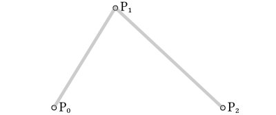
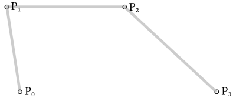
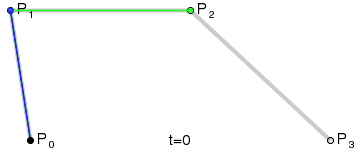
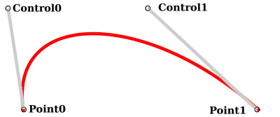
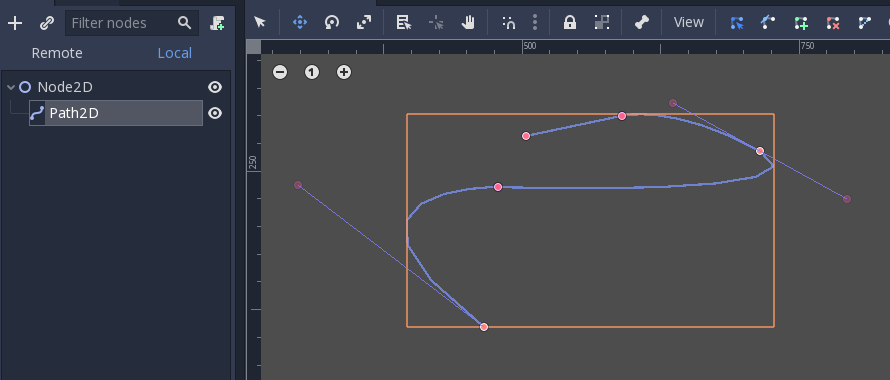
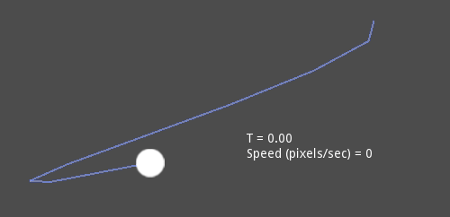
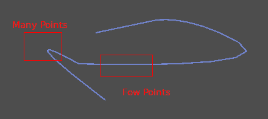

.. _doc_beziers_and_curves:

Beziers, curves and paths
=========================

Bezier curves are a mathematical approximation of natural geometric shapes. We
use them to represent a curve with as little information as possible and with a
high level of flexibility.

Unlike more abstract mathematical concepts, Bezier curves were created for
industrial design. They are a popular tool in the graphics software industry.

They rely on :ref:`interpolation<doc_interpolation>`, which we saw in the
previous article, combining multiple steps to create smooth curves. To better
understand how Bezier curves work, let's start from its simplest form: Quadratic
Bezier.

Quadratic Bezier
----------------

Take three points, the minimum required for Quadratic Bezier to work:

To draw a curve between them, we first interpolate gradually over the two
vertices of each of the two segments formed by the three points, using values
ranging from 0 to 1. This gives us two points that move along the segments as we
change the value of ``t`` from 0 to 1.

.. tabs::
 .. code-tab:: gdscript GDScript

    func _quadratic_bezier(p0: Vector2, p1: Vector2, p2: Vector2, t: float):
        var q0 = p0.linear_interpolate(p1, t)
        var q1 = p1.linear_interpolate(p2, t)

We then interpolate ``q0`` and ``q1`` to obtain a single point ``r`` that moves
along a curve.

.. tabs::
 .. code-tab:: gdscript GDScript

        var r = q0.linear_interpolate(q1, t)
        return r

This type of is called a *Quadratic Bezier* curve.

.. image:: img/bezier_quadratic_points2.gif

*(Image credit: Wikipedia)*

Cubic Bezier
------------

Building upon the previous example, we can get more control by interpolating
between four points.

We first use a function with four parameters to take four points as an input,
``p0``, ``p1``, ``p2`` and ``p3``:

.. tabs::
 .. code-tab:: gdscript GDScript

    func _cubic_bezier(p0: Vector2, p1: Vector2, p2: Vector2, p3: Vector2, t: float):

We apply a linear interpolation to each couple of points to reduce them to
three:

.. tabs::
 .. code-tab:: gdscript GDScript

        var q0 = p0.linear_interpolate(p1, t)
        var q1 = p1.linear_interpolate(p2, t)
        var q2 = p2.linear_interpolate(p3, t)

We then take our three points and reduce them to two:

.. tabs::
 .. code-tab:: gdscript GDScript

        var r0 = q0.linear_interpolate(q1, t)
        var r1 = q1.linear_interpolate(q2, t)

And to one:

.. tabs::
 .. code-tab:: gdscript GDScript

        var s = r0.linear_interpolate(r1, t)
        return s

Here is the full function:

.. tabs::
 .. code-tab:: gdscript GDScript

    func _cubic_bezier(p0: Vector2, p1: Vector2, p2: Vector2, p3: Vector2, t: float):
        var q0 = p0.linear_interpolate(p1, t)
        var q1 = p1.linear_interpolate(p2, t)
        var q2 = p2.linear_interpolate(p3, t)

        var r0 = q0.linear_interpolate(q1, t)
        var r1 = q1.linear_interpolate(q2, t)

        var s = r0.linear_interpolate(r1, t)
        return s

The result will be a smooth curve interpolating between all four points:

*(Image credit: Wikipedia)*

.. note:: Cubic Bezier interpolation works the same in 3D, just use ``Vector3``
          instead of ``Vector2``.

Adding control points
---------------------

Building upon Cubic Bezier, we can change the way two of the points work to
control the shape of our curve freely. Instead of having ``p0``, ``p1``, ``p2``
and ``p3``, we will store them as:

* ``point0 = p0``: Is the first point, the source
* ``control0 = p1 - p0``: Is a vector relative to the first control point
* ``control1 = p3 - p2``: Is a vector relative to the second control point
* ``point1 = p3``: Is the second point, the destination

This way, we have two points and two control points which are relative vectors
to the respective points. If you've used graphics or animation software before,
this might look familiar:

This is how graphics software presents Bezier curves to the users, and how they
work and look in Godot.

Curve2D, Curve3D, Path and Path2D
---------------------------------

There are two objects that contain curves: :ref:`Curve3D <class_Curve3D>` and :ref:`Curve2D <class_Curve2D>` (for 3D and 2D respectively).

They can contain several points, allowing for longer paths. It is also possible to set them to nodes: :ref:`Path <class_Path>` and :ref:`Path2D <class_Path2D>` (also for 3D and 2D respectively):

Using them, however, may not be completely obvious, so following is a description of the most common use cases for Bezier curves.

Evaluating
----------

Just evaluating them may be an option, but in most cases it's not very useful. The big drawback with Bezier curves is that if you traverse them at constant speed, from ``t = 0`` to ``t = 1``, the actual interpolation will *not* move at constant speed. The speed is also an interpolation between the distances between points ``p0``, ``p1``, ``p2`` and ``p3`` and there is not a mathematically simple way to traverse the curve at constant speed.

Let's do a simple example with the following pseudocode:

.. tabs::
 .. code-tab:: gdscript GDScript

    var t = 0.0

    func _process(delta):
        t += delta
        position = _cubic_bezier(p0, p1, p2, p3, t)

As you can see, the speed (in pixels per second) of the circle varies, even though ``t`` is increased at constant speed. This makes beziers difficult to use for anything practical out of the box.

Drawing
-------

Drawing beziers (or objects based on the curve) is a very common use case, but it's also not easy. For pretty much any case, Bezier curves need to be converted to some sort of segments. This is normally difficult, however, without creating a very high amount of them.

The reason is that some sections of a curve (specifically, corners) may require considerable amounts of points, while other sections may not:

Additionally, if both control points were ``0, 0`` (remember they are relative vectors), the Bezier curve would just be a straight line (so drawing a high amount of points would be wasteful).

Before drawing Bezier curves, *tessellation* is required. This is often done with a recursive or divide and conquer function that splits the curve until the curvature amount becomes less than a certain threshold.

The *Curve* classes provide this via the
:ref:`Curve2D.tessellate() <class_Curve2D_method_tessellate>` function (which receives optional ``stages`` of recursion and angle ``tolerance`` arguments). This way, drawing something based on a curve is easier.

Traversal
---------

The last common use case for the curves is to traverse them. Because of what was mentioned before regarding constant speed, this is also difficult.

To make this easier, the curves need to be *baked* into equidistant points. This way, they can be approximated with regular  interpolation (which can be improved further with a cubic option). To do this, just use the :ref:`Curve.interpolate_baked()<class_Curve_method_interpolate_baked>` method together with
:ref:`Curve2D.get_baked_length()<class_Curve2D_method_get_baked_length>`. The first call to either of them will bake the curve internally.

Traversal at constant speed, then, can be done with the following pseudo-code:

.. tabs::
 .. code-tab:: gdscript GDScript

    var t = 0.0

    func _process(delta):
        t += delta
        position = curve.interpolate_baked(t * curve.get_baked_length(), true)

And the output will, then, move at constant speed:

