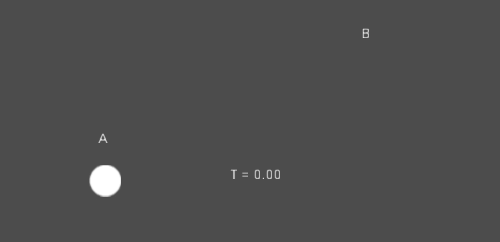
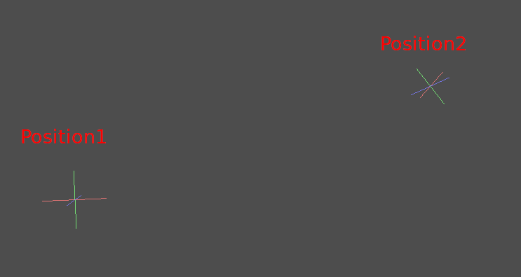
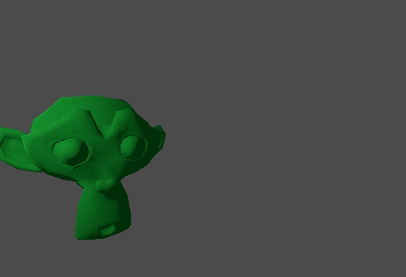

.. _doc_interpolation:

Interpolation
=============

Interpolation is a very basic operation in graphics programming. It's good to become familiar with it in order to expand your horizons as a graphics developer.

The basic idea is that you want to transition from A to B. A value ``t``, represents the states in-between.

For example, if ``t`` is 0, then the state is A. If ``t`` is 1, then the state is B. Anything in-between is an *interpolation*.

Between two real (floating-point) numbers, an interpolation can be described as:

::

    interpolation = A * (1 - t) + B * t

And often simplified to:

::

    interpolation = A + (B - A) * t

The name of this type of interpolation, which transforms a value into another at *constant speed* is *"linear"*. So, when you hear about *Linear Interpolation*, you know they are referring to this formula.

There are other types of interpolations, which will not be covered here. A recommended read afterwards is the :ref:`Bezier <doc_beziers_and_curves>` page.

Vector interpolation
--------------------

Vector types (:ref:`Vector2 <class_Vector2>` and :ref:`Vector3 <class_Vector3>`) can also be interpolated, they come with handy functions to do it
:ref:`Vector2.lerp() <class_Vector2_method_lerp>` and :ref:`Vector3.lerp() <class_Vector3_method_lerp>`.

For cubic interpolation, there are also :ref:`Vector2.cubic_interpolate() <class_Vector2_method_cubic_interpolate>` and :ref:`Vector3.cubic_interpolate() <class_Vector3_method_cubic_interpolate>`, which do a :ref:`Bezier <doc_beziers_and_curves>` style interpolation.

Here is example pseudo-code for going from point A to B using interpolation:

.. tabs::
 .. code-tab:: gdscript GDScript

    var t = 0.0

    func _physics_process(delta):
        t += delta * 0.4

        $Sprite2D.position = $A.position.lerp($B.position, t)

 .. code-tab:: csharp

    private float _t = 0.0f;

    public override void _PhysicsProcess(double delta)
    {
        _t += (float)delta * 0.4f;

        Marker2D a = GetNode<Marker2D>("A");
        Marker2D b = GetNode<Marker2D>("B");
        Sprite2D sprite = GetNode<Sprite2D>("Sprite2D");

        sprite.Position = a.Position.Lerp(b.Position, _t);
    }

It will produce the following motion:

Transform interpolation
-----------------------

It is also possible to interpolate whole transforms (make sure they have either uniform scale or, at least, the same non-uniform scale).
For this, the function :ref:`Transform3D.interpolate_with() <class_Transform3D_method_interpolate_with>` can be used.

Here is an example of transforming a monkey from Position1 to Position2:

Using the following pseudocode:

.. tabs::
 .. code-tab:: gdscript GDScript

    var t = 0.0

    func _physics_process(delta):
        t += delta

        $Monkey.transform = $Position1.transform.interpolate_with($Position2.transform, t)

 .. code-tab:: csharp

    private float _t = 0.0f;

    public override void _PhysicsProcess(double delta)
    {
        _t += (float)delta;

        Marker3D p1 = GetNode<Marker3D>("Position1");
        Marker3D p2 = GetNode<Marker3D>("Position2");
        CSGMesh3D monkey = GetNode<CSGMesh3D>("Monkey");

        monkey.Transform = p1.Transform.InterpolateWith(p2.Transform, _t);
    }

And again, it will produce the following motion:

Smoothing motion
----------------

Interpolation can be used to smooth movement, rotation, etc. Here is an example of a circle following the mouse using smoothed motion:

.. tabs::
 .. code-tab:: gdscript GDScript

    const FOLLOW_SPEED = 4.0

    func _physics_process(delta):
        var mouse_pos = get_local_mouse_position()

        $Sprite2D.position = $Sprite2D.position.lerp(mouse_pos, delta * FOLLOW_SPEED)

 .. code-tab:: csharp

    private const float FollowSpeed = 4.0f;

    public override void _PhysicsProcess(double delta)
    {
        Vector2 mousePos = GetLocalMousePosition();

        Sprite2D sprite = GetNode<Sprite2D>("Sprite2D");

        sprite.Position = sprite.Position.Lerp(mousePos, (float)delta * FollowSpeed);
    }

Here is how it looks:

This useful for smoothing camera movement, allies following you (ensuring they stay within a certain range), and many other common game patterns.
