.. _doc_matrices_and_transforms:

Matrices and transforms
=======================

Introduction
------------

Before reading this tutorial, it is advised to read the previous one
about :ref:`doc_vector_math` as this one is a direct continuation.

This tutorial will be about *transformations* and will cover a little
about matrices (but not in-depth).

Transformations are most of the time applied as translation, rotation
and scale so they will be considered as priority here.

Oriented coordinate system (OCS)
--------------------------------

Imagine we have a spaceship somewhere in space. In Godot this is easy,
just move the ship somewhere and rotate it:

Ok, so in 2D this looks simple, a position and an angle for a rotation.
But remember, we are grown ups here and don't use angles (plus, angles
are not even that useful when working in 3D).

We should realize that at some point, someone *designed* this
spaceship. Be it for 2D in a drawing such as Paint.net, Gimp,
Photoshop, etc. or in 3D through a 3D DCC tool such as Blender, Max,
Maya, etc.

When it was designed, it was not rotated. It was designed in its own
*coordinate system*.

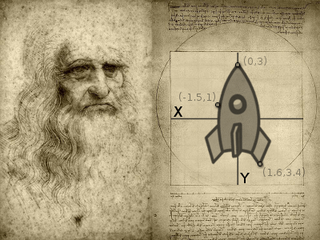

This means that the tip of the ship has a coordinate, the fin has
another, etc. Be it in pixels (2D) or vertices (3D).

So, let's recall again that the ship was somewhere in space:

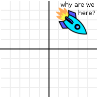

How did it get there? What moved it and rotated it from the place it was
designed to its current position? The answer is... a **transform**, the
ship was *transformed* from their original position to the new one. This
allows the ship to be displayed where it is.

But transform is too generic of a term to describe this process. To solve this
puzzle, we will superimpose the ship's original design position at their
current position:

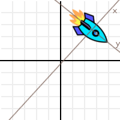

So, we can see that the "design space" has been transformed too. How can
we best represent this transformation? Let's use 3 vectors for this (in
2D), a unit vector pointing towards X positive, a unit vector pointing
towards Y positive and a translation.

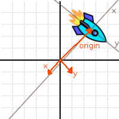

Let's call the 3 vectors "X", "Y" and "Origin", and let's also
superimpose them over the ship so it makes more sense:

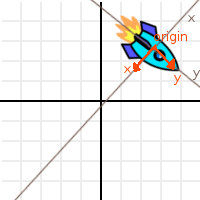

Ok, this is nicer, but it still does not make sense. What do X,Y and
Origin have to do with how the ship got there?

Well, let's take the point from top tip of the ship as reference:

And let's apply the following operation to it (and to all the points in
the ship too, but we'll track the top tip as our reference point):

.. tabs::
 .. code-tab:: gdscript GDScript

    var new_pos = pos - origin

 .. code-tab:: csharp

    var newPosition = pos - origin;

Doing this to the selected point will move it back to the center:

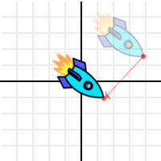

This was expected, but then let's do something more interesting. Use the
dot product of X and the point, and add it to the dot product of Y and
the point:

.. tabs::
 .. code-tab:: gdscript GDScript

    var final_pos = Vector2(x.dot(new_pos), y.dot(new_pos))

 .. code-tab:: csharp

    var finalPosition = new Vector2(x.Dot(newPosition), y.Dot(newPosition));

Then what we have is.. wait a minute, it's the ship in its design
position!

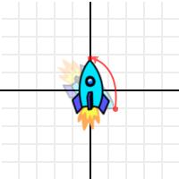

How did this black magic happen? The ship was lost in space, and now
it's back home!

It might seem strange, but it does have plenty of logic. Remember, as
we have seen in the :ref:`doc_vector_math`, what
happened is that the distance to X axis, and the distance to Y axis
were computed. Calculating distance in a direction or plane was one of
the uses for the dot product. This was enough to obtain back the
design coordinates for every point in the ship.

So, what we have been working with so far (with X, Y and Origin) is an
*Oriented Coordinate System*. X an Y are the **Basis**, and *Origin*
is the offset.

Basis
-----

We know what the Origin is. It's where the 0,0 (origin) of the design
coordinate system ended up after being transformed to a new position.
This is why it's called *Origin*, But in practice, it's just an offset
to the new position.

The Basis is more interesting. The basis is the direction of X and Y in the OCS
from the new, transformed location. It tells what has changed, in either 2D or
3D. The Origin (offset) and Basis (direction) communicate "Hey, the original X
and Y axes of your design are *right here*, pointing towards *these
directions*."

So, let's change the representation of the basis. Instead of 2 vectors,
let's use a *matrix*.

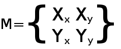

The vectors are up there in the matrix, horizontally. The next problem
now is that.. what is this matrix thing? Well, we'll assume you've never
heard of a matrix.

Transforms in Godot
-------------------

This tutorial will not explain matrix math (and their operations) in
depth, only its practical use. There is plenty of material for that,
which should be a lot simpler to understand after completing this
tutorial. We'll just explain how to use transforms.

Transform2D
~~~~~~~~~~~

:ref:`class_Transform2D` is a 3x2 matrix. It has 3 Vector2 elements and
it's used for 2D. The "X" axis is the element 0, "Y" axis is the element 1 and
"Origin" is element 2. It's not divided in basis/origin for convenience, due to
its simplicity.

.. tabs::
 .. code-tab:: gdscript GDScript

    var m = Transform2D()
    var x = m[0] # 'X'
    var y = m[1] # 'Y'
    var o = m[2] # 'Origin'

 .. code-tab:: csharp

    var m = new Transform2D();
    Vector2 x = m[0]; // 'X'
    Vector2 y = m[1]; // 'Y'
    Vector2 o = m[2]; // 'Origin'

Most operations will be explained with this datatype (Transform2D), but the
same logic applies to 3D.

Identity
~~~~~~~~

An important transform is the "identity" matrix. This means:

-  'X' Points right: Vector2(1,0)
-  'Y' Points up (or down in pixels): Vector2(0,1)
-  'Origin' is the origin Vector2(0,0)

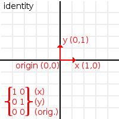

It's easy to guess that an *identity* matrix is just a matrix that
aligns the transform to its parent coordinate system. It's an *OCS*
that hasn't been translated, rotated or scaled.

.. tabs::
 .. code-tab:: gdscript GDScript

    # The Transform2D constructor will default to Identity
    var m = Transform2D()
    print(m)
    # prints: ((1, 0), (0, 1), (0, 0))
    

 .. code-tab:: csharp

    // Due to technical limitations on structs in C# the default
    // constructor will contain zero values for all fields.
    var defaultTransform = new Transform2D();
    GD.Print(defaultTransform);
    // prints: ((0, 0), (0, 0), (0, 0))

    // Instead we can use the Identity property.
    var identityTransform = Transform2D.Identity;
    GD.Print(identityTransform);
    // prints: ((1, 0), (0, 1), (0, 0))

Operations
----------

Rotation
~~~~~~~~

Rotating Transform2D is done by using the "rotated" function:

.. tabs::
 .. code-tab:: gdscript GDScript

    var m = Transform2D()
    m = m.rotated(PI/2) # rotate 90°

 .. code-tab:: csharp

    var m = Transform2D.Identity;
    m = m.Rotated(Mathf.Pi / 2); // rotate 90°

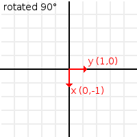

Translation
~~~~~~~~~~~

There are two ways to translate a Transform2D, the first one is moving
the origin:

.. tabs::
 .. code-tab:: gdscript GDScript

    # Move 2 units to the right
    var m = Transform2D()
    m = m.rotated(PI/2) # rotate 90°
    m[2] += Vector2(2,0)

 .. code-tab:: csharp

    // Move 2 units to the right
    var m = Transform2D.Identity;
    m = m.Rotated(Mathf.Pi / 2); // rotate 90°
    m[2] += new Vector2(2, 0);

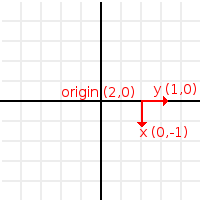

This will always work in global coordinates.

If instead, translation is desired in *local* coordinates of the
matrix (towards where the *basis* is oriented), there is the
:ref:`Transform2D.translated() <class_Transform2D_translated>`
method:

.. tabs::
 .. code-tab:: gdscript GDScript

    # Move 2 units towards where the basis is oriented
    var m = Transform2D()
    m = m.rotated(PI/2) # rotate 90°
    m = m.translated( Vector2(2,0) )

 .. code-tab:: csharp

    // Move 2 units towards where the basis is oriented
    var m = Transform2D.Identity;
    m = m.Rotated(Mathf.Pi / 2); // rotate 90°
    m = m.Translated(new Vector2(2, 0));

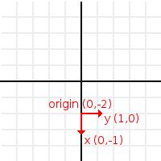

You could also transform the global coordinates to local coordinates manually:

.. tabs::
 .. code-tab:: gdscript GDScript

    var local_pos = m.xform_inv(point)

 .. code-tab:: csharp

    var localPosition = m.XformInv(point);

But even better, there are helper functions for this as you can read in the next sections.

Local to global coordinates and vice versa
~~~~~~~~~~~~~~~~~~~~~~~~~~~~~~~~~~~~~~~~~~

There are helper methods for converting between local and global coordinates.

There are :ref:`Node2D.to_local() <class_Node2D_to_local>` and :ref:`Node2D.to_global() <class_Node2D_to_global>` for 2D
as well as :ref:`Spatial.to_local() <class_Spatial_to_local>` and :ref:`Spatial.to_global() <class_Spatial_to_global>` for 3D.

Scale
~~~~~

A matrix can be scaled too. Scaling will multiply the basis vectors by a
vector (X vector by x component of the scale, Y vector by y component of
the scale). It will leave the origin alone:

.. tabs::
 .. code-tab:: gdscript GDScript

    # Make the basis twice its size.
    var m = Transform2D()
    m = m.scaled( Vector2(2,2) )

 .. code-tab:: csharp

    // Make the basis twice its size.
    var m = Transform2D.Identity;
    m = m.Scaled(new Vector2(2, 2));

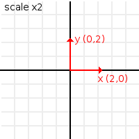

These kind of operations in matrices are accumulative. It means every
one starts relative to the previous one. For those who have been living
on this planet long enough, a good reference of how transform works is
this:

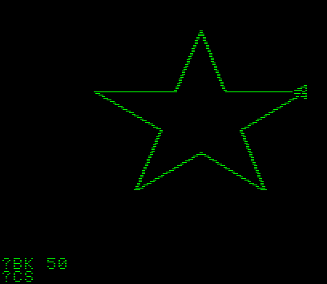

A matrix is used similarly to a turtle. The turtle most likely had a
matrix inside (and you are likely learning this many years *after*
discovering Santa is not real).

Transform
~~~~~~~~~

Transform is the act of switching between coordinate systems. To convert
a position (either 2D or 3D) from "designer" coordinate system to the
OCS, the "xform" method is used.

.. tabs::
 .. code-tab:: gdscript GDScript

    var new_pos = m.xform(pos)

 .. code-tab:: csharp

    var newPosition = m.Xform(position);

And only for basis (no translation):

.. tabs::
 .. code-tab:: gdscript GDScript

    var new_pos = m.basis_xform(pos)

 .. code-tab:: csharp

    var newPosition = m.BasisXform(position);

Inverse transform
~~~~~~~~~~~~~~~~~

To do the opposite operation (what we did up there with the rocket), the
"xform_inv" method is used:

.. tabs::
 .. code-tab:: gdscript GDScript

    var new_pos = m.xform_inv(pos)

 .. code-tab:: csharp

    var newPosition = m.XformInv(position);

Only for Basis:

.. tabs::
 .. code-tab:: gdscript GDScript

    var new_pos = m.basis_xform_inv(pos)

 .. code-tab:: csharp

    var newPosition = m.BasisXformInv(position);

Orthonormal matrices
^^^^^^^^^^^^^^^^^^^^

However, if the matrix has been scaled (vectors are not unit length),
or the basis vectors are not orthogonal (90°), the inverse transform
will not work.

In other words, inverse transform is only valid in *orthonormal*
matrices. For this, these cases an affine inverse must be computed.

The transform, or inverse transform of an identity matrix will return
the position unchanged:

.. tabs::
 .. code-tab:: gdscript GDScript

    # Does nothing, pos is unchanged
    pos = Transform2D().xform(pos)

 .. code-tab:: csharp

    // Does nothing, position is unchanged
    position = Transform2D.Identity.Xform(position);

Affine inverse
~~~~~~~~~~~~~~

The affine inverse is a matrix that does the inverse operation of
another matrix, no matter if the matrix has scale or the axis vectors
are not orthogonal. The affine inverse is calculated with the
affine_inverse() method:

.. tabs::
 .. code-tab:: gdscript GDScript

    var mi = m.affine_inverse()
    pos = m.xform(pos)
    pos = mi.xform(pos)
    # pos is unchanged

 .. code-tab:: csharp

    var mi = m.AffineInverse();
    position = m.Xform(position);
    position = mi.Xform(position);
    // position is unchanged

If the matrix is orthonormal, then:

.. tabs::
 .. code-tab:: gdscript GDScript
 
    # if m is orthonormal, then
    pos = mi.xform(pos)
    # is the same is
    pos = m.xform_inv(pos)

 .. code-tab:: csharp

    // if m is orthonormal, then
    position = mi.Xform(position);
    // is the same is
    position = m.XformInv(position);

Matrix multiplication
~~~~~~~~~~~~~~~~~~~~~

Matrices can be multiplied. Multiplication of two matrices "chains"
(concatenates) their transforms.

However, as per convention, multiplication takes place in reverse
order.

Example:

.. tabs::
 .. code-tab:: gdscript GDScript

    var m = more_transforms * some_transforms

 .. code-tab:: csharp

    var m = moreTransforms * someTransforms;

To make it a little clearer, this:

.. tabs::
 .. code-tab:: gdscript GDScript

    pos = transform1.xform(pos)
    pos = transform2.xform(pos)

 .. code-tab:: csharp

    position = transform1.Xform(position);
    position = transform2.Xform(position);

Is the same as:

.. tabs::
 .. code-tab:: gdscript GDScript

    # note the inverse order
    pos = (transform2 * transform1).xform(pos)

 .. code-tab:: csharp

    // note the inverse order
    position = (transform2 * transform1).Xform(position);

However, this is not the same:

.. tabs::
 .. code-tab:: gdscript GDScript

    # yields a different results
    pos = (transform1 * transform2).xform(pos)

 .. code-tab:: csharp

    // yields a different results
    position = (transform1 * transform2).Xform(position);

Because in matrix math, A * B is not the same as B * A.

Multiplication by inverse
~~~~~~~~~~~~~~~~~~~~~~~~~

Multiplying a matrix by its inverse, results in identity:

.. tabs::
 .. code-tab:: gdscript GDScript

    # No matter what A is, B will be identity
    var B = A.affine_inverse() * A

 .. code-tab:: csharp

    // No matter what A is, B will be identity
    var B = A.AffineInverse() * A;

Multiplication by identity
~~~~~~~~~~~~~~~~~~~~~~~~~~

Multiplying a matrix by identity, will result in the unchanged matrix:

.. tabs::
 .. code-tab:: gdscript GDScript

    # B will be equal to A
    B = A * Transform2D()

 .. code-tab:: csharp

    // B will be equal to A
    var B = A * Transform2D.Identity;

Matrix tips
-----------

When using a transform hierarchy, remember that matrix multiplication is
reversed! To obtain the global transform for a hierarchy, do:

.. tabs::
 .. code-tab:: gdscript GDScript

    var global_xform = parent_matrix * child_matrix

 .. code-tab:: csharp

    var globalTransform = parentMatrix * childMatrix;

For 3 levels:

.. tabs::
 .. code-tab:: gdscript GDScript

    var global_xform = gradparent_matrix * parent_matrix * child_matrix

 .. code-tab:: csharp

    var globalTransform = grandparentMatrix * parentMatrix * childMatrix;

To make a matrix relative to the parent, use the affine inverse (or
regular inverse for orthonormal matrices).

.. tabs::
 .. code-tab:: gdscript GDScript

    # transform B from a global matrix to one local to A
    var B_local_to_A = A.affine_inverse() * B

 .. code-tab:: csharp

    // transform B from a global matrix to one local to A
    var bLocalToA = A.AffineInverse() * B;

Revert it just like the example above:

.. tabs::
 .. code-tab:: gdscript GDScript

    # transform back local B to global B
    B = A * B_local_to_A

 .. code-tab:: csharp

    // transform back local B to global B
    B = A * bLocalToA;

OK, hopefully this should be enough! Let's complete the tutorial by
moving to 3D matrices.

Matrices & transforms in 3D
---------------------------

As mentioned before, for 3D, we deal with 3 :ref:`Vector3 <class_Vector3>`
vectors for the rotation matrix, and an extra one for the origin.

Basis
~~~~~

Godot has a special type for a 3x3 matrix, named :ref:`Basis <class_basis>`.
It can be used to represent a 3D rotation and scale. Sub vectors can be
accessed as:

.. tabs::
 .. code-tab:: gdscript GDScript

    var m = Basis()
    var x = m[0] # Vector3
    var y = m[1] # Vector3
    var z = m[2] # Vector3

 .. code-tab:: csharp

    var m = new Basis();
    Vector3 x = m[0];
    Vector3 y = m[1];
    Vector3 z = m[2];

Or, alternatively as:

.. tabs::
 .. code-tab:: gdscript GDScript

    var m = Basis()
    var x = m.x # Vector3
    var y = m.y # Vector3
    var z = m.z # Vector3

 .. code-tab:: csharp

    var m = new Basis();
    Vector3 x = m.x;
    Vector3 y = m.y;
    Vector3 z = m.z;

The Identity Basis has the following values:

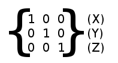

And can be accessed like this:

.. tabs::
 .. code-tab:: gdscript GDScript

    # The Basis constructor will default to Identity
    var m = Basis()
    print(m)
    # prints: ((1, 0, 0), (0, 1, 0), (0, 0, 1))

 .. code-tab:: csharp

    // Due to technical limitations on structs in C# the default
    // constructor will contain zero values for all fields.
    var defaultBasis = new Basis();
    GD.Print(defaultBasis);
    // prints: ((0, 0, 0), (0, 0, 0), (0, 0, 0))

    // Instead we can use the Identity property.
    var identityBasis = Basis.Identity;
    GD.Print(identityBasis);;
    // prints: ((1, 0, 0), (0, 1, 0), (0, 0, 1))

Rotation in 3D
~~~~~~~~~~~~~~

Rotation in 3D is more complex than in 2D (translation and scale are the
same), because rotation is an implicit 2D operation. To rotate in 3D, an
*axis*, must be picked. Rotation, then, happens around this axis.

The axis for the rotation must be a *normal vector*. As in, a vector
that can point to any direction, but length must be one (1.0).

.. tabs::
 .. code-tab:: gdscript GDScript

    #rotate in Y axis
    var m3 = Basis()
    m3 = m3.rotated( Vector3(0,1,0), PI/2 )

 .. code-tab:: csharp

    // rotate in Y axis
    var m3 = Basis.Identity;
    m3 = m3.Rotated(new Vector3(0, 1, 0), Mathf.Pi / 2);

Transform
~~~~~~~~~

To add the final component to the mix, Godot provides the
:ref:`Transform <class_Transform>` type. Transform has two members:

-  *basis* (of type :ref:`Basis <class_Basis>`)
-  *origin* (of type :ref:`Vector3 <class_Vector3>`)

Any 3D transform can be represented with Transform, and the separation
of basis and origin makes it easier to work translation and rotation
separately.

An example:

.. tabs::
 .. code-tab:: gdscript GDScript

    var t = Transform()
    pos = t.xform(pos) # transform 3D position
    pos = t.basis.xform(pos) # (only rotate)
    pos = t.origin + pos # (only translate)

 .. code-tab:: csharp

    var t = new Transform(Basis.Identity, Vector3.Zero);
    position = t.Xform(position); // transform 3D position
    position = t.basis.Xform(position); // (only rotate)
    position = t.origin + position; // (only translate)
