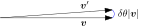
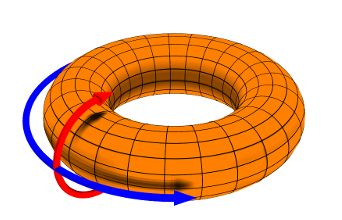

.. _doc_rotations:

Rotations
=========

In the context of 3D transforms, rotations are the nontrivial and complicated part. While it is possible to describe 3D rotations using geometrical drawings and derive the rotation matrices, which is what most people would be more familiar with, it offers a very limited picture, and fails to give any insight on related practical things such quaternions and SLERP. For this reason, this document takes a different approach, a very general (although a little abstract at first) approach which was popularized by its extensive use in local gauge theories in physics.
That being said, the aim of this text is to provide a minimal background to understand 2D and 3D rotations in a general way and shed light on practical things such as gimbal lock, quaternions and SLERP using an accessible language for programmers, and not completeness or mathematical rigor.

A crash course in Lie groups and algebras for programmers
---------------------------------------------------------

Lie groups is a branch of mathematics which deals with rotations in a systematic way. While it is a very extensive subject and most programmers haven't even heard of it, it is very relevant in game development, because it provides a coherent and unified view of 3D rotations.

So let's start with small steps. Suppose that you want to make a really tiny rotation around some axis. For, concreteness let's say around  :math:`z`-axis by an infinitesimal angle :math:`\delta\theta`. For small angles, as illustrated in the figure, the rotation operator can be written as :math:`R_z(\delta\theta) = I + \delta \theta \boldsymbol e_z \times` (neglecting higher order terms :math:`\mathcal O(\delta\theta^2)` ) where :math:`I` is identity operator and :math:`\boldsymbol e_z` is a unit vector along the :math:`z`-axis, such that a vector :math:`\boldsymbol v` becomes

.. math::

	\boldsymbol v' = R_z(\delta\theta) \boldsymbol v = \boldsymbol v + \delta \theta \boldsymbol e_z \times \boldsymbol v.

(If this isn't clear, you can verify this by looking at the figure: :math:`\boldsymbol v` is rotated into :math:`\boldsymbol v'` in the plane (so the rotation axis :math:`\boldsymbol e_z` is pointing out of screen). The overlap of two vectors is :math:`\boldsymbol v \cdot \boldsymbol v' = v^2\cos\delta\theta \approx v^2 + \mathcal O(\delta\theta^2)` since the rotation is just a tiny amount, so the part of :math:`\boldsymbol v'` parallel to :math:`\boldsymbol v` is indeed :math:`\boldsymbol v`. Here, :math:`v = |\boldsymbol v|`. What about the perpendicular part, which must be :math:`\boldsymbol v' - \boldsymbol v`? Using the right-hand rule, the direction is :math:`\boldsymbol e_z \times \boldsymbol v/v`, and to the first order in :math:`\delta\theta`, we can approximate the length of the difference vector by the arc length (blue arc in the figure) which is :math:`\delta \theta v`, so the perpendicular component :math:`\delta \theta \boldsymbol e_z \times \boldsymbol v` also checks out.)

Now, a practical way of representing operators is by using matrices (note that an `operator <https://en.wikipedia.org/wiki/Operator_(mathematics)>`_ is not a matrix, and there are different mathematical objects other than matrices which be used to represent operators, such as quaternions, a point which we will come back to later when we're discussing `representations <https://en.wikipedia.org/wiki/Group_representation>`_ . In terms of real :math:`3 \times 3` matrices, the identity operator :math:`I` simply corresponds to a :math:`3 \times 3` identity matrix, and the cross product :math:`\boldsymbol e_z \times` can be represented as

.. math::

	J_z \cong \boldsymbol e_z \times \equiv \begin{pmatrix}
	0 & -1 & 0 \\
	1 & 0 & 0 \\
	0 & 0 & 0 \\
	\end{pmatrix}

(If you're curious how you can find the matrix representation of an operator :math:`A` in some set of real basis :math:`\{ \boldsymbol e_i\}`: the matrix element on :math:`i` th row :math:`j` th column is given by :math:`\boldsymbol e_i \cdot (A \boldsymbol e_j)`; the basis we use here is :math:`\{ \boldsymbol e_x, \boldsymbol e_y, \boldsymbol e_z \}`) It is no accident that :math:`J_z` rotates a vector in the :math:`xy` plane around the :math:`z`-axis by :math:`\pi/2`; for an arbitrary axis :math:`\boldsymbol n`, the operator :math:`J_n \cong \boldsymbol n \times` is a rotation by :math:`\pi/2` around that axis for vectors in the plane perpendicular to :math:`\boldsymbol n`.

In terms of :math:`J_z`, we can express the infinitesimal rotation operator around the :math:`z`-axis as

.. math::

	R_z(\delta\theta) = I + \delta\theta J_z.

So, how about finite rotations? We simply can apply this infinitesimal rotation operator :math:`N` times to obtain a finite rotation :math:`\theta \equiv N \delta \theta`:

.. math::

	R_z(\theta) = \lim_{N \to \infty} R_z^N(\delta\theta) = \left( I + \frac{\theta}{N} J_z \right)^N = e^{\theta J_z}.

(If you're confused about seeing a matrix as an exponent: the meaning of an operator :math:`A` in `exponential map <https://en.wikipedia.org/wiki/Exponential_map_(Lie_theory)>`_ is given by its series expansion as :math:`e^A = 1 + A + A^2/2! + \ldots` ). This is arguably the most important relation in this write up, and lies at the heart of Lie groups, whose significance will be clarified in a moment. But first, let's take step back and observe the significance of this result: using a very simple picture of an infinitesimal rotation, we derived a general expression for arbitrary rotations around the :math:`z`-axis. In fact, this gets even better. If we repeated the same analysis for rotations around :math:`x`- and :math:`y`-axes, we would have obtained similar results :math:`e^{\theta J_x}` and :math:`e^{\theta J_y}` respectively, where

.. math::

	J_x \cong \boldsymbol e_x \times \equiv \begin{pmatrix}
	0 & 0 & 0 \\
	0 & 0 & -1 \\
	0 & 1 & 0 \\
	\end{pmatrix}, \quad
	J_y \cong \boldsymbol e_y \times \equiv \begin{pmatrix}
	0 & -1 & 0 \\
	1 & 0 & 0 \\
	0 & 0 & 0 \\
	\end{pmatrix}.

Or, if we did a rotation around an arbitrary axis :math:`\boldsymbol n`, the result would have been

.. math::

	R_n(\theta) = \lim_{N \to \infty} \left(I + \frac{\theta}{N}\boldsymbol n \times\right)^N = \lim_{N \to \infty} \left(I + \frac{\theta}{N}\boldsymbol n \cdot \boldsymbol J \right)^N = e^{\theta \boldsymbol n \cdot \boldsymbol J},

where :math:`\boldsymbol J = (J_x, J_y, J_z)`.
Note how the rotation axis :math:`\boldsymbol n` and rotation angle :math:`\theta` plays a central role in the final expression. Axis-angle is *the* parametrization for *all* Lie groups, not just 3D rotations. (We will come back to this point later when we're discussing Euler angle parametrization, which is an unnatural and defective parametrization of rotations in 3D.)

If you ever tried to derive the rotation matrix corresponding to a :math:`\theta` rotation around :math:`\boldsymbol n`, you can appreciate the simplicity and elegance of how we obtained this result. To be fair, we still need to figure out how to actually use an operator sitting on top of an exponent (by summing up the Taylor series), of course, but that's merely a "programmatic" labor and you just need to follow the finite multiplication table of :math:`J_i` operators. But this is much straightforward than trying to draw geometric diagrams and angles and figure out the rotation matrix. For the particular case of the algebra corresponding to rotations in 3D Euclidean space that we've been talking about so far, the exponent can simply be written as

.. math::

	R_n(\theta) = e^{\theta\boldsymbol n \cdot \boldsymbol J} = I + 2 \cos\frac{\theta}{2} \sin\frac{\theta}{2}(\boldsymbol n \cdot \boldsymbol J) + 2 \sin^2\frac{\theta}{2} (\boldsymbol n \cdot \boldsymbol J)^2

which is known as Rodrigues' rotation formula. Note that we only ended up with terms up to second order in :math:`\boldsymbol n \cdot \boldsymbol J` when we summed the series expansion; the reason is higher powers can be reduced to 0th, 1st or 2nd order terms due to the relation :math:`(\boldsymbol n \cdot \boldsymbol J)^3 = -\boldsymbol n \cdot \boldsymbol J`, which makes summing up the series straightforward.

The thing that sits on top of :math:`e`, which is a linear combination :math:`J_i` operators (where :math:`i = x,y,z`), forms an algebra; in fact, it forms a vector space whose basis "vectors" are :math:`J_i`. Furthermore, the algebra is closed under the Lie bracket (which is essentially a commutator: :math:`[a,b] = a b - ba`, and is something like a cross-product in this vector space). In the particular case of 3D rotations, this "multiplication table" is :math:`[J_x, J_y] = J_z` and its cyclic permutations :math:`x\to y, y\to z, z\to x`.

Rotations form what is called a `group <https://en.wikipedia.org/wiki/Group_(mathematics>`_: simply put, it means that if you combine two rotations, you get another rotation. And you can observe it here too: when you put an element of the Lie algebra (which are simply linear combinations of :math:`J_i` ) on top of :math:`e`, you get what is called a Lie group, and the Lie algebra is said to *generate* the Lie group. For example, the operator :math:`J_z \equiv \boldsymbol e_z \times` is said to *generate* the rotations around the :math:`z`-axis. The group of rotations in the 3D Euclidean space is called SO(3).

The order of rotations in 2D don't matter: you can first rotate by :math:`\pi` and rotate by :math:`\pi/2`, or do it in reverse order, and either way, the result is a rotation by :math:`3 \pi/2` in the plane. But the order of rotations in 3D do matter, in general, when different rotation axes are involved (see `this picture <https://i.stack.imgur.com/6vvFi.png>`_ for an example) (rotations around the same axes do commute, of course). When the ordering of group elements don't matter, that group is said to be Abelian, and non-Abelian otherwise. SO(2) is an Abelian group, and SO(3) is a non-Abelian group.

Lie groups and algebras are *not* matrices. You can *represent* both by using object which emulate their "multiplication" rules: this can be real or complex matrices of varying dimensions, or something like quaternions. A single Lie group/algebra have infinitely many different representations in vector spaces in different dimensions (see `these <https://en.wikipedia.org/wiki/Rotation_group_SO(3)#A_note_on_Lie_algebra>`_ for example for SO(3)). Above, we use the 3D real representation of SO(3), which happens to be the fundamental representation, and accidentally coincides with the adjoint representation.

Some mathematical remarks (feel free to skip)
~~~~~~~~~~~~~~~~~~~~~~~~~~~~~~~~~~~~~~~~~~~~~

There are many different Lie groups, corresponding to different symmetries, and they all have different names. For example, the group which contains all rotations in :math:`n`-dimensional Euclidean space is called SO(:math:`n`), and has :math:`n (n-1)/2` linearly independent generators (yes, Lie groups can handle rotations is higher dimensions as-is, and even in non-Euclidean ones). This is called the *rank* of the Lie algebra. You can think of the generators as independent axes of rotations. For 2D, we can only rotate in the :math:`xy` plane meaning we have only 1 generator. For 3D, you can rotate around 3 different planes/axes.

Lie groups have deep connections with symmetries, and have played central role in theoretical physics since around mid 20th century.

For example, if something is symmetric under 3D rotation, that something (in physics, it is typically Lagrangian, which leads to conservation laws through Noether's theorem) remains invariant under SO(3) transformations (we will cover transformations below).

In the context of Lie groups and group theory in general, some common words have specific meanings and a part of the math jargon: representation, generator, group, algebra, parametrization, operator are such words. You don't need to know their precise definitions to understand this write up; just be aware that they are special terms and may not mean what you think they mean. All of these terms a described in this write up in a colloquial language.

Representation of rotations
---------------------------

Representation of rotations is an independent concept from parametrization of rotations. These two concepts are commonly conflated, which leads to the current state of confusion among many programmers. People tend to associate Euler angles parametrization with matrices (or sometimes even vectors!), and axis-angle parametrization with quaternions.

In game engines, rotation operators are represented using either matrices, or quaternions. *As will be clear in what follows, you can use a matrix or a quaternion to represent a rotation parameterized using Euler angles, and same goes for axis-angle parametrization.* Unfortunately, even graphics programming books and documentations of expensive game engines often make a mistake here, and this causes programmers to start comparing Euler angles (a parametrization) to quaternions (a representation) and even discussing their trade-offs, which is "not even wrong".

`Representation <https://en.wikipedia.org/wiki/Group_representation>`_ here refers to a technical term in group theory. So will many other things that will be mentioned in what follows. To gain a basic understand of these concepts, let's first go through simpler and better understood example of rotations in 2D first.

Representation of rotations in 2D
~~~~~~~~~~~~~~~~~~~~~~~~~~~~~~~~~

Since there is only one possible axis of rotation in a two dimensional plane, there is no Euler angle parametrization for them (or if you like, there is only one Euler-angle). Rather, axis-angle parametrization is used, with the axis being fixed to z-axis, which leaves only the angle of rotation :math:`\varphi` as a free parameter.

A point in the 2D Euclidean space can be represented by a pair of 2D real numbers as :math:`\boldsymbol v = (x,y)` (called vector representation), or they can alternatively be represented by a complex number as :math:`v = x + \imath y` where :math:`\imath \equiv \sqrt{-1}` is the unit imaginary number. In the vector representation, we can rotate the point through a rotation matrix (an element of the Lie group SO(2), which can be represented by :math:`2 \times 2` orthogonal matrices with determinant +1) as follows:

.. math::

	R(\theta) =  \begin{pmatrix}
	\cos\theta & -\sin\theta \\
	\sin\theta & \cos\theta
	\end{pmatrix}

So for example, when :math:`\theta=\pi/2`, we get :math:`R(\pi/2) \boldsymbol v = (-y,x)`.

In the complex representation, a rotation is represented by  a unit complex number :math:`e^{\imath\theta} = \cos\theta + \imath \sin\theta`, where we used `Euler's formula <https://en.wikipedia.org/wiki/Euler%27s_formula>`_, is an element of the Lie group U(1), which can be represented by complex numbers of unit norm. Again, for :math:`\theta=\pi/2`, you recover :math:`e^{\imath\pi/2}(x+\imath y) = \imath(x+\imath y) = (-y) + \imath x`.

Rotations in the complex number representation look simpler, but it's only an illusion: the complications of performing a matrix multiplication is absorbed by the introduction of something that lives outside of the realm of real numbers, which follows a rather "odd" algebra: :math:`\imath^2 = -1`. The way complex numbers mimic 2D rotations can be made clearer if we rewrite the rotation matrix in terms of

.. math::

	I_2 \equiv \begin{pmatrix}
	1 & 0 \\
	0 & 1
	\end{pmatrix}, \qquad J_z \equiv \begin{pmatrix}
	0 & -1 \\
	1 & 0
	\end{pmatrix}

as :math:`R(\theta) = I_2 \cos\theta  + J_z \sin\theta`, which can then be compared to :math:`1 x + \imath y` directly. Now we can see the equivalence (the technical term is `isomorphism <https://en.wikipedia.org/wiki/Group_isomorphism>`_ in this context) of the representations clearer through their multiplication table: :math:`I_2 I_2 = I_2, I_2 J_z = J_z, J_z I_2 = J_z, J_z J_z = -I_2` which behaves the same way as :math:`1 \times 1 = 1, 1 \times \imath = \imath, \imath \times 1 = \imath, \imath \times \imath = -1`. Also note that both :math:`\imath` and :math:`J_z` represent a :math:`\pi/2` rotation. And as it should be, :math:`\imath` and :math:`J_z` behave the same under multiplication.

Furthermore, by Taylor series expansion, it is straightforward to show that :math:`R(\theta) = e^{J_z \theta}`.

We have then the following table:

+-------------------+-----------------------------------------------------------------------------------------------------------------------------------------------------+-----------------------------------------------------------------------------------+
| What              | Matrix representation of SO(2)                                                                                                                      | Complex representation of U(1)                                                    |
+===================+=====================================================================================================================================================+===================================================================================+
| Vector            | :math:`(x,y)`                                                                                                                                       | :math:`x+\imath y`                                                                |
+-------------------+-----------------------------------------------------------------------------------------------------------------------------------------------------+-----------------------------------------------------------------------------------+
| Generator         | :math:`J_z \cong \begin{pmatrix} 0 & -1 \\ 1 & 0 \end{pmatrix}`                                                                                     | :math:`J_z \cong \imath`                                                          |
+-------------------+-----------------------------------------------------------------------------------------------------------------------------------------------------+-----------------------------------------------------------------------------------+
| Rotation operator | :math:`e^{J_z \theta} \equiv I_2 \cos\theta + J_z\sin\theta \equiv \begin{pmatrix}\cos\theta & -\sin\theta \\\sin\theta & \cos\theta \end{pmatrix}` | :math:`e^{J_z \theta} \equiv e^{\imath\theta} = 1 \cos\theta + \imath \sin\theta` |
+-------------------+-----------------------------------------------------------------------------------------------------------------------------------------------------+-----------------------------------------------------------------------------------+

Clearly, introduction of the unit imaginary number is enough to capture the behavior of 2D rotation matrices. As a footnote remark, while the number :math:`e^{\imath\theta}` can only represent a rotation matrix, it can't of course represent an arbitrary :math:`2 \times 2` matrix (meaning no scaling, no shearing, etc): after all, U(1) isn't isomorphic to :math:`\text{GL}(2, \mathbb R)`, the group of all (invertible) real :math:`2\times 2` matrices.

The equivalence of these two seemingly different way of representing vectors and rotations in 2D lies in the `isomorphism between the Lie groups SO(2) and U(1) <https://en.wikipedia.org/wiki/Circle_group#Isomorphisms>`_.

Furthermore, in this representation, it is clear that you can do a "smooth" rotation by slowly changing :math:`\theta`, which is the 2D analogue of SLERP (could as well be called Circular Linear Interpolation!). Note that if you linearly interpolate the *elements* of two rotation matrices (that is, linearly interpolating between :math:`R_{ij}` and :math:`R'_{ij}` ), you'll get a weird trajectory with jerky motion; to do SLERP with a matrix, you need to extract the angles from each matrix (which can only happen for matrices whose entries have to form given by :math:`R(\theta)` above; that is, elements of SO(2)), interpolate between the angles linearly, and construct the intermediate matrix using that angle.

The take-aways of this short visit to the more understandable 2D land are:

1. There can be different (but "equivalent", of course) *representations* of rotations: like matrices and complex numbers.
2. Despite the fact that you can use complex numbers to represent vectors and rotations in 2D, the *concept* of rotations in 2D doesn't require an understanding/knowledge of complex numbers or Euler's formula.
3. The introduction of the imaginary :math:`\imath` is not black magic: it's just something that mimics :math:`2 \times 2` matrix :math:`J_z`: :math:`1` and :math:`\imath` behave the same way as :math:`I_2` and :math:`J_z` under multiplication (see the group multiplication table given above).

These are often sources of confusion in 3D: introducing a third dimension means we have new rotation axes (rotations around X and Y axes) giving rise to alternative parametrizations (such as Euler angles), and new generators :math:`J_x` and :math:`J_y`, which will be the generalization of :math:`J_z` above.

Some mathematical remarks (again, feel free to skip)
~~~~~~~~~~~~~~~~~~~~~~~~~~~~~~~~~~~~~~~~~~~~~~~~~~~~
The fact that SO(3) has 3 generators is an accident: SO(:math:`n`) has :math:`n(n-1)/2` generators. Furthermore, the next step (after quaternions, which is `another accident <https://en.wikipedia.org/wiki/Spin_group#Accidental_isomorphisms>`_) of `Cayley-Dickson construction <https://en.wikipedia.org/wiki/Cayley%E2%80%93Dickson_construction>`_ does *not* correspond to a Lie algebra, but rather a non-associative algebra called `octonions <https://en.wikipedia.org/wiki/Octonion>`_. Rather, in arbitrary dimensions, the "complex" representation can be written using the generators of Spin(:math:`n`), which is a double cover of SO(:math:`n`). Also, throughout this page, when we say representation of SO(2), U(1) or any other group, we are talking about the `*fundamental* <https://en.wikipedia.org/wiki/Fundamental_representation>`_ `irreducible representation <https://en.wikipedia.org/wiki/Irreducible_representation>`_, corresponding to a `Young diagram <https://en.wikipedia.org/wiki/Young_tableau>`_ with a single box.

Representation of rotations in 3D
~~~~~~~~~~~~~~~~~~~~~~~~~~~~~~~~~

Let's first review how 3D rotations work using familiar vectors and matrices.

In 2D, we considered vectors lying in the :math:`xy` plane, and the only axis we could can rotate them was the :math:`z`-axis. In 3D, we can perform a rotation around any axis. And this doesn't just mean around :math:`x, y, z` axes, the rotation can also be around an axis which is a linear combination of those, where :math:`\boldsymbol n` is the unit vector (meaning :math:`\boldsymbol n \cdot \boldsymbol n = 1` ) aligned with the axis we want to perform the rotation.

Just like the 2D rotation matrix, the 3D rotation matrix can also be derived with some effort by drawing lots of arrows and angles and some linear algebra, but this would be very opaque and won't give us much insight to what's really going on. A less straightforward, but more rewarding way of deriving this matrix is to understand the rotation group SO(3).

SO(3) is the group of rotations in Euclidean 3D space (for which the `signature <https://en.wikipedia.org/wiki/Metric_signature>`_ is :math:`(+1,+1,+1)`), which preserve the magnitude and handedness of the vectors it acts on. The most typical way to represent its elements is to use :math:`3 \times 3` real orthogonal matrices with determinant :math:`+1`. This :math:`\text{Mat}(3, \mathbb R)` representation is called the fundamental representation of SO(3).

To recap what we discussed earlier, SO(3) has 3 generators, :math:`J_x, J_y, J_z` and we found that they can be represented using these :math:`3\times 3` real matrices:

.. math::

	J_x \cong \boldsymbol e_x \times \equiv \begin{pmatrix}
	0 & 0 & 0 \\
	0 & 0 & -1 \\
	0 & 1 & 0 \\
	\end{pmatrix}, \quad
	J_y \cong \boldsymbol e_y \times \equiv \begin{pmatrix}
	0 & -1 & 0 \\
	1 & 0 & 0 \\
	0 & 0 & 0 \\
	\end{pmatrix}, \quad
	J_z \cong \boldsymbol e_z \times \equiv \begin{pmatrix}
	0 & -1 & 0 \\
	1 & 0 & 0 \\
	0 & 0 & 0 \\
	\end{pmatrix}.

These matrices have the same "multiplication table" as :math:`J_i` (they're isomorphic), so for all practical purposes, you can replace the operators with their matrix representations.

We also found that an element of SO(3), that is, a rotation operator is

.. math::

	R_n(\varphi) = e^{\varphi\boldsymbol n \cdot \boldsymbol J} = I + 2 \cos\frac{\varphi}{2} \sin\frac{\varphi}{2}(\boldsymbol n \cdot \boldsymbol J) + 2 \sin^2\frac{\varphi}{2} (\boldsymbol n \cdot \boldsymbol J)^2

If you want, you can plug-in the matrix representations for :math:`J_i` and derive the complicated :math:`3\times 3` rotation matrix which is

.. math::

	R_n(\varphi) =
	\begin{pmatrix}
	\cos \varphi +n_x^2 \left(1-\cos \varphi\right) & n_x n_y \left(1-\cos \varphi\right) - n_z \sin \varphi & n_x n_z \left(1-\cos \varphi\right) + n_y \sin \varphi \\
	n_y n_x \left(1-\cos \varphi\right) + n_z \sin \varphi & \cos \varphi + n_y^2\left(1-\cos \varphi\right) & n_y n_z \left(1-\cos \varphi\right) - n_x \sin \varphi  \\
	n_z n_x \left(1-\cos \varphi\right) - n_y \sin \varphi & n_z n_y \left(1-\cos \varphi\right) + n_x \sin \varphi & \cos \varphi + n_z^2\left(1-\cos \varphi\right).  \\
	\end{pmatrix}

(Hint: you can use the relation :math:`(\boldsymbol n \cdot \boldsymbol J)^2 = \boldsymbol n \otimes \boldsymbol n-I` to quickly evaluate the last term in the Rodrigues' formula, where :math:`\otimes` is the `Kronecker product <https://en.wikipedia.org/wiki/Kronecker_product>`_ which is also called `outer product <https://en.wikipedia.org/wiki/Outer_product>`_ for vectors. Using the `half-angle formulae <https://en.wikipedia.org/wiki/List_of_trigonometric_identities#Half-angle_formulae>`_ to rewrite :math:`\sin\varphi = 2 \cos\frac{\varphi}{2} \sin\frac{\varphi}{2}`  and :math:`1-\cos\varphi = 2 \sin^2\frac{\varphi}{2}` in Rodrigues' formula, you can use cosine and sine terms as a visual aid when comparing to the matrix form.)

However, we don't really *have to* use matrices to represent SO(3) generators :math:`J_i`. Remember how we used :math:`\imath`, the imaginary unit to emulate :math:`J_z` rather than using a :math:`2 \times 2` matrix? As it turns out we can do something similar here.

`Hamilton <https://en.wikipedia.org/wiki/William_Rowan_Hamilton>`_ is mostly commonly known for the omnipresent `Hamiltonian <https://en.wikipedia.org/wiki/Hamiltonian_mechanics>`_ in physics. One of his less known contributions is essentially an alternative way of representing 3D cross product, which eventually gave in to popularity of usual vector `cross products <https://en.wikipedia.org/wiki/Cross_product#History>`_. He essentially realized that there are three different non-commuting rotations in 3D, and gave a name to the generator for each. He identified the operators :math:`\{\boldsymbol e_x \times, \boldsymbol e_y \times, \boldsymbol e_z \times\}` as the elements of an algebra, naming them as :math:`\{i,j,k\}`.

This may sound trivial at this point, because we're equipped with all the machinery of Lie groups and Lie algebras: apparently, quaternion units :math:`\{i,j,k\}` are just another representation of the SO(3) generators, which satisfy the Lie bracket. Well, no so fast. While the Lie *algebra* :math:`\mathfrak{so}(3)`, whose elements are the linear combination of :math:`J_i`
s are isomorphic to unit quaternions, but quaternions are :math:`1 w + x i + y j + z k` in general, so there's also an identity part, which isn't a vector that is a part of any Lie algebra. Quaternions look more like the *group* SO(3) (when they're normalized, because SO(3) preserves vector norms). But it actually isn't isomorphic to SO(3). It turns out that unit quaternions are isomorphic to the group SU(2) (which is isomorphic to Spin(3)), which in turn is a double cover of SO(3).

SU(2) is essentially the group of unitary rotations with determinant +1 (called Special Unitary groups) which preserve the norm of complex vectors it acts on, generated by `Pauli spin matrices <https://en.wikipedia.org/wiki/Pauli_matrices>`_ :math:`\sigma_i`, and :math:`i,j,k` correspond to :math:`\sigma_x/\imath\ \sigma_y/\imath, \sigma_z/\imath`. To exemplify, :math:`R = e^{\varphi \boldsymbol n \cdot \boldsymbol J} \in \text{SO}(3)` rotates a real vector by :math:`R \boldsymbol v` and the corresponding rotation :math:`U = e^{-\imath\varphi \boldsymbol n \cdot \boldsymbol \sigma/2} \in \text{SU}(2)` rotates the same vector  through :math:`U (\boldsymbol v \cdot \boldsymbol \sigma) U^\dagger`. Note that :math:`U \to -U` achieves the same SO(3) rotation, SU(2) it's said to be a double cover of SO(3) (this is mapping gives the adjoint representation of SU(2) by the way). Here :math:`-\imath\boldsymbol \sigma = -\imath (\sigma_x, \sigma_y, \sigma_z) \cong (i,j,k)`.

SU(2) and SO(3) look the same locally (their tangent spaces dictated by their Lie algebras are isomorphic), but they're different globally. While this sounds like just a technicality, this has topological implications, but we won't get into that much. The take away from this discussion is that unit quaternions *can* be used emulate SO(3) rotations.

But taking a step back, why do we bother *emulating* SO(3) at all? For computational purposes, we already have something that works: the matrix representation. Why do we need to both with a weird group that isn't even exactly the same as SO(3)?

The answer is the cost of computation, and this is two fold. First, you see, a rotation operator has only 3 degrees of freedom: two for the unit vector which is the rotation axis, and one for the rotation angle around that axis. A :math:`3\times 3` matrix, on the other hand has 9 elements. It's an overkill. For example, whenever you multiply two rotations, you need to multiply two :math:`3\times 3` matrices, summing and multiplying every single element. In terms of CPU cycles, this is wasted effort and we can be more optimal. Second part is precision errors. The errors are worse in matrix representation, because originally, we have only 3 degrees of freedom,  which means we can have precision errors in axis and angle (only 3 errors) but it's still an element of SO(3), whereas with matrices, we can have errors in any one of the 9 elements in the matrix and so we can even have a matrix that isn't even an element of SO(3). These errors can quickly build up quickly especially if you're for example modifying the orientation of an object every frame by doing a smooth interpolation between an initial and a target orientation (discussed further in SLERP section).

Sure, we know that elements of SO(3) can be represented by using orthogonal matrices with determinant +1 (hence the name Special Orthogonal) such that :math:`R R^T = I`; in plain language, this means the columns of :math:`R` form an orthonormal set of vectors, so we can eliminate the errors if we perform `Gram-Schmidt <https://en.wikipedia.org/wiki/Gram%E2%80%93Schmidt_process>`_ orthonormalization once in a while, and force it back into SO(3), such that it's an actual rotation matrix (albeit still noisy in axis and angle). But this is expensive and still quite bad in terms of errors.

So, what is the alternative then? Shall we go back to the Rodrigues' formula and hardcode the behavior of :math:`J_i` into our program? A nicer alternative is, we use SU(2) (which we know covers SO(3), twice in fact!), because the equivalent of the Rodrigues' formula is much simpler:

.. math::

	U = e^{-\imath \varphi \boldsymbol n \cdot \boldsymbol \sigma/2} = I \cos\frac{\varphi}{2}  -\imath (\boldsymbol n \cdot \boldsymbol \sigma) \sin\frac{\varphi}{2}

owing to the nice relation :math:`(\boldsymbol n \cdot \boldsymbol \sigma)^2 = I` (something like this happens only at the third power with SO(3) generators, remember? and it doesn't give identity), or if you prefer quaternion version which is more commonly used to represent the isomorphic group Spin(3), this is

.. math::

	U = e^{\varphi \boldsymbol n \cdot (i,j,k)/2} = I \cos\frac{\varphi}{2}  + \boldsymbol n \cdot (i,j,k) \sin\frac{\varphi}{2}.

In game engines, rather than storing the axis-angle :math:`(\boldsymbol n(\phi,\theta), \varphi )` pair where :math:`\phi,\theta` are the azimuthal and polar angles parametrizing the unit vector :math:`\boldsymbol n`, people typically store :math:`\boldsymbol q= (q_0, q_x, q_y, q_z) \equiv (\cos\frac{\varphi}{2}, \sin\frac{\varphi}{2} n_x, \sin\frac{\varphi}{2} n_y, \sin\frac{\varphi}{2} n_z)` such that :math:`U = \boldsymbol q  \cdot (1, i, j, k)`, and enforce the condition :math:`|\boldsymbol q|=1` once in a while by renormalization (note that while you can see many people referring to :math:`\boldsymbol q` as a quaternion, it's not; :math:`U` is the actual quaternion here and :math:`\boldsymbol q` is just an artificial vector containing the coefficients in the expansion of the exponential map). Of course, if they store :math:`(\varphi, \phi, \theta)`, there is no need for a renormalization because such parametrization guarantees the normalization, but this choice would come at the cost of calculating a bunch of sines and cosines whenever you use them, so this is a middle ground in terms of errors and speed.

So, the take aways of this section are:

1. Matrices can represent SO(3) just fine, but are a little too general and extravagant in terms of CPU cycles and behave bad in the presence of floating point errors, and errors can even lead to a matrix that doesn't correspond to a rotation matrix at all!

2. For all practical purposes, we can use an element of SU(2) to represent an SO(3) rotation. It's a double cover of SO(3), so we wouldn't be losing anything in doing so. The main reason for choosing one over another is the SO(3) Rodrigues' formula is a little nasty to work with whereas SU(2) expansion is neat, clean and simple to work with.

3. Using matrices, you can practically do everything you do with quaternions, vice versa. The real differences, as highlighted, are in computation trade-offs, not mathematics.

3. The relationship between quaternions and 3D rotation matrices is the roughly the same as the relation between the complex number :math:`e^{\imath\theta}` and a 2D rotation matrix. Just as the complex number :math:`\imath \cong J_z` rotates by :math:`\pi/2` (which is, as we saw, what a *generator* does), :math:`i,j,k` (which are :math:`\cong J_x, J_y, J_z`) rotate by :math:`\pi/2` around :math:`x, y, z` axes; they don't commute with each other because in 3D, the order of rotations is important. Owing to this isomorphism between their generators, an SO(3) rotation :math:`e^{\varphi \boldsymbol n \cdot \boldsymbol J}` corresponds to the SU(2) rotation :math:`e^{\varphi \boldsymbol n \cdot (i,j,k)/2}`. This is a very helpful picture to gain an intuition on quaternions. While the SO(3) is familiar to many people,  the "Rodrigues' formula" for the SU(2) one is much preferable graphics programming due to it's simplicity, and hence you see quaternions in game engines.

4. This doesn't mean quaternions are a generalization of complex numbers in our construction when considering rotations in a strict sense; they're rather the 3D generalization of the 2D rotation generator in some loose sense (loose, because SO(3) and SU(2) are different groups). There *is* a construction which generalizes real numbers to complex numbers to quaternions, called `Cayley-Dickson construction <https://en.wikipedia.org/wiki/Cayley%E2%80%93Dickson_construction>`_, but it's next steps give off topic objects octonions and sedenions (setting exceptional Lie groups aside for octonions).

5. Note that we haven't said a word about Euler angles. In both matrix and quaternion *representations*, we sticked to the axis-angle *parametrization*. We will discuss different parametrizations in what follows.

+-------------------+------------------------------------------------------------------------------------------------------------------+------------------------------------------------------------------------------------------------+
| What              | Matrix representation of SO(3)                                                                                   | Quaternion representation of SU(2)                                                             |
+===================+==================================================================================================================+================================================================================================+
| Vector            | :math:`(x,y,z)`                                                                                                  | :math:`\sqrt{r}(\cos\frac{\theta}{2}, e^{\imath \phi} \sin\frac{\theta}{2})`                   |
+-------------------+------------------------------------------------------------------------------------------------------------------+------------------------------------------------------------------------------------------------+
| Generator         | Matrices for :math:`J_x, J_y, J_z  \cong \boldsymbol e_x \times, \boldsymbol e_y \times, \boldsymbol e_z \times` | :math:`i,j,k`                                                                                  |
+-------------------+------------------------------------------------------------------------------------------------------------------+------------------------------------------------------------------------------------------------+
| Rotation operator | :math:`e^{\varphi \boldsymbol n \cdot \boldsymbol J}`, can expand with Rodrigues' formula                        | :math:`e^{\varphi \boldsymbol n \cdot (i,j,k)/2}` can expand with SU(2) "Rodrigues' formula"   |
+-------------------+------------------------------------------------------------------------------------------------------------------+------------------------------------------------------------------------------------------------+

Above, :math:`r,\theta,\phi` are spherical coordinates corresponding to :math:`x,y,z`.

A note about the SU(2) vector
~~~~~~~~~~~~~~~~~~~~~~~~~~~~~

We earlier mentioned that rotation of a real vector in SU(2) is done via :math:`(R \boldsymbol v) \cdot \boldsymbol \sigma = U (\boldsymbol v \cdot \boldsymbol \sigma) U^\dagger`, and you may be wondering what the complex vector  listed above :math:`|\psi\rangle = (\cos\frac{\theta}{2}, e^{\imath \phi} \sin\frac{\theta}{2})` has to do with that. The answer is, there vector :math:`|\psi\rangle` is the one a single :math:`U` acts on, and in terms of it, we can rewrite  :math:`U (\boldsymbol v \cdot \boldsymbol \sigma) U^\dagger` as :math:`r U (|\psi\rangle \otimes \langle \psi|) U^\dagger` up to some trivial identity term, where :math:`\langle \psi| = |\psi\rangle^\dagger` (this is the way complex vectors are typically denoted in quantum mechanics and is called `bra-ket notation <https://en.wikipedia.org/wiki/Bra%E2%80%93ket_notation>`_: bra is like the vector and ket is the `conjugate transpose <https://en.wikipedia.org/wiki/Hermitian_adjoint>`_, and people typically omit the :math:`\otimes`  in between because that's already implied when you multiply a ket with a bra, and likewise there is no :math:`\cdot` when you multiply a bra with ket since that's also implied).

So, notational concerns aside, long story short, the vector listed above is in a generalized sense "half" of what we are rotating:

.. math::

	\frac{\boldsymbol v \cdot \boldsymbol \sigma + I |\boldsymbol v|}{2} = r|\psi\rangle \langle \psi| = r\left(\cos\frac{\theta}{2}, e^{\imath \phi} \sin\frac{\theta}{2}\right)  \otimes  \left(\cos\frac{\theta}{2}, e^{\imath \phi} \sin\frac{\theta}{2}\right)^\dagger

and each "half" goes to one of the :math:`U` s on each side of the modified/generalized relation

.. math::

	r = |\psi'\rangle \langle \psi'| = \frac{(R \boldsymbol v) \cdot \boldsymbol \sigma + I |\boldsymbol v|}{2} = r U |\psi\rangle \langle \psi| U^\dagger = U \left(\frac{\boldsymbol v \cdot \boldsymbol \sigma + I |\boldsymbol v|}{2}\right) U^\dagger

so everything is compatible, and :math:`|\psi'\rangle = U |\psi(\boldsymbol v)\rangle = |\psi(R \boldsymbol v)\rangle` is satisfied. This parametrization of an SU(2) vector is typically done in spherical coordinates :math:`\theta,\phi` (for :math:`r=1`, because state vectors are normalized in quantum mechanics), and the sphere is called `Bloch sphere <https://en.wikipedia.org/wiki/Bloch_sphere>`_).

Parametrization of rotations
----------------------------

From general arguments of linear independence, it is clear that a general rotation in 3D requires 3 independent parameters, which is known as `Euler's rotation theorem <https://en.wikipedia.org/wiki/Euler's_rotation_theorem>`_.
It is tempting to think rotations as three-dimensional vectors, but they are rather `linear operators <https://en.wikipedia.org/wiki/Linear_map>`_ that transform vectors.

There are `different ways of parametrizing rotations <https://en.wikipedia.org/wiki/Charts_on_SO(3)#Parametrizations>`_ in the `3D Euclidean space <https://en.wikipedia.org/wiki/Euclidean_space>`_ using 3 parameters, and we will go through the two commonly used in game programming.

Axis-angle parametrization: :math:`(\phi, \theta, \varphi)`
~~~~~~~~~~~~~~~~~~~~~~~~~~~~~~~~~~~~~~~~~~~~~~~~~~~~~~~~~~~

As we found out, this is the *de facto* parametrization of rotations in 3D (or in fact, in any dimensions), which is also the direct generalization of rotations in 2D, is this:
choose an axis in 3D space (a unit vector to specify a direction, which has two independent parameters, because its length is conventionally fixed to 1) and is typically parametrized using `polar and  azimuthal angles <https://en.wikipedia.org/wiki/Spherical_coordinate_system>`_ as :math:`\boldsymbol n(\phi,\theta) = (\sin\theta \cos\phi, \sin\theta \sin\phi,\cos\theta)` and specify the angle of rotation around that axis :math:`\varphi` (which is the third parameter) whose sense of rotation is fixed by the `right-hand rule <https://en.wikipedia.org/wiki/Right-hand_rule>`_ (for a right-hand coordinate system).
For (embedded) 2D rotations in the :math:`xy`-plane, the rotation axis is taken to be the z-axis, and we only need to specify the rotation angle.
In 3D, the rotation axis can be pointing toward any direction (since the axis is a unit vector, you can think of it as a point on the unit sphere, if you like).
This way of parametrizing rotations is called axis-angle parametrization, and is the easiest to picture intuitively.

Another advantage of the axis angle parametrization is, it is very easy to interpolate between two different rotations (let's call their parameters :math:`\boldsymbol n_1, \varphi_1` and :math:`\boldsymbol n_2, \varphi_2`), which is useful when you're changing the orientation of an object, starting from a given initial orientation and going toward a final one. A nice way of doing this is described in a later section where we describe SLERP. It results in a smooth motion, rather than a "jerky" motion which may start fast, go slow in the middle and go fast again etc. It turns out that if a mass is transported this way, it experiences the least amount of torque (compared to other possible trajectories). This way of linearly interpolating rotations in the axis-angle parametrization is called Spherical Linear Interpolation or SLERP, and is almost ubiquitously used in games.

Euler angles (and Tait-Bryan angles): :math:`(\varphi_1, \varphi_2, \varphi_3 )`
~~~~~~~~~~~~~~~~~~~~~~~~~~~~~~~~~~~~~~~~~~~~~~~~~~~~~~~~~~~~~~~~~~~~~~~~~~~~~~~~

Another way of parametrizing 3D rotations is by considering a sequence of at least 3 rotations around certain, fixed axes.
This could be, for example "rotate around the :math:`Z`-axis by :math:`\varphi_1`, then rotate around the :math:`Y`-axis by :math:`\varphi_2`, and finally rotate around the :math:`x`-axis by :math:`\varphi_3`". Of course, these axes don't have to be Z, then Y, then X.
As long as two sequential rotations are not around the same axis (in which case they would combine into a single rotation, hence reducing the number of actually independent parameters by 1), they can be anything.
They don't even need to be aligned with any "named" axis. Another thing important think to watch out is, if you imagine that there is a local coordinate system "painted" on the object, as you go through the
3-step rotation sequence, that local frame rotates with the object itself, while the global frame of course remains as-is. The rotation angles specified with respect to a global, fixed reference frame are sometimes called Tait-Bryan angles. So when we're specifying a general rotation in terms of 3 rotations around certain "fixed" axes, you need to specify whether those axes refer to the global (called extrinsic, usually written with an additional prime, :math:`X'` rather than :math:`X`,  after each rotation ) or the local (called intrinsic) frame as well. Typically, extrinsic is used as it is relatively easier to picture, and axes are chosen to coincide with X,Y or Z.
The 3 rotation angles used in such representation of rotations is called Euler angles.

Ancient mechanical devices called gimbal (which are long obsolete in this age) used to calculate realize 3D rotations in engineering applications in vehicles increased the popularity of Euler angles.
Furthermore, since the :math:`3 \times 3` rotation matrix around X,Y or Z axis is easier to write down, it is commonly said that Euler angles are easier to understand when compared to axis-angle representation (which is commonly, although not necessarily, implemented through quaternions).
While this may be true if you're creating a linear algebra library from scratch, or filling in the elements of the transformation matrix on your own, this is not the case when writing games with game engines, such as Godot.
The popularity of Euler angles endured despite the fact that they, in fact, can not represent a smooth transition between two different rotations by a smooth variation of the three angles.
The reason behind this lies in the fact that Euler angles describe a chart on 3-torus, which is not a `covering map <https://en.wikipedia.org/wiki/Covering_space>`_ of SO(3), three dimensional rotations (if this sounds too abstract, see the subsection about 3-torus and sphere below). As the mapping from Euler angles to SO(3) is ill-defined at certain points, during the smooth interpolation between two rotations, we may bump into such points, and as a result the rank may drop to 2 or even 1 (which mechanically corresponds to a situation in which two or three gimbals become aligned as they go around), which is known as the `gimbal-lock <https://en.wikipedia.org/wiki/Gimbal_lock>`_ problem.
Thus, while it's OK to use Euler angles to represent a fixed rotation, they're not suitable for slowly changing the orientation of objects. You can still do that if you put some additional effort to avoid gimbal-lock, of course, but even if by some luck you don't bump into such bad points, a linear interpolation between two sets of Euler angles is going to result in a "jerky" motion.

All in all, despite being an ill-defined parametrization for rotations, Euler angles enjoyed a popularity due to gimbals.

While Euler angles may not be too useful when calculating the rotation operator (be it a matrix or a quaternion) in body dynamics, people still find them useful to think about and describe the *orientation* of 3D objects starting from the initial default *"unrotated"* state (it's very difficult to calculate the 3 Euler angles for driving an object from a non-trivial initial orientation to a non-trivial final orientation ---it can't be calculated intuitively in general, it is a task for computers). For this reason, Godot's property editor uses Euler angles (in extrinsic YXZ convention; if the node has a parent node, the YXZ axes refer to the local axes of the parent) for the rotation property of a Transform --this is pretty much the only place Euler angles are used in Godot.

So the answer to the question "should I use Euler angles or axis-angle parametrization in my game" is: unless you're trying to *statically* orient an object in a particular way starting from an *unrotated, default orientation* (for which you can still use axis-angle parametrization in your script, if you prefer), you shouldn't be using Euler angles. Major reasons are:

1. Jerky interpolations. You can't interpolate two orientations smoothly (torque-free) in a way that is reference independent (which doesn't depend on how you choose the 3 fixed rotation axes).
2. Gimbal lock. Rotation dynamics (which includes interpolations) can get worse than jerky, you can get stuck in a weird coordinate singularity (the kind which doesn't exist in axis-angle parametrization) and never reach your target.

A note about surface of 3-torus and sphere, and Gimbal lock
~~~~~~~~~~~~~~~~~~~~~~~~~~~~~~~~~~~~~~~~~~~~~~~~~~~~~~~~~~~

What is a 3-torus, to begin with? The surface of a donut is a 2-torus, referring to the fact that the surface itself is two-dimensional (although curved), which is easy to visualize. However, it's difficult to visualize a torus in higher dimensions. But as it turns out, there is another way of thinking about torus, which generalizes to higher dimensions.

Imagine an ant walking on the surface of a donut illustrated below (image borrowed from `here <https://en.wikipedia.org/wiki/Torus#/media/File:Toroidal_coord.png>`_).

If it keeps walking along either the red or the blue lines, it will eventually come back to where it started. At any time, we can use two angles to describe where the ant is: one angle (:math:`\theta` which goes between :math:`0` and :math:`2\pi`) describing it's position along the red line, and another one (:math:`\phi`, again between :math:`0` and :math:`2\pi`) for the blue line. And note that we have periodicity: :math:`(\theta,\phi)`  and :math:`(\theta + 2\pi N,\phi + 2\pi N)`  describe exactly the same point on the donut for an integer :math:`N`. We have two angles, of course, because we're talking about a two-dimensional surface. Now we're ready to talk about :math:`n`-dimensional surfaces.

If you have a set of :math:`n` "coordinates" (or angles) which are periodic, just like :math:`\theta` and :math:`\phi` were (which is the case for the three Euler angles), then people say those coordinates describe a point on the surface of an :math:`n`-torus. (In the case that the period of a "coordinate" is different than :math:`2\pi`, that coordinate can be scaled to make it so, such that it corresponds to an :math:`n`-torus).

Now, back to our original issue. The axis of the axis-angle parametrization (which is *the* natural way of parametrizing rotations, and is a one-to-one covering map of SO(3); in fact, this is true for all Lie groups, not just rotations in 3D) spans a sphere (every point in a ball of radius :math:`\pi` corresponds to a rotation in SO(3) where the rotation amount is mapped to radius and rotation axis points is the direction from the origin; with the additional caveat that if you flip the sign of the axis and angle simultaneously, it maps to the same rotation), which is described using spherical coordinates, whereas Euler angles span the surface of a 3-torus (such that every point on the 3-torus corresponds to a rotation), which is described by the three Euler angles.
The problem here is, a sphere is topologically different from a torus.
In simple terms, this means that it's impossible to deform a sphere to a torus "smoothly": at some point, you have to punch a hole in it to make a donut from a ball (and you can never "punch a hole" or change the topology when you stick with a parametrization: if you use Euler angles, you're forever stuck walking the surface of a 3-donut, and if you use axis-angle, you're forever stuck flying inside the sphere).

Why is this a problem at all?
Because it means that a smooth walk (flight?) inside the sphere doesn't always correspond to a smooth walk on the surface of the 3-torus, vice versa: a 3-torus and sphere are globally different, which is a fact you're bound to discover if you walk the parameter space by a smoothly rotating a body using these parametrizations.
Axis-angle parametrization has singularities at the poles (where the azimuthal angle is ill-defined) but that's fine because that's exactly how SO(3) is, after all, axis-angle is how Lie groups are parametrized. Euler angle parametrization also has singularities corresponding to points where two gimbals are aligned, but those singularities are different from SO(3)'s poles.

Suppose that you're at a nice spot, a rotation that can be parametrized by both axis-angle and Euler angles uniquely. Sometimes, it can just happen that if you take a wrong step, you'll fall into a "hole" (meaning a singularity at which infinitely many parameters correspond to the same rotation, like at the poles, all choices for the azimuthal angle give the same rotation, or the similar situation with gimbal lock) in one parametrization, while you can continue a smooth journey in the other parametrization. When you fall a "hole" using Euler angles, it's called gimbal lock, and since there may not be a corresponding "hole" when you take the similar step in the sphere, this tells us that Euler angles is a defective parametrization of SO(3).

The root of the problem isn't just the fact that Euler angle parametrization has singularties, just as axis-angle does which is fine on its own, but that those singularities don't match with SO(3)'s singularities.

This is the mathematical description of the gimbal-lock problem.

Here's an example of gimbal lock in Euler angle parametrization. Suppose that one of the rotations is :math:`\pi/2`, let's say the middle one. By inserting an identity operator :math:`X(-\pi/2) X(\pi/2)` to the right side and rearranging terms, we can show that

.. math::

    R = Y(\varphi_y) X(\pi/2) Z (\varphi_z) = Y(\varphi_y) [X(\pi/2) Z (\varphi_z) X(-\pi/2)] X(\pi/2) = Y(\varphi_y) Y(-\varphi_z) X(\pi/2) = Y(\varphi_y-\varphi_z) X(\pi/2),

(see the section about active transformation below about how a rotation matrix itself transforms, which also explains why and how a Z rotation turns into a Y rotation when surrounded by :math:`\pi/2` and :math:`-\pi/2` X rotations) which means we lost a degree of freedom: :math:`\varphi_y-\varphi_z` effectively became a single parameter determining the Y rotation and we completely lost the first Z rotation. You can follow similar steps to show that when *any* of the YXZ Euler angles become :math:`\pm \pi/2`, you get a gimbal lock.

This happens for :math:`\pm \pi/2` simply because in the YXZ convention, neighboring axes are related to each other by a :math:`\pm \pi/2` rotation around the axis given by the other neighbor. For XZX convention, the gimbal lock would happen at :math:`\varphi_z = \pm \pi` for example.

Summary: representation versus parametrization
~~~~~~~~~~~~~~~~~~~~~~~~~~~~~~~~~~~~~~~~~~~~~~

We can sum it up in a table:

+-------------------------------+----------------------------------------------------------------+-----------------------------------------------------------------+
|Parametrization/Representation | Matrix representation of SO(3)                                 | Quaternion representation of SU(2)                              |
+===============================+================================================================+=================================================================+
|Axis-angle                     | :math:`e^{\varphi \boldsymbol v \cdot \boldsymbol J}`          | :math:`e^{\varphi \boldsymbol v \cdot (i,j,k)/2}`               |
+-------------------------------+----------------------------------------------------------------+-----------------------------------------------------------------+
|Euler-angles                   | :math:`e^{\varphi_3 J_y} e^{\varphi_2 J_x} e^{\varphi_1 J_z}`  | :math:`e^{\varphi_3 j/2} e^{\varphi_2 i/2} e^{\varphi_1 k/2}`   |
+-------------------------------+----------------------------------------------------------------+-----------------------------------------------------------------+

where :math:`\boldsymbol J`  denotes the matrix representation of the :math:`\boldsymbol J` operators (too lazy to introduce a new symbol for that). YXZ Euler angles is chosen for concreteness (as it is the default convention in Godot), and can be replaced by any three axes (as long as two neighboring axes aren't the same).

In all cases listed in the above table, Rodrigues' formula (or it's analogue for quaternions) given above can be used for practical purposes.

In the context of 3D rotations, one representation isn't superior or inferior to another. Whatever representation you're using, you are representing exactly the same thing. A difference appears only when you implement it on a computer: different representations have trade offs when it comes to precision errors, CPU cycles and memory usage (for example, accessing to rotation axis-angle with quaternions is trivial but requires some algebra in matrix representation whereas the converse is true when accessing the basis vectors, SLERP, composition of rotations and orthonormalization is faster with quaternions but a conversion to matrix representation, which isn't free, is always required because that's the representation OpenGL uses and rotating a 3D vector is faster in matrix representation since they are written in the same basis), and they may have different characteristics when doing finite precision arithmetic with floating point numbers. In principle, you can do everything you do with quaternions using matrices, vice versa. The performance could be bad in one representation, but the point is, there is nothing in their mathematics that prevent you from doing that.

Parametrizations, on the other hand, are vastly different. Axis-angle is the "one true" parametrization of rotations. Euler angles, despite being a defective parametrization of rotations, could be more intuitive for simple (involving only 1 or 2 angles)  and *static* situations like orienting a body/vehicle in the editor, but should be avoided for rotational *dynamics* which would eventually lead to a gimbal lock.

Interpolating rotations
-----------------------

In games, it's common problem to interpolate between two different orientation in a "nice way" which doesn't depend on arbitrary things like how the reference frame, and which doesn't result in a "jerky" motion (that is, a torque-free motion) such that the angular speed remains constant during the interpolation. These are the properties that we seek when we say "nice".

Formally, we'd like to interpolate between an initial rotation :math:`R_1 = e^{\lambda \varphi_1 \boldsymbol n_1 \cdot \boldsymbol J }` and a final one :math:`R_2 = e^{\varphi_2 \boldsymbol n \cdot \boldsymbol J }` a function of time, and what we're seeking is something that transforms one into another smoothly, :math:`R(\lambda)`, where :math:`\lambda` is the normalized time which is 0 at the beginning and 1 at the end. Clearly, we must have :math:`R(\lambda=0)=R_1` and :math:`R(\lambda=1) = R_2`. Since we also know that rotations form a group, we can relate :math:`R(\lambda)` to :math:`R_1` and :math:`R_2` using another rotation, such that we can for example write

.. math::

	R(\lambda) = e^{\lambda \varphi \boldsymbol n \cdot \boldsymbol J } R_1.

This form makes sense because for :math:`\lambda=0`, the interpolation hasn't started and :math:`R(\lambda)` automatically becomes :math:`R_1`. But why not pick a different form for the exponent as a function of :math:`\lambda` which evaluates to 0 when :math:`\lambda=0`? That's simply because we don't want to have a jerky motion, meaning :math:`\boldsymbol \omega \cdot \boldsymbol J =  R^T(\lambda) \dot R(\lambda)`, where :math:`\boldsymbol \omega` is the angular velocity vector, has to be a constant, which can only happen if the time derivative of the exponent is linear in time (in which case we obtain :math:`\boldsymbol \omega = \varphi \boldsymbol n`). Or equivalently, you can simply observe that a rotation around a fixed axis (fixed because otherwise if you tilt the rotation axis in time, you'll again get a "jerky motion" due to `Euler force <https://en.wikipedia.org/wiki/Euler_force>`_) with constant angular speed is :math:`e^{\boldsymbol \omega t \cdot \boldsymbol J }` where the exponent is linear in time.

But how do we choose :math:`\boldsymbol n` and :math:`\varphi`? Well, we simply enforce that :math:`R(\lambda)`  has to becomes :math:`R_2` at the end, when :math:`\lambda=1`. Although this looks like a very difficult problem, it's actually not. We first make a rearrangement:

.. math::

	R(\lambda) = e^{\lambda \varphi \boldsymbol n \cdot \boldsymbol J } R_1 = (e^{\varphi \varphi \boldsymbol n \cdot \boldsymbol J })^\lambda R_1.

From this expression, it becomes evident evident that the solution is :math:`e^{\varphi \boldsymbol n \cdot \boldsymbol J } = R_2 R_1^T`.

We can also do the same thing in SU(2) and obtain:

.. math::

	U(\lambda) = (U_2 U_1^\dagger)^\lambda U_1,

or isomorphically, in terms of quaternions:

.. math::

	q(\lambda) = (q_2 q_1^{-1})^\lambda q_1.

For any Lie group, including SO(3) and SU(2), this "nice" interpolation is called SLERP.

Note that at no step we made any reference to axes of some fixed reference frame (as it is in the case of Euler angle parametrization, which are defined with respect to certain "special" 3 axes), everything we did is independent of the reference frame. Also note that this scheme can work for any Lie group, and is independent of the representation used (matrix, quaternion, ...).

After some tedious algebra (which involves using :math:`\text{tr}(\sigma_i \sigma_j) = 2 \delta_{ij}`), this result can be simplified to

.. math::

	q(\lambda) = \frac{\sin([1-\lambda]\Omega)q_1 + \sin(\Omega \lambda) q_2}{\sin\Omega}

when :math:`q_1 \neq \pm q_2`, where we introduced :math:`\cos\Omega \equiv \cos\frac{\varphi_1}{2}\cos\frac{\varphi_2}{2} + \sin\frac{\varphi_1}{2}\sin\frac{\varphi_2}{2} \boldsymbol n_1 \cdot \boldsymbol n_2` (or equivalently, in terms of an artificial vector which contains the coefficients of the quaternions, as we discussed above, :math:`\boldsymbol q_1 \cdot \boldsymbol q_2`). This result has a very simple geometric interpretation when a (unit) quaternion is taken to be a point on the 3-sphere and when one introduces an inner product of the 4D Euclidean space, but we'll skip that because it's a bit off topic in our treatment. We'll however note that this is where the name *Spherical* Linear intERpolation comes from, which refers to the 4D sphere.

Reference frames: global, parent-local, object-local
----------------------------------------------------

A reference frame essentially how and where how place the origin and axes of your coordinate system. In Godot, there are three different reference frames. The first is the global reference frame. It exist as the "anchor" frame, where all other frames can be defined with respect to. The other types of reference frames appear when you have objects which have children objects. Here's an example which illustrates these frames.

Consider a ship in the ocean. You can imagine, however that there's a coordinate system painted on the ground somewhere in the ship. This coordinate system moves and rotates with the ship, so it's called ship's local frame. Furthermore, we can attach a reference frame to passengers on the ship (for example, let's say, for each passenger, their left is their :math:`x`-axis and their forward is their :math:`z` axis, and their origin is where they stand).

The global coordinate system corresponds to a coordinate system world painted somewhere on the ground in the world (let's say we live in a flat world for simplicity). Then every object, including the ship and the passengers have their own reference frames, they're called object-local frames. But notice that for passengers, the most natural frame would be where they are located (and how they're oriented) relative to the ship. After all, when someone asks "Where's Joe?", you'd reply with something like "I saw him in the front deck" rather than trying to look up GPS coordinates (global frame) or saying something like "7 meters to my five o'clock" (passenger/object-local). The ship is referred to as the parent-local frame.

In Godot, Basis matrices refer to the parent-local frame. If the object is top level, then it's Basis is written in the global frame.

Active and passive transformations
----------------------------------

While operators (such as :math:`e^{\varphi \boldsymbol n \cdot \boldsymbol J}` ) and vectors :math:`\boldsymbol v` are "out there" and are independent of the reference frame, their coordinates aren't. For example, a vector can be aligned with the :math:`x`-axis in some frame  whereas in can be aligned with :math:`y`-axis in another, if you choose to draw your coordinate system differently. But the vector doesn't know about your arbitrary choice of how and where you draw your coordinate system. When we have multiple reference frames, it's important how the coordinates would transform between them.

For example, if you know that the coordinates of a vector :math:`\boldsymbol v` are given as :math:`v_x, v_y, v_z` in some reference frame, you can obtain the coordinates in a different frame which is rotated which respect to the first one around some :math:`\boldsymbol n` axis by :math:`-\varphi` as

.. math::

	\begin{pmatrix} v_x' \\ v_y' \\ v_z' \end{pmatrix} = R_n(\varphi) \begin{pmatrix} v_x \\ v_y \\ v_z \end{pmatrix},

where primed coordinates correspond to coordinates in the rotated *frame*.
You can also transform the matrix representations of operators. For example, :math:`M_{ij} = \boldsymbol e_i \cdot M  \boldsymbol e_j` but what is the rotation matrix if we used the basis vectors of a different frame :math:`\{\boldsymbol e_i'\}`? To obtain the matrix representation of :math:`M` in the new frame, you can do

.. math::

	M' = R_n(\varphi) M R_n^T(\varphi).

These are called passive transformations.

Now let's consider actually moving those objects (we consider only one reference frame and it's fixed). We rotate a vector around some :math:`\boldsymbol n` axis by :math:`\varphi`

.. math::

	\begin{pmatrix} v_x' \\ v_y' \\ v_z' \end{pmatrix} = R_n(\varphi) \begin{pmatrix} v_x \\ v_y \\ v_z \end{pmatrix},

where primed coordinates are the coordinates of the rotated *vector*, in the same reference frame.
Similarly, for matrices

.. math::

	M' = R_n(\varphi) M R_n^T(\varphi).

These are called active transformations.

Note how things fit nicely, for example, when you consider how a rotated vector :math:`R_0 \boldsymbol v_0` transforms:

.. math::

	R_n(\varphi) [R_0 \boldsymbol v_0] = [R_n(\varphi)  (R_0) R_n(\varphi)^T] [R_n(\varphi) \boldsymbol v_0]

The left hand side is rotation of the vector :math:`(R_0 \boldsymbol v_0)` and the right hand side is the rotation of the vector :math:`v_0` and the matrix :math:`R_0` that acts on it, which of course agree.

The rotation operator itself rotates in a very expected way (you can use Rodrigues' formula along with the equation above, if you prefer):

.. math::

    R_n(\varphi) (e^{\varphi_0 \boldsymbol n_0 \cdot \boldsymbol J}) R_n(\varphi)^T = e^{\varphi_0 [R_n(\varphi)\boldsymbol n_0] \cdot \boldsymbol J}

For example, if we have a rotation around the :math:`z`-axis by :math:`\varphi_0 = \varphi_z` and we would like to rotate it around the :math:`x`-axis by :math:`\varphi = \pi/2`, we'd have

.. math::

    R_x(\pi/2) (e^{\varphi_z \boldsymbol n_z \cdot \boldsymbol J}) R_x(\pi/2)^T = e^{\varphi_z [R_x(\pi/2)\boldsymbol e_z] \cdot \boldsymbol J} = e^{\varphi_z [-\boldsymbol e_y] \cdot \boldsymbol J},

that is, the original rotation axis :math:`\boldsymbol n_0 = \boldsymbol e_z` gets rotated around the :math:`x`-axis by :math:`\varphi = \pi/2` and becomes a rotation around the :math:`y`-axis by :math:`-\varphi_z`.
