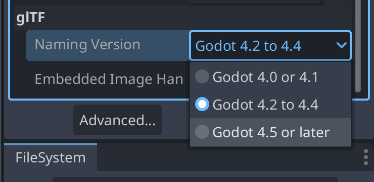

.. _doc_upgrading_to_godot_4.5:

Upgrading from Godot 4.4 to Godot 4.5
=====================================

For most games and apps made with 4.4 it should be relatively safe to migrate to 4.5.
This page intends to cover everything you need to pay attention to when migrating
your project.

Breaking changes
----------------

If you are migrating from 4.4 to 4.5, the breaking changes listed here might
affect you. Changes are grouped by areas/systems.

.. warning::

    In order to support `new Google Play requirements`_ Android now requires
    targeting .NET 9 when exporting C# projects to Android, other platforms
    continue to use .NET 8 as the minimum required version but newer versions
    are supported and encouraged.

    If you are using C# in your project and want to export to Android, you will
    need to upgrade your project to .NET 9 (see `Upgrading to a new .NET version`_
    for instructions).

This article indicates whether each breaking change affects GDScript and whether
the C# breaking change is *binary compatible* or *source compatible*:

- **Binary compatible** - Existing binaries will load and execute successfully without
  recompilation, and the run-time behavior won't change.
- **Source compatible** - Source code will compile successfully without changes when
  upgrading Godot.

Core
~~~~

========================================================================================================================  ===================  ====================  ====================  ============
Change                                                                                                                    GDScript Compatible  C# Binary Compatible  C# Source Compatible  Introduced
========================================================================================================================  ===================  ====================  ====================  ============
**JSONRPC**
Method ``set_scope`` replaced by ``set_method``                                                                           |❌|                 |❌ with stub|        |❌ with stub|        `GH-104890`_
**Node**
Method ``get_rpc_config`` renamed to ``get_node_rpc_config``                                                              |❌|                 |✔️ with compat|      |✔️ with compat|      `GH-106848`_
Method ``set_name`` changes ``name`` parameter type from ``String`` to ``StringName``                                     |✔️|                 |✔️ with compat|      |✔️ with compat|      `GH-76560`_
========================================================================================================================  ===================  ====================  ====================  ============

Rendering
~~~~~~~~~

========================================================================================================================  ===================  ====================  ====================  ============
Change                                                                                                                    GDScript Compatible  C# Binary Compatible  C# Source Compatible  Introduced
========================================================================================================================  ===================  ====================  ====================  ============
**DisplayServer**
Method ``file_dialog_show`` adds a new ``parent_window_id`` optional parameter                                            |✔️|                 |✔️ with compat|      |✔️ with compat|      `GH-98194`_
Method ``file_dialog_with_options_show`` adds a new ``parent_window_id`` optional parameter                               |✔️|                 |✔️ with compat|      |✔️ with compat|      `GH-98194`_
**RenderingDevice**
Method ``texture_create_from_extension`` adds a new ``mipmaps`` optional parameter                                        |✔️|                 |✔️ with compat|      |✔️ with compat|      `GH-105570`_
**RenderingServer**
Method ``instance_reset_physics_interpolation`` removed                                                                   |❌|                 |✔️ with compat|      |✔️ with compat|      `GH-104269`_
Method ``instance_set_interpolated`` removed                                                                              |❌|                 |✔️ with compat|      |✔️ with compat|      `GH-104269`_
========================================================================================================================  ===================  ====================  ====================  ============

.. note::

    In C#, the enum ``RenderingDevice.Features`` breaks compatibility because of the way the bindings generator
    detects the enum prefix. New members were added to the enum in `GH-103941`_ that caused the enum member
    ``Address`` to be renamed to ``BufferDeviceAddress``.

GLTF
~~~~

========================================================================================================================  ===================  ====================  ====================  ============
Change                                                                                                                    GDScript Compatible  C# Binary Compatible  C# Source Compatible  Introduced
========================================================================================================================  ===================  ====================  ====================  ============
**GLTFAccessor**
Property ``byte_offset`` changes type metadata from ``int32`` to ``int64``                                                |✔️|                 |❌|                  |❌|                  `GH-106220`_
Property ``component_type`` changes type from ``int`` to ``GLTFAccessor::GLTFComponentType``                              |✔️|                 |❌|                  |❌|                  `GH-106220`_
Property ``count`` changes type metadata from ``int32`` to ``int64``                                                      |✔️|                 |❌|                  |❌|                  `GH-106220`_
Property ``sparse_count`` changes type metadata from ``int32`` to ``int64``                                               |✔️|                 |❌|                  |❌|                  `GH-106220`_
Property ``sparse_indices_byte_offset`` changes type metadata from ``int32`` to ``int64``                                 |✔️|                 |❌|                  |❌|                  `GH-106220`_
Property ``sparse_indices_component_type`` changes type from ``int`` to ``GLTFAccessor::GLTFComponentType``               |✔️|                 |❌|                  |❌|                  `GH-106220`_
Property ``sparse_values_byte_offset`` changes type metadata from ``int32`` to ``int64``                                  |✔️|                 |❌|                  |❌|                  `GH-106220`_
**GLTFBufferView**
Property ``byte_length`` changes type metadata from ``int32`` to ``int64``                                                |✔️|                 |❌|                  |❌|                  `GH-106220`_
Property ``byte_offset`` changes type metadata from ``int32`` to ``int64``                                                |✔️|                 |❌|                  |❌|                  `GH-106220`_
Property ``byte_stride`` changes type metadata from ``int32`` to ``int64``                                                |✔️|                 |❌|                  |❌|                  `GH-106220`_
========================================================================================================================  ===================  ====================  ====================  ============

.. note::

    As a result of changing the type metadata, the C# bindings changed the type from ``int`` (32-bytes) to ``long`` (64-bytes).

Text
~~~~

========================================================================================================================  ===================  ====================  ====================  ============
Change                                                                                                                    GDScript Compatible  C# Binary Compatible  C# Source Compatible  Introduced
========================================================================================================================  ===================  ====================  ====================  ============
**CanvasItem**
Method ``draw_char`` adds a new ``oversampling`` optional parameter                                                       |✔️|                 |✔️ with compat|      |✔️ with compat|      `GH-104872`_
Method ``draw_char_outline`` adds a new ``oversampling`` optional parameter                                               |✔️|                 |✔️ with compat|      |✔️ with compat|      `GH-104872`_
Method ``draw_multiline_string`` adds a new ``oversampling`` optional parameter                                           |✔️|                 |✔️ with compat|      |✔️ with compat|      `GH-104872`_
Method ``draw_multiline_string_outline`` adds a new ``oversampling`` optional parameter                                   |✔️|                 |✔️ with compat|      |✔️ with compat|      `GH-104872`_
Method ``draw_string`` adds a new ``oversampling`` optional parameter                                                     |✔️|                 |✔️ with compat|      |✔️ with compat|      `GH-104872`_
Method ``draw_string_outline`` adds a new ``oversampling`` optional parameter                                             |✔️|                 |✔️ with compat|      |✔️ with compat|      `GH-104872`_
**Font**
Method ``draw_char`` adds a new ``oversampling`` optional parameter                                                       |✔️|                 |✔️ with compat|      |✔️ with compat|      `GH-104872`_
Method ``draw_char_outline`` adds a new ``oversampling`` optional parameter                                               |✔️|                 |✔️ with compat|      |✔️ with compat|      `GH-104872`_
Method ``draw_multiline_string`` adds a new ``oversampling`` optional parameter                                           |✔️|                 |✔️ with compat|      |✔️ with compat|      `GH-104872`_
Method ``draw_multiline_string_outline`` adds a new ``oversampling`` optional parameter                                   |✔️|                 |✔️ with compat|      |✔️ with compat|      `GH-104872`_
Method ``draw_string`` adds a new ``oversampling`` optional parameter                                                     |✔️|                 |✔️ with compat|      |✔️ with compat|      `GH-104872`_
Method ``draw_string_outline`` adds a new ``oversampling`` optional parameter                                             |✔️|                 |✔️ with compat|      |✔️ with compat|      `GH-104872`_
**RichTextLabel**
Method ``add_image`` adds a new ``alt_text`` optional parameter                                                           |✔️|                 |✔️ with compat|      |✔️ with compat|      `GH-76829`_
Method ``add_image`` replaced ``size_in_percent`` parameter by ``width_in_percent`` and ``height_in_percent``             |✔️|                 |✔️ with compat|      |✔️ with compat|      `GH-107347`_
Method ``push_strikethrough`` adds optional ``color`` parameter                                                           |✔️|                 |✔️ with compat|      |✔️ with compat|      `GH-106300`_
Method ``push_table`` adds a new ``name`` optional parameter                                                              |✔️|                 |✔️ with compat|      |✔️ with compat|      `GH-76829`_
Method ``push_underline`` adds optional ``color`` parameter                                                               |✔️|                 |✔️ with compat|      |✔️ with compat|      `GH-106300`_
Method ``update_image`` replaced ``size_in_percent`` parameter by ``width_in_percent`` and ``height_in_percent``          |✔️|                 |✔️ with compat|      |✔️ with compat|      `GH-107347`_
**TextLine**
Method ``draw`` adds a new ``oversampling`` optional parameter                                                            |✔️|                 |✔️ with compat|      |✔️ with compat|      `GH-104872`_
Method ``draw_outline`` adds a new ``oversampling`` optional parameter                                                    |✔️|                 |✔️ with compat|      |✔️ with compat|      `GH-104872`_
**TextParagraph**
Method ``draw`` adds a new ``oversampling`` optional parameter                                                            |✔️|                 |✔️ with compat|      |✔️ with compat|      `GH-104872`_
Method ``draw_dropcap`` adds a new ``oversampling`` optional parameter                                                    |✔️|                 |✔️ with compat|      |✔️ with compat|      `GH-104872`_
Method ``draw_dropcap_outline`` adds a new ``oversampling`` optional parameter                                            |✔️|                 |✔️ with compat|      |✔️ with compat|      `GH-104872`_
Method ``draw_line`` adds a new ``oversampling`` optional parameter                                                       |✔️|                 |✔️ with compat|      |✔️ with compat|      `GH-104872`_
Method ``draw_line_outline`` adds a new ``oversampling`` optional parameter                                               |✔️|                 |✔️ with compat|      |✔️ with compat|      `GH-104872`_
Method ``draw_outline`` adds a new ``oversampling`` optional parameter                                                    |✔️|                 |✔️ with compat|      |✔️ with compat|      `GH-104872`_
**TextServer**
Method ``font_draw_glyph`` adds a new ``oversampling`` optional parameter                                                 |✔️|                 |✔️ with compat|      |✔️ with compat|      `GH-104872`_
Method ``font_draw_glyph_outline`` adds a new ``oversampling`` optional parameter                                         |✔️|                 |✔️ with compat|      |✔️ with compat|      `GH-104872`_
Method ``shaped_text_draw`` adds a new ``oversampling`` optional parameter                                                |✔️|                 |✔️ with compat|      |✔️ with compat|      `GH-104872`_
Method ``shaped_text_draw_outline`` adds a new ``oversampling`` optional parameter                                        |✔️|                 |✔️ with compat|      |✔️ with compat|      `GH-104872`_
**TreeItem**
Method ``add_button`` adds a new ``alt_text`` optional parameter                                                          |✔️|                 |✔️ with compat|      |✔️ with compat|      `GH-76829`_
**TextServerExtension**
Method ``_font_draw_glyph`` adds a new ``oversampling`` optional parameter                                                |❌|                 |❌|                  |❌|                  `GH-104872`_
Method ``_font_draw_glyph_outline`` adds a new ``oversampling`` optional parameter                                        |❌|                 |❌|                  |❌|                  `GH-104872`_
Method ``_shaped_text_draw`` adds a new ``oversampling`` optional parameter                                               |❌|                 |❌|                  |❌|                  `GH-104872`_
Method ``_shaped_text_draw_outline`` adds a new ``oversampling`` optional parameter                                       |❌|                 |❌|                  |❌|                  `GH-104872`_
========================================================================================================================  ===================  ====================  ====================  ============

XR
~~

============================================================================================================================================================  ===================  ====================  ====================  ============
Change                                                                                                                                                        GDScript Compatible  C# Binary Compatible  C# Source Compatible  Introduced
============================================================================================================================================================  ===================  ====================  ====================  ============
**OpenXRAPIExtension**
Method ``register_composition_layer_provider`` changes ``extension`` parameter type from ``OpenXRExtensionWrapperExtension`` to ``OpenXRExtensionWrapper``    |✔️|                 |✔️ with compat|      |✔️ with compat|      `GH-104087`_
Method ``register_projection_views_extension`` changes ``extension`` parameter type from ``OpenXRExtensionWrapperExtension`` to ``OpenXRExtensionWrapper``    |✔️|                 |✔️ with compat|      |✔️ with compat|      `GH-104087`_
Method ``unregister_composition_layer_provider`` changes ``extension`` parameter type from ``OpenXRExtensionWrapperExtension`` to ``OpenXRExtensionWrapper``  |✔️|                 |✔️ with compat|      |✔️ with compat|      `GH-104087`_
Method ``unregister_projection_views_extension`` changes ``extension`` parameter type from ``OpenXRExtensionWrapperExtension`` to ``OpenXRExtensionWrapper``  |✔️|                 |✔️ with compat|      |✔️ with compat|      `GH-104087`_
**OpenXRBindingModifierEditor**
Type ``OpenXRBindingModifierEditor`` changed API type from Core to Editor                                                                                     |❌|                 |❌|                  |❌|                  `GH-103869`_
**OpenXRInteractionProfileEditor**
Type ``OpenXRInteractionProfileEditor`` changed API type from Core to Editor                                                                                  |❌|                 |❌|                  |❌|                  `GH-103869`_
**OpenXRInteractionProfileEditorBase**
Type ``OpenXRInteractionProfileEditorBase`` changed API type from Core to Editor                                                                              |❌|                 |❌|                  |❌|                  `GH-103869`_
============================================================================================================================================================  ===================  ====================  ====================  ============

.. note::

    Classes ``OpenXRBindingModifierEditor``, ``OpenXRInteractionProfileEditor``, and ``OpenXRInteractionProfileEditorBase``
    are only available in the editor. Using them outside of the editor will result in a compilation error.

    In C#, this means the types are moved from the ``GodotSharp`` assembly to the ``GodotSharpEditor`` assembly.
    Make sure to wrap code that uses these types in a ``#if TOOLS`` block to ensure they are not included in an exported game.

    **This change was also backported to 4.4.1.**

Editor plugins
~~~~~~~~~~~~~~

========================================================================================================================  ===================  ====================  ====================  ============
Change                                                                                                                    GDScript Compatible  C# Binary Compatible  C# Source Compatible  Introduced
========================================================================================================================  ===================  ====================  ====================  ============
**EditorExportPlatform**
Method ``get_forced_export_files`` adds a new ``preset`` optional parameter                                               |✔️|                 |✔️ with compat|      |✔️ with compat|      `GH-71542`_
**EditorUndoRedoManager**
Method ``create_action`` adds a new ``mark_unsaved`` optional parameter                                                   |✔️|                 |✔️ with compat|      |✔️ with compat|      `GH-106121`_
**EditorExportPlatformExtension**
Method ``_get_option_icon`` changes return type from ``ImageTexture`` to ``Texture2D``                                    |✔️|                 |❌|                  |❌|                  `GH-108825`_
========================================================================================================================  ===================  ====================  ====================  ============

Behavior changes
----------------

In 4.5, some behavior changes have been introduced, which might require you to adjust your project.

TileMapLayer
~~~~~~~~~~~~

:ref:`TileMapLayer.get_coords_for_body_rid() <class_TileMapLayer_method_get_coords_for_body_rid>`
will return different values in 4.5 compared to 4.4,
as TileMapLayer physics chunking is enabled by default. Higher values of
:ref:`TileMapLayer.physics_quadrant_size <class_TileMapLayer_property_physics_quadrant_size>`
will make this function less precise. To get the exact cell coordinates like in 4.4 and prior
versions, you need to set
:ref:`TileMapLayer.physics_quadrant_size <class_TileMapLayer_property_physics_quadrant_size>`
to ``1``, which disables physics chunking.

3D Model Import
~~~~~~~~~~~~~~~

A fix has been made to the 3D model importers to correctly handle non-joint nodes within a skeleton hierarchy (`GH-104184`_).
To preserve compatibility, the default behavior is to import existing files with the same behavior as before (`GH-107352`_).
New ``.gltf``, ``.glb``, ``.blend``, and ``.fbx`` files (without a corresponding ``.import`` file)
will be imported with the new behavior. However, for existing files, if you want to use the
new behavior, you must change the "Naming Version" option at the bottom of the Import dock:

Core
~~~~

.. note::

    :ref:`Resource.duplicate(true) <class_Resource_method_duplicate>` (which performs
    deep duplication) now only duplicates resources internal to the resource file
    it's called on. In 4.4, this duplicated everything instead, including external resources.
    If you were deep-duplicating a resource that contained references to other
    external resources, those external resources aren't duplicated anymore. You must call
    :ref:`Resource.duplicate_deep(RESOURCE_DEEP_DUPLICATE_ALL) <class_Resource_method_duplicate_deep>`
    instead to keep the old behavior.

.. note::

    :ref:`ProjectSettings.add_property_info() <class_ProjectSettings_method_add_property_info>`
    now prints a warning when the dictionary parameter has missing keys or invalid keys.
    Most importantly, it will now warn when a ``usage`` key is passed, as this key is not used.
    This was also the case before 4.5, but it was silently ignored instead.
    As a reminder, to set property usage information correctly, you must use
    :ref:`ProjectSettings.set_as_basic() <class_ProjectSettings_method_set_as_basic>`,
    :ref:`ProjectSettings.set_restart_if_changed() <class_ProjectSettings_method_set_restart_if_changed>`,
    or :ref:`ProjectSettings.set_as_internal() <class_ProjectSettings_method_set_as_internal>` instead.

.. note::

    In C#, ``StringExtensions.PathJoin`` now avoids adding an extra path separator when the original string is empty,
    or when the appended path starts with a path separator (`GH-105281`_).

.. note::

    In C#, ``StringExtensions.GetExtension`` now returns an empty string instead of the original string
    when the original string does not contain an extension (`GH-108041`_).

.. note::

    In C#, the ``Quaternion(Vector3, Vector3)`` constructor now correctly creates a quaternion representing
    the shortest arc between the two input vectors. Previously, it would return incorrect values for certain inputs
    (`GH-107618`_).

Navigation
~~~~~~~~~~

.. note::

    By default, the regions in a NavigationServer map now update asynchronously using threads to improve performance.
    This can cause additional delay in the update due to thread synchronisation.
    The asynchronous region update can be toggled with the ``navigation/world/region_use_async_iterations`` project setting.

.. note::
    The merging of navmeshes in the NavigationServer has changed processing order. Regions now merge and cache
    internal navmeshes first, then the remaining free edges are merged by the navigation map.
    If a project had navigation map synchronisation errors before, it might now have shifted
    affected edges, making already existing errors in a layout more noticeable in the pathfinding.
    The ``navigation/2d_or_3d/merge_rasterizer_cell_scale`` project setting can be set to a lower value
    to increase the detail of the rasterization grid (with `0.01` being the smallest cell size possible).
    If edge merge errors still persist with the lowest possible rasterization scale value,
    the error may be caused by overlap: two navmeshes are stacked on top of each other, causing geometry conflict.

Physics
~~~~~~~

.. note::

    When the 3D physics engine is set to Jolt Physics, you will now always have overlaps between ``Area3D`` and static
    bodies reported by default, as the ``physics/jolt_physics_3d/simulation/areas_detect_static_bodies`` project setting
    has been removed (`GH-105746`_). If you still want such overlaps to be ignored, you will need to change the collision mask
    or layer of either the ``Area3D`` or the static body instead.

Text
~~~~

.. note::

    In GDScript, calls to functions ``RichTextLabel::add_image`` and ``RichTextLabel::update_image`` will continue to work,
    but the ``size_in_percent`` argument will now be used as the value for ``width_in_percent`` and ``height_in_percent``
    will default to ``false`` (`GH-107347`_). To restore the previous behavior, you can explicitly set ``height_in_percent``
    to the same value you were passing as ``size_in_percent``.

.. |❌| replace:: :abbr:`❌ (This API breaks compatibility.)`
.. |❌ with stub| replace:: :abbr:`❌ (Stub compatibility methods were added to prevent crashes. However, this API is not functional anymore.)`
.. |✔️| replace:: :abbr:`✔️ (This API does not break compatibility.)`
.. |✔️ with compat| replace:: :abbr:`✔️ (This API does not break compatibility. A compatibility method was added.)`

.. _GH-71542: https://github.com/godotengine/godot/pull/71542
.. _GH-76560: https://github.com/godotengine/godot/pull/76560
.. _GH-76829: https://github.com/godotengine/godot/pull/76829
.. _GH-98194: https://github.com/godotengine/godot/pull/98194
.. _GH-103869: https://github.com/godotengine/godot/pull/103869
.. _GH-103941: https://github.com/godotengine/godot/pull/103941
.. _GH-104087: https://github.com/godotengine/godot/pull/104087
.. _GH-104184: https://github.com/godotengine/godot/pull/104184
.. _GH-104269: https://github.com/godotengine/godot/pull/104269
.. _GH-104872: https://github.com/godotengine/godot/pull/104872
.. _GH-104890: https://github.com/godotengine/godot/pull/104890
.. _GH-105281: https://github.com/godotengine/godot/pull/105281
.. _GH-105570: https://github.com/godotengine/godot/pull/105570
.. _GH-105746: https://github.com/godotengine/godot/pull/105746
.. _GH-106121: https://github.com/godotengine/godot/pull/106121
.. _GH-106220: https://github.com/godotengine/godot/pull/106220
.. _GH-106300: https://github.com/godotengine/godot/pull/106300
.. _GH-106848: https://github.com/godotengine/godot/pull/106848
.. _GH-107347: https://github.com/godotengine/godot/pull/107347
.. _GH-107352: https://github.com/godotengine/godot/pull/107352
.. _GH-107618: https://github.com/godotengine/godot/pull/107618
.. _GH-108041: https://github.com/godotengine/godot/pull/108041
.. _GH-108825: https://github.com/godotengine/godot/pull/108825

.. _new Google Play requirements: https://android-developers.googleblog.com/2025/05/prepare-play-apps-for-devices-with-16kb-page-size.html
.. _Upgrading to a new .NET version: https://learn.microsoft.com/en-us/dotnet/core/install/upgrade
