.. _doc_node_flexibility:

Node flexibility
----------------

Godot's Node system is a highly flexible framework for building game content.
Simply saying so isn't very interesting though. Let's dive into an in-depth
example! Let's simulate how business and developer requirements change over
time.

Follow along with the examples to see how easily nodes can bend to your needs.

Create an environment
---------------------

You want to build an environment? Easy! Godot provides suggestions for creating
scenes with root nodes tailored for different environments.

.. image:: img/node_flexibility/environment_empty_scene.png

As an example, we're going to create a "2D scene". You should see this:

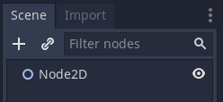

Add something to an environment
-------------------------------

Let's say we want to create a sprite that fetches an image from the Internet.

We are in a 2D environment, so to display a texture, we'll need a
:ref:`Sprite <class_Sprite>`. This sprite will have custom logic to fetch an
image, so the Sprite will need a script. Let's call it an HTTPSprite using
a script called "http_sprite.gd". To submit
HTTP requests, the script will need an :ref:`HTTPRequest <class_HTTPRequest>`
sub-node to which it can delegate network logic.

We might then have something like this:

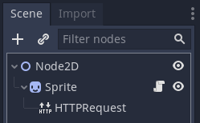

.. tabs::
  .. code-tab:: gdscript GDScript

  # http_sprite.gd
  extends Sprite
  class_name HTTPSprite

From this, we can tell at a glance that the "thing" is a texture in the 2D
world that supports network communication. We can also tell that only the
Sprite has unique functionality.

Migrate to an independent scene
-------------------------------

Right now, we are editing an environment class that has an inlined HTTPSprite
class. That is, we have a 2D scene that just so happens to have another concept
inside of it. It would be cleaner if we could convert that subtree into its own
independent class.

How about we move it into its own scene?

Right-click the Sprite to open the context menu. Choose the
"Save Branch As Scene" option.

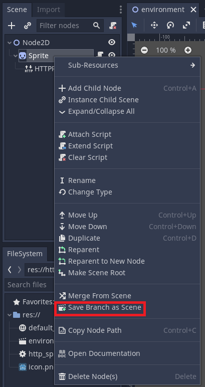

Save the file as ``http_sprite.tscn``.

You should then see the sub-node-tree replaced by a new nested scene instance.

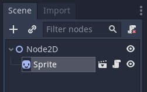

If you click the scene icon beside the Sprite, you will open the new scene!

.. image:: img/node_flexibility/https_sprite_scene.png

Merging scenes
--------------

Even if we've done heavy customizations in one scene, Godot makes it easy
for us to copy those changes to other scenes as needed.

Let's say we've already heavily customized a specific part of our custom
class's subtree.

For simplicity, we'll make two changes for "heavy customization".

Go to the HTTPSprite scene. Select the HTTPRequest node.
Toggle on the "Use Threads" flag in the Inspector.

Then go to the Node tab beside the Inspector. Find the
``request_completed()`` signal.

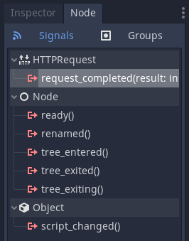

Double-click it. You should see the signal connection dialogue open. Click
"Connect" to form a signal connection and make a callback method in
the script.

.. image:: img/node_flexibility/requested_completed_connection.png

Save the scene. Our customizations are completed.

Now go back to the environment scene. Right click the Node2D root node
and select the "Merge From Scene" option.

.. image :: img/node_flexibility/merge_from_scene.png

Navigate and select your ``http_sprite.tscn`` scene. Then choose the
HTTPRequest node in that scene and hit OK.

The node has been copied from scene to scene! Select the new
HTTPRequest node. Verify that it too has "Use Threads"
toggled on.

Notice that Godot did not merge the signal connection. That was specific
to the script in that scene which is absent in the new one.

By merging scenes, you can reuse your work building one scene to build others.

Overriding changes to scene instances
-------------------------------------

By default, nested scenes only expose their root node to other scenes.
This helps safeguard the scene's internals by establishing a single public
API.

But, sometimes you need a parent scene with private access to an owned
instance.

Let's say there is a particular class using our HTTPSprite which we *don't*
want to use threads. For simplicity, let's say its our environment class.

In the environment scene, right-click the HTTPSprite scene instance and select
the "Editable Children" option.

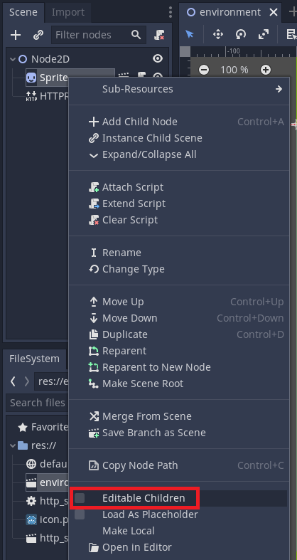

You can now see the scene's internal nodes exposed in the scene dock. The
owning class can now have class-specific overrides of the nested class.

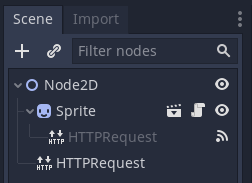

Scripts as classes
------------------

We just learned how an owning class can seize control of an
owned class's internals. This is useful in enabling designers to
tweak classes as they build a game. But, sometimes backend
developers don't want frontend designers to have that kind
of access.

How then can we design classes that aren't editable from the
scene editor?

Well, what exactly is a scene? It's a constructor for a node hierarchy.
We instantiate nodes, add them as children, and configure them.
Anything that can be done with scenes can also be done with scripts.
So, let's convert our declarative scene code to imperative script code.

Create a new script, ``http_sprite_private.gd`` that looks like this:

.. tabs::
  .. code-tab:: gdscript GDScript

    # http_sprite_private.gd
    extends Sprite
    class_name HTTPSpritePrivate

    var http: HTTPRequest = null
    
    func _init() -> void:
        http = HTTPRequest.new()
        http.use_threads = true
        http.connect("request_completed", self, "_on_HTTPRequest_request_completed")

    func _on_HTTPRequest_request_completed(result, response_code, headers, body) -> void:
        pass

And there you have it. A custom node class with all the same features, but
hidden away from the editor.

Let's create an instance of it. In the environment scene, click the root
node and then add a node. In the "Add a Node" dialogue, find and select the
HTTPSpritePrivate node.

You should see something like this now:

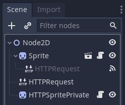

Notice how the class hides the child HTTPRequest node's existence from frontend
users. They can only access the public API of the class's script.

Extending scripts
-----------------

So you've created a script class, but now you want to extend it for a new
class. Let's say we want to build a LoadingHTTPSprite that displays a
predefined loading icon using an :ref:`AnimatedTexture <class_AnimatedTexture>`.

Right-click the HTTPSpritePrivate and select the "Extend Script" option.

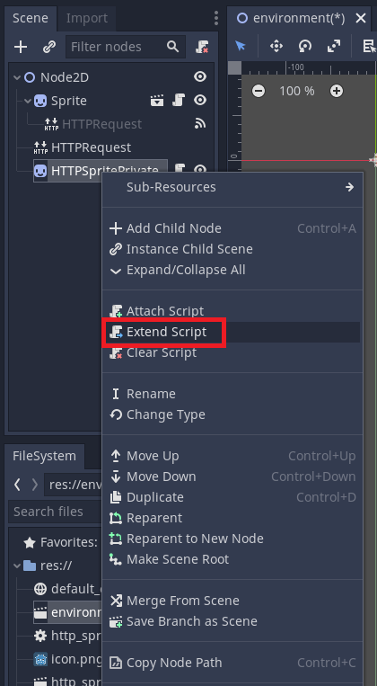

The ScriptCreateDialog will appear:

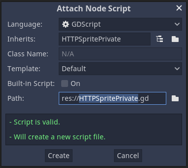

Notice how it has prefilled the "Inherits" field with the script class's name.

Save the file as ``loading_http_sprite_private.gd``. Now save your environment scene.

Hover your mouse over the script icon beside the HTTPSpritePrivate node. You
can see now that it is referencing your new script!

Extending scenes
----------------

Just as you can extend classes defined by scripts, so too can you extend scenes.

There are two ways to do this:

In the main toolbar, select ``Scene > New Inherited Scene...``.

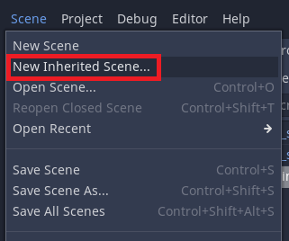

Choose the
``http_sprite.tscn`` file. A new scene will appear that inherits
the nodes and configuration of your base scene. Save this untitled scene, and
you're done!

The second method involves you making a new scene and "instancing a sub-scene"
for your root node.

In the main toolbar, select ``Scene > New Scene``.

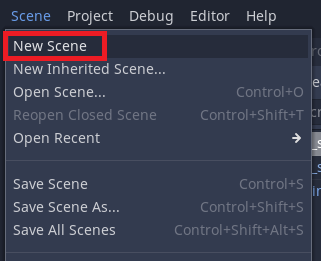

or, alternatively, click the plus button beside the scene tabs in the main
viewport.

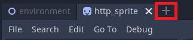

Select the chain-link icon beside the plus sign in the ``Scene`` dock.

.. image:: img/node_flexibility/extend_scene_chainlink_button.png

This button instantiates a sub-scene within the current scene. But, if there are
no nodes, the instantiated sub-scene becomes the root node. Godot interprets
your intent and sets the instantiated scene as the base.

Choose the ``http_sprite.tscn`` file, save the scene and you're done!

.. note::

  All changes made to the base scene will automatically update the
  state of the derived scene. Base scene changes will not affect properties
  which a derived scene has already overridden.

Changing nodes
--------------

Man, the HTTPSprite class is so handy. But oh no! Our requirements have
changed. Now we need to load multiple images in advance from the filesystem
and have the sprite cycle between those images. We no longer need HTTP
requests at all!

Well now, how would we do that? We need to remove the HTTPRequest. But,
let's pretend that it also had children of its own. In that scenario, we
can't just delete it. We'd lose the children too. Instead, we need an in-place
replacement operation. We need our HTTPRequest to become a
:ref:`ResourcePreloader <class_ResourcePreloader>`.

All we need to do is right-click the HTTPRequest node and select the
"Change Type" option. Then choose ``ResourcePreloader``.

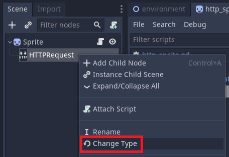

Then rename the "HTTPRequest" node name to "ResourcePreloader". Done! It should
look something like this:

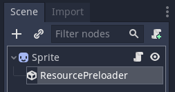

Although, if this were for real, you might also wanna update file names to not
reference HTTP.

Swapping root nodes
-------------------

Let's say that our requirements change again, and we don't want our class
to be a Sprite that preloads assets. We want it to be a resource preloader
that renders a sprite somewhere on screen! We have re-arranged the root
nature of the class. But, we don't want to lose the rendering ability either.

All we must do is right-click the ``ResourcePreloader`` node and select the
"Make Scene Root" option.

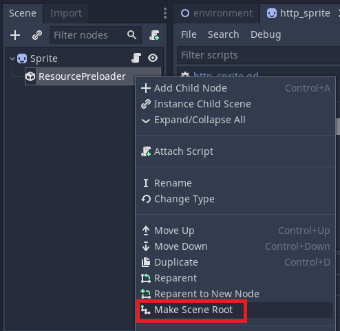

Voila! Godot has rearranged your scene for you.

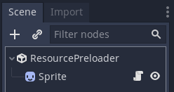

The next steps will be to move the script, change the script's base class,
and update the logic for the new class.

.. note::

  In real life, the root node of a class defines the environment it operates
  in. Node, Node2D, Control, and Spatial; Changing from any one to any other
  will change how it relates to its environment. Thus, you may need to adjust
  any scenes that use the updated class.

Conclusion
----------

That's all for the whirlwind tour of Godot's Node system. It provides
many avenues for rearranging your classes to fit your needs. This approach
has a higher level of granularity than most other engines. As such, learning
how best to tweak it and arrange optimal scenes takes time.

For more information on arranging scenes, see the best practices documentation
on :ref:`scene organization <doc_scene_organization>`.
