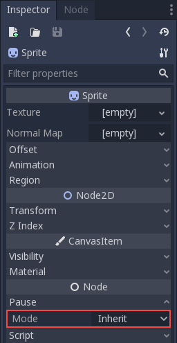
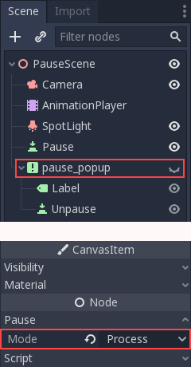

.. _doc_pausing_games:

Pausing games
=============

Pause?
------

In most games it is desirable to, at some point, interrupt the
game to do something else, such as taking a break or changing options.
However, this is not as simple as it seems. The game might be stopped,
but it might be desirable that some menus and animations continue
working.

Implementing a fine-grained control for what can be paused (and what can
not) is a lot of work, so a simple framework for pausing is provided in
Godot.

How pausing works
-----------------

To set pause mode, the pause state must be set. This is done by assigning
``true`` to the :ref:`SceneTree.paused <class_SceneTree_property_paused>` property:

.. tabs::
 .. code-tab:: gdscript GDScript

    get_tree().paused = true

 .. code-tab:: csharp

    GetTree().Paused = true;

Doing so will have the following behavior:

-  2D and 3D physics will be stopped.
-  ``_process`` and ``_physics_process`` will not be called anymore in nodes.
-  ``_input`` and ``_input_event`` will not be called anymore either.

This effectively stops the whole game. Calling this function from a
script, by default, will result in an unrecoverable state (nothing will
work anymore!).

White-listing nodes
-------------------

Before enabling pause, make sure that nodes that must keep working
during pause are white-listed. This is done by editing the "Pause Mode"
property in a node:

You can achieve the same result in code:

.. tabs::
 .. code-tab:: gdscript GDScript

    func _ready():
        pause_mode = Node.PAUSE_MODE_PROCESS

By default all nodes have this property in the "Inherit" state. This
means, that they will only process (or not) depending on what this same
property is set on the parent node. If the parent is set to "Inherit" ,
then the grandparent will be checked and so on. Ultimately, if a state
can't be found in any of the grandparents, the pause state in SceneTree
is used. This means that, by default, when the game is paused every node
will be paused.

So the three possible states for a node are:

-  **Inherit**: Process depending on the state of the parent,
   grandparent, etc. The first parent that has a non-Inherit state.
-  **Stop**: Stop the node no matter what (and children in Inherit
   mode). When paused this node will not process.
-  **Process**: Process the node no matter what (and children in Inherit
   mode). Paused or not this node will process.

Example
-------

An example of this is creating a popup or panel with controls inside,
and set its pause mode to "Process" then hide it:

Just by setting the root of the pause popup to "Process", all children
and grandchildren will inherit that state. This way, this branch of the
scene tree will continue working when paused.

Finally, make it so when a pause button is pressed (any button will do),
enable the pause and show the pause screen.

.. tabs::
 .. code-tab:: gdscript GDScript

    func _on_pause_button_pressed():
        get_tree().paused = true
        $pause_popup.show()

 .. code-tab:: csharp

    public void _on_pause_button_pressed()
    {
        GetTree().Paused = true;
        GetNode<Control>("pause_popup").Show();
    }

To remove the pause, do the opposite when the pause screen is
closed:

.. tabs::
 .. code-tab:: gdscript GDScript

    func _on_pause_popup_close_pressed():
        $pause_popup.hide()
        get_tree().paused = false

 .. code-tab:: csharp

    public void _on_pause_popup_close_pressed()
    {
        GetNode<Control>("pause_popup").Hide();
        GetTree().Paused = false;
    }

And that should be all!
