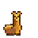
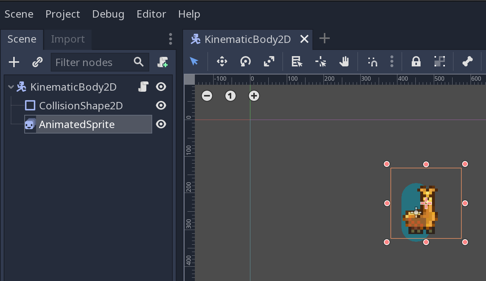
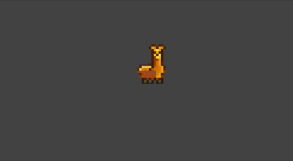

.. _doc_state_design_pattern:

State design pattern
====================

Introduction
------------

Scripting a game can be difficult when there are many states that need to handled, but
only one script can be attached to a node at a time. Instead of creating a state machine
within the player's control script, it would make development simpler if the states were
separated out into different classes.

There are many ways to implement a state machine with Godot, and some other methods are below:

* The player can have a child node for each state, which are called when utilized.
* Enums can be used in conjunction with a match statement.
* The state scripts themselves could be swapped out from a node dynamically at run-time.

This tutorial will focus only on adding and removing nodes which have a state script attached. Each state
script will be an implementation of a different state.

.. note::
    There is a great resource explaining the concept of the state design pattern here:
    https://gameprogrammingpatterns.com/state.html

Script setup
------------

The feature of inheritance is useful for getting started with this design principle.
A class should be created that describes the base features of the player. For now, a
player will be limited to two actions: **move left**, **move right**. This means
there will be two states: **idle** and **run**.

Below is the generic state, from which all other states will inherit.

.. tabs::
    .. code-tab:: gdscript GDScript

        # state.gd

        extends Node2D

        class_name State

        var change_state
        var animated_sprite
        var persistent_state
        var velocity

        # Writing _delta instead of delta here prevents the unused variable warning.
        func _physics_process(_delta):
            persistent_state.move_and_slide(persistent_state.velocity, Vector2.UP)

        func setup(change_state, animated_sprite, persistent_state):
            self.change_state = change_state
            self.animated_sprite = animated_sprite
            self.persistent_state = persistent_state

        func move_left():
            pass

        func move_right():
            pass

A few notes on the above script. First, this implementation uses a
``setup(change_state, animated_sprite, persistent_state)`` method to assign
references. These references will be instantiated in the parent of this state. This helps with something
in programming known as *cohesion*. The state of the player does not want the responsibility of creating
these variables, but does want to be able to use them. However, this does make the state *coupled* to the
state's parent. This means that the state is highly reliant on whether it has a parent which contains
these variables. So, remember that *coupling* and *cohesion* are important concepts when it comes to code management.

.. note::
    See the following page for more details on cohesion and coupling:
    https://courses.cs.washington.edu/courses/cse403/96sp/coupling-cohesion.html

Second, there are some methods in the script for moving, but no implementation. The state script
just uses ``pass`` to show that it will not execute any instructions when the methods are called. This is important.

Third, the ``_physics_process(delta)`` method is actually implemented here. This allows the states to have a default
``_physics_process(delta)`` implementation where ``velocity`` is used to move the player. The way that the states can modify
the movement of the player is to use the ``velocity`` variable defined in their base class.

Finally, this script is actually being designated as a class named ``State``. This makes refactoring the code
easier, since the file path from using the ``load()`` and ``preload()`` functions in godot will not be needed.

So, now that there is a base state, the two states discussed earlier can be implemented.

.. tabs::
    .. code-tab:: gdscript GDScript

        # idle_state.gd

        extends State

        class_name IdleState

        func _ready():
            animated_sprite.play("idle")

        func _flip_direction():
            animated_sprite.flip_h = not animated_sprite.flip_h

        func move_left():
            if animated_sprite.flip_h:
                change_state.call_func("run")
            else:
                _flip_direction()

        func move_right():
            if not animated_sprite.flip_h:
                change_state.call_func("run")
            else:
                _flip_direction()

.. tabs::
    .. code-tab:: gdscript GDScript

        # run_state.gd

        extends State

        class_name RunState

        var move_speed = Vector2(180, 0)
        var min_move_speed = 0.005
        var friction = 0.32

        func _ready():
            animated_sprite.play("run")
            if animated_sprite.flip_h:
                move_speed.x *= -1
            persistent_state.velocity += move_speed

        func _physics_process(_delta):
            if abs(velocity) < min_move_speed:
                 change_state.call_func("idle")
            persistent_state.velocity.x *= friction

        func move_left():
            if animated_sprite.flip_h:
                persistent_state.velocity += move_speed
            else:
                change_state.call_func("idle")

        func move_right():
            if not animated_sprite.flip_h:
                persistent_state.velocity += move_speed
            else:
                change_state.call_func("idle")

.. note::
  The since the ``Run`` and ``Idle`` states extend from ``State`` which extends ``Node2D``, the function
  ``_physics_process(delta)`` is called from the **bottom-up** meaning ``Run`` and ``Idle`` will call their
  implementation of ``_physics_process(delta)``, then ``State`` will call its implementation, then ``Node2D``
  will call its own implementation and so on. This may seem strange, but it is only relevant for predefined functions
  such as ``_ready()``, ``_process(delta)``, etc. Custom functions use the normal inheritance rules of overriding
  the base implementation.

There is a round-about method for obtaining a state instance. A state factory can be used.

.. tabs::
    .. code-tab:: gdscript GDScript

        # state_factory.gd

        class_name StateFactory

        var states

        func _init():
            states = {
                "idle": IdleState,
                "run": RunState
        }

        func get_state(state_name):
            if states.has(state_name):
                return states.get(state_name)
            else:
                printerr("No state ", state_name, " in state factory!")

This will look for states in a dictionary and return the state if found.

Now that all the states are defined with their own scripts, it is time to figure out
how those references that passed to them will be instantiated. Since these references
will not change it makes sense to call this new script ``persistent_state.gd``.

.. tabs::
    .. code-tab:: gdscript GDScript

        # persistent_state.gd

        extends KinematicBody2D

        class_name PersistentState

        var state
        var state_factory

        var velocity = Vector2()

        func _ready():
            state_factory = StateFactory.new()
            change_state("idle")

        # Input code was placed here for tutorial purposes.
        func _process(_delta):
        if Input.is_action_pressed("ui_left"):
            move_left()
        elif Input.is_action_pressed("ui_right"):
            move_right()

        func move_left():
            state.move_left()

        func move_right():
            state.move_right()

        func change_state(new_state_name):
            state.queue_free()
            state = state_factory.get_state(new_state_name).new()
            state.setup(funcref(self, "change_state"), $AnimatedSprite, self)
            state.name = "current_state"
            add_child(state)

.. note::
    The ``persistent_state.gd`` script contains code for detecting input. This was to make the tutorial simple, but it is not usually
    best practice to do this.

Project setup
-------------

This tutorial made an assumption that the node it would be attached to contained a child node which is an :ref:`AnimatedSprite <class_AnimatedSprite>`.
There is also the assumption that this :ref:`AnimatedSprite <class_AnimatedSprite>` has at least two animations,
the idle and run animations. Also, the top-level node is assumed to be a :ref:`KinematicBody2D <class_KinematicBody2D>`.

.. note::
    The zip file of the llama used in this tutorial is :download:`here <files/llama.zip>`.
    The source was from `piskel_llama <https://www.piskelapp.com/p/agxzfnBpc2tlbC1hcHByEwsSBlBpc2tlbBiAgICfx5ygCQw/edit>`_, but
    I couldn't find the original creator information on that page though...
    There is also a good tutorial for sprite animation already. See :ref:`2D Sprite Animation <doc_2d_sprite_animation>`.

So, the only script that must be attached is ``persistent_state.gd``, which  should be attached to the top node of the
player, which is a :ref:`KinematicBody2D <class_KinematicBody2D>`.

Now the player has utilized the state design pattern to implement its two different states. The nice part of this
pattern is that if one wanted to add another state, then it would involve creating another class that need only
focus on itself and how it changes to another state. Each state is functionally separated and instantiated dynamically.
