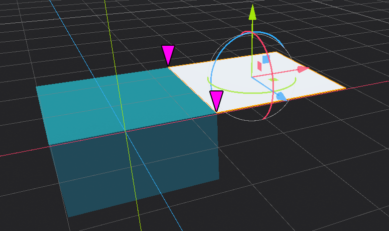
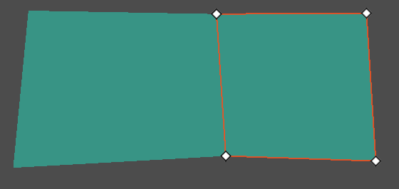
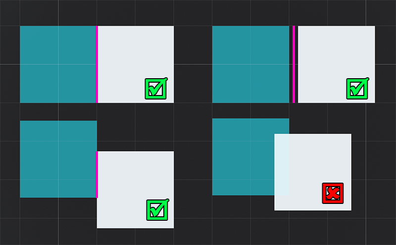

.. _doc_navigation_connecting_navmesh:

Connecting navigation meshes
============================

Different NavigationMeshes are automatically merged by the NavigationServer
when at least two vertex positions of one edge exactly overlap.

To connect over arbitrary distances see :ref:`doc_navigation_using_navigationlinks`.

The same is true for multiple NavigationPolygon resources. As long as their
outline points overlap exactly the NavigationServer will merge them.
NavigationPolygon outlines must be from different NavigationPolygon resources to connect.

Overlapping or intersecting outlines on the same NavigationPolygon
will fail the navigation mesh creation. Overlapping or intersecting
outlines from different NavigationPolygons will often fail to create the
navigation region edge connections on the NavigationServer and should be avoided.

.. warning::

    Exactly means exactly for the vertex position merge. Small float errors
    that happen quite regularly with imported meshes will prevent a successful vertex merge.

Alternatively navigation meshes are not merged but still considered as **connected** by
the NavigationServer when their edges are nearly parallel and within distance
to each other. The connection distance is defined by the  ``edge_connection_margin`` for each
navigation map. In many cases navigation mesh edges cannot properly connect when they partly overlap.
Better avoid any navigation mesh overlap at all time for a consistent merge behavior.

If navigation debug is enabled and the NavigationServer active the established navigation mesh connections will be visualized.
See :ref:`doc_navigation_debug_tools` for more info about navigation debug options.

The default 2D ``edge_connection_margin`` can be changed in the ProjectSettings under ``navigation/2d/default_edge_connection_margin``.

The default 3D ``edge_connection_margin`` can be changed in the ProjectSettings under ``navigation/3d/default_edge_connection_margin``.

The edge connection margin value of any navigation map can also be changed at runtime with the NavigationServer API.

.. tabs::
 .. code-tab:: gdscript 2D GDScript

    extends Node2D

    func _ready() -> void:
        # 2D margins are designed to work with 2D "pixel" values.
        var default_map_rid: RID = get_world_2d().get_navigation_map()
        NavigationServer2D.map_set_edge_connection_margin(default_map_rid, 50.0)

 .. code-tab:: gdscript 3D GDScript

    extends Node3D

    func _ready() -> void:
        # 3D margins are designed to work with 3D world unit values.
        var default_map_rid: RID = get_world_3d().get_navigation_map()
        NavigationServer3D.map_set_edge_connection_margin(default_map_rid, 0.5)

.. note::

    Changing the edge connection margin will trigger a full update of all navigation mesh connections on the NavigationServer.
