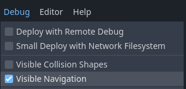
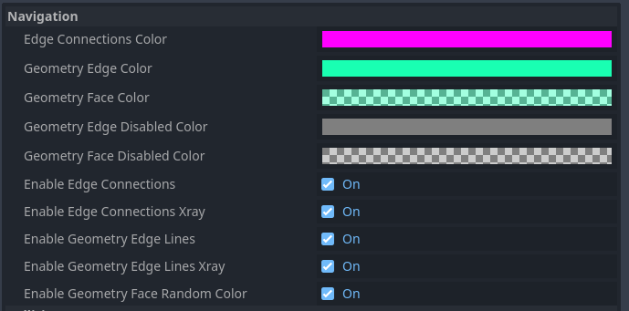
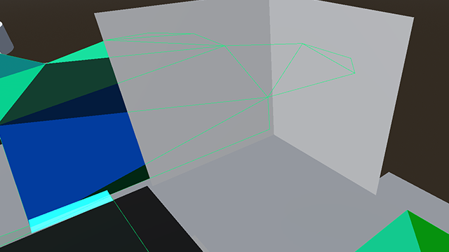
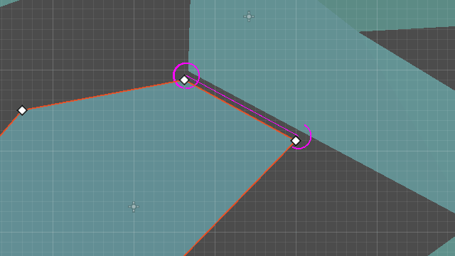
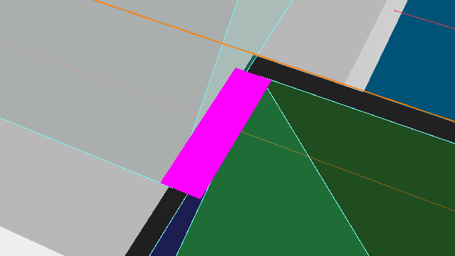
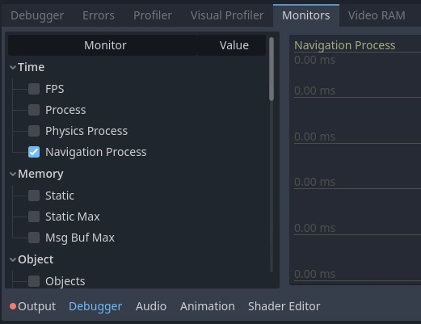
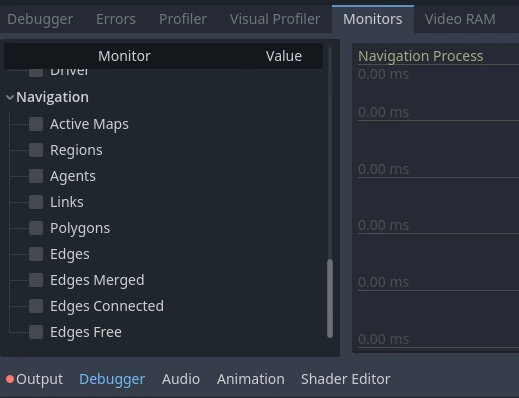

.. _doc_navigation_debug_tools:

Navigation debug tools
======================

.. note::

    The debug tools, properties and functions are only available in Godot debug builds.
    Do not use any of them in code that will be part of a release build.

Enabling navigation debug
-------------------------

The navigation debug visualizations are enabled by default inside the editor.
To visualize navigation meshes and connections at runtime too, enable the option **Visible Navigation** in the editor **Debug** menu.

In Godot debug builds the navigation debug can also be toggled through the NavigationServer singletons from scripts.

.. tabs::
 .. code-tab:: gdscript GDScript

    NavigationServer2D.set_debug_enabled(false)
    NavigationServer3D.set_debug_enabled(true)

Debug visualizations are currently based on Nodes in the SceneTree. If the :ref:`NavigationServer2D<class_NavigationServer2D>` or :ref:`NavigationServer3D<class_NavigationServer3D>` 
APIs are used exclusively then changes will not be reflected by the debug navigation tools.

Navigation debug settings
-------------------------

The appearance of navigation debug can be changed in the ProjectSettings under ``debug/shapes/navigation``.
Certain debug features can also be enabled or disabled at will but may require a scene restart to take effect.

Debug navigation mesh polygons
------------------------------

If ``enable_edge_lines`` is enabled, the edges of navigation mesh polygons will be highlighted.
If ``enable_edge_lines_xray`` is also enabled, the edges of navigation meshes will be visible through geometry.

If ``enable_geometry_face_random_color`` is enabled, the color of each navigation mesh face will be mixed with a random color that is itself mixed with the color specified in ``geometry_face_color``.

Debug edge connections
----------------------

When two navigation meshes are connected within ``edge_connection_margin`` distance, the connection is overlaid.
The color of the overlay is controlled by ``edge_connection_color``.
The connections can be made visible through geometry with ``enable_edge_connections_xray``.

.. note::

    Edge connections are only visible when the NavigationServer is active.

Debug performance
-----------------

To measure NavigationServer performance a dedicated monitor exists that can be found within the Editor Debugger under *Debugger->Monitors->Navigation Process*.

Navigation Process shows how long the NavigationServer spends updating its internals this update frame in milliseconds.
Navigation Process works similar to Process for visual frame rendering and Physics Process for collision and fixed updates.

Navigation Process accounts for all updates to **navigation maps**, **navigation regions** and **navigation agents** as well as all the **avoidance calculations** for the update frame.

.. note::

    Navigation Process does NOT include pathfinding performance cause pathfinding operates on the navigation map data independently from the server process update.

Navigation Process should be in general kept as low and as stable as possible for runtime performance to avoid frame rate issues.
Note that since the NavigationServer process update happens in the middle of the physics update an increase in Navigation Process will automatically increase Physics Process by the same amount.

Navigation also provides more detailed statistics about the current navigation related objects and navigation map composition on the NavigationServer.

Navigation statistics shown here can not be judged as good or bad for performance as it depends entirely on the project what can be considered as reasonable or horribly excessive.

Navigation statistics help with identifying performance bottlenecks that are less obvious because the source might not always have a visible representation.
E.g. pathfinding performance issues created by overly detailed navigation meshes with thousand of edges / polygons or problems caused by procedural navigation gone wrong.
