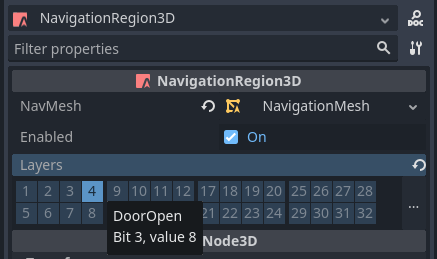

.. _doc_navigation_different_actor_area_access:

Support different actor area access
===================================

A typical example for different area access in gameplay are doors that connect rooms 
with different navigation meshes and are not accessible by all actors all the time.

Add a NavigationRegion at the door position.
Add an appropriate navigation mesh the size of the door that can connect with the surrounding navigation meshes.
In order to control access, enable / disable navigation layer bits so path queries
that use the same navigation layer bits can find a path through the "door" navigation mesh.

The bitmask can act as a set of door keys or abilities and only actors with at least 
one matching and enabled bit layer in their pathfinding query will find a path through this region.
See :ref:`doc_navigation_advanced_using_navigationlayers` for more information on how to work with navigation layers and the bitmask.

The entire "door" region can also be enabled / disable if required but if disabled will block access for all path queries.

Prefer working with navigation layers in path queries whenever possible as enabling or disabling 
navigation layers on a region triggers a costly recalculation of the navigation map connections.

.. warning::

    Changing navigation layers will only affect new path queries but not automatically update existing paths.
