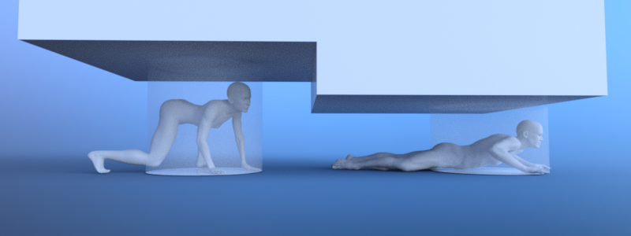

.. _doc_navigation_different_actor_locomotion:

Support different actor locomotion
==================================

To support different actor locomotion like crouching and crawling, a similar
map setup as supporting :ref:`doc_navigation_different_actor_types` is required.

Bake different navigation meshes with an appropriate height for crouched
or crawling actors so they can find paths through those narrow sections in your game world.

When an actor changes locomotion state, e.g. stands up, starts
crouching or crawling, query the appropriate map for a path.

If the avoidance behavior should also change with the locomotion e.g. only avoid while standing or only avoid
other agents in the same locomotion state, switch the actor's avoidance agent to another avoidance map with each locomotion change.

.. tabs::
 .. code-tab:: gdscript GDScript

    func update_path():

        if actor_standing:
            path = NavigationServer3D.map_get_path(standing_navigation_map_rid, start_position, target_position, true)
        elif actor_crouching:
            path = NavigationServer3D.map_get_path(crouched_navigation_map_rid, start_position, target_position, true)
        elif actor_crawling:
            path = NavigationServer3D.map_get_path(crawling_navigation_map_rid, start_position, target_position, true)

    func change_agent_avoidance_state():

        if actor_standing:
            NavigationServer3D.agent_set_map(avoidance_agent_rid, standing_navigation_map_rid)
        elif actor_crouching:
            NavigationServer3D.agent_set_map(avoidance_agent_rid, crouched_navigation_map_rid)
        elif actor_crawling:
            NavigationServer3D.agent_set_map(avoidance_agent_rid, crawling_navigation_map_rid)

 .. code-tab:: csharp

    private void UpdatePath()
    {
        if (_actorStanding)
        {
            _path = NavigationServer3D.MapGetPath(_standingNavigationMapRid, _startPosition, _targetPosition, true);
        }
        else if (_actorCrouching)
        {
            _path = NavigationServer3D.MapGetPath(_crouchedNavigationMapRid, _startPosition, _targetPosition, true);
        }
        else if (_actorCrawling)
        {
            _path = NavigationServer3D.MapGetPath(_crawlingNavigationMapRid, _startPosition, _targetPosition, true);
        }
    }

    private void ChangeAgentAvoidanceState()
    {
        if (_actorStanding)
        {
            NavigationServer3D.AgentSetMap(_avoidanceAgentRid, _standingNavigationMapRid);
        }
        else if (_actorCrouching)
        {
            NavigationServer3D.AgentSetMap(_avoidanceAgentRid, _crouchedNavigationMapRid);
        }
        else if (_actorCrawling)
        {
            NavigationServer3D.AgentSetMap(_avoidanceAgentRid, _crawlingNavigationMapRid);
        }
    }

.. note::

    While a path query can be execute immediately for multiple maps, the avoidance agent map switch will only take effect after the next server synchronization.
