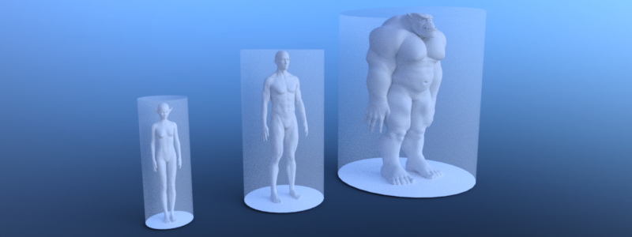

.. _doc_navigation_different_actor_types:

Support different actor types
=============================

To support different actor types due to e.g. their sizes each type requires its own
navigation map and navigation mesh baked with an appropriated agent radius and height.
The same approach can be used to distinguish between e.g. landwalking, swimming or flying agents.

.. note::

   Agents are exclusively defined by a radius and height value for baking navigation meshes, pathfinding and avoidance. More complex shapes are not supported.

.. tabs::
 .. code-tab:: gdscript GDScript

    # create navigation mesh resources for each actor size
    var navigation_mesh_standard_size: NavigationMesh = NavigationMesh.new()
    var navigation_mesh_small_size: NavigationMesh = NavigationMesh.new()
    var navigation_mesh_huge_size: NavigationMesh = NavigationMesh.new()

    # set appropriated agent parameters
    navigation_mesh_standard_size.agent_radius = 0.5
    navigation_mesh_standard_size.agent_height = 1.8
    navigation_mesh_small_size.agent_radius = 0.25
    navigation_mesh_small_size.agent_height = 0.7
    navigation_mesh_huge_size.agent_radius = 1.5
    navigation_mesh_huge_size.agent_height = 2.5

    # get the root node for the baking to parse geometry
    var root_node: Node3D = get_node("NavigationMeshBakingRootNode")

    # bake the navigation geometry for each agent size
    NavigationMeshGenerator.bake(navigation_mesh_standard_size, root_node)
    NavigationMeshGenerator.bake(navigation_mesh_small_size, root_node)
    NavigationMeshGenerator.bake(navigation_mesh_huge_size, root_node)

    # create different navigation maps on the NavigationServer
    var navigation_map_standard: RID = NavigationServer3D.map_create()
    var navigation_map_small: RID = NavigationServer3D.map_create()
    var navigation_map_huge: RID = NavigationServer3D.map_create()

    # create a region for each map
    var navigation_map_standard_region: RID = NavigationServer3D.region_create()
    var navigation_map_small_region: RID = NavigationServer3D.region_create()
    var navigation_map_huge_region: RID = NavigationServer3D.region_create()

    # set navigation mesh for each region
    NavigationServer3D.region_set_navigation_mesh(navigation_map_standard_region, navigation_mesh_standard_size)
    NavigationServer3D.region_set_navigation_mesh(navigation_map_small_region, navigation_mesh_small_size)
    NavigationServer3D.region_set_navigation_mesh(navigation_map_huge_region, navigation_mesh_huge_size)

    # add regions to maps
    navigation_map_standard_region.region_set_map(navigation_map_standard_region, navigation_map_standard)
    navigation_map_small_region.region_set_map(navigation_map_small_region, navigation_map_small)
    navigation_map_huge_region.region_set_map(navigation_map_huge_region, navigation_map_huge)

    # wait a physics frame for sync
    await get_tree().physics_frame

    # query paths for each size
    var path_standard_agent = NavigationServer3D.map_get_path(navigation_map_standard, start_pos, end_pos, true)
    var path_small_agent = NavigationServer3D.map_get_path(navigation_mesh_small_size, start_pos, end_pos, true)
    var path_huge_agent = NavigationServer3D.map_get_path(navigation_map_huge, start_pos, end_pos, true)
