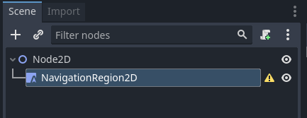
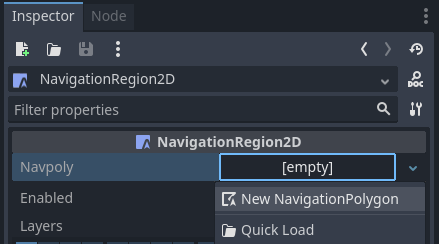
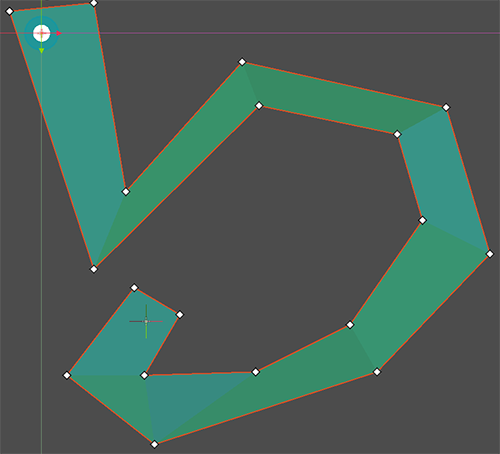

.. _doc_navigation_overview_2d:

2D Navigation Overview
======================

Godot provides multiple objects, classes and servers to facilitate grid-based or mesh-based navigation and pathfinding for 2D and 3D games. 
The following section provides a quick overview over all available navigation related objects in Godot for 2D scenes and their primary use.

Godot provides the following objects and classes for 2D navigation:

- :ref:`Astar2D<class_Astar2D>`
    ``Astar2D`` objects provide an option to find the shortest path in a graph of weighted **points**.

    The AStar2D class is best suited for cellbased 2D gameplay that does not require actors to reach any possible position within an area but only predefined, distinct positions.

- :ref:`NavigationServer2D<class_NavigationServer2D>`
    ``NavigationServer2D`` provides a powerful server API to find the shortest path between two positions on a area defined by a navigation mesh.

    The NavigationServer is best suited for 2D realtime gameplay that does require actors to reach any possible position within an navmesh defined area.
    Meshbased navigation scales well with large gameworlds as a large area can often be defined with a single polygon when it would require many, many grid cells.

    The NavigationServer holds different navigation maps that each consist of regions that hold navigation mesh data.
    Agents can be placed on a map for avoidance calculation.
    RIDs are used to reference the internal maps, regions and agents when communicating with the server.

    The following NavigationServer RID types are available.
        - NavMap RID
            Reference to a specific navigation map that holds regions and agents.
            The map will attempt to join changed navigation meshes of regions by proximity.
            The map will synchronise regions and agents each physics frame.
        - NavRegion RID
            Reference to a specific navigation region that can hold navigation mesh data.
            The region can be enabled / disabled or the use restricted with a navigationlayer bitmask.
        - NavAgent RID
            Reference to a specific avoidance agent with a radius value use solely in avoidance.

The following SceneTree Nodes are available as helpers to work with the NavigationServer2D API.

- :ref:`NavigationRegion2D<class_NavigationRegion2D>` Node
    A Node that holds a NavigationPolygon resource that defines a navigation mesh for the NavigationServer2D.
    The region can be enabled / disabled.
    The use in pathfinding can be further restricted through the navigationlayers bitmask.
    Regions can join their navigation meshes by proximity for a combined navigation mesh.

-  :ref:`NavigationAgent2D<class_NavigationAgent2D>` Node
    An optional helper Node to facilitate common NavigationServer2D API calls for pathfinding and avoidance
    for a Node2D inheriting parent Node.

-  :ref:`NavigationObstacle2D<class_NavigationObstacle2D>` Node
    A Node that acts as an agent with avoidance radius, to work it needs to be added under a Node2D
    inheriting parent Node. Obstacles are intended as a last resort option for constantly moving objects
    that cannot be re(baked) to a navigation mesh efficiently. This node also only works if RVO processing
    is being used.

The 2D navigationm eshes are defined with the following resources:

- :ref:`NavigationPolygon<class_NavigationPolygon>` Resource
    A resource that holds 2D navigation mesh data and provides polygon drawtools to define navigation areas inside the Editor as well as at runtime.

    - The NavigationRegion2D Node uses this resource to define its navigation area.
    - The NavigationServer2D uses this resource to update navmesh of individual regions.
    - The TileSet Editor creates and uses this resource internally when defining tile navigation areas.

Setup for 2D scene
------------------

The following steps show the basic setup for a minimum viable navigation in 2D that uses the
NavigationServer2D and a NavigationAgent2D for path movement.

1.) Add a NavigationRegion2D Node to the scene.

2.) Click on the region node and add a new NavigationPolygon Resource to the region node

3.) Define the moveable navigation area with the NavigationPolygon draw tool

.. note::

    The navigation mesh defines the area where an actor can stand and move with its center.
    Leave enough margin between the navpolygon edges and collision objects to not get path following actors repeatedly stuck on collision.

4.) Add a CharacterBody2D below the region node with a basic collision shape and a sprite or mesh for visuals.

5.) Add a NavigationAgent2D node below the character node

6.) Add the following script to the CharacterBody2D node. Set a movement target with the set_movement_target() function after the scene has fully loaded and the NavigationServer had time to sync.

.. note::

    On the first frame the NavigationServer map has not synchronised region data and any path query will return empty.
    Use ``await get_tree().physics_frame`` to pause scripts until the NavigationServer had time to sync.

.. tabs::
 .. code-tab:: gdscript GDScript

    extends CharacterBody2D

    var movement_speed  : float = 200.0
    var movement_target_position : Vector2 = Vector2(60.0,180.0)

    @onready var navigation_agent : NavigationAgent2D = $NavigationAgent2D

    func _ready():
        # these values need to be adjusted for the actor's speed
        # and the navpolygon layout as each crossed edge will create a path point
        # If the actor moves to fast it might overshoot 
        # multiple path points in one frame and start to backtrack
        navigation_agent.path_desired_distance = 4.0
        navigation_agent.target_desired_distance = 4.0

        # make a deferred function call to assure the entire Scenetree is loaded
        call_deferred("actor_setup")

    func actor_setup():
        # wait for the first physics frame so the NavigationServer can sync
        await get_tree().physics_frame

        # now that the navigation map is no longer empty set the movement target
        set_movement_target(movement_target_position)

    func set_movement_target(movement_target : Vector2):
        navigation_agent.set_target_location(movement_target)

    func _physics_process(delta):

        if navigation_agent.is_target_reached():
            return

        var current_agent_position : Vector2 = global_transform.origin
        var next_path_position : Vector2 = navigation_agent.get_next_location()

        var new_velocity : Vector2 = next_path_position - current_agent_position
        new_velocity = new_velocity.normalized()
        new_velocity = new_velocity * movement_speed

        set_velocity(new_velocity)

        move_and_slide()
