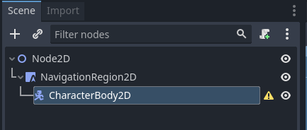
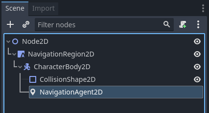

.. _doc_navigation_setup_2d_scene:

Setup for 2D scene
==================

The following steps show the basic setup for a minimum viable navigation in 2D that uses the NavigationServer2D and a NavigationAgent2D for path movement.

1.) Add a NavigationRegion2D Node to the scene.

.. image:: img/nav_2d_min_setup_step1.png

2.) Click on the region node and add a new NavigationPolygon Resource to the region node

.. image:: img/nav_2d_min_setup_step2.png

3.) Define the moveable navigation area with the NavigationPolygon draw tool

.. image:: img/nav_2d_min_setup_step3.png

.. note::

    The navigation mesh defines the area where an actor can stand and move with its center.
    Leave enough margin between the navpolygon edges and collision objects to not get path following actors repeatedly stuck on collision.

4.) Add a CharacterBody2D below the region node with a basic collision shape and some sprit/mesh for visuals.

5.) Add a NavigationAgent2D node below the character node

6.) Add the following script to the CharacterBody2D node. Set a movement target with the set_movement_target() function after the scene has fully loaded and the NavigationServer had time to sync.

.. note::

    On the first frame the NavigationServer map has not synchronised region data and any path query will return empty.
    Use ``await get_tree().physics_frame`` to pause scripts until the NavigationServer had time to sync.

.. tabs::
 .. code-tab:: gdscript GDScript

    extends CharacterBody2D

    var movement_speed  : float = 200.0
    var movement_target_position : Vector2 = Vector2(60.0,180.0)

    @onready var navigation_agent : NavigationAgent2D = $NavigationAgent2D

    func _ready():
        # these values need to be adjusted for the actor's speed
        # and the navpolygon layout as each crossed edge will create a path point
        # If the actor moves to fast it might overshoot 
        # multiple path points in one frame and start to backtrack
        navigation_agent.path_desired_distance = 4.0
        navigation_agent.target_desired_distance = 4.0

        # make a deferred function call to assure the entire Scenetree is loaded
        call_deferred("actor_setup")

    func actor_setup():
        # wait for the first physics frame so the NavigationServer can sync
        await get_tree().physics_frame

        # now that the navigation map is no longer empty set the movement target
        set_movement_target(movement_target_position)

    func set_movement_target(movement_target : Vector2):
        navigation_agent.set_target_location(movement_target)

    func _physics_process(delta):
        
        if navigation_agent.is_target_reached():
            return
        
        var current_agent_position : Vector2 = global_transform.origin
        var next_path_position : Vector2 = navigation_agent.get_next_location()
        
        var new_velocity : Vector2 = next_path_position - current_agent_position
        new_velocity = new_velocity.normalized()
        new_velocity = new_velocity * movement_speed

        set_velocity(new_velocity)

        move_and_slide()
