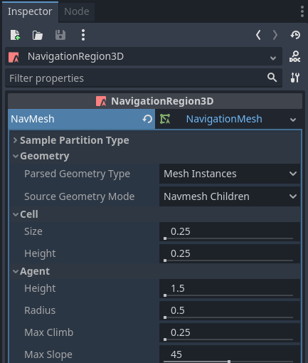
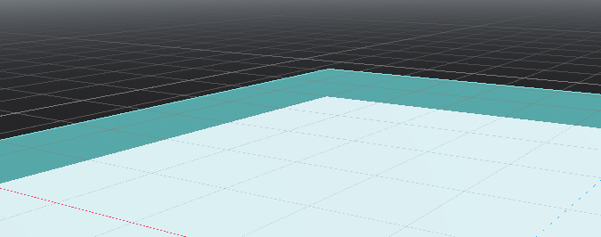
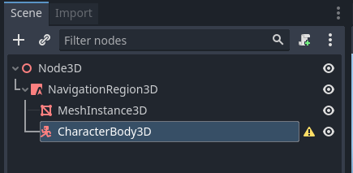
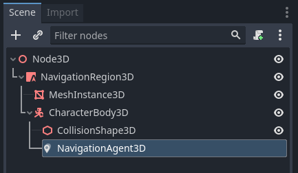

.. _doc_navigation_setup_3d_scene:

Setup for 3D scene
==================

The following steps show how to setup a minimum viable navigation in 3D that uses the NavigationServer3D and a NavigationAgent3D for path movement.

1.) Add a NavigationRegion3D Node to the scene.

.. image:: img/nav_3d_min_setup_step1.png

2.) Click on the region node and add a new NavigationMesh Resource to the region node

.. image:: img/nav_3d_min_setup_step2.png

3.) Add a new MeshInstance node below the region node

.. image:: img/nav_3d_min_setup_step3.png

4.) Select the meshinstance node and add a new PlaneMesh and increase the xy size to 10.

.. image:: img/nav_3d_min_setup_step4.png

5.) Select the region node again and open the NavigationMesh baking properties. The default is sufficient for now.

6.) With the region node still selected hit the "Bake Navmesh" button on the top bar

7.) Now a transparent navigationmesh appeared that hovers some distance on top the planemesh.

8.) Add a CharacterBody3D below the region node with a basic collision shape and some mesh for visuals.

9.) Add a NavigationAgent3D node below the character node

10.) Add a script to the CharacterBody3D node with the following content.

.. tabs::
 .. code-tab:: gdscript GDScript

    extends CharacterBody3D
    
    var movement_speed  : float = 4.0
    
    @onready var navigation_agent = $NavigationAgent3D
    
    func set_movement_target(movement_target : Vector3):
        navigation_agent.set_target_location(movement_target)
    
    func _physics_process(delta):
        
        var current_agent_position : Vector3 = global_transform.origin
        var next_path_position : Vector3 = navigation_agent.get_next_location()
        
        var new_velocity : Vector3 = next_path_position - current_agent_position
        new_velocity = new_velocity.normalized()
        new_velocity = new_velocity * movement_speed
        
        set_velocity(new_velocity)
        move_and_slide()

Set a movement target with the set_movement_target() function after the scene has fully loaded.
Also add a Camera3D and some light and environment to see something.

.. warning::

    On the first frame the NavigationServer map has not synchronised region data and any path query will return empty.
    Use ``await get_tree().physics_frame`` to pause scripts until the NavigationServer had time to sync.
