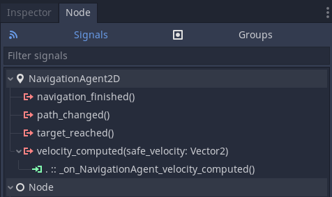

.. _doc_navigation_using_navigationagents:

Using NavigationAgents
======================

NavigationsAgents are helper nodes that combine functionality
for pathfinding, path following and agent avoidance for a Node2D/3D inheriting parent node.
They facilitate common calls to the NavigationServer API on
behalf of the parent actor node in a more convenient manner for beginners.

2D and 3D version of NavigationAgents are available as
:ref:`NavigationAgent2D<class_NavigationAgent2D>` and
:ref:`NavigationAgent3D<class_NavigationAgent3D>` respectively.

New NavigationAgent nodes will automatically join the default navigation map on the :ref:`World2D<class_World2D>`/:ref:`World3D<class_World3D>`.

NavigationsAgent nodes are optional and not a hard requirement to use the navigation system.
Their entire functionality can be replaced with scripts and direct calls to the NavigationServer API.

NavigationAgent Pathfinding
---------------------------

NavigationAgents query a new navigation path on their current navigation map when their ``target_position`` is set with a global position.

The result of the pathfinding can be influenced with the following properties.

- The ``navigation_layers`` bitmask can be used to limit the navigation meshes that the agent can use.
- The ``pathfinding_algorithm`` controls how the pathfinding travels through the navigation mesh polygons in the path search.
- The ``path_postprocessing`` sets if or how the raw path corridor found by the pathfinding is altered before it is returned.
- The ``path_metadata_flags`` enable the collection of additional path point meta data returned by the path.

.. warning::

    Disabling path meta flags will disable related signal emissions on the agent.

NavigationAgent Pathfollowing
-----------------------------

After a ``target_position`` has been set for the agent, the next position to follow in the path
can be retrieved with the ``get_next_path_position()`` function.

Once the next path position is received move the parent actor node of the agent
towards this path position with your own movement code.

.. note::

    The navigation system never moves the parent node of a NavigationAgent.
    The movement is entirely in the hands of users and their custom scripts.

NavigationAgents have their own internal logic to proceed with the current path and call for updates.

The ``get_next_path_position()`` function is responsible for updating many of the agent's internal states and properties.
The function should be repeatedly called *once* every ``physics_process`` until ``is_navigation_finished()`` tells that the path is finished.
The function should not be called after the target position or path end has been reached
as it can make the agent jitter in place due to the repeated path updates.
Always check very early in script with ``is_navigation_finished()`` if the path is already finished.

The following properties influence the path following behavior.

- The ``path_desired_distance`` defines the distance at which the agent advances its internal path index to the next path position.
- The ``target_desired_distance`` defines the distance at which the agent considers the target position to be reached and the path at its end.
- The ``path_max_distance`` defines when an agent requests a new path cause it was moved too far away from the current path point segment.

The important updates are all triggered with the ``get_next_path_position()`` function
when called in ``_physics_process()``.

NavigationAgents can be used with ``process`` but are still limited to a single update that happens in ``physics_process``.

Script examples for various nodes commonly used with NavigationAgents can be found further below.

Pathfollowing common problems
~~~~~~~~~~~~~~~~~~~~~~~~~~~~~

There are some common user problems and important caveats to consider when writing agent movement scripts.

- The path is returned empty
    If an agent queries a path before the navigation map synchronisation, e.g. in a ``_ready()`` function, the path might return empty. In this case the ``get_next_path_position()`` function will return the same position as the agent parent node and the agent will consider the path end reached. This is fixed by making a deferred call or using a callback e.g. waiting for the navigation map changed signal.

- The agent is stuck dancing between two positions
    This is usually caused by very frequent path updates every single frame, either deliberate or by accident (e.g. max path distance set too short). The pathfinding needs to find the closest position that are valid on navigation mesh. If a new path is requested every single frame the first path positions might end up switching constantly in front and behind the agent's current position, causing it to dance between the two positions.

- The agent is backtracking sometimes
    If an agent moves very fast it might overshoot the path_desired_distance check without ever advancing the path index. This can lead to the agent backtracking to the path point now behind it until it passes the distance check to increase the path index. Increase the desired distances accordingly for your agent speed and update rate usually fixes this as well as a more balanced navigation mesh polygon layout with not too many polygon edges cramped together in small spaces.

- The agent is sometimes looking backwards for a frame
    Same as with stuck dancing agents between two positions, this is usually caused by very frequent path updates every single frame. Depending on your navigation mesh layout, and especially when an agent is directly placed over a navigation mesh edge or edge connection, expect path positions to be sometimes slightly "behind" your actors current orientation. This happens due to precision issues and can not always be avoided. This is usually only a visible problem if actors are instantly rotated to face the current path position.

NavigationAgent Avoidance
-------------------------

This section explains how to use the navigation avoidance specific to NavigationAgents.

In order for NavigationAgents to use the avoidance feature the ``enable_avoidance`` property must be set to ``true``.

.. image:: img/agent_avoidance_enabled.png

The ``velocity_computed`` signal of the NavigationAgent node must be connected to receive the safe velocity calculation result.

Set the ``velocity`` of the NavigationAgent node in ``_physics_process()`` to update the agent with the current velocity of the agent's parent node.

While avoidance is enabled on the agent the ``safe_velocity`` vector will be received with the velocity_computed signal every physics frame.
This velocity vector should be used to move the NavigationAgent's parent node in order to avoidance collision with other avoidance using agents or avoidance obstacles.

.. note::

    Only other agents on the same map that are registered for avoidance themself will be considered in the avoidance calculation.

The following NavigationAgent properties are relevant for avoidance:

  - The property ``height`` is available in 3D only. The height together with the current global y-axis position of the agent determines the vertical placement of the agent in the avoidance simulation. Agents using the 2D avoidance will automatically ignore other agents or obstacles that are below or above them.
  - The property ``radius`` controls the size of the avoidance circle, or in case of 3D sphere, around the agent. This area describes the agents body and not the avoidance maneuver distance.
  - The property ``neighbor_distance`` controls the search radius of the agent when searching for other agents that should be avoided. A lower value reduces processing cost.
  - The property ``max_neighbors`` controls how many other agents are considered in the avoidance calculation if they all have overlapping radius.
    A lower value reduces processing cost but a too low value may result in agents ignoring the avoidance.
  - The properties ``time_horizon_agents`` and ``time_horizon_obstacles`` control the avoidance prediction time for other agents or obstacles in seconds. When agents calculate their safe velocities they choose velocities that can be kept for this amount of seconds without colliding with another avoidance object. The prediction time should be kept as low as possible as agents will slow down their velocities to avoid collision in that timeframe.
  - The property ``max_speed`` controls the maximum velocity allowed for the agents avoidance calculation.
    If the agents parents moves faster than this value the avoidance ``safe_velocity`` might not be accurate enough to avoid collision.
  - The property ``use_3d_avoidance`` switches the agent between the 2D avoidance (xz axis) and the 3D avoidance (xyz axis) on the next update.
    Note that 2D avoidance and 3D avoidance run in separate avoidance simulations so agents split between them do not affect each other.
  - The properties ``avoidance_layers`` and ``avoidance_mask`` are bitmasks similar to e.g. physics layers. Agents will only avoid other avoidance objects that are on an avoidance layer that matches at least one of their own avoidance mask bits.
  - The ``avoidance_priority`` makes agents with a higher priority ignore agents with a lower priority. This can be used to give certain agents more importance in the avoidance simulation, e.g. important npcs characters, without constantly changing their entire avoidance layers or mask.

Avoidance exists in its own space and has no information from navigation meshes or physics collision.
Behind the scene avoidance agents are just circles with different radius on a flat 2D plane or spheres in an otherwise empty 3D space.
NavigationObstacles can be used to add some environment constrains to the avoidance simulation, see :ref:`doc_navigation_using_navigationobstacles`.

.. note::

    Avoidance does not affect the pathfinding. It should be seen as an additional option for constantly moving objects that cannot be (re)baked to a navigation mesh efficiently in order to move around them.

.. note::

    RVO avoidance makes implicit assumptions about natural agent behavior. E.g. that agents move on reasonable passing sides that can be assigned when they encounter each other.
    This means that very clinical avoidance test scenarios will commonly fail. E.g. agents moved directly against each other with perfect opposite velocities will fail because the agents can not get their passing sides assigned.

Using the NavigationAgent ``enable_avoidance`` property is the preferred option
to toggle avoidance. The following code snippets can be used to
toggle avoidance on agents, create or delete avoidance callbacks or switch avoidance modes.

.. tabs::
 .. code-tab:: gdscript GDScript

    extends NavigationAgent2D

    var agent: RID = get_rid()
    # Enable avoidance
    NavigationServer2D.agent_set_avoidance_enabled(agent, true)
    # Create avoidance callback
    NavigationServer2D.agent_set_avoidance_callback(agent, Callable(self, "_avoidance_done"))

    # Disable avoidance
    NavigationServer2D.agent_set_avoidance_enabled(agent, false)
    # Delete avoidance callback
    NavigationServer2D.agent_set_avoidance_callback(agent, Callable())

.. tabs::
 .. code-tab:: gdscript GDScript

    extends NavigationAgent3D

    var agent: RID = get_rid()
    # Enable avoidance
    NavigationServer3D.agent_set_avoidance_enabled(agent, true)
    # Create avoidance callback
    NavigationServer3D.agent_set_avoidance_callback(agent, Callable(self, "_avoidance_done"))
    # Switch to 3D avoidance
    NavigationServer3D.agent_set_use_3d_avoidance(agent, true)

    # Disable avoidance
    NavigationServer3D.agent_set_avoidance_enabled(agent, false)
    # Delete avoidance callback
    NavigationServer3D.agent_set_avoidance_callback(agent, Callable())
    # Switch to 2D avoidance
    NavigationServer3D.agent_set_use_3d_avoidance(agent, false)

NavigationAgent Script Templates
--------------------------------

The following sections provides script templates for nodes commonly used with NavigationAgents.

Actor as Node3D
~~~~~~~~~~~~~~~

This script adds basic navigation movement to a :ref:`Node3D <class_Node3D>` with a :ref:`NavigationAgent3D <class_NavigationAgent3D>` child node.

.. tabs::
 .. code-tab:: gdscript GDScript

    extends Node3D

    @export var movement_speed: float = 4.0
    @onready var navigation_agent: NavigationAgent3D = get_node("NavigationAgent3D")
    var movement_delta: float

    func _ready() -> void:
        navigation_agent.velocity_computed.connect(Callable(_on_velocity_computed))

    func set_movement_target(movement_target: Vector3):
        navigation_agent.set_target_position(movement_target)

    func _physics_process(delta):
        if navigation_agent.is_navigation_finished():
            return

        movement_delta = movement_speed * delta
        var next_path_position: Vector3 = navigation_agent.get_next_path_position()
        var new_velocity: Vector3 = global_position.direction_to(next_path_position) * movement_delta
        if navigation_agent.avoidance_enabled:
            navigation_agent.velocity = new_velocity
        else:
            _on_velocity_computed(new_velocity)

    func _on_velocity_computed(safe_velocity: Vector3) -> void:
        global_position = global_position.move_toward(global_position + safe_velocity, movement_delta)

Actor as CharacterBody3D
~~~~~~~~~~~~~~~~~~~~~~~~

This script adds basic navigation movement to a :ref:`CharacterBody3D <class_CharacterBody3D>` with a :ref:`NavigationAgent3D <class_NavigationAgent3D>` child node.

.. tabs::
 .. code-tab:: gdscript GDScript

    extends CharacterBody3D

    @export var movement_speed: float = 4.0
    @onready var navigation_agent: NavigationAgent3D = get_node("NavigationAgent3D")

    func _ready() -> void:
        navigation_agent.velocity_computed.connect(Callable(_on_velocity_computed))

    func set_movement_target(movement_target: Vector3):
        navigation_agent.set_target_position(movement_target)

    func _physics_process(delta):
        if navigation_agent.is_navigation_finished():
            return

        var next_path_position: Vector3 = navigation_agent.get_next_path_position()
        var new_velocity: Vector3 = global_position.direction_to(next_path_position) * movement_speed
        if navigation_agent.avoidance_enabled:
            navigation_agent.velocity = new_velocity
        else:
            _on_velocity_computed(new_velocity)

    func _on_velocity_computed(safe_velocity: Vector3):
        velocity = safe_velocity
        move_and_slide()

Actor as RigidBody3D
~~~~~~~~~~~~~~~~~~~~

This script adds basic navigation movement to a :ref:`RigidBody3D <class_RigidBody3D>` with a :ref:`NavigationAgent3D <class_NavigationAgent3D>` child node.

.. tabs::
 .. code-tab:: gdscript GDScript

    extends RigidBody3D

    @export var movement_speed: float = 4.0
    @onready var navigation_agent: NavigationAgent3D = get_node("NavigationAgent3D")

    func _ready() -> void:
        navigation_agent.velocity_computed.connect(Callable(_on_velocity_computed))

    func set_movement_target(movement_target: Vector3):
        navigation_agent.set_target_position(movement_target)

    func _physics_process(delta):
        if navigation_agent.is_navigation_finished():
            return

        var next_path_position: Vector3 = navigation_agent.get_next_path_position()
        var new_velocity: Vector3 = global_position.direction_to(next_path_position) * movement_speed
        if navigation_agent.avoidance_enabled:
            navigation_agent.velocity = new_velocity
        else:
            _on_velocity_computed(new_velocity)

    func _on_velocity_computed(safe_velocity: Vector3):
        linear_velocity = safe_velocity
