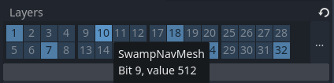

.. _doc_navigation_advanced_using_navigationlayers:

Using NavigationLayers
======================

NavigationLayers are an optional feature to further control which navigation meshes are considered in a path query.
They work similar to how physics layers control collision between collision objects or how visual layers control what is rendered to the Viewport.

NavigationLayers can be named in the **ProjectSettings** the same as physics layers or visual layers.

If a region has not a single compatible navigation layer with the ``navigation_layers`` parameter of a path query this regions navigation mesh will be skipped in pathfinding.
See :ref:`doc_navigation_using_navigationpaths` for more information on querying the NavigationServer for paths.

NavigationLayers are a single ``int`` value that is used as a **bitmask**.
Many navigation related nodes have ``set_navigation_layer_value()`` and
``get_navigation_layer_value()`` functions to set and get a layer number directly
without the need for more complex bitwise operations.

In scripts the following helper functions can be used to work with the ``navigation_layers`` bitmask.

.. tabs::
 .. code-tab:: gdscript 2D GDScript

    func change_layers():
        var region: NavigationRegion2D = get_node("NavigationRegion2D")
        # enables 4-th layer for this region
        region.navigation_layers = enable_bitmask_inx(region.navigation_layers, 4)
        # disables 1-rst layer for this region
        region.navigation_layers = disable_bitmask_inx(region.navigation_layers, 1)

        var agent: NavigationAgent2D = get_node("NavigationAgent2D")
        # make future path queries of this agent ignore regions with 4-th layer
        agent.navigation_layers = disable_bitmask_inx(agent.navigation_layers, 4)

        var path_query_navigation_layers: int = 0
        path_query_navigation_layers = enable_bitmask_inx(path_query_navigation_layers, 2)
        # get a path that only considers 2-nd layer regions
        var path: PackedVector2Array = NavigationServer2D.map_get_path(
            map,
            start_position,
            target_position,
            true,
            path_query_navigation_layers
            )

    static func is_bitmask_inx_enabled(_bitmask: int, _index: int) -> bool:
        return _bitmask & (1 << _index) != 0

    static func enable_bitmask_inx(_bitmask: int, _index: int) -> int:
        return _bitmask | (1 << _index)

    static func disable_bitmask_inx(_bitmask: int, _index: int) -> int:
        return _bitmask & ~(1 << _index)

 .. code-tab:: csharp 2D C#

    using Godot;

    public partial class MyNode2D : Node2D
    {
        private Rid _map;
        private Vector2 _startPosition;
        private Vector2 _targetPosition;

        private void ChangeLayers()
        {
            NavigationRegion2D region = GetNode<NavigationRegion2D>("NavigationRegion2D");
            // Enables the 4th layer for this region.
            region.NavigationLayers = EnableBitmaskInx(region.NavigationLayers, 4);
            // Disables the 1st layer for this region.
            region.NavigationLayers = DisableBitmaskInx(region.NavigationLayers, 1);

            NavigationAgent2D agent = GetNode<NavigationAgent2D>("NavigationAgent2D");
            // Make future path queries of this agent ignore regions with the 4th layer.
            agent.NavigationLayers = DisableBitmaskInx(agent.NavigationLayers, 4);

            uint pathQueryNavigationLayers = 0;
            pathQueryNavigationLayers = EnableBitmaskInx(pathQueryNavigationLayers, 2);
            // Get a path that only considers 2nd layer regions.
            Vector2[] path = NavigationServer2D.MapGetPath(
                _map,
                _startPosition,
                _targetPosition,
                true,
                pathQueryNavigationLayers
            );
        }

        private static bool IsBitmaskInxEnabled(uint bitmask, int index)
        {
            return (bitmask & (1 << index)) != 0;
        }

        private static uint EnableBitmaskInx(uint bitmask, int index)
        {
            return bitmask | (1u << index);
        }

        private static uint DisableBitmaskInx(uint bitmask, int index)
        {
            return bitmask & ~(1u << index);
        }
    }

 .. code-tab:: gdscript 3D GDScript

    func change_layers():
        var region: NavigationRegion3D = get_node("NavigationRegion3D")
        # enables 4-th layer for this region
        region.navigation_layers = enable_bitmask_inx(region.navigation_layers, 4)
        # disables 1-rst layer for this region
        region.navigation_layers = disable_bitmask_inx(region.navigation_layers, 1)

        var agent: NavigationAgent3D = get_node("NavigationAgent3D")
        # make future path queries of this agent ignore regions with 4-th layer
        agent.navigation_layers = disable_bitmask_inx(agent.navigation_layers, 4)

        var path_query_navigation_layers: int = 0
        path_query_navigation_layers = enable_bitmask_inx(path_query_navigation_layers, 2)
        # get a path that only considers 2-nd layer regions
        var path: PackedVector3Array = NavigationServer3D.map_get_path(
            map,
            start_position,
            target_position,
            true,
            path_query_navigation_layers
            )

    static func is_bitmask_inx_enabled(_bitmask: int, _index: int) -> bool:
        return _bitmask & (1 << _index) != 0

    static func enable_bitmask_inx(_bitmask: int, _index: int) -> int:
        return _bitmask | (1 << _index)

    static func disable_bitmask_inx(_bitmask: int, _index: int) -> int:
        return _bitmask & ~(1 << _index)

 .. code-tab:: csharp 3D C#

    using Godot;

    public partial class MyNode3D : Node3D
    {
        private Rid _map;
        private Vector3 _startPosition;
        private Vector3 _targetPosition;

        private void ChangeLayers()
        {
            NavigationRegion3D region = GetNode<NavigationRegion3D>("NavigationRegion3D");
            // Enables the 4th layer for this region.
            region.NavigationLayers = EnableBitmaskInx(region.NavigationLayers, 4);
            // Disables the 1st layer for this region.
            region.NavigationLayers = DisableBitmaskInx(region.NavigationLayers, 1);

            NavigationAgent3D agent = GetNode<NavigationAgent3D>("NavigationAgent2D");
            // Make future path queries of this agent ignore regions with the 4th layer.
            agent.NavigationLayers = DisableBitmaskInx(agent.NavigationLayers, 4);

            uint pathQueryNavigationLayers = 0;
            pathQueryNavigationLayers = EnableBitmaskInx(pathQueryNavigationLayers, 2);
            // Get a path that only considers 2nd layer regions.
            Vector3[] path = NavigationServer3D.MapGetPath(
                _map,
                _startPosition,
                _targetPosition,
                true,
                pathQueryNavigationLayers
            );
        }

        private static bool IsBitmaskInxEnabled(uint bitmask, int index)
        {
            return (bitmask & (1 << index)) != 0;
        }

        private static uint EnableBitmaskInx(uint bitmask, int index)
        {
            return bitmask | (1u << index);
        }

        private static uint DisableBitmaskInx(uint bitmask, int index)
        {
            return bitmask & ~(1u << index);
        }
    }

Changing navigation layers for path queries is a performance friendly alternative to
enabling / disabling entire navigation regions. Compared to region changes a
navigation path query with different navigation layers does not
trigger large scale updates on the NavigationServer.

Changing the navigation layers of NavigationAgent nodes will have an immediate
effect on the next path query. Changing the navigation layers of
regions will have an effect after the next NavigationServer sync.
