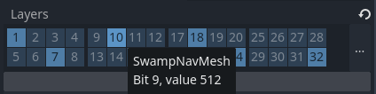

.. _doc_navigation_advanced_using_navigationlayers:

Using navigation layers
=======================

Navigation layers are an optional feature to further specify which navigation
meshes are considered in a path query.
They work similarly to how physics layers specify collisions between collision
objects, or how visual layers specify what is rendered to a viewport.

Navigation layers can be named in the **Project Settings** in the same way
as physics layers or visual layers.

If a region does not have any compatible navigation layer with the ``navigation_layers``
parameter of a path query, the region's navigation mesh will be skipped in the pathfinding.
See :ref:`doc_navigation_using_navigationpaths` for more information on querying
the NavigationServer for paths.

Navigation layers are contained in a single ``int`` value that is used as a **bitmask**.
Many navigation-related nodes have ``set_navigation_layer_value()`` and
``get_navigation_layer_value()`` functions to access a layer by number directly,
without the need for more complex bitwise operations.

.. tabs::
 .. code-tab:: gdscript GDScript

    @onready var region = get_node("MyNavigationRegion")
    @onready var agent = get_node("MyNavigationAgent")

    func _ready():
        # Enables layer 4 for this region.
        region.set_navigation_layer_value(4, true)
        # Disables layer 1 for this region.
        region.set_navigation_layer_value(1, false)

        # Make future path queries of this agent ignore regions with layer 4.
        agent.set_navigation_layer_value(4, false)

    .. TODO: C# example.

.. tabs::
 .. code-tab:: gdscript GDScript (2D)

    var map: RID
    var start_position: Vector2
    var target_position: Vector2

    func get_path():
        # Get a path that only considers layer 2 regions.
        var path: PackedVector2Array = NavigationServer2D.map_get_path(
                map,
                start_position,
                target_position,
                true,
                0b10
        )

 .. code-tab:: csharp C# (2D)

    private Rid _map;
    private Vector2 _startPosition;
    private Vector2 _targetPosition;

    private void GetPath()
    {
        // Get a path that only considers layer 2 regions.
        Vector2[] path = NavigationServer2D.MapGetPath(
            _map,
            _startPosition,
            _targetPosition,
            true,
            0b01
        );
    }

 .. code-tab:: gdscript GDScript (3D)

    var map: RID
    var start_position: Vector3
    var target_position: Vector3

    func get_path():
        # Get a path that only considers layer 2 regions.
        var path: PackedVector3Array = NavigationServer3D.map_get_path(
                map,
                start_position,
                target_position,
                true,
                0b10
        )

 .. code-tab:: csharp C# (3D)

    private Rid _map;
    private Vector3 _startPosition;
    private Vector3 _targetPosition;

    private void GetPath()
    {
        // Get a path that only considers layer 2 regions.
        Vector3[] path = NavigationServer3D.MapGetPath(
            _map,
            _startPosition,
            _targetPosition,
            true,
            0b01
        );
    }

Inside a script, the following helper functions can make it easier to work
with the ``navigation_layers`` bitmask:

.. tabs::
 .. code-tab:: gdscript

    static func is_bitmask_idx_enabled(bitmask: int, index: int) -> bool:
        return bitmask & (1 << index) != 0

    static func enable_bitmask_idx(bitmask: int, index: int) -> int:
        return bitmask | (1 << index)

    static func disable_bitmask_idx(bitmask: int, index: int) -> int:
        return bitmask & ~(1 << index)

 .. code-tab:: csharp 2D C#

    private static bool IsBitmaskIdxEnabled(uint bitmask, int index)
    {
        return (bitmask & (1 << index)) != 0;
    }

    private static uint EnableBitmaskIdx(uint bitmask, int index)
    {
        return bitmask | (1u << index);
    }

    private static uint DisableBitmaskIdx(uint bitmask, int index)
    {
        return bitmask & ~(1u << index);
    }

Changing navigation layers for path queries is a performance-friendly alternative to
enabling/disabling entire navigation regions. Compared to region changes, a
navigation path query with different navigation layers does not
trigger large-scale updates on the NavigationServer.

Changing the navigation layers of a navigation agent will have an immediate
effect on the next path query. Changing the navigation layers of
a region will have an effect after the next NavigationServer sync.
