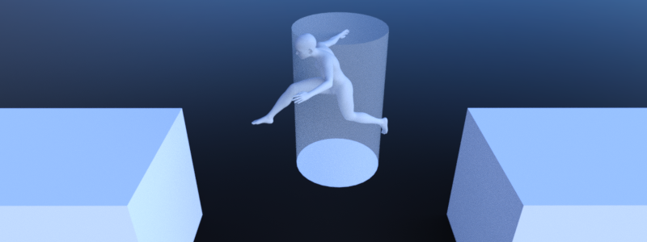
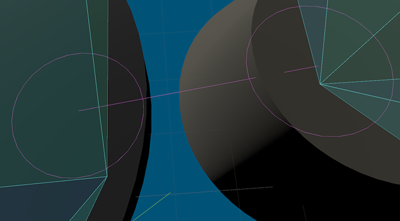

.. _doc_navigation_using_navigationlinks:

Using NavigationLinks
=====================

NavigationLinks are used to connect navigation mesh polygons from :ref:`NavigationRegion2D<class_NavigationRegion2D>`
and :ref:`NavigationRegion3D<class_NavigationRegion3D>` over arbitrary distances for pathfinding.

NavigationLinks are also used to consider movement shortcuts in pathfinding available through
interacting with gameplay objects e.g. ladders, jump pads or teleports.

2D and 3D versions of NavigationJumplinks nodes are available as
:ref:`NavigationLink2D<class_NavigationLink2D>` and
:ref:`NavigationLink3D<class_NavigationLink3D>` respectively.

Different NavigationRegions can connect their navigation meshes without the need for a NavigationLink
as long as they are within navigation map ``edge_connection_margin`` and have compatible ``navigation_layers``.
As soon as the distance becomes too large, building valid connections becomes a problem - a problem that NavigationLinks can solve.

See :ref:`doc_navigation_using_navigationregions` to learn more about the use of navigation regions.
See :ref:`doc_navigation_connecting_navmesh` to learn more about how to connect navigation meshes.

.. image:: img/nav_link_properties.png

NavigationLinks share many properties with NavigationRegions like ``navigation_layers``.
NavigationLinks add a single connection between two positions over an arbitrary distance
compared to NavigationRegions that add a more local traversable area with a navigation mesh resource.

NavigationLinks have a ``start_position`` and ``end_position`` and can go in both directions when ``bidirectional`` is enabled.
When placed a navigationlink connects the navigation mesh polygons closest to its ``start_position`` and ``end_position`` within search radius for pathfinding.

The polygon search radius can be configured globally in the ProjectSettings under ``navigation/2d_or_3d/default_link_connection_radius``
or set for each navigation **map** individually using the ``NavigationServer.map_set_link_connection_radius()`` function.

Both ``start_position`` and ``end_position`` have debug markers in the Editor.
The visible radius of a position shows the polygon search radius.
All navigation mesh polygons inside are compared and the closest is picked for the edge connection.
If no valid polygon is found within the search radius the navigation link gets disabled.

The link debug visuals can be changed in the Editor :ref:`ProjectSettings<class_ProjectSettings>` under ``debug/shapes/navigation``.
The visibility of the debug can also be controlled in the Editor 3D Viewport gizmo menu.

A navigation link does not provide any specialized movement through the link. Instead, when
an agent reaches the position of a link, game code needs to react (e.g. through area triggers)
and provide means for the agent to move through the link to end up at the links other position
(e.g. through teleport or animation). Without that an agent will attempt to move itself along
the path of the link. You could end up with an agent walking over a bottomless pit instead of
waiting for a moving platform, or walking through a teleporter and proceeding through a wall.

Navigation link script templates
--------------------------------

The following script uses the NavigationServer to create a new navigation link.

.. tabs::
 .. code-tab:: gdscript 2D GDScript

    extends Node2D

    var link_rid: RID
    var link_start_position: Vector2
    var link_end_position: Vector2

    func _ready() -> void:
        link_rid = NavigationServer2D.link_create()

        var link_owner_id: int = get_instance_id()
        var link_enter_cost: float = 1.0
        var link_travel_cost: float = 1.0
        var link_navigation_layers: int = 1
        var link_bidirectional: bool = true

        NavigationServer2D.link_set_owner_id(link_rid, link_owner_id)
        NavigationServer2D.link_set_enter_cost(link_rid, link_enter_cost)
        NavigationServer2D.link_set_travel_cost(link_rid, link_travel_cost)
        NavigationServer2D.link_set_navigation_layers(link_rid, link_navigation_layers)
        NavigationServer2D.link_set_bidirectional(link_rid, link_bidirectional)

        # Enable the link and set it to the default navigation map.
        NavigationServer2D.link_set_enabled(link_rid, true)
        NavigationServer2D.link_set_map(link_rid, get_world_2d().get_navigation_map())

        # Move the 2 link positions to their intended global positions.
        NavigationServer2D.link_set_start_position(link_rid, link_start_position)
        NavigationServer2D.link_set_end_position(link_rid, link_end_position)

 .. code-tab:: gdscript 3D GDScript

    extends Node3D

    var link_rid: RID
    var link_start_position: Vector3
    var link_end_position: Vector3

    func _ready() -> void:
        link_rid = NavigationServer3D.link_create()

        var link_owner_id: int = get_instance_id()
        var link_enter_cost: float = 1.0
        var link_travel_cost: float = 1.0
        var link_navigation_layers: int = 1
        var link_bidirectional: bool = true

        NavigationServer3D.link_set_owner_id(link_rid, link_owner_id)
        NavigationServer3D.link_set_enter_cost(link_rid, link_enter_cost)
        NavigationServer3D.link_set_travel_cost(link_rid, link_travel_cost)
        NavigationServer3D.link_set_navigation_layers(link_rid, link_navigation_layers)
        NavigationServer3D.link_set_bidirectional(link_rid, link_bidirectional)

        # Enable the link and set it to the default navigation map.
        NavigationServer3D.link_set_enabled(link_rid, true)
        NavigationServer3D.link_set_map(link_rid, get_world_3d().get_navigation_map())

        # Move the 2 link positions to their intended global positions.
        NavigationServer3D.link_set_start_position(link_rid, link_start_position)
        NavigationServer3D.link_set_end_position(link_rid, link_end_position)
