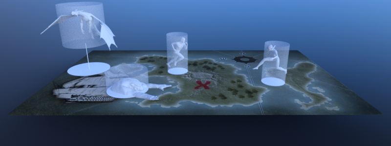

.. _doc_navigation_using_navigationmaps:

Using NavigationMaps
====================

A NavigationMap is an abstract navigation world on the NavigationServer identified by a NavigationServer :ref:`RID<class_RID>`.

A map can hold and connect a near infinite number of navigation regions with navigation meshes to build the traversable areas of a game world for pathfinding.

A map can contain avoidance agents. Collision avoidance will be calculated based on the agents present in the map.

.. note::

    Different NavigationMaps are completely isolated from each other but navigation regions
    and avoidance agents can switch between different maps. Switches will become effective on NavigationServer synchronization.

Default navigation maps
~~~~~~~~~~~~~~~~~~~~~~~

By default Godot creates a navigation map for each :ref:`World2D<class_World2D>` and :ref:`World3D<class_World3D>` of the root viewport.

The 2D default navigation map RID can be obtained with ``get_world_2d().get_navigation_map()`` from any :ref:`Node2D<class_Node2D>` inheriting Node.

The 3D default navigation map RID can be obtained with ``get_world_3d().get_navigation_map()`` from any :ref:`Node3D<class_Node3D>` inheriting Node.

.. tabs::
 .. code-tab:: gdscript 2D GDScript

    extends Node2D

    func _ready() -> void:
        var default_navigation_map_rid: RID = get_world_2d().get_navigation_map()

 .. code-tab:: gdscript 3D GDScript

    extends Node3D

    func _ready() -> void:
        var default_navigation_map_rid: RID = get_world_3d().get_navigation_map()

Creating new navigation maps
~~~~~~~~~~~~~~~~~~~~~~~~~~~~

The NavigationServer can create and support as many navigation maps as required for specific gameplay.
Additional navigation maps are created and handled by using the NavigationServer API
directly e.g. to support different avoidance agent or actor locomotion types.

For example uses of different navigation maps see :ref:`doc_navigation_different_actor_types` and :ref:`doc_navigation_different_actor_locomotion`.

Each navigation map individually synchronizes queued changes to its navigation regions and avoidance agents.
A navigation map that has not received changes will consume little to no processing time.
Navigation regions and avoidance agents can only be part of a single navigation map but they can switch map at any time.

.. note::

    A navigation map switch will take effect only after the next NavigationServer synchronization.

.. tabs::
 .. code-tab:: gdscript 2D GDScript

    extends Node2D

    func _ready() -> void:
        var new_navigation_map: RID = NavigationServer2D.map_create()
        NavigationServer2D.map_set_active(true)

 .. code-tab:: gdscript 3D GDScript

    extends Node3D

    func _ready() -> void:
        var new_navigation_map: RID = NavigationServer3D.map_create()
        NavigationServer3D.map_set_active(true)

.. note::

    There is no difference between navigation maps created with the NavigationServer2D API or the NavigationServer3D API.
