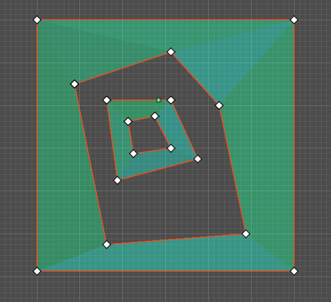
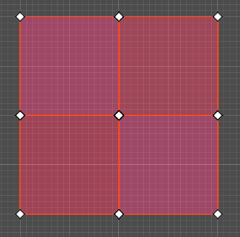
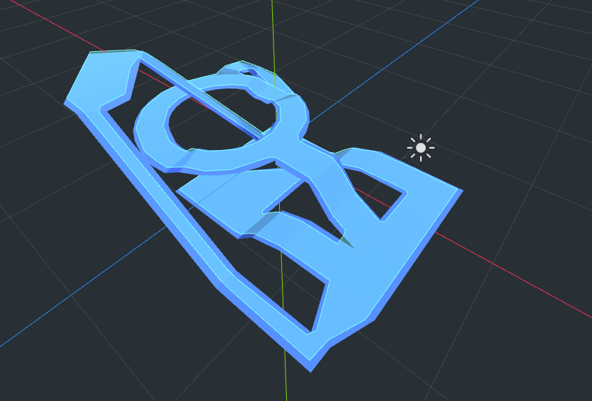

.. _doc_navigation_using_navigationmeshes:

Using navigation meshes
=======================

2D and 3D versions of the navigation mesh are available as
:ref:`NavigationPolygon<class_NavigationPolygon>` and
:ref:`NavigationMesh<class_NavigationMesh>`  respectively.

.. note::

    A navigation mesh only describes a traversable area for an agent's center position. Any radius values an agent may have are ignored.
    If you want pathfinding to account for an agent's (collision) size you need to shrink the navigation mesh accordingly.

Navigation works independently from other engine parts like rendering or physics.
Navigation meshes are the only things considered when doing pathfinding, e.g. visuals and collision shapes for example are completely ignored by the navigation system.
If you need to take other data (like visuals for example) into account when doing pathfinding, you need to adapt your navigation meshes accordingly.
The process of factoring in navigation restrictions in navigation meshes is commonly referred to as navigation mesh baking.

If you experience clipping or collision problems while following navigation paths, always remember that you need to tell the navigation system what your intentions are through an appropriate navigation mesh.
By itself the navigation system will never know "this is a tree / rock / wall collision shape or visual mesh" because it only knows that "here I was told I can path safely because it is on a navigation mesh".

.. _doc_navigation_navmesh_baking:

Creating 2D navigation meshes
~~~~~~~~~~~~~~~~~~~~~~~~~~~~~

Navigation meshes in the 2D editor are created with the help of the NavigationPolygon draw tools
that appear in the top bar of the editor when a NavigationRegion2D is selected.

The NavigationPolygon draw tools can be used to create and edit navigation meshes by defining **outline** polygons.
The outline polygons are later converted to real navigation mesh resources for the NavigationServer regions.

Multiple outlines can be added to the same NavigationPolygon resource as long as they **do not intersect or overlap**.
Each additional outline will cut a hole in the polygon created by the larger outline.
If the larger polygon is already a hole, it will create a new navigation mesh polygon inside.

Outlines are not a replacement if the intention is to merge aligned polygons e.g. from grid cells.
Outlines, as the name would suggest, cannot intersect each other or have any overlapping vertex positions.

Outline layouts like seen in this picture will fail the convex partitioning required by the navigation mesh generation.
In these layout cases, the outline tool cannot be used. Use the :ref:`Geometry2D<class_Geometry2D>` class to merge or intersect polygons to create a merged mesh that is valid for navigation.

.. note::

    The NavigationServer does not connect navigation mesh islands from the same navigation mesh resource.
    Do not create multiple disconnected islands in the same NavigationRegion2D or NavigationPolygon resource if they should be later connected.

For 2D, no similar navigation mesh baking with geometry parsing exists like in 3D.
The Geometry2D class functions for offset, merge, intersect, and clip can be used to shrink or enlarge existing NavigationPolygons for different actor sizes.

Creating 3D navigation meshes
~~~~~~~~~~~~~~~~~~~~~~~~~~~~~

Navigation meshes in the 3D editor are created with the help of the
:ref:`NavigationMeshGenerator<class_NavigationMeshGenerator>` singleton
and the NavigationMesh bake settings that appear in the editor inspector.

Navigation mesh baking is the process of creating a simplified mesh used for pathfinding out of (complex) 3D level geometry.
For this process Godot parses scene geometry and hands the raw mesh or collision data to the
third-party ReCast library for processing and creation of the final navigation mesh.

The resulting navigation mesh is an approximation of the source geometry surfaces
for both performance and technical reasons. Do not expect the navigation mesh
to perfectly follow the original surfaces. Especially navigation polygons placed
over ramps will not keep an equal distance to the ground surface. To align an
actor perfectly with the ground use other means like physics.

.. warning::

    Meshes need to be triangulated to work as navigation meshes. Other mesh face formats like quad or ngon are not supported.

NavigationMesh rebaking at runtime
~~~~~~~~~~~~~~~~~~~~~~~~~~~~~~~~~~

To rebake a ``NavigationMesh`` at runtime, use the ``NavigationRegion3D.bake_navigation_mesh()`` function.
Another option is to use the ``NavigationMeshGenerator.bake()`` singleton function with the NavigationMesh resource directly.
If the NavigationMesh resource is already prepared, the region can be updated with the NavigationServer3D API directly as well.

.. tabs::
 .. code-tab:: gdscript GDScript

    extends NavigationRegion3D

    func update_navigation_mesh():

        # use bake and update function of region
        var on_thread: bool = true
        bake_navigation_mesh(on_thread)

        # or use the NavigationMeshGenerator singleton
        var _navigationmesh: NavigationMesh = navigation_mesh
        NavigationMeshGenerator.bake(_navigationmesh, self)
        # remove old resource first to trigger a full update
        navigation_mesh = null
        navigation_mesh = _navigationmesh

        # or use NavigationServer API to update region with prepared navigation mesh
        var region_rid: RID = get_region_rid()
        NavigationServer3D.region_set_navigation_mesh(region_rid, navigation_mesh)

.. note::

    Baking a NavigationMesh at runtime is a costly operation.
    A complex navigation mesh takes some time to bake and if done on the main thread can freeze a game.
    (Re)baking a large navigation mesh is preferably done in a separate thread.

.. warning::

    Property values on a NavigationMesh resource like ``cell_size`` need
    to match the actual mesh data stored inside in order to merge
    different navigation meshes without issues.

NavigationRegion2D and NavigationRegion3D both use meshes to mark traversable areas, only the tools to create them are different.

For 2D, NavigationPolygon resources are used to draw outline points in the editor. From these outline points the NavigationServer2D creates a mesh to upload navigation data to the NavigationServer.

For 3D, NavigationMesh resources are used. Instead of providing draw tools the 3D variant
provides an extensive amount of parameters to bake a navigation mesh directly from 3D source geometry.

.. note::

    Technically there is no hard distinction between 2D and 3D on how to use the given toolsets to create flat navigation meshes. The 2D drawing tool can be used to create a flat 3D navigation mesh and the 3D baking tool can be used to parse flat 3D geometry into appropriate 2D navigation meshes.

2D navigation mesh from CollisionPolygons
~~~~~~~~~~~~~~~~~~~~~~~~~~~~~~~~~~~~~~~~~

The following script parses all child nodes of a NavigationRegion2D for CollisionPolygons
and bakes their shape into the NavigationPolygon. As the NavigationPolygon creates the
navigation mesh from outline data the shapes cannot overlap.

.. tabs::
 .. code-tab:: gdscript GDScript

    extends NavigationRegion2D

    var new_navigation_polygon: NavigationPolygon = get_navigation_polygon()

    func _ready():

        parse_2d_collisionshapes(self)

        new_navigation_polygon.make_polygons_from_outlines()
        set_navigation_polygon(new_navigation_polygon)

    func parse_2d_collisionshapes(root_node: Node2D):

        for node in root_node.get_children():

            if node.get_child_count() > 0:
                parse_2d_collisionshapes(node)

            if node is CollisionPolygon2D:

                var collisionpolygon_transform: Transform2D = node.get_global_transform()
                var collisionpolygon: PackedVector2Array = node.polygon

                var new_collision_outline: PackedVector2Array = collisionpolygon_transform * collisionpolygon

                new_navigation_polygon.add_outline(new_collision_outline)

Procedural 2D navigation mesh
~~~~~~~~~~~~~~~~~~~~~~~~~~~~~

The following script creates a new 2D navigation region and fills it with procedurally generated navigation mesh data from a NavigationPolygon resource.

.. tabs::
 .. code-tab:: gdscript GDScript

    extends Node2D

    var new_2d_region_rid: RID = NavigationServer2D.region_create()

    var default_2d_map_rid: RID = get_world_2d().get_navigation_map()
    NavigationServer2D.region_set_map(new_2d_region_rid, default_2d_map_rid)

    var new_navigation_polygon: NavigationPolygon = NavigationPolygon.new()
    var new_outline: PackedVector2Array = PackedVector2Array([
        Vector2(0.0, 0.0),
        Vector2(50.0, 0.0),
        Vector2(50.0, 50.0),
        Vector2(0.0, 50.0),
    ])
    new_navigation_polygon.add_outline(new_outline)
    new_navigation_polygon.make_polygons_from_outlines()

    NavigationServer2D.region_set_navigation_polygon(new_2d_region_rid, new_navigation_polygon)

Procedural 3D navigation mesh
~~~~~~~~~~~~~~~~~~~~~~~~~~~~~

The following script creates a new 3D navigation region and fills it with procedurally generated navigation mesh data from a NavigationMesh resource.

.. tabs::
 .. code-tab:: gdscript GDScript

    extends Node3D

    var new_3d_region_rid: RID = NavigationServer3D.region_create()

    var default_3d_map_rid: RID = get_world_3d().get_navigation_map()
    NavigationServer3D.region_set_map(new_3d_region_rid, default_3d_map_rid)

    var new_navigation_mesh: NavigationMesh = NavigationMesh.new()
    # Add vertices for a triangle.
    new_navigation_mesh.vertices = PackedVector3Array([
        Vector3(-1.0, 0.0, 1.0),
        Vector3(1.0, 0.0, 1.0),
        Vector3(1.0, 0.0, -1.0)
    ])
    # Add indices for the polygon.
    new_navigation_mesh.add_polygon(
        PackedInt32Array([0, 1, 2])
    )
    NavigationServer3D.region_set_navigation_mesh(new_3d_region_rid, new_navigation_mesh)

Navigation mesh for 3D GridMaps
~~~~~~~~~~~~~~~~~~~~~~~~~~~~~~~

The following script creates a new 3D navigation mesh for each GridMap items, clears the current grid cells, and adds new procedural grid cells with the new navigation mesh.

.. tabs::
 .. code-tab:: gdscript GDScript

    extends GridMap

    # enable navigation mesh for grid items
    set_bake_navigation(true)

    # get grid items, create and set a new navigation mesh for each item in the MeshLibrary
    var gridmap_item_list: PackedInt32Array = mesh_library.get_item_list()
    for item in gridmap_item_list:
        var new_item_navigation_mesh: NavigationMesh = NavigationMesh.new()
        # Add vertices and polygons that describe the traversable ground surface.
        # E.g. for a convex polygon that resembles a flat square.
        new_item_navigation_mesh.vertices = PackedVector3Array([
            Vector3(-1.0, 0.0, 1.0),
            Vector3(1.0, 0.0, 1.0),
            Vector3(1.0, 0.0, -1.0),
            Vector3(-1.0, 0.0, -1.0),
        ])
        new_item_navigation_mesh.add_polygon(
            PackedInt32Array([0, 1, 2, 3])
        )
        mesh_library.set_item_navigation_mesh(item, new_item_navigation_mesh)
        mesh_library.set_item_navigation_mesh_transform(item, Transform3D())

    # clear the cells
    clear()

    # add procedural cells using the first item
    var _position: Vector3i = Vector3i(global_transform.origin)
    var _item: int = 0
    var _orientation: int = 0
    for i in range(0,10):
        for j in range(0,10):
            _position.x = i
            _position.z = j
            gridmap.set_cell_item(_position, _item, _orientation)
            _position.x = -i
            _position.z = -j
            gridmap.set_cell_item(_position, _item, _orientation)
