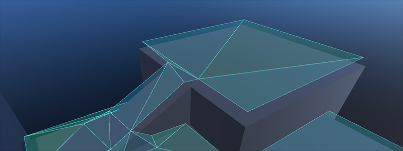
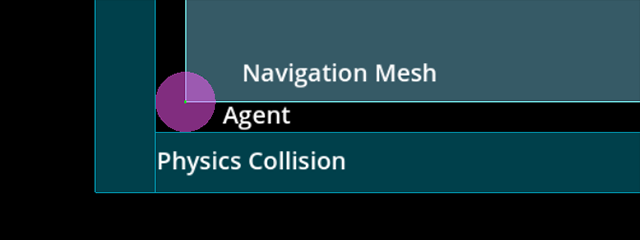
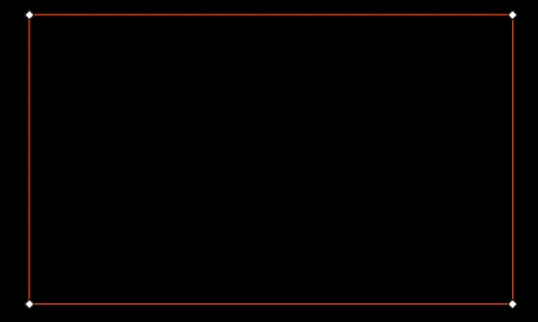

.. _doc_navigation_using_navigationmeshes:

Using navigation meshes
=======================

2D and 3D versions of the navigation mesh are available as
:ref:`NavigationPolygon<class_NavigationPolygon>` and
:ref:`NavigationMesh<class_NavigationMesh>`  respectively.

.. note::

    A navigation mesh only describes a traversable area for an agent's center position. Any radius values an agent may have are ignored.
    If you want pathfinding to account for an agent's (collision) size you need to shrink the navigation mesh accordingly.

Navigation works independently from other engine parts like rendering or physics.
Navigation meshes are the only things considered when doing pathfinding, e.g. visuals and collision shapes for example are completely ignored by the navigation system.
If you need to take other data (like visuals for example) into account when doing pathfinding, you need to adapt your navigation meshes accordingly.
The process of factoring in navigation restrictions in navigation meshes is commonly referred to as navigation mesh baking.

   A navigation mesh describes a surface that an agent can stand on safely with its center compared to physics shapes that describe outer collision bounds.

If you experience clipping or collision problems while following navigation paths, always remember that you need to tell the navigation system what your intentions are through an appropriate navigation mesh.
By itself the navigation system will never know "this is a tree / rock / wall collision shape or visual mesh" because it only knows that "here I was told I can path safely because it is on a navigation mesh".

.. _doc_navigation_navmesh_baking:

Navigation mesh baking can be done either by using a :ref:`NavigationRegion2D<class_NavigationRegion2D>` or :ref:`NavigationRegion3D<class_NavigationRegion3D>`, or by using the 
:ref:`NavigationServer2D<class_NavigationServer2D>` and :ref:`NavigationServer3D<class_NavigationServer3D>` API directly.

.. _doc_navigation_using_navigationmeshes_baking_navigation_mesh_with_navigationregion:

Baking a navigation mesh with a NavigationRegion
------------------------------------------------

   Baking a navigation mesh with agent radius offset from geometry.

The navigation mesh baking is made more accessible with the NavigationRegion node. When baking with a NavigationRegion
node, the individual parsing, baking, and region update steps are all combined into one function.

The nodes are available in 2D and 3D as :ref:`NavigationRegion2D<class_NavigationRegion2D>` and :ref:`NavigationRegion3D<class_NavigationRegion3D>` respectively.

.. tabs::

   .. tab:: Baking with a NavigationRegion2D

        When a NavigationRegion2D node is selected in the Editor, bake options as well as polygon draw tools appear in the top bar of the Editor.

        .. image:: img/nav_region_baking_01.webp

        In order for the region to work a :ref:`NavigationPolygon<class_NavigationPolygon>` resource needs to be added.

        The properties to parse and bake a navigation mesh are then part of the used resource and can be found in the resource Inspector.

        .. image:: img/nav_region_baking_02.webp

        The result of the source geometry parsing can be influenced with the following properties.

        - The ``parsed_geometry_type`` that filters if visual objects or physics objects or both should be parsed from the :ref:`SceneTree<class_SceneTree>`.
          For more details on what objects are parsed and how, see the section about parsing source geometry below.
        - The ``collision_mask`` filters which physics collision objects are included when the ``parsed_geometry_type`` includes static colliders.
        - The ``source_geometry_mode`` that defines on which node(s) to start the parsing, and how to traverse the :ref:`SceneTree<class_SceneTree>`.
        - The ``source_geometry_group_name`` is used when only a certain node group should be parsed. Depends on the selected ``source_geometry_mode``.

        With the source geometry added, the result of the baking can be controlled with the following properties.

        - The ``cell_size`` sets the rasterization grid size and should match the navigation map size.
        - The ``agent_radius`` shrinks the baked navigation mesh to have enough margin for the agent (collision) size.

        The NavigationRegion2D baking can also be used at runtime with scripts.

        .. tabs::
         .. code-tab:: gdscript GDScript

            var on_thread: bool = true
            bake_navigation_polygon(on_thread)

        To quickly test the 2D baking with default settings:

        - Add a :ref:`NavigationRegion2D<class_NavigationRegion2D>`.
        - Add a :ref:`NavigationPolygon<class_NavigationPolygon>` resource to the NavigationRegion2D.
        - Add a :ref:`Polygon2D<class_Polygon2D>` below the NavigationRegion2D.
        - Draw 1 NavigationPolygon outline with the selected NavigationRegion2D draw tool.
        - Draw 1 Polygon2D outline inside the NavigationPolygon outline with the selected Polygon2D draw tool.
        - Hit the Editor bake button and a navigation mesh should appear.

        .. image:: img/nav_region_baking_01.webp

        .. image:: img/nav_mesh_mini_2d.webp

   .. tab:: Baking with a NavigationRegion3D

        When a NavigationRegion3D node is selected in the Editor, bake options appear in the top bar of the Editor.

        .. image:: img/nav_mesh_bake_toolbar.webp

        In order for the region to work a :ref:`NavigationMesh<class_NavigationMesh>` resource needs to be added.

        The properties to parse and bake a navigation mesh are then part of the used resource and can be found in the resource Inspector.

        .. image:: img/nav_region3d_baking_01.webp

        The result of the source geometry parsing can be influenced with the following properties.

        - The ``parsed_geometry_type`` that filters if visual objects or physics objects or both should be parsed from the :ref:`SceneTree<class_SceneTree>`.
          For more details on what objects are parsed and how, see the section about parsing source geometry below.
        - The ``collision_mask`` filters which physics collision objects are included when the ``parsed_geometry_type`` includes static colliders.
        - The ``source_geometry_mode`` that defines on which node(s) to start the parsing, and how to traverse the :ref:`SceneTree<class_SceneTree>`.
        - The ``source_geometry_group_name`` is used when only a certain node group should be parsed. Depends on the selected ``source_geometry_mode``.

        With the source geometry added, the result of the baking can be controlled with the following properties.

        - The ``cell_size`` and ``cell_height`` sets the rasterization voxel grid size and should match the navigation map size.
        - The ``agent_radius`` shrinks the baked navigation mesh to have enough margin for the agent (collision) size.
        - The ``agent_height`` excludes areas from the navigation mesh where the agent is too tall to fit in.
        - The ``agent_max_climb`` and ``agent_max_slope`` removes areas where the height difference between neighboring voxels is too large, or where their surface is too steep.

        .. warning::

            A too small ``cell_size`` or ``cell_height`` can create so many voxels that it has the potential to freeze the game or even crash.

        The NavigationRegion3D baking can also be used at runtime with scripts.

        .. tabs::
         .. code-tab:: gdscript GDScript

            var on_thread: bool = true
            bake_navigation_mesh(on_thread)

        To quickly test the 3D baking with default settings:

        - Add a :ref:`NavigationRegion3D<class_NavigationRegion3D>`.
        - Add a :ref:`NavigationMesh<class_NavigationMesh>` resource to the NavigationRegion3D.
        - Add a :ref:`MeshInstance3D<class_MeshInstance3D>` below the NavigationRegion3D.
        - Add a :ref:`PlaneMesh<class_PlaneMesh>` to the MeshInstance3D.
        - Hit the Editor bake button and a navigation mesh should appear.

        .. image:: img/nav_mesh_bake_toolbar.webp

        .. image:: img/nav_mesh_mini_3d.webp

.. _doc_navigation_using_navigationmeshes_baking_navigation_mesh_with_navigationserver:

Baking a navigation mesh with the NavigationServer
--------------------------------------------------

The :ref:`NavigationServer2D<class_NavigationServer2D>` and :ref:`NavigationServer3D<class_NavigationServer3D>` have API functions to call each step of the navigation mesh baking process individually.

- ``parse_source_geometry_data()`` can be used to parse source geometry to a reusable and serializable resource.
- ``bake_from_source_geometry_data()`` can be used to bake a navigation mesh from already parsed data e.g. to avoid runtime performance issues with (redundant) parsing.
- ``bake_from_source_geometry_data_async()`` is the same but bakes the navigation mesh deferred with threads, not blocking the main thread.

Compared to a NavigationRegion, the NavigationServer offers finer control over the navigation mesh baking process.
In turn it is more complex to use but also provides more advanced options.

Some other advantages of the NavigationServer over a NavigationRegion are:

- The server can parse source geometry without baking, e.g. to cache it for later use.
- The server allows selecting the root node at which to start the source geometry parsing manually.
- The server can accept and bake from procedurally generated source geometry data.
- The server can bake multiple navigation meshes in sequence while (re)using the same source geometry data.

To bake navigation meshes with the NavigationServer, source geometry is required.
Source geometry is geometry data that should be considered in a navigation mesh baking process.
Both navigation meshes for 2D and 3D are created by baking them from source geometry.

2D and 3D versions of the source geometry resources are available as
:ref:`NavigationMeshSourceGeometryData2D<class_NavigationMeshSourceGeometryData2D>` and
:ref:`NavigationMeshSourceGeometryData3D<class_NavigationMeshSourceGeometryData3D>`  respectively.

Source geometry can be geometry parsed from visual meshes, from physics collision,
or procedural created arrays of data, like outlines (2D) and triangle faces (3D).
For convenience, source geometry is commonly parsed directly from node setups in the SceneTree.
For runtime navigation mesh (re)bakes, be aware that the geometry parsing always happens on the main thread.

.. note::

    The SceneTree is not thread-safe. Parsing source geometry from the SceneTree can only be done on the main thread.

.. warning::

    The data from visual meshes and polygons needs to be received from the GPU, stalling the RenderingServer in the process.
    For runtime (re)baking prefer using physics shapes as parsed source geometry.

Source geometry is stored inside resources so the created geometry can be reused for multiple bakes.
E.g. baking multiple navigation meshes for different agent sizes from the same source geometry.
This also allows to save source geometry to disk so it can be loaded later, e.g. to avoid the overhead of parsing it again at runtime.

The geometry data should be in general kept very simple. As many edges as are required but as few as possible.
Especially in 2D duplicated and nested geometry should be avoided as it forces polygon hole calculation that can result in flipped polygons.
An example for nested geometry would be a smaller StaticBody2D shape placed completely inside the bounds of another StaticBody2D shape.

Navigation mesh baking common problems
--------------------------------------

There are some common user problems and important caveats to consider when creating or baking navigation meshes.

- Navigation mesh baking creates frame rate problems at runtime
    The navigation mesh baking is by default done on a background thread, so as long as the platform supports threads, the actual baking is
    rarely the source of any performance issues (assuming a reasonably sized and complex geometry for runtime rebakes).

    The common source for performance issues at runtime is the parsing step for source geometry that involves nodes and the SceneTree.
    The SceneTree is not thread-safe so all the nodes need to be parsed on the main thread.
    Some nodes with a lot of data can be very heavy and slow to parse at runtime, e.g. a TileMap has one or more polygons for every single used cell and TileMapLayer to parse.
    Nodes that hold meshes need to request the data from the RenderingServer stalling the rendering in the process.

    To improve performance, use more optimized shapes, e.g. collision shapes over detailed visual meshes, and merge and simplify as much geometry as possible upfront.
    If nothing helps, don't parse the SceneTree and add the source geometry procedural with scripts. If only pure data arrays are used as source geometry, the entire baking process can be done on a background thread.

- Navigation mesh creates unintended holes in 2D.
    The navigation mesh baking in 2D is done by doing polygon clipping operations based on outline paths.
    Polygons with "holes" are a necessary evil to create more complex 2D polygons but can become unpredictable for users with many complex shapes involved.

    To avoid any unexpected problems with polygon hole calculations, avoid nesting any outlines inside other outlines of the same type (traversable / obstruction).
    This includes the parsed shapes from nodes. E.g. placing a smaller StaticBody2D shape inside a larger StaticBody2D shape can result in the resulting polygon being flipped.

- Navigation mesh appears inside geometry in 3D.
    The navigation mesh baking in 3D has no concept of "inside". The voxel cells used to rasterize the geometry are either occupied or not.
    Remove the geometry that is on the ground inside the other geometry. If that is not possible, add smaller "dummy" geometry inside with as few triangles as possible so the cells
    are occupied with something.

Navigation mesh script templates
--------------------------------

The following script uses the NavigationServer to parse source geometry from the scene tree, bakes a navigation mesh, and updates a navigation region with the updated navigation mesh.

.. tabs::
 .. code-tab:: gdscript 2D GDScript

    extends Node2D

    var navigation_mesh: NavigationPolygon
    var source_geometry : NavigationMeshSourceGeometryData2D
    var callback_parsing : Callable
    var callback_baking : Callable
    var region_rid: RID

    func _ready() -> void:
        navigation_mesh = NavigationPolygon.new()
        navigation_mesh.agent_radius = 10.0
        source_geometry = NavigationMeshSourceGeometryData2D.new()
        callback_parsing = on_parsing_done
        callback_baking = on_baking_done
        region_rid = NavigationServer2D.region_create()

        # Enable the region and set it to the default navigation map.
        NavigationServer2D.region_set_enabled(region_rid, true)
        NavigationServer2D.region_set_map(region_rid, get_world_2d().get_navigation_map())

        # Some mega-nodes like TileMap are often not ready on the first frame.
        # Also the parsing needs to happen on the main-thread.
        # So do a deferred call to avoid common parsing issues.
        parse_source_geometry.call_deferred()

    func parse_source_geometry() -> void:
        source_geometry.clear()
        var root_node: Node2D = self

        # Parse the obstruction outlines from all child nodes of the root node by default.
        NavigationServer2D.parse_source_geometry_data(
            navigation_mesh,
            source_geometry,
            root_node,
            callback_parsing
        )

    func on_parsing_done() -> void:
        # If we did not parse a TileMap with navigation mesh cells we may now only
        # have obstruction outlines so add at least one traversable outline
        # so the obstructions outlines have something to "cut" into.
        source_geometry.add_traversable_outline(PackedVector2Array([
            Vector2(0.0, 0.0),
            Vector2(500.0, 0.0),
            Vector2(500.0, 500.0),
            Vector2(0.0, 500.0)
        ]))

        # Bake the navigation mesh on a thread with the source geometry data.
        NavigationServer2D.bake_from_source_geometry_data_async(
            navigation_mesh,
            source_geometry,
            callback_baking
        )

    func on_baking_done() -> void:
        # Update the region with the updated navigation mesh.
        NavigationServer2D.region_set_navigation_polygon(region_rid, navigation_mesh)

 .. code-tab:: gdscript 3D GDScript

    extends Node3D

    var navigation_mesh: NavigationMesh
    var source_geometry : NavigationMeshSourceGeometryData3D
    var callback_parsing : Callable
    var callback_baking : Callable
    var region_rid: RID

    func _ready() -> void:
        navigation_mesh = NavigationMesh.new()
        navigation_mesh.agent_radius = 0.5
        source_geometry = NavigationMeshSourceGeometryData3D.new()
        callback_parsing = on_parsing_done
        callback_baking = on_baking_done
        region_rid = NavigationServer3D.region_create()

        # Enable the region and set it to the default navigation map.
        NavigationServer3D.region_set_enabled(region_rid, true)
        NavigationServer3D.region_set_map(region_rid, get_world_3d().get_navigation_map())

        # Some mega-nodes like GridMap are often not ready on the first frame.
        # Also the parsing needs to happen on the main-thread.
        # So do a deferred call to avoid common parsing issues.
        parse_source_geometry.call_deferred()

    func parse_source_geometry() -> void:
        source_geometry.clear()
        var root_node: Node3D = self

        # Parse the geometry from all mesh child nodes of the root node by default.
        NavigationServer3D.parse_source_geometry_data(
            navigation_mesh,
            source_geometry,
            root_node,
            callback_parsing
        )

    func on_parsing_done() -> void:
        # Bake the navigation mesh on a thread with the source geometry data.
        NavigationServer3D.bake_from_source_geometry_data_async(
            navigation_mesh,
            source_geometry,
            callback_baking
        )

    func on_baking_done() -> void:
        # Update the region with the updated navigation mesh.
        NavigationServer3D.region_set_navigation_mesh(region_rid, navigation_mesh)

The following script uses the NavigationServer to update a navigation region with procedurally generated navigation mesh data.

.. tabs::
 .. code-tab:: gdscript 2D GDScript

    extends Node2D

    var navigation_mesh: NavigationPolygon
    var region_rid: RID

    func _ready() -> void:
        navigation_mesh = NavigationPolygon.new()
        region_rid = NavigationServer2D.region_create()

        # Enable the region and set it to the default navigation map.
        NavigationServer2D.region_set_enabled(region_rid, true)
        NavigationServer2D.region_set_map(region_rid, get_world_2d().get_navigation_map())

        # Add vertices for a convex polygon.
        navigation_mesh.vertices = PackedVector2Array([
            Vector2(0.0, 0.0),
            Vector2(100.0, 0.0),
            Vector2(100.0, 100.0),
            Vector2(0.0, 100.0)
        ])

        # Add indices for the polygon.
        navigation_mesh.add_polygon(
            PackedInt32Array([0, 1, 2, 3])
        )

        NavigationServer2D.region_set_navigation_polygon(region_rid, navigation_mesh)

 .. code-tab:: gdscript 3D GDScript

    extends Node3D

    var navigation_mesh: NavigationMesh
    var region_rid: RID

    func _ready() -> void:
        navigation_mesh = NavigationMesh.new()
        region_rid = NavigationServer3D.region_create()

        # Enable the region and set it to the default navigation map.
        NavigationServer3D.region_set_enabled(region_rid, true)
        NavigationServer3D.region_set_map(region_rid, get_world_3d().get_navigation_map())

        # Add vertices for a convex polygon.
        navigation_mesh.vertices = PackedVector3Array([
            Vector3(-1.0, 0.0, 1.0),
            Vector3(1.0, 0.0, 1.0),
            Vector3(1.0, 0.0, -1.0),
            Vector3(-1.0, 0.0, -1.0),
        ])

        # Add indices for the polygon.
        navigation_mesh.add_polygon(
            PackedInt32Array([0, 1, 2, 3])
        )

        NavigationServer3D.region_set_navigation_mesh(region_rid, navigation_mesh)
