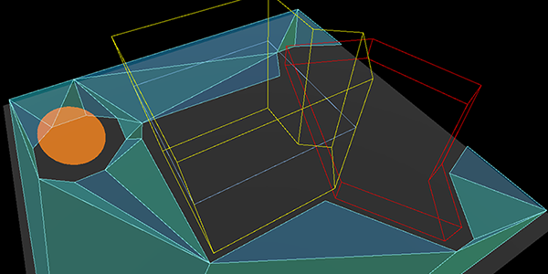
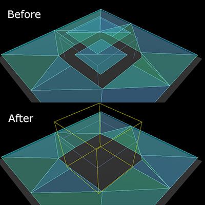
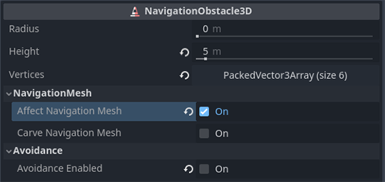

.. _doc_navigation_using_navigationobstacles:

Using NavigationObstacles
=========================

2D and 3D versions of NavigationObstacles nodes are available as
:ref:`NavigationObstacle2D<class_NavigationObstacle2D>` and
:ref:`NavigationObstacle3D<class_NavigationObstacle3D>`  respectively.

Navigation obstacles are dual purpose in that they can affect both the navigation mesh baking, and the agent avoidance.

- With ``affect_navigation_mesh`` enabled the obstacle will affect navigation mesh when baked.
- With ``avoidance_enabled`` the obstacle will affect avoidance agents.

.. tip::

    Avoidance is enabled by default. If the obstacle is not used for avoidance disable ``enabled_avoidance`` to save performance.

Obstacles and navigation mesh
-----------------------------

   Navigation obstacles affecting navigation mesh baking.

For navigation mesh baking obstacles can be used to discard parts of all other source geometry inside the obstacle shape.

This can be used to stop navigation meshes being baked in unwanted places,
e.g. inside "solid" geometry like thick walls or on top of other geometry that should not be included for gameplay like roofs.

   Navigation obstacles discard of unwanted navigation mesh.

An obstacle does not add geometry in the baking process, it only removes geometry.
It does so by nullifying all the (voxel) cells with rasterized source geometry that are within the obstacle shape.
As such its effect and shape detail is limited to the cell resolution used by the baking process.

For more details on the navigation mesh baking see :ref:`doc_navigation_using_navigationmeshes`.

The property ``affect_navigation_mesh`` makes the obstacle contribute to the navigation mesh baking.
It will be parsed or unparsed like all other node objects in a navigation mesh baking process.

The ``carve_navigation_mesh`` property makes the shape unaffected by offsets of the baking,
e.g. the offset added by the navigation mesh ``agent_radius``.
It will basically act as a stencil and cut into the already offset navigation mesh surface.
It will still be affected by further postprocessing of the baking process like edge simplification.

The obstacle shape and placement is defined with the ``height`` and ``vertices`` properties, and the ``global_position`` of the obstacle.
The y-axis value of any Vector3 used for the vertices is ignored as the obstacle is projected on a flat horizontal plane.

When baking navigation meshes in scripts obstacles can be added procedurally as a projected obstruction.
Obstacles are not involved in the source geometry parsing so adding them just before baking is enough.

.. tabs::
 .. code-tab:: gdscript 2D GDScript

    var obstacle_outline = PackedVector2Array([
        Vector2(-50, -50),
        Vector2(50, -50),
        Vector2(50, 50),
        Vector2(-50, 50)
    ])

    var navigation_mesh = NavigationPolygon.new()
    var source_geometry = NavigationMeshSourceGeometryData2D.new()

    NavigationServer2D.parse_source_geometry_data(navigation_mesh, source_geometry, $MyTestRootNode)

    var obstacle_carve: bool = true

    source_geometry.add_projected_obstruction(obstacle_outline, obstacle_carve)

    NavigationServer2D.bake_from_source_geometry_data(navigation_mesh, source_geometry)

 .. code-tab:: csharp 2D C#

    Vector2[] obstacleOutline = new Vector2[]
    {
        new Vector2(-50, -50),
        new Vector2(50, -50),
        new Vector2(50, 50),
        new Vector2(-50, 50),
    };

    var navigationMesh = new NavigationPolygon();
    var sourceGeometry = new NavigationMeshSourceGeometryData2D();

    NavigationServer2D.ParseSourceGeometryData(navigationMesh, sourceGeometry, GetNode<Node2D>("MyTestRootNode"));

    bool obstacleCarve = true;

    sourceGeometry.AddProjectedObstruction(obstacleOutline, obstacleCarve);
    NavigationServer2D.BakeFromSourceGeometryData(navigationMesh, sourceGeometry);

 .. code-tab:: gdscript 3D GDScript

    var obstacle_outline = PackedVector3Array([
        Vector3(-5, 0, -5),
        Vector3(5, 0, -5),
        Vector3(5, 0, 5),
        Vector3(-5, 0, 5)
    ])

    var navigation_mesh = NavigationMesh.new()
    var source_geometry = NavigationMeshSourceGeometryData3D.new()

    NavigationServer3D.parse_source_geometry_data(navigation_mesh, source_geometry, $MyTestRootNode)

    var obstacle_elevation: float = $MyTestObstacleNode.global_position.y
    var obstacle_height: float = 50.0
    var obstacle_carve: bool = true

    source_geometry.add_projected_obstruction(obstacle_outline, obstacle_elevation, obstacle_height, obstacle_carve)

    NavigationServer3D.bake_from_source_geometry_data(navigation_mesh, source_geometry)

 .. code-tab:: csharp 3D C#

    Vector3[] obstacleOutline = new Vector3[]
    {
        new Vector3(-5, 0, -5),
        new Vector3(5, 0, -5),
        new Vector3(5, 0, 5),
        new Vector3(-5, 0, 5),
    };

    var navigationMesh = new NavigationMesh();
    var sourceGeometry = new NavigationMeshSourceGeometryData3D();

    NavigationServer3D.ParseSourceGeometryData(navigationMesh, sourceGeometry, GetNode<Node3D>("MyTestRootNode"));

    float obstacleElevation = GetNode<Node3D>("MyTestObstacleNode").GlobalPosition.Y;
    float obstacleHeight = 50.0f;
    bool obstacleCarve = true;

    sourceGeometry.AddProjectedObstruction(obstacleOutline, obstacleElevation, obstacleHeight, obstacleCarve);
    NavigationServer3D.BakeFromSourceGeometryData(navigationMesh, sourceGeometry);

Obstacles and agent avoidance
-----------------------------

For avoidance navigation obstacles can be used either as static or dynamic obstacles to affect avoidance controlled agents.

- When used statically NavigationObstacles constrain avoidance controlled agents outside or inside a polygon defined area.
- When used dynamically NavigationObstacles push away avoidance controlled agents in a radius around them.

Static avoidance obstacles
~~~~~~~~~~~~~~~~~~~~~~~~~~

An avoidance obstacle is considered static when its ``vertices`` property is populated with an outline array of positions to form a polygon.

.. figure:: img/nav_static_obstacle_build.gif
   :align: center
   :alt: Static obstacle drawn in the editor to block or contain navigation agents

   Static obstacle drawn in the editor to block or contain navigation agents.

- Static obstacles act as hard do-not-cross boundaries for avoidance using agents, e.g. similar to physics collision but for avoidance.
- Static obstacles define their boundaries with an array of outline ``vertices`` (positions), and in case of 3D with an additional ``height`` property.
- Static obstacles only work for agents that use the 2D avoidance mode.
- Static obstacles define through winding order of the vertices if agents are pushed out or sucked in.
- Static obstacles can not change their position. They can only be warped to a new position and rebuilt from scratch.
  Static obstacles as a result are ill-suited for usages where the position is changed every frame, as the constant rebuild has a high performance cost.
- Static obstacles that are warped to another position can not be predicted by agents. This creates the risk of getting agents stuck should a static obstacle be warped on top of agents.

When the 2D avoidance is used in 3D the y-axis of Vector3 vertices is ignored. Instead, the global y-axis position of the obstacle is used as the elevation level. Agents will ignore static obstacles in 3D that are below or above them. This is automatically determined by global y-axis position of both obstacle and agent as the elevation level as well as their respective height properties.

Dynamic avoidance obstacles
~~~~~~~~~~~~~~~~~~~~~~~~~~~

An avoidance obstacle is considered dynamic when its ``radius`` property is greater than zero.

- Dynamic obstacles act as a soft please-move-away-from-me object for avoidance using agents, e.g. similar to how they avoid other agents.
- Dynamic obstacles define their boundaries with a single ``radius`` for a 2D circle, or in case of 3D avoidance a sphere shape.
- Dynamic obstacles can change their position every frame without additional performance cost.
- Dynamic obstacles with a set velocity can be predicted in their movement by agents.
- Dynamic obstacles are not a reliable way to constrain agents in crowded or narrow spaces.

While both static and dynamic properties can be active at the same time on the same obstacle this is not recommended for performance.
Ideally when an obstacle is moving the static vertices are removed and instead the radius activated.
When the obstacle reaches the new final position it should gradually enlarge its radius to push all other agents away.
With enough created safe space around the obstacle it should add the static vertices again and remove the radius.
This helps avoid getting agents stuck in the suddenly appearing static obstacle when the rebuilt static boundary is finished.

Similar to agents the obstacles can make use of the ``avoidance_layers`` bitmask.
All agents with a matching bit on their own avoidance mask will avoid the obstacle.

Procedural obstacles
--------------------

New obstacles can be created in a script without a Node by using the NavigationServer directly.

Obstacles created with scripts require at least a ``map`` and a ``position``.
For dynamic use a ``radius`` is required.
For static use an array of ``vertices`` is required.

.. tabs::
 .. code-tab:: gdscript 2D GDScript

    # create a new "obstacle" and place it on the default navigation map.
    var new_obstacle_rid: RID = NavigationServer2D.obstacle_create()
    var default_map_rid: RID = get_world_2d().get_navigation_map()

    NavigationServer2D.obstacle_set_map(new_obstacle_rid, default_map_rid)
    NavigationServer2D.obstacle_set_position(new_obstacle_rid, global_position)

    # Use obstacle dynamic by increasing radius above zero.
    NavigationServer2D.obstacle_set_radius(new_obstacle_rid, 5.0)

    # Use obstacle static by adding a square that pushes agents out.
    var outline = PackedVector2Array([Vector2(-100, -100), Vector2(100, -100), Vector2(100, 100), Vector2(-100, 100)])
    NavigationServer2D.obstacle_set_vertices(new_obstacle_rid, outline)

    # Enable the obstacle.
    NavigationServer2D.obstacle_set_avoidance_enabled(new_obstacle_rid, true)

 .. code-tab:: csharp 2D C#

    // Create a new "obstacle" and place it on the default navigation map.
    Rid newObstacleRid = NavigationServer2D.ObstacleCreate();
    Rid defaultMapRid = GetWorld2D().NavigationMap;

    NavigationServer2D.ObstacleSetMap(newObstacleRid, defaultMapRid);
    NavigationServer2D.ObstacleSetPosition(newObstacleRid, GlobalPosition);

    // Use obstacle dynamic by increasing radius above zero.
    NavigationServer2D.ObstacleSetRadius(newObstacleRid, 5.0f);

    // Use obstacle static by adding a square that pushes agents out.
    Vector2[] outline = new Vector2[]
    {
        new Vector2(-100, -100),
        new Vector2(100, -100),
        new Vector2(100, 100),
        new Vector2(-100, 100),
    };
    NavigationServer2D.ObstacleSetVertices(newObstacleRid, outline);

    // Enable the obstacle.
    NavigationServer2D.ObstacleSetAvoidanceEnabled(newObstacleRid, true);

 .. code-tab:: gdscript 3D GDScript

    # Create a new "obstacle" and place it on the default navigation map.
    var new_obstacle_rid: RID = NavigationServer3D.obstacle_create()
    var default_map_rid: RID = get_world_3d().get_navigation_map()

    NavigationServer3D.obstacle_set_map(new_obstacle_rid, default_map_rid)
    NavigationServer3D.obstacle_set_position(new_obstacle_rid, global_position)

    # Use obstacle dynamic by increasing radius above zero.
    NavigationServer3D.obstacle_set_radius(new_obstacle_rid, 0.5)

    # Use obstacle static by adding a square that pushes agents out.
    var outline = PackedVector3Array([Vector3(-5, 0, -5), Vector3(5, 0, -5), Vector3(5, 0, 5), Vector3(-5, 0, 5)])
    NavigationServer3D.obstacle_set_vertices(new_obstacle_rid, outline)
    # Set the obstacle height on the y-axis.
    NavigationServer3D.obstacle_set_height(new_obstacle_rid, 1.0)

    # Enable the obstacle.
    NavigationServer3D.obstacle_set_avoidance_enabled(new_obstacle_rid, true)

 .. code-tab:: csharp 3D C#

    // Create a new "obstacle" and place it on the default navigation map.
    Rid newObstacleRid = NavigationServer3D.ObstacleCreate();
    Rid defaultMapRid = GetWorld3D().NavigationMap;

    NavigationServer3D.ObstacleSetMap(newObstacleRid, defaultMapRid);
    NavigationServer3D.ObstacleSetPosition(newObstacleRid, GlobalPosition);

    // Use obstacle dynamic by increasing radius above zero.
    NavigationServer3D.ObstacleSetRadius(newObstacleRid, 5.0f);

    // Use obstacle static by adding a square that pushes agents out.
    Vector3[] outline = new Vector3[]
    {
        new Vector3(-5, 0, -5),
        new Vector3(5, 0, -5),
        new Vector3(5, 0, 5),
        new Vector3(-5, 0, 5),
    };
    NavigationServer3D.ObstacleSetVertices(newObstacleRid, outline);
    // Set the obstacle height on the y-axis.
    NavigationServer3D.ObstacleSetHeight(newObstacleRid, 1.0f);

    // Enable the obstacle.
    NavigationServer3D.ObstacleSetAvoidanceEnabled(newObstacleRid, true);
